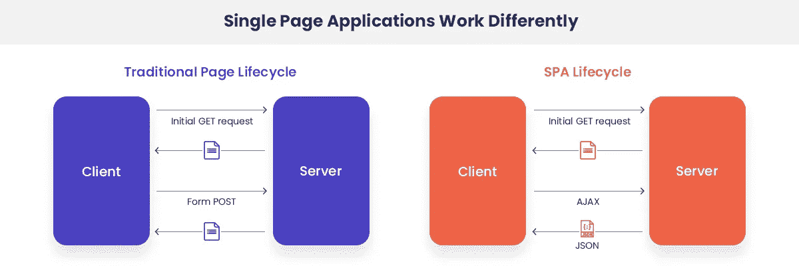
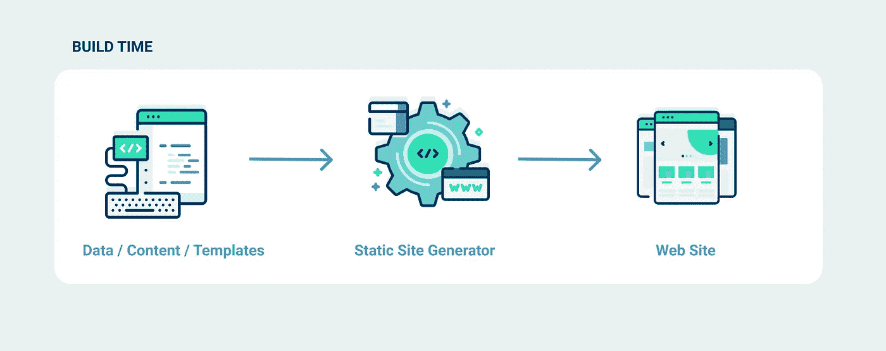
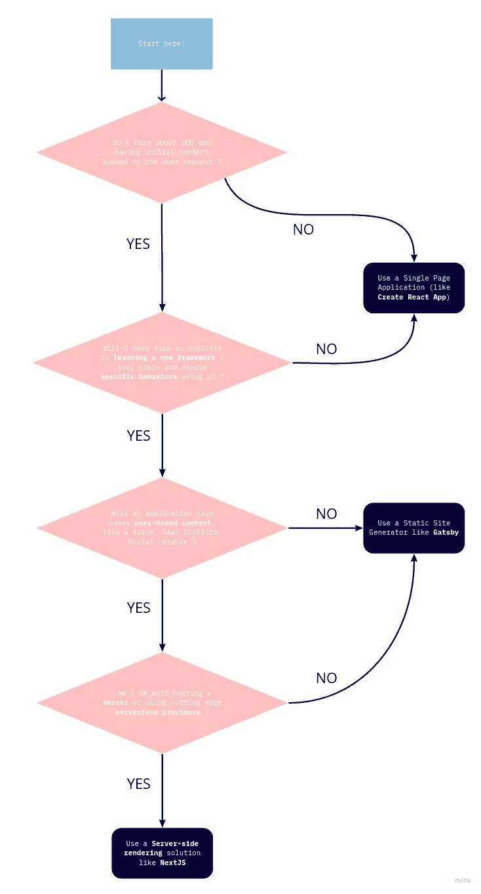

# SPA、SSG、SSR 和 JAMStack:首字母缩略词指南

> 原文：<https://levelup.gitconnected.com/spa-ssg-ssr-and-jamstack-a-front-end-acronyms-guide-6add9543f24d>

在过去的十年中，前端开发经历了多种范式的变化，很难跟上。

从 jQuery / Mootools 转移到 Angularjs，然后是 React/Vue/Angular，这很令人兴奋，但也足够困难。现在来了 [**盖茨比**](https://www.gatsbyjs.org/) **，** [**Nuxt**](https://nuxtjs.org/) **，**[**grid some**](https://gridsome.org/)**，**以及他们的朋友们，他们以再次震撼我们开发者的世界为乐。


在本文中，我们将探讨前端 web 开发的新模式，看看它们带来了什么，以及如何用合适的工具实现它们。

# 单页应用程序



单页面应用在 2010 年代初真正起飞，当时 AngularJS 的流行使得前端开发人员希望用 JavaScript 编码他们的整个应用内容和流程，而不是为每个页面编写传统的 HTML/CSS/JS 文件。

单页应用程序(SPA)背后的理念是以开发移动或桌面客户端应用程序的方式开发网站:
您的应用程序源代码(主要是 JavaScript)负责在可用呈现器(您用户的 web 浏览器)内的应用程序内容之间进行**填充、交互和导航**。

因此，与加载不同 CSS 和 JavaScript 资源的多个 HTML 页面以及浏览器使用链接在这些页面之间导航不同，使用 SPA，您有一个没有内容的**单个 HTML 页面**(index.html ),加载一个或多个 **JavaScript 文件**,这些文件将**呈现您的内容，在应用程序的各个部分之间导航，并处理您的 DOM 组件之间的任何交互**。

他们利用了以下技术:

*   **HTML5 历史 API(或位置散列#)** :该 API 能够感知网站页面之间的可导航性，使导航与本机浏览器行为兼容(上一页/下一页按钮和 URL 更改)
*   **JavaScript Web 框架:** React、Angular、Vue 都处理内容表示与数据的解耦，以及这些数据到 DOM 的渲染和更新。该模型简化了数据密集型应用程序的制作，其灵感来自客户端应用程序的 MVVM 架构。
*   **Ajax 和 HTTP API**:由于 app 的初始页面是空的，JavaScript 代码会经常调用一个 API 来获取用户内容。这些 API 通常使用 REST 协议和 JSON 作为数据格式，但是最近 GraphQL 为内容查询提供了一个灵活的选择。

因为你可能不想在一个 JavaScript ES5 文件中编写你的应用程序，现代工具提供了一个**构建工具链** (webpack 是目前最著名的捆绑器)，使你能够在一个结构化和开发友好的环境(ES2020 标准，组件树)中编写你的应用程序，并编译它以最小化，连接和分块你的 JS & CSS 文件到一个构建文件夹中。

此外，现代框架通常自带类似 HTML 的语法(JSX，vue 基于 HTML 的模板),以增强 HTML 语言的动态特性，如数据插值和事件绑定。

综上所述，以下是 SPA 带给前端开发界的东西:

*   使用**新框架**的能力，简化了高度数据绑定和交互式应用的开发。
*   能够以你喜欢的方式构建你的代码，并将其构建在一个可部署的包(HTML、JS、CSS)上
*   由于您的应用程序是一次性加载的**，所以以后的导航和交互不会生成资产请求，这使得它比传统的完全重新加载导航更快**
*   ****SPA 利用 API**来查询应用程序的内容，这鼓励了数据和它的表示之间的**解耦****

**但是这些优势也伴随着代价，例如:**

*   **你的应用捆绑包的总大小可能会变得很大，从而减慢你的应用的第一次加载**
*   ****状态管理可能会变得复杂**，因为使用 JavaScript 导航，您的应用程序状态不会在页面导航上重置(您不会获得完全重新加载的空白)。Redux/Vuex 或 React reducer 挂钩使它更容易。**
*   ****SEO 可能很棘手:**尽管存在索引机器人的 ajax 爬行，但普遍认为服务器呈现的 HTML 页面作为 SPAs 更容易优化。**
*   ****性能**会受到影响:随着你的应用增长，会运行越来越多的 JS 代码来渲染你的应用，这会让你的访客 CPU 疯狂运行。幸运的是，大多数框架都推荐最佳实践，比如使用内存化来防止过多的 DOM 重新呈现。**

**总的来说，单页面应用程序使你能够**拥抱现代 JavaScript** 框架的精神(ES2020、组件架构、捆绑和优化、HTML5 历史 API)，但如果你想要最好的 SEO 和 UX 体验，也会带来一些挑战。**

# **静态站点生成器**

****

**[https://www . netlify . com/blog/2020/04/14/what-a-static-site-generator-and-3-ways-to-find-the-best-one/](https://www.netlify.com/blog/2020/04/14/what-is-a-static-site-generator-and-3-ways-to-find-the-best-one/)**

**早期的静态站点生成器从 2008 年就出现了( [Jekyll](https://jekyllrb.com/) )，我认为他们想为基于 CMS 的网络应用提供一种替代方案。**

**事实上，很多网站向所有用户展示的内容都是由 CMS 编辑的(比如 Wordpress)。这使得 CMS 中的更改可以直接部署给用户，因为内容是在**运行时生成的(基于 PHP 的 CMS 的事件请求时间**)。**

**SSG 挑战的是这样一种假设，即对于用户的每个请求，都应该从数据库中请求内容。事实上，他们建议在**构建时**生成内容。因为一旦你的页面已经从 CMS 中生成，就这样了，在你的 CMS 中的下一个内容改变之前，它不需要被改变。**

**那么，为什么不在每次你的内容发生变化的时候**将你所有的网站页面**生成为静态页面**？****

**它通常的工作方式是你将连接你的内容(CMS，headless CMS，文件存储等)到**你的 CI 引擎**例如使用 **webhooks** ，这样每次你的内容改变时，一个 CI 管道被触发，从而重建你的所有网站并使缓存失效。**

**此外，新 SSG 如 **Gatsby 或 Gridsome 是围绕 React/Vue 框架**构建的，这意味着您的静态站点将受益于框架架构和生态系统，并且一旦您的页面被初始加载，额外的 DOM 交互将由您的代码使用框架来处理。**

**使用静态站点生成器代替单页面应用程序的好处是:**

*   **更好的搜索引擎优化:因为你的网站由多个 HTML 页面组成，机器人抓取更容易，你的内容会被很好地索引。**
*   ****更好的性能:**现代的 SSG 工具只包含运行请求页面所必需的 JS/CSS 代码，如果用户浏览你的网站，它们会加载额外的代码。**
*   **内容分离: SSG 提供了一种将你内容从它的表现中分离出来的方法。**
*   ****多源内容:**SSG 提供多内容源集成，如无头 CMS ( [Contentful](https://www.contentful.com/) 、 [Strapi](https://strapi.io/) )、本地标记文件或远程文件。**

**这通常会带来一些缺点和限制:**

*   ****用户定制内容:**只有当内容页面**对所有用户都相同时，内容的静态生成才有效**，否则，您需要为每个用户生成每个页面，这将占用大量空间，并可能导致安全问题，因为所有静态页面都是公开的。
    所以对于用户定制的内容(仪表板、论坛帖子、收件箱等等)，你需要进行 API 调用来获得格式化的内容。**
*   ****学习曲线**:每个 SSG 都有自己的方式来查询你的内容和生成你的页面。尽管 Gatsby 是基于 React 的，但它使用 GraphQL 进行内容查询，所以您需要深入了解它才能使它工作。**
*   ****CI 开销和预览延迟**:如果你想让你的网站总是与你的内容保持同步，你应该插入 webhooks 和 CI 管道来使其工作。如果你的管道运行需要 5 分钟，那么你就要等 5 分钟才能看到你的网站更新你的内容。**

**总之，如果你关心 SEO，如果你的网站有大量的公共内容，我会说静态站点生成器是单页应用程序的一个很好的替代品。如果你关心**性能和开发者体验**，它也是经典 CMS 的一个很好的替代品。**

# **服务器端渲染**

**我们这里要提到的最新趋势是服务器端渲染。从历史上看，服务器端呈现(或脚本)已经存在很长时间了。**

```
<div>Hello <?php echo 'world'; ?></div>
```

**还记得那些邪恶的台词吗？这是最坏的服务器端渲染。所以 SSR 仅仅意味着从服务器呈现你的 HTML 内容。ASP.Net，JEE，PHP Symfony，Ruby on Rails，所有这些常规的 MVC 框架都提供了某种带有模板引擎的服务器端渲染。**

**但是那些基于服务器的渲染有局限性:你不能处理客户端与它的交互，你被限制在浏览器中显示的初始内容。以下任何行为都必须在附加的 JavaScript 文件中进行编码。**

**当我们在 JavaScript 世界中谈论 SSR 时，我们在 **JavaScript 同构渲染**中真正指的是什么。随着 NodeJS 的出现，JavaScript 现在既可以在服务器上运行**，也可以在客户机上运行**，这使得共享呈现逻辑成为可能。**

**因此，NextJS、Nuxt 和其他公司提供的是一种**共享组件渲染逻辑的方式**，在服务器的初始加载和客户端的后续交互之间。**

****

**你可能会问，像盖茨比这样的现代 SSG 有什么不同？事实上，它们也在 React 中呈现页面，并让框架处理客户端交互。是的，但是使用 SSR **你的页面在运行时为每个请求**呈现，这意味着你可以根据你的用户上下文定制你页面的初始呈现**。而 Gatsby 生成的页面是静态的，因此初始内容对所有用户都是相同的。****

**让我们总结一下为什么要使用 SSR，以及您可以从中获得哪些好处:**

*   ****SEO** :如果你想让用户定制的页面在搜索引擎上被编入索引，或者在社交媒体共享中预载缩略图，你需要这些页面在服务器端呈现。**
*   ****内容更新**:如果你的内容存放在 CMS 中，你希望每次更新都能立即反映在你的网站上，SSR 正是你所需要的。**
*   ****性能**:与 SSG 一样，SSR 通常意味着比 SPA 更好的性能，至少在第一次加载页面内容时是如此。**
*   ****相同代码库中的后端和前端:**由于 SSR 运行在您的服务器上，您也可以用它托管您的 API，为您的 API 和前端提供一个单一的存储库。**

**和往常一样，这也带来了限制和棘手的方面:**

*   ****需要一台服务器**:要让 SSR 工作，你需要一台服务器。虽然有些神奇的托管平台，如 [Vercel](https://nextjs.org/docs/deployment#optimized-for-nextjs) 会利用无服务器的功能来做预渲染，这样就不需要服务器了。**
*   ****性能:**是的，页面的初始加载会包含内容，但它是由服务器计算的，服务器可能会臃肿。与提供静态文件的 SSG 相反，使用 SSR 你需要确保你的初始加载足够快。**
*   ****学习曲线:**为了让同构的 JavaScript 工作，框架在你创建组件的方式上执行约定。在熟练使用它们之前，你必须学习和理解它们。**
*   ****并非真正通用:**尽管从理论上讲，JavaScript 可以在服务器和客户端使用，但这两种环境还是有区别的。例如，`window`在服务器上不存在，所以您将需要一些类似代码的“杂注”,以确保您的一些前端依赖项仍然工作良好**

# **JAMStack**

**JAMStack 更像是一个营销世界。它意味着 JavaScript、API 和标记。因此，从历史上看，它主要会促进静态站点生成器的使用，作为传统 CMS (Wordpress)或传统服务器端 MVC 框架的替代方案。**

**随着时间的推移，这个术语汇集了所有与静态和服务器端渲染网站相关的生态系统和工具，例如:**

*   **CI 管道**
*   **Git 集成**
*   **面向缓存和地理性能的 CDN**
*   **缓存失效**
*   **API 的云函数**
*   **…而且每天都在增加**

# **好吧，那我应该用什么？**

**首先恭喜你熬过了这篇重磅文章。如果你跳到这部分，我能理解。**

**当我从头开始一个前端项目时，我会浏览这个决策图，以了解我应该关注什么技术。**

****

**我希望这将有助于你对下一个项目的决定。如果您觉得我遗漏了什么，或者如果您想与社区分享您的决策过程和具体工具，请分享您的评论。**

**PS: NextJS 处理[自动静态优化](https://nextjs.org/docs/advanced-features/automatic-static-optimization)，这意味着如果需要，这个框架可以处理静态页面生成和服务器端呈现。所以当有疑问时，这是一个安全的选择。**