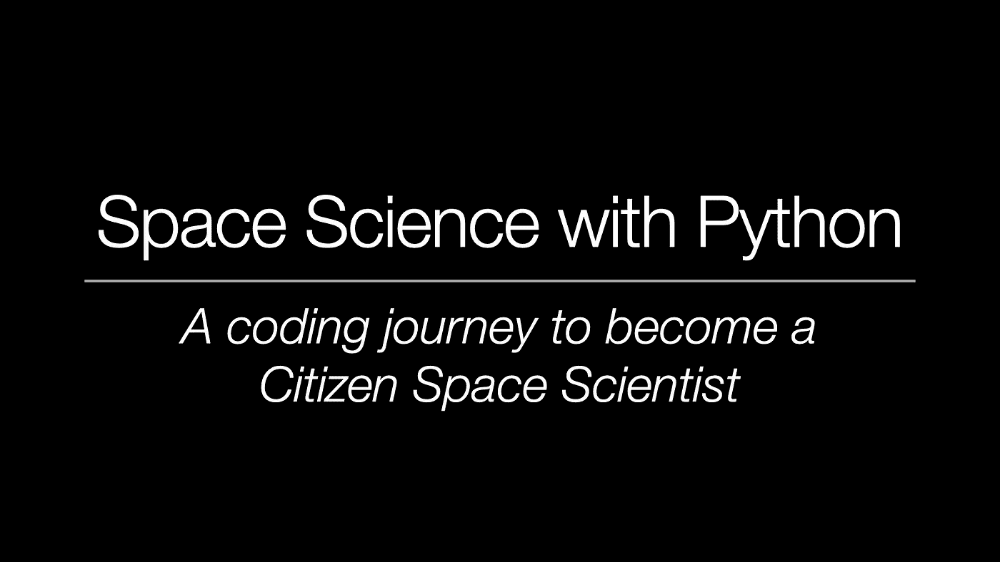

# Python 的空间科学——数据科学和机器学习之旅

> 原文：<https://levelup.gitconnected.com/space-science-with-python-a-data-science-machine-learning-journey-f383a7fe8511>

## 将 3 个热门话题结合在一起，即 Python —数据科学—空间，成为一名公民空间科学家！

图片来源:托马斯·阿尔宾

没有研究过天文学和空间科学的人似乎很难接触到它们。尽管为科学界贡献数据或见解并不需要博士学位或多年的研究。在 SpaceX 等创新公司的推动下，重返月球的努力，最近启动和部署了詹姆斯·韦伯太空望远镜等任务和许多其他主题，太空和天文学获得了新的关注和热情。

## 我自己的一个小故事

这种热情也使我开始研究天体物理学。我有幸参与了两项主要任务:

1.  **Rosetta/Philae** :欧空局对彗星 67P/Churyumov-Gerasimenko 的任务；在那里，我是仪器小组*粉尘影响监测仪*的一员，进行实验室实验并对测量数据进行数据分析
2.  **卡西尼/惠更斯**:美国宇航局和欧洲航天局的巨大探测器访问土星系统数年。利用来自宇宙尘埃分析仪的数据，我开发了尘埃粒子动力学的数值模拟以及用于光谱分类的机器学习算法

此外，我的兴趣和研究项目是关于小行星，近地物体，流星(流星)和更多。

两年半以来，我的职业生涯一直是在汽车行业做机器学习工程师。但是我对空间的热情依旧，是时候给社区一些回报了。

## 现在这是怎么回事？

我一直热衷的一件事是:教育、准备研讨会、教授他人和传授知识。专业知识，尤其是关于空间主题、编码和机器学习的知识是一种宝贵的财富。不仅仅是对自己，还包括对同样话题感兴趣的其他人。通过分享知识，一个人能够合作，创建一个社区，并支持其他人参与同一事业。

但是科学工作并不是科学家的专利。当然，为了确保高质量的标准，人们需要在同行评议的论文中、在会议上以及与其他专业人士分享自己的研究。然而，公民科学家也可以参与这个由好奇心驱动的领域，尤其是天文学领域。

## 最近的一些例子

最近和过去，公民科学家帮助研究团体完成各种各样的任务。例如，太空机构在过去发起了不同的运动…

 [## 启动新公民科学项目，活跃的小行星！

### “在公民科学家的慷慨帮助下，我们希望已知活跃小行星的数量翻两番，并鼓励…

science.nasa.gov](https://science.nasa.gov/science-news/launch-of-new-citizen-science-project-active-asteroids) 

…以及对星系进行分类的社区倡议:

 [## 动物宇宙

### Zooniverse 是世界上最大、最受欢迎的人力研究平台。

www.zooniverse.org](https://www.zooniverse.org/projects/zookeeper/galaxy-zoo/) 

最近，“非研究人员”的合作努力在哈勃图像中总共发现了 1000 颗新的小行星:

 [## 公民科学家发现 1000 多颗小行星在轰炸哈勃图像

### 在旧的哈勃照片上发现了 1000 多颗以前未知的小行星——不是由专业天文学家发现的…

skyandtelescope.org](https://skyandtelescope.org/astronomy-news/citizen-scientists-find-1000-asteroids-photobombing-hubble-images/) 

业余爱好者是真正有激情的；在俱乐部和更大的社区中组织自己，例如国际流星组织*，专业人士和业余爱好者都创建自己的科学杂志，计划和举办会议(所谓的*国际流星会议*)等等。*

## *让空间科学变得触手可及*

*总而言之，公民科学的努力是有目共睹的！成吨的！但是，一个人如何才能有一个“起点”，一个成为公民太空科学家的“入口”？*

*尤其是你，这篇文章的读者，很可能是一名编码员、机器学习工程师或数据科学家。通过点击和阅读这篇文章，你也会对太空相关的话题感兴趣。那么，如何才能弥合你的编码技能与投身太空科学和相关研究工作的愿望之间的差距呢？*

*在这里，我想带着对空间的*的热情，为 ***Python 程序员*** 搭建一座知识桥梁。互动教育系列，名为…**

## **使用 Python 的空间科学**

**我在疫情期间开始了这个项目，并写了几篇关于媒体的文章。然而，我从几个读者那里得到了反馈，提供了一种类似讲座或研讨会的氛围。可以说是一个视频系列，不仅要遵循和理解代码，还要理解在编写空间科学相关脚本时的思维过程。**

**该系列分为一些*通用空间科学编码*和目前正在进行的*使用谷歌 Colab 的机器学习项目*。**

**那么，要成为空间科学专家，你需要按照这个教程系列做些什么呢？**

*   **VS 代码+扩展远程容器(或者虚拟环境)**
*   **Git，获取最新的编码部分**
*   **耳机和第二个屏幕来编码和跟随教程系列**

**GitHub 存储库可以在以下位置找到:**

** [## GitHub-Thomas Albin/Astroniz-YT-Tutorials:我的 Python YT 空间科学教程库…

### 欢迎来到 Astroniz 教程库。每个文件夹都链接到我的频道上的 YouTube 教程视频…

github.com](https://github.com/ThomasAlbin/Astroniz-YT-Tutorials) 

那里已经有成吨的 Jupyter 笔记本脚本:

*   计算地球的位置和速度
*   确定月亮和金星在夜空中的坐标
*   用 QT5 +渲染彗星 67P 理解如何绘制探测器菲莱的着陆
*   确定我们太阳系中不同的彗星数量
*   等等。

相应的视频上传到这里:

 [## 阿斯特罗尼兹

### 嘿观众们！在这里我想给你看一些 Python 和机器学习教程，里面有空间科学的链接！还有:我……

www.youtube.com](https://www.youtube.com/channel/UCvuCPVj5zTjxdR-EcatFfUg) 

## Quo Vadis？

目前，一个小行星光谱分类算法正在开发中，并在我的知识库和我的 YouTube 频道上逐步展示。为了稍微梳理一下未来的 ML 和数据科学相关主题，以下项目将紧随其后:

*   研究卡西尼号和罗塞塔号的数据，以了解太阳系中的宇宙尘埃环境
*   识别星际(！)灰尘来源
*   太阳系中小行星和彗星的集群
*   利用星系光谱区分不同的活动星系核心类型
*   模拟虚拟小行星来估计我们的母星的线程
*   …还有更多更多。

## 知识转移导致一个社区

如前所述，新的想法来自一个不断学习和成长的社区。请通过这里、我的频道或 [Twitter](https://twitter.com/MrAstroThomas) 联系我，让我知道应该涵盖哪些主题。

敬请关注，

托马斯**