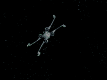
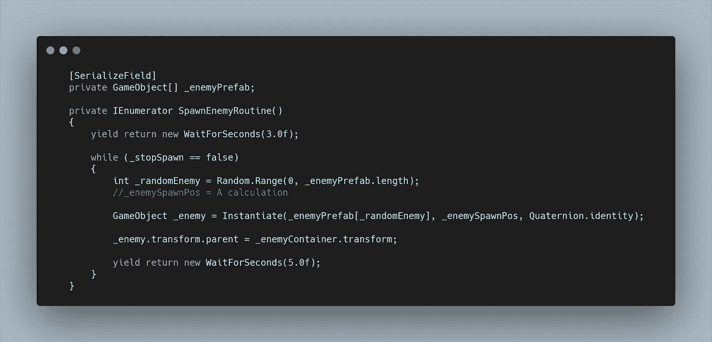
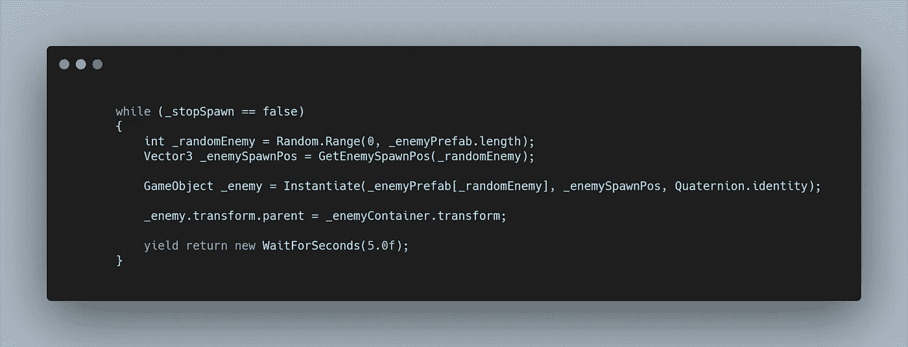
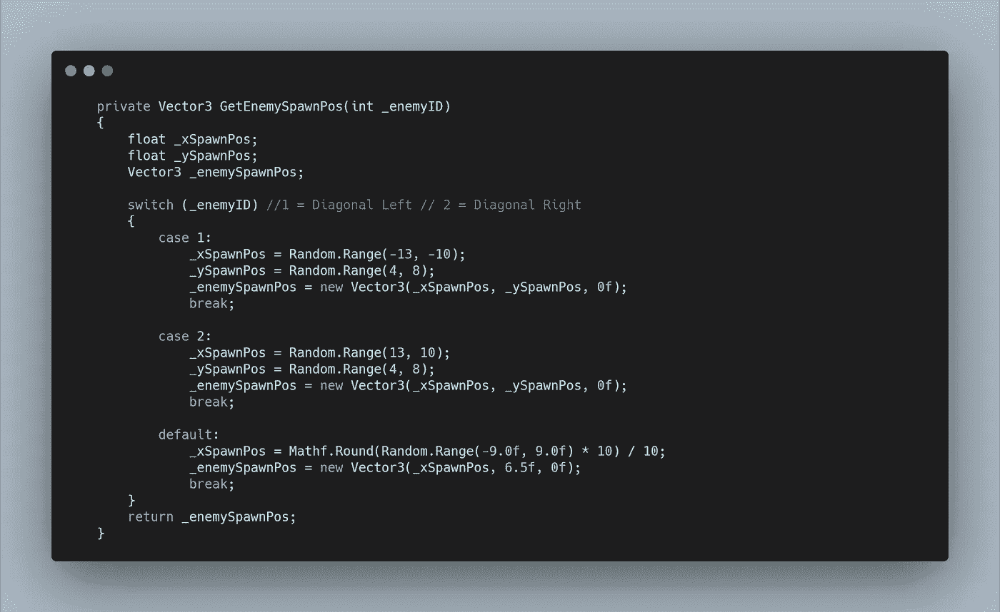
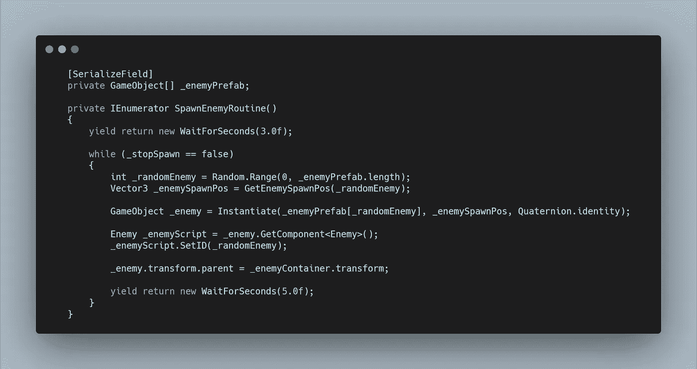
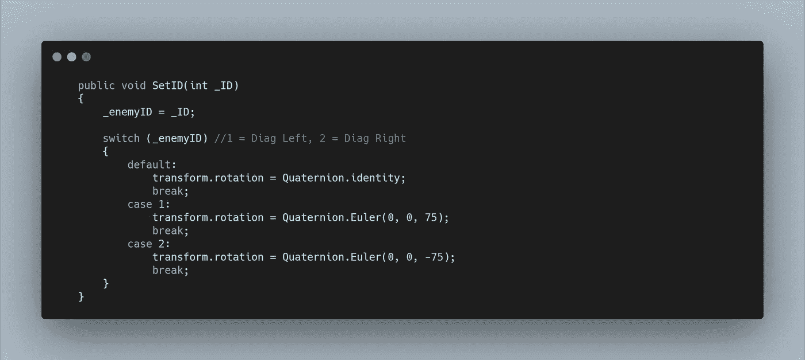
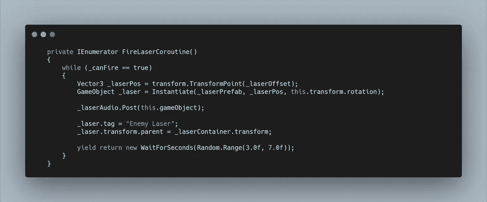
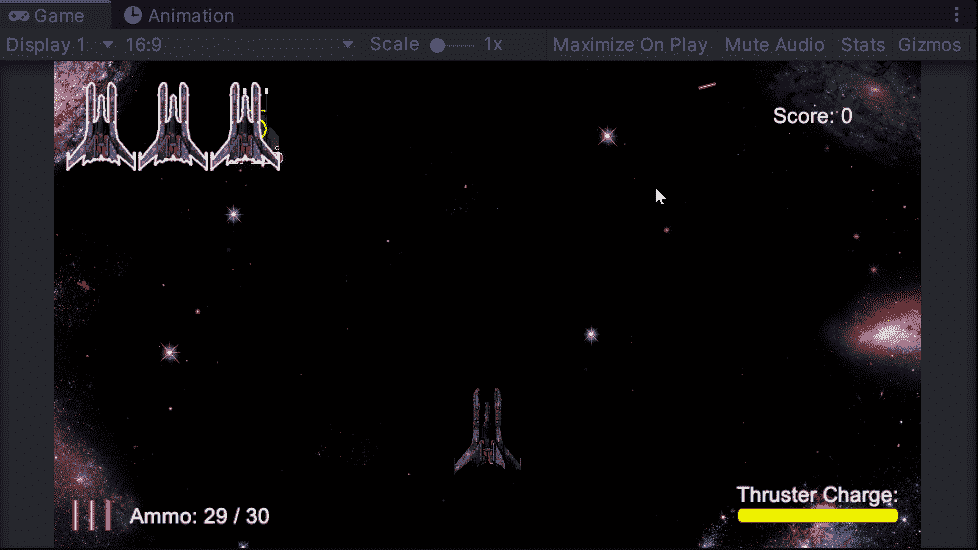

# 太空射击挑战:另类敌人运动

> 原文：<https://levelup.gitconnected.com/space-shooter-challenge-alternative-enemy-movement-bf0a94939506>

昨天 V1.1 发布，可以在这里找到 [**。**](https://calumslee.itch.io/2d-space-shooter)

因此，今天标志着一系列新的挑战，使游戏更加充实和困难。

第一个挑战是创造可供选择的敌人运动。对于这个挑战，我只是想让已经存在的敌人从不同的角度攻击。虽然我可以创造一个全新的敌人，功能将是相同的，更先进的不同型号的敌人将稍后出现！

让我们开始吧。

将**敌人预设**拖进**场景视图**并进行实验，让我发现我喜欢的 75 度旋转角度穿过屏幕。我还需要制定一个不同的产卵点范围，以及何时消灭敌人的界限。不像标准的敌人，我想让**对角线变化**看起来更像是一个简单的抓点，因此不会重生。

找到这些变量后，我就可以进入代码了。

我首先需要将我的 **_enemyPrefab 变量**改为一个**数组。**然后我可以通过**检查器拖动另外两个**敌人预置**的实例。** ID 0 是标准敌人，1 在左边的对角线上，2 在右边。

然后在我的 **SpawnEnemyRoutine** 中，我需要一个随机选择这些敌人的方法。我可以用一个 **int 变量**在 0 和**数组长度之间选择一个**随机范围**来实现。**

现在我们的**敌人预置**的随机变化将被选择用于产卵，但是我需要一种方法来设置不同的位置和旋转。

旋转可以在**敌人脚本**本身中完成，所以让我们首先关注**的位置。**我创建了一个新的**返回类型方法**来返回一个**向量 3 变量**，要调用这个方法，需要追加**随机敌人**的 **int 值**。

然后，**getenemysponpos 返回方法**可以使用**开关语句**为 x 和 y 种子位置设置不同的范围，然后在**向量 3 中设置和返回这些范围。**现在根据所选择的**随机敌人**,**SpawnEnemyRoutine**调用**getenemysponpos****方法**并根据该敌人类型的条件接收一个**随机** **向量 3** 。

对于**旋转，**每个被实例化的敌人已经被存储为一个**游戏对象变量**，所以它可以被添加到一个容器中。我可以利用这个变量使用 **GetComponent** 访问**敌人脚本**，然后调用一个**公共方法**来传递 **ID。**

同样，我可以在**敌人脚本**中使用**切换语句**来设置旋转，这取决于当**敌人**被**实例化时，哪个 **ID** 被设置。**

现在敌人可以在三个不同的位置范围产生，有三种不同的旋转。**移动方法**已经使用 **Vector3.down、**移动**敌人**，它跟随**敌人**的局部旋转，因此无论旋转如何，它看起来都是向前移动的。

不过，我的问题是**激光。**之前创建的**激光偏置**基于全局位置，因此不会跟随旋转。为了解决这个问题，我创建了一个使用**变换的**激光位置矢量 3** 。变换点**将**激光偏置**应用到本地位置，并将其转换到全局坐标。

然后不是用**四元数。身份**为旋转，我在**敌人的旋转中通过。**

像**敌人一样，**激光**在**矢量 3.down** 方向移动，所以会简单地跟随**实例化**的旋转。**

现在我有了一个备用的敌人移动方式，并且已经创建了一个 ID 系统以备将来创造更多的敌人时使用。模块化！

不要让他们从侧面攻击你！