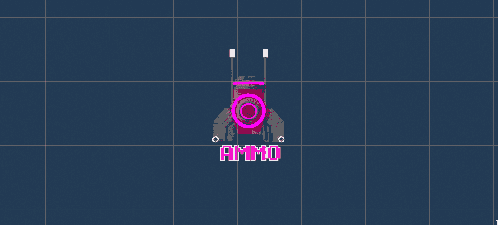
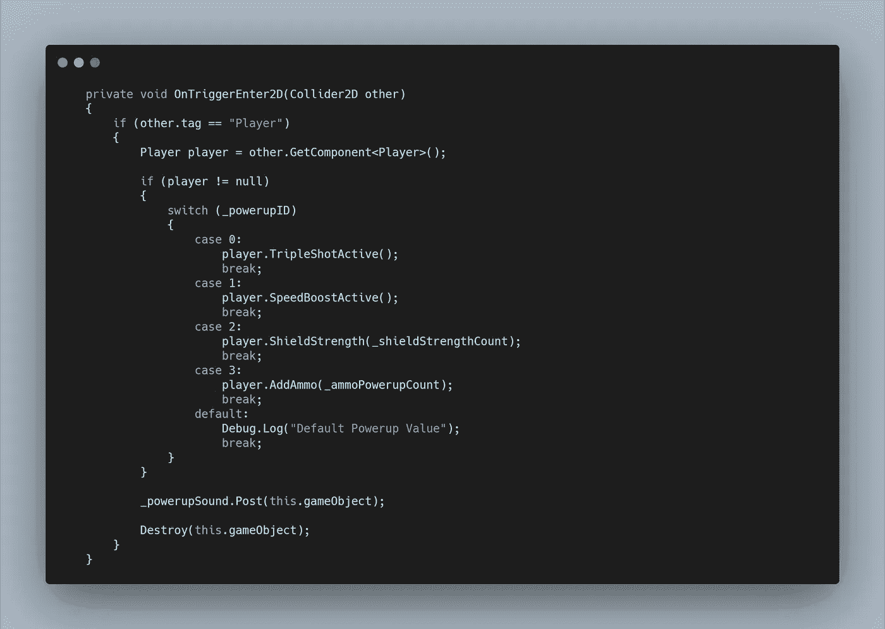
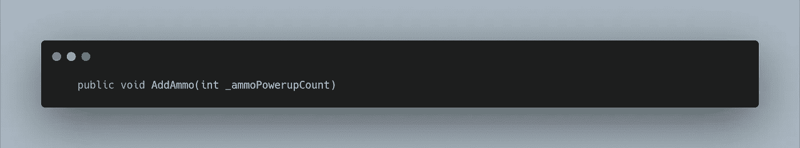
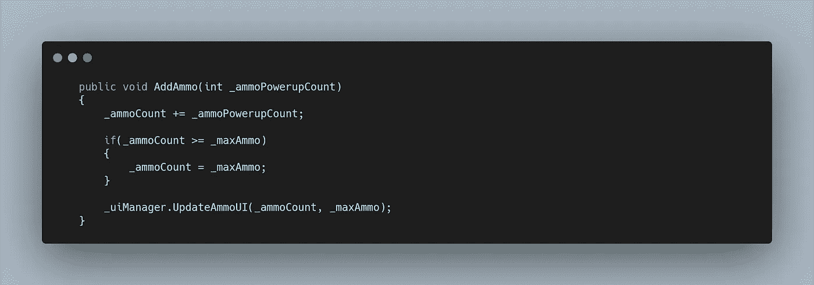
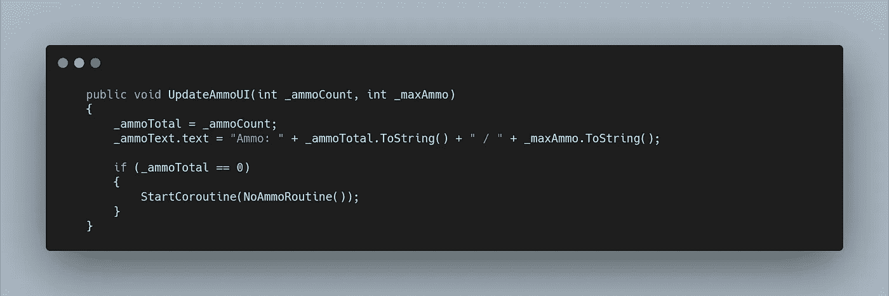
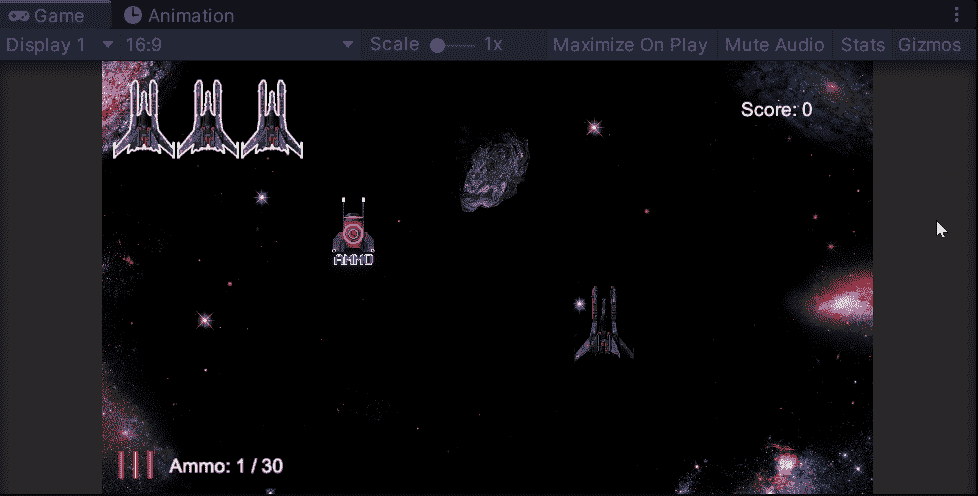

# 太空射击挑战:弹药收集

> 原文：<https://levelup.gitconnected.com/space-shooter-challenge-ammo-collectable-4189add27bbc>

我们的游戏现在有弹药计数，但没有办法补充弹药。是时候扩展**模块化加电**系统了。我从创建**精灵**开始。

为此，我在 **GIMP 中打开了一个现有的电源。**在谷歌上快速搜索找到一个类似的块状字体后，我创建了一个新的文本框，并将其缩放到原来的旁边，以尽可能匹配。然后我裁剪掉原来的文本，把新的文本拖进去。

创建白色轮廓需要一些工作。我不是艺术家，这是我第一次使用 GIMP。我很快发现，您可以将**路径添加到文本**中，从而创建一个轮廓路径。创建一个新的层，然后绘制路径，让我试错，并最终与上述图像。分不清对不对？

最后，我把原始动画精灵的所有文字颜色放到一个调色板中，然后复制弹药能量，每次都改变文字颜色。

这需要一点工作和大量的学习，但现在我有了一个未来电源的模板。

回到**团结。我导入了第一个精灵，重新命名，重新缩放。然后我把它放在**前景层。**增加了一个**箱式碰撞器 2D** 和一个**刚体 2D** 然后是**加电脚本**。然后我将加电 ID 设置为 3，使其成为**预置，**然后在我的**产卵管理器**上，将**预置**拖入我的**加电数组**。**

弹药强化将和其他强化一起随机产生。

为了创建功能，需要在**加电脚本的**开关语句**中添加一个新的**案例**。**

最初，会有一个错误，因为**添加弹药方法**还没有被创建。我还选择了传入一个**int variable _ ammoPowerupCount**，它可以在 **Inspector** 中分配给 **Powerup 预置。**这是未来更多的模块化，当我可能想要多种级别的**弹药能量，**如小型，中型或大型。

我现在也为护盾加电做了同样的事情。

在**播放器脚本中，**我相应地创建了新的**方法。**

**_ amcount 变量**已经存在。我只想把传递的 int 值附加到它上面。此外，我不希望用户能够积累太多弹药，所以我为 **_maxAmmo 创建了一个 **int 变量**。**

然后我可以检查弹药数量是否超过最大弹药数量，并锁定在该值。

最后，我还需要调用 **UpdateAmmoUI 方法**，它也在激光发射时被调用，，这样 **UIManager** 可以增加和减少弹药数量。

我还调整了 **UpdateAmmoUI 方法**来要求第二个 **int 变量**，这样我就可以传入 **max ammo 变量。**

这允许我将最大弹药添加到弹药总量中，向用户显示他们还有多少弹药。

我还为 **UIManager** 添加了一个 **_ammoTotal 变量**，这样我就可以将弹药数量分配给一个可以在脚本的其他方法中使用的变量。这是为了让我停止协程。弹药现在可以达到 0 并开始闪烁，但之后会增加。

为了停止**协程**，我将 **while 循环**改为在弹药总量等于零时运行**。**

