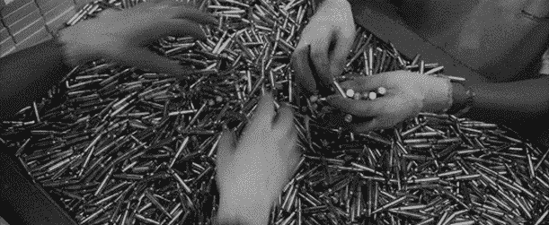
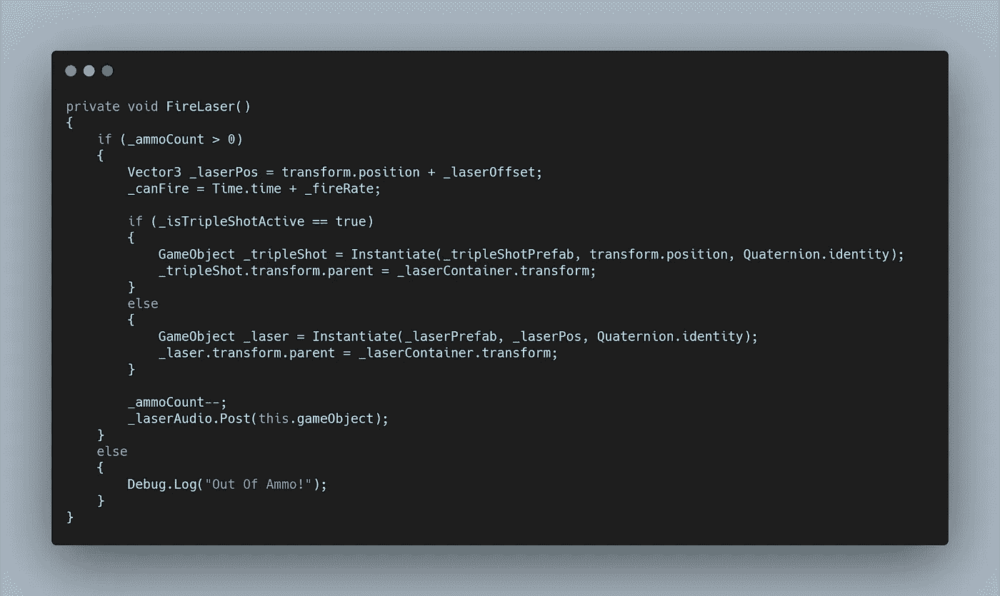
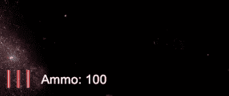
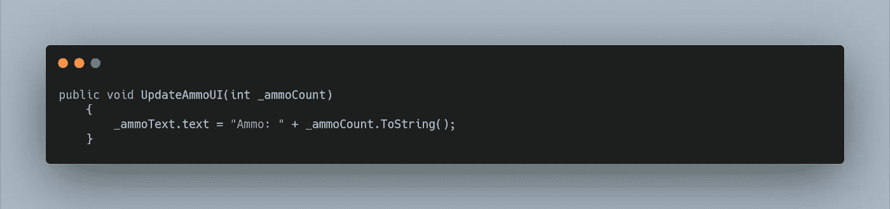
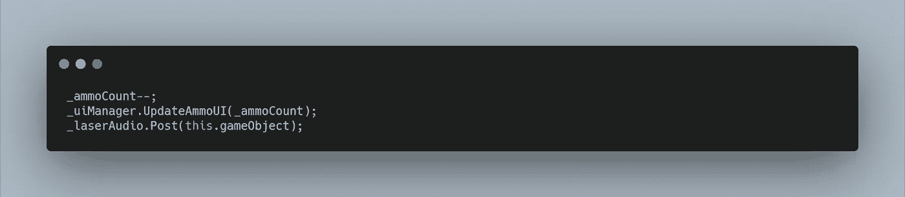
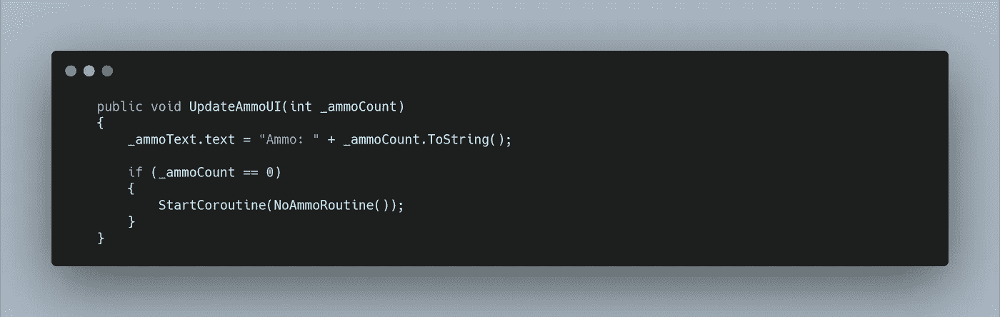
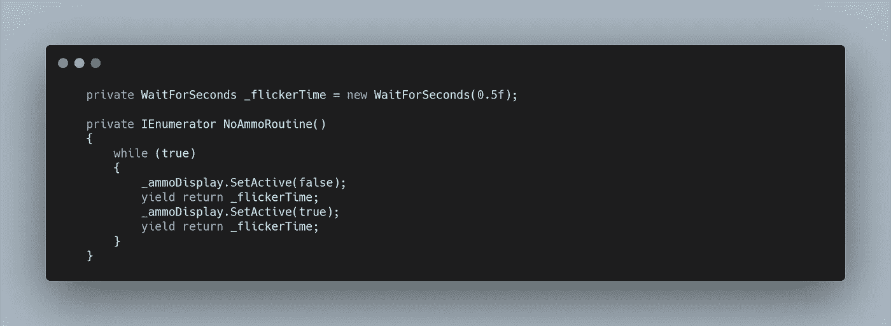

# 太空射击挑战:弹药计数

> 原文：<https://levelup.gitconnected.com/space-shooter-challenge-ammo-count-4e053f418a38>

让我们增加限制玩家弹药数量的能力，让游戏比滥发空格键更具挑战性。

首先，我需要为弹药计数创建一个 int 变量。现在，我们可以在检查器中将其赋值为 15。在未来，我们可以考虑增加一个最大弹药数，这样玩家就不会积累太多的火力，但是现在 15 似乎是一个不错的起始值。

现在在我们的 **FireLaser 方法**中，我们可以将整个代码块包含在一个 **if 语句**中，检查弹药计数是否大于 0。如果是这样的话，**火激光法**继续，然后弹药数应该减 1。我们还可以创建一个 **else 语句**来指示当玩家没有弹药时会发生什么。现在，一个简单的**调试。日志**可以向我们展示事情正在按照它们应该的方式工作。

让我们添加一些用户界面来记录他们的弹药数量。为此，我在**画布**中创建了一个**空游戏对象**，我这样做是因为我想存储一个**图像**和**文本。**对于**的图像，**我使用了三个激光精灵。文本可以简单地说“弹药:”。

为了给 UI 一些功能，我们可以在 **UIManager 脚本中创建一个**文本变量**。**接下来，我创建了一个名为 **UpdateAmmoUI、**的**公共方法**，并分配了一个名为 **_ammoCount** 的 **int 变量来调用它。**

在方法内部，我将**_ amcount 变量**附加到**文本变量。**

**玩家脚本**已经有了对 **UIManager** 的引用，所以我们可以在扣除弹药数量后简单地调用新的**公共方法**，传入变量 **_ammoCount。**

在 FireLaser 方法的 if (_ammoCount > 0)函数内

如果弹药数达到 0，我希望用户的视线被吸引到弹药数上，这样他们就知道了。为此，我可以使用一个 **if 语句**并在其中**启动**一个**协程。**

这个**协程**看起来将非常类似于**gameeflockerroutine，**每 0.5f 秒启用和禁用**弹药文本**。

为了整理一下，我们可以创建一个 **WaitForSeconds 变量**供两个**协程**使用，而不是不断地创建一个**新的 WaitForSeconds** 。

除了**弹药文本闪烁，**我还决定有一个弹药耗尽的音频提示。为了创造这一点，我将一些不同的卡嗒声分层。再次，制作一个新的**事件**，然后替换**调试。用新的**事件发布记录 **FireLaser 方法**的 **Else 语句**中的**代码。**