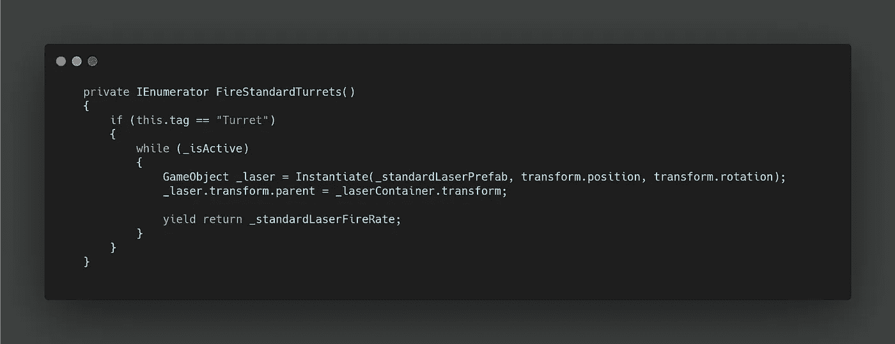

# 太空射击挑战:Boss 第 2 部分-武器

> 原文：<https://levelup.gitconnected.com/space-shooter-challenge-boss-part-2-weapons-f8fd0602c37e>

我现在有一个以多种不同方式移动的老板，但如果没有伤害玩家的能力，它又有什么价值呢？

让我们从发射侧面的**地雷**开始。我想让它们以某种圆周运动的方式散开，然后继续在屏幕上移动，为**玩家制造障碍。**

在不同的**运动协程**中，我调用了一个 **FireMines 方法，**为侧面传递一个字符串。这允许我使用一个 **switch 语句**并将**父游戏对象**设置为正确的**空对象**，这是我在昨天的文章中设置的。

然后，我使用**GetComponentsInChildren**来创建一个**数组**，然后使用 **foreach 循环**来循环这个数组。**GetComponentsInChildren**也将**父对象**添加到**数组中。**父对象位于 0，0，0，我不希望**矿**在那里被**实例化**。因此我需要检查**标签**来删除我不想要的对象。从那里，我**实例化**我的**地雷预置**并将其添加到**激光容器**中，以形成一个整洁的**层级。**

一旦 boss 完成，我打算用 int 而不是 strings 来整理 switch 语句。

接下来，我需要为**地雷创建功能。**为此，我想将 **Boss** 存储为一个变量，然后运行一个**协程**，将**矿**从 **Boss 的相反方向移动。我还创建了一个**随机时间**，在允许每个**地雷**向下移动之前运行。**

此外，我创建了一个**销毁方法**来检查屏幕边界，以避免**地雷**永远漂浮在游戏世界中！

对于**炮塔，**我从**炮塔脚本**本身开始。首先，创建一个**公共方法**来开始。这需要从 **Boss 脚本**中传递一个 **bool** ，以及一个 **int** 供侧面开火。

如果 **Boss** 允许**炮塔**开火，我启动两个协程，一个用于旋转——这将在明天的文章中讨论，另一个用于发射大型炮塔。

对于较小的炮塔，我需要运行一个**侧选方法**类似于地雷方法。

如果 **Boss** 阻止**炮塔**开火，我只需使用 **StopAllCoroutines。**

我在这里使用了 int 而不是 strings！这个老板是一个正在进行的建设！

另外，一旦 boss 完成，我打算做一个**游戏对象**的**数组**来存放不同的空容器。

用于**触发协程。**我检查**标签**以区分两个尺寸，然后在一个 **while 循环**中，我**实例化**适当的**激光预制、**并将**激光**添加到**容器中。**

在未展示的**大型炮塔协程**中，唯一额外的方面是我必须为**激光创建一个**矢量 3 偏移**。**我没有为**标准炮塔**这样做的原因是，它在非常近的距离发射两个较小的激光。我不想让这个对玩家造成两次伤害，所以我创建了一个包含**激光行为的**空对象**，**中嵌套了两个包含**激光精灵的对象。**

为了从 **Boss 脚本中调用 **TurretControl 方法**，**我创建了一个方法来存储每个 **Turret 的脚本**，因为我会多次访问它们以用于各种用途。

一旦访问了**脚本，**我就把它们添加到了**列表中。**

从这里，我可以简单地访问我的**所有刀塔列表**中的每个**刀塔脚本**，并访问我喜欢的任何一个**公共方法**。我创建了一个**开始转塔**和**停止转塔方法**，通过适当的调用调用我的**转塔控制方法**。

然后我在我的 **StateSelector 方法**的开头和结尾分别调用了这两个方法。

明天，让我们看看如何实现健康系统，并让炮塔跟踪玩家。

点击这里查看第三部！