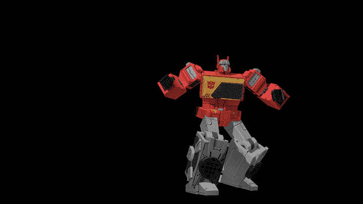
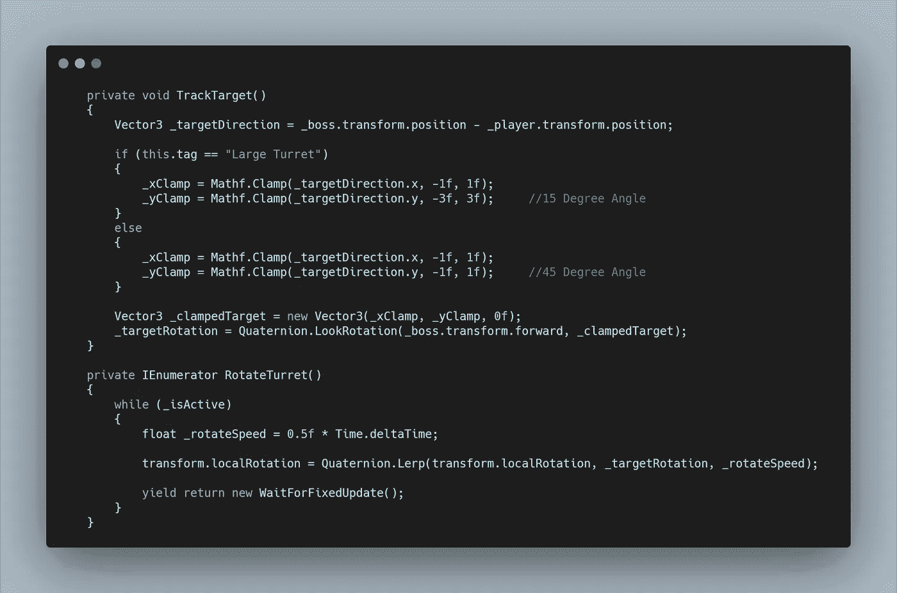
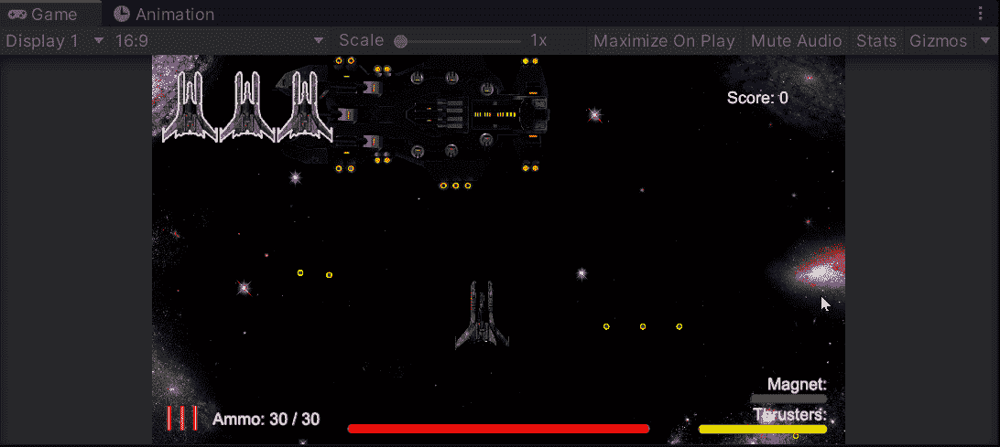
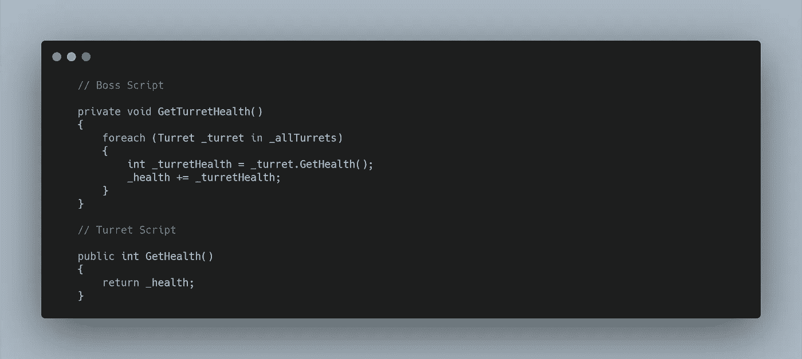
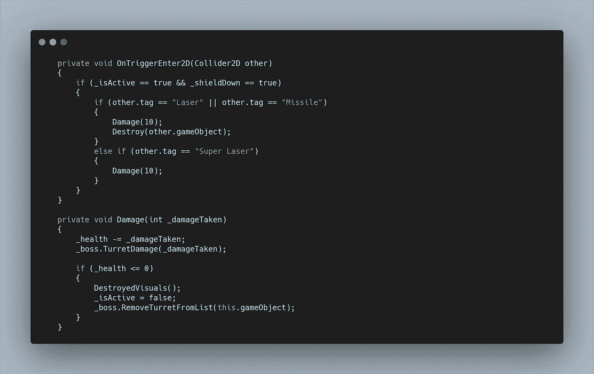
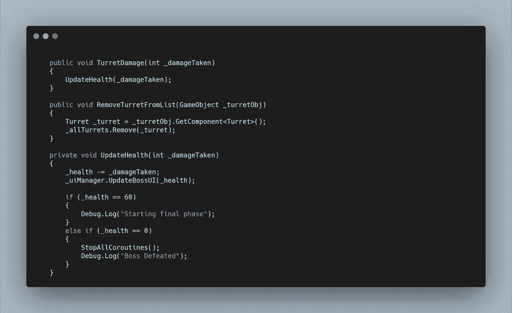
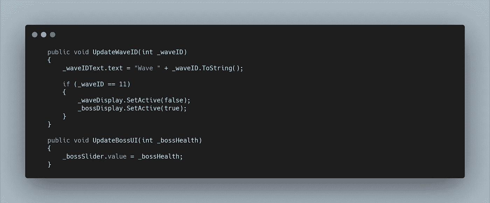
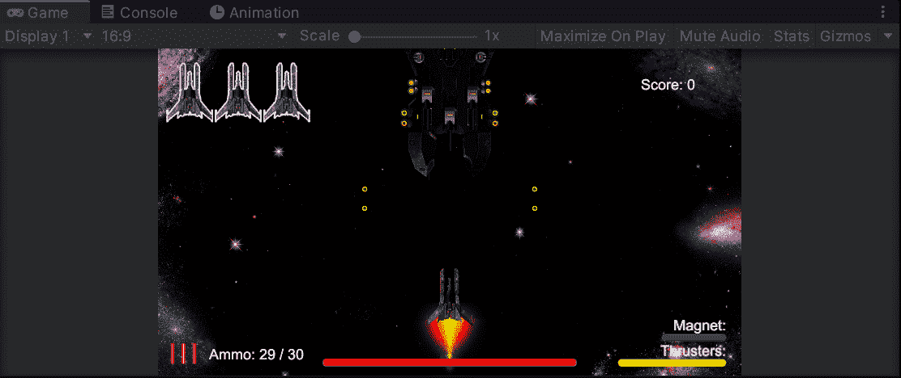

# 太空射手挑战:Boss 第 3 部分-炮塔旋转和健康系统

> 原文：<https://levelup.gitconnected.com/space-shooter-challenge-boss-part-3-turret-rotation-and-health-system-1c958a439f97>

我现在有了功能性武器，但我想让我的**炮塔**在某种程度上跟踪**玩家。**为了防止完全旋转并且让 9 个**炮塔**都直接向**玩家开火，**我遇到了限制旋转的挑战。

我还想让每组**炮塔**看起来像三个一组的，所以对于我的**目标方向**我是从 **Boss 的变换**中计算出来的，而不是每个单独的炮塔。

然后我可以将**夹具**设置在**方向向量**上，我通过想象每个点都在对角的正方形来计算，然后利用内角的基本知识，我为标准炮塔设置了 45 度的限制，较大的为 15 度。我选择了 1:1 和 3:1 的比例，但实际值可以根据屏幕空间的不同而增加或减少。

从这里，在使用 **LookRotation** 之前，我可以将这些**夹紧值**输入到一个新的**矢量 3** 中，以计算**凸台**的**前进方向**与**夹紧目标方向之间的角度。**

然后**旋转**刀架本身，我用 **Lerp** 从当前**局部旋转，**移动到**目标旋转。为了找到所有合适的变量，我们做了大量的实验，我必须向奥斯汀·麦克雷尔发出呼喊，以获得各种消息和帮助！**

随着武器的完成，我现在可以考虑创建一个**医疗系统。为了做到这一点，我想让每个**炮塔**都能够受到伤害，在触发最后阶段之前贡献大部分总体 **Boss 生命值**。**

每个**标准炮塔**可以射击 2 次，每次造成 10 点伤害。而**大型炮塔**取 4。总的来说，总共造成 240 点伤害，剩下 60 点伤害在最后阶段完成，总共造成 300 点伤害。

我创建了一个 **UI 滑块**来显示在屏幕底部，这在以前的 gif 中已经出现过，它的值为 300，所以可以直接关联到**健康变量。**

每个**炮塔**负责通过在**控制中心修改的变量来跟踪自己的**健康**。**

为了让 **Boss** 计算它的总生命值，它首先需要从**炮塔脚本中获取 **int 变量**。**

然后在**炮塔脚本**中，我可以调用一个**伤害方法**来减少**炮塔生命值**并在 **Boss 脚本中调用一个**炮塔伤害方法**。**在这里，我也检查了 0 生命值，将**炮塔关闭，**将其从**活动炮塔列表中移除，**并触发一些伤害视觉效果。

回到 **Boss 脚本，**这里我可以做上面**炮塔脚本**调用的事情，然后更新 **UI。**我对**健康变量**进行了一些检查，以便稍后触发最终阶段和死亡功能。

在 **UIManager 脚本中，**我需要检查 **Wave ID** ，这样我就可以关闭 **Wave Display UI** 并在它的位置激活 **Boss Display** 。稍后我可能会添加一些额外的 **UI 元素**来提供一个老板正在接近的警告系统。

我还不得不在**产卵管理器**中做了一些修改，以防止普通敌人产卵，但允许电力仍然产卵。

现在剩下的就是一些收尾工作了！

在这里阅读它们！