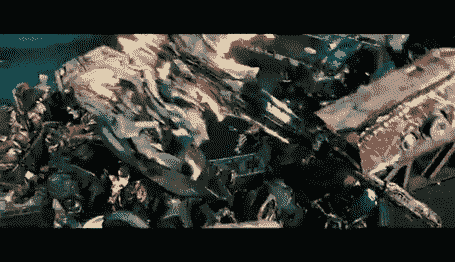

# 太空射击挑战:老板第 4 部分-最终状态和整理

> 原文：<https://levelup.gitconnected.com/space-shooter-challenge-boss-part-4-final-state-and-tidy-up-56243a6d6c70>

为了增强第一次遭遇的效果，我增加了初始护盾来显示不能对 Boss 造成初始伤害。然后在船的“核心”和加特林机枪周围有一个较小的护盾，以允许常规状态和最终状态之间的分离。

我还为这两个护盾添加了一个**脚本**，它只是简单地包括在碰撞时摧毁射弹，防止里面的任何组件被损坏。为了关闭和打开它们，我在 **Boss 脚本中创建了两个**游戏对象变量**、**，并使用 **SetActive** 在需要的地方传递真或假。

接下来，如果所有的炮塔都被摧毁了，我需要设置 boss 进入下一阶段。我可以通过检查每个炮塔的生命值来做到这一点，但是我知道剩下的总生命值应该是 60，因此我使用了 If 检查。

从这里，我可以启动 **boss 的碰撞器**，这样**玩家**击中的任何地方都会伤害 boss。然后我可以关掉我之前制作的小盾牌，在标准动作的基础上开始**加特林射击套路**。

为了使用 **Boss 碰撞器**，我需要创建一个 **OnTriggerEnter2D 方法**来检查各种射弹并摧毁它们。我选择让**超级激光**造成 1 点伤害，因为它可以持续碰撞。

对于**加特林射击程序**，我创建了一个新的由 4 个激光器组成的**预置**，并且**每 7 到 10 秒随机实例化**。至此，老板之争的最艰难部分已经完成。加特林火可以瞬间杀死玩家，但它并不打算为最后几击太难。

最后，我需要一种方法来摧毁老板。我想在船上发生多次爆炸，所以我在随机的点上创建了一堆空的物体，来保存各种爆炸的位置。然后我将它们存储在一个**数组中。**

使用 **ForEach 循环，**我可以访问**数组中的每个位置，**然后**在每个位置实例化**我的**爆炸预置**。

在这里，我在**游戏管理器脚本中调用了 **GameWon 方法**。**它很像 **GameOver 方法**，阻止一切继续繁殖。在指示如何重启之前，它另外调用 **UI 管理器**中的**公共方法**来显示一个成功的消息。

至此，我的**太空射手**的 **V1.2** 完成。下周，我将在 **Unity** 开始**电影摄影**项目，名为 **The Great Fleece** 。我很期待！在我空闲的时候，我有一些想法可以整合到**太空射击游戏**中，所以请务必通过下面的链接在 **Itch.io** 上关注它。

如果你想亲自试试我的游戏。点击 [**这里！**](https://calumslee.itch.io/2d-space-shooter)