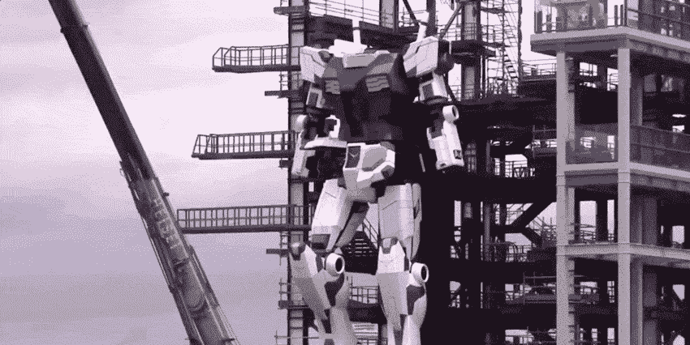
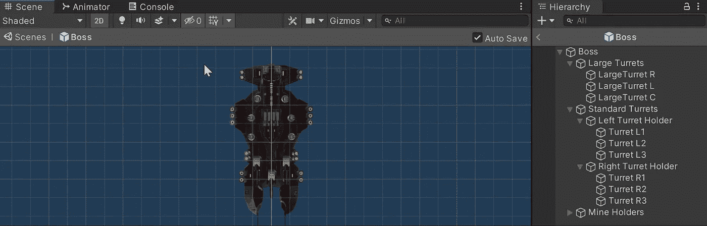
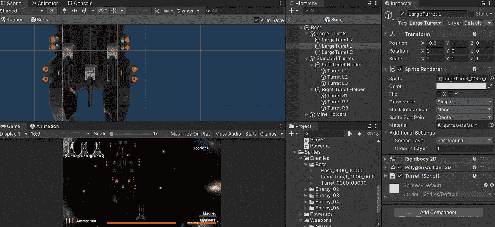
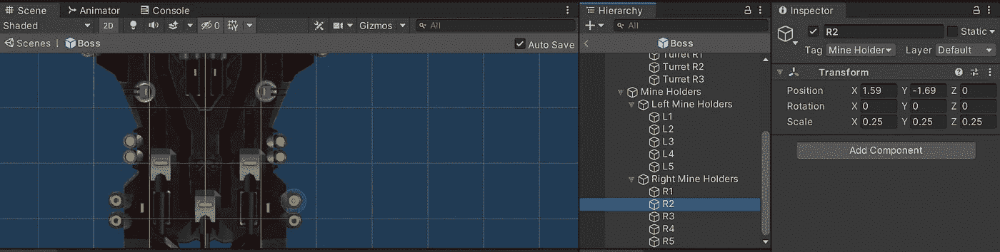
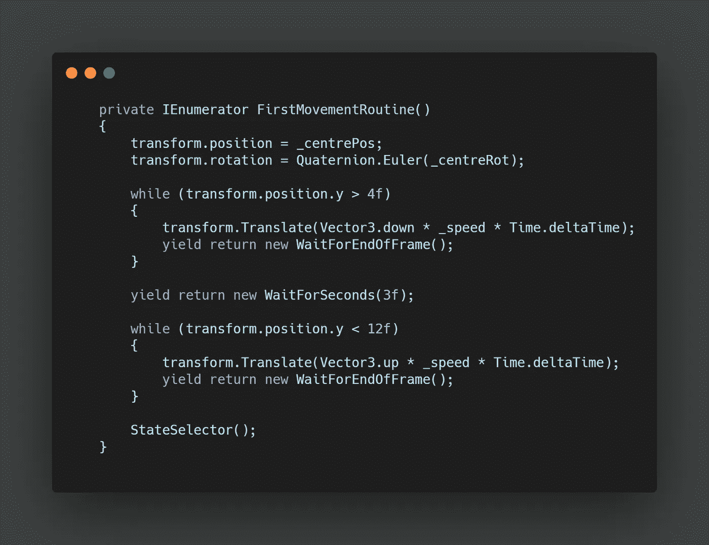
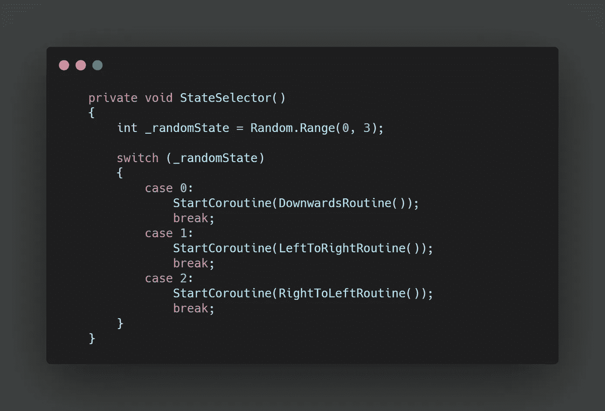
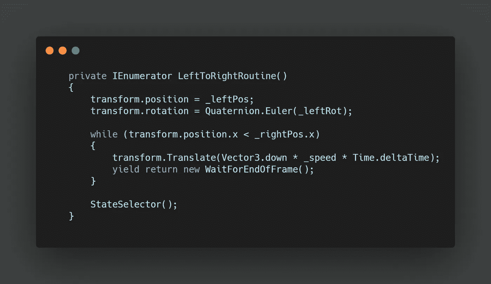
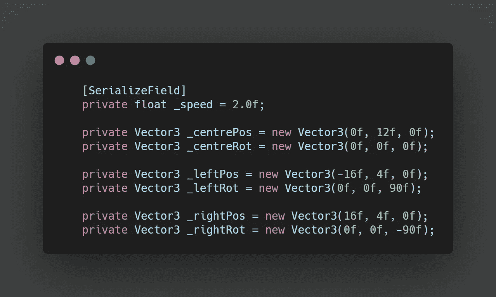

# 太空射击挑战:Boss Pt 1-设置和运动

> 原文：<https://levelup.gitconnected.com/space-shooter-challenge-boss-pt-1-setup-and-movements-aafb5e223618>

我的太空射击游戏的最后一个挑战是制造一个敌人。

首先，我需要找到一个合适的候选人。Filebase 有一艘看起来很邪恶的无畏舰，我把它出口到**搅拌机**去玩。我最后把小的侧炮塔和三个大的前炮塔分开，这样我就可以在游戏中单独操纵 **Boss** 的炮塔。我还在边上复制了黄色的看起来像地雷的东西，并捕获了所有东西的**png**图像作为**精灵导入到 **Unity** 中。**

在 Unity 中，我使用了许多空的游戏对象来存储不同的组件，这大部分是事先想好的，基于我想要在任何给定的时间点进行不同的操作。

我有一个**物体**拿着三个**大炮塔，**对于较小的侧炮塔，我把它们放在每一边，所以我可以选择以后只射击特定的一边。

对于**地雷，**我简单地使用了**空的物体**，我可以稍后用它们在合适的位置**实例化地雷预置**。

对于我的第一个 **Boss 行为，**我只是想在撤退之前把船介绍到屏幕上。最终，它会部署一些地雷，并激活一个护盾，这样它最初是不会受到伤害的。

为此，我使用了一个在**开始方法**中调用的**协程**。在这个**协程**中，我想用一些变量适当的设置我的位置和旋转。这些是为我们将要为 **Boss 创建的多个状态准备的。**然后当**变换位置**在屏幕上期望的停止点上方时，我简单地使用了**变换。向下平移**，每帧运行一次。

接下来我加了一个停顿，这将是地雷爆炸的地方。

之后，我反转先前的**同时循环**以返回屏幕外的**凸台**。

然后我调用一个 **StateSelector 方法**。

在这个**状态选择器中，**我使用了一个接收随机数的**开关语句**，然后为多个状态调用不同的**协程**。

这些不同的状态看起来与初始运动状态非常相似，下面是一个横向运动变化的例子。

最后，这里是我用来创建不同产卵位置和不同旋转的**向量 3 变量**。

下一步是考虑增加发射不同武器的功能。在这里阅读第二部！