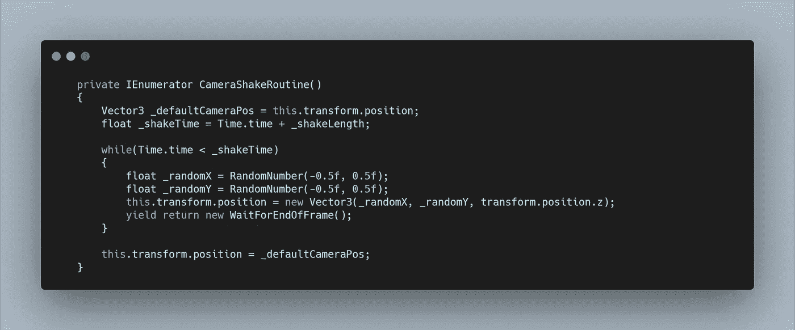

# 太空射击挑战:相机抖动

> 原文：<https://levelup.gitconnected.com/space-shooter-challenge-camera-shake-d35f8ac8c052>

当玩家受到伤害时，添加一些更强的反馈，不仅感觉更身临其境，而且可以分散注意力，制造恐慌和注意力。把它加到太空射手里吧！

我没有在**玩家脚本**中操纵**相机**，而是给**相机对象**添加了一个**相机脚本**。在尝试移动相机的变换位置时，我也决定不希望**背景叠加**出现改变位置，所以我把它做成相机的**子对象**，现在当我摇动相机时，背景会跟随相机的位置。

在**相机抖动脚本**中，我需要一个**公共方法**，这样我就可以在受到伤害时从**玩家脚本**中调用它。这个**公共方法**只是启动了一个**协程**。

首先，我需要一个默认位置的引用，这样在摇动后就可以返回到。这只是一个设置为 transform.position 的 **Vector3 变量**。

然后我想要一个可以在**检查器中改变的**摇动长度**，现在我将把它设置为 0.3f。**

最后，我可以为摇动时间创建一个 **float** ，它等于 **Time.time** (当前时间)加上**摇动长度。**

现在我可以创建一个 **while 循环**，当 **Time.time** 小于 **Shake Time** 时运行，因此在当前实例中，运行时间为 0.3 秒。

在这个循环中，我想将变换位置设置为每帧的一个随机位置。随机化**向量 3** 的每一个元素会很长，所以我创建了一个**返回类型方法**来获得一个**随机数。**

回到 **while 循环**中，我创建了两个浮点数，一个用于 X，一个用于 Y，然后将它们分配给 **RandomNumber 方法**。之后，我可以将这两个变量传递给**新向量 3** 。

一旦 **while 循环**完成，我想将位置返回到默认位置。

