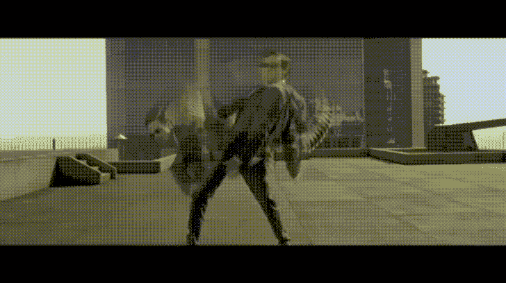
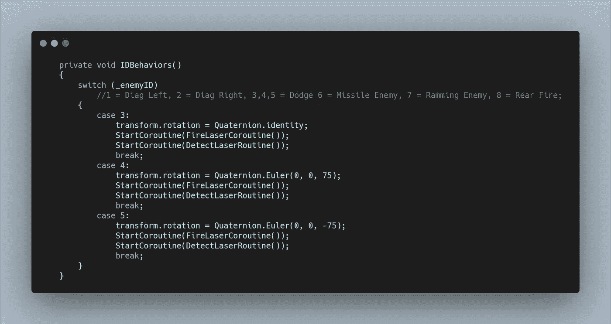
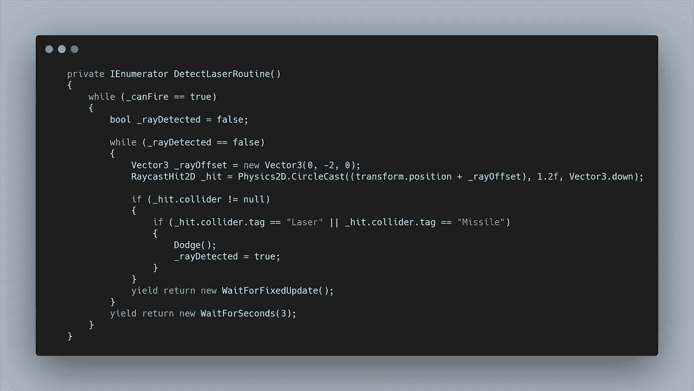
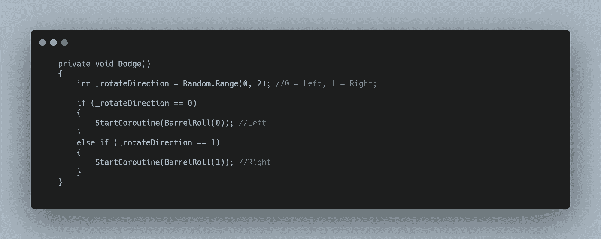
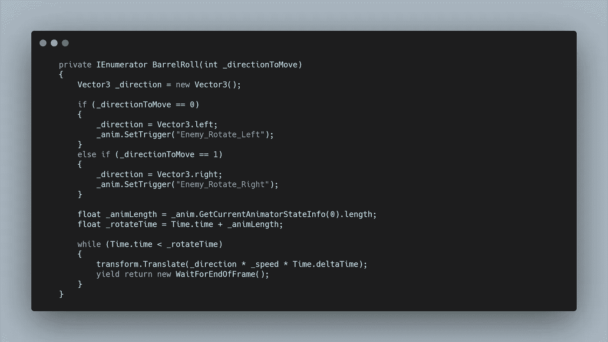
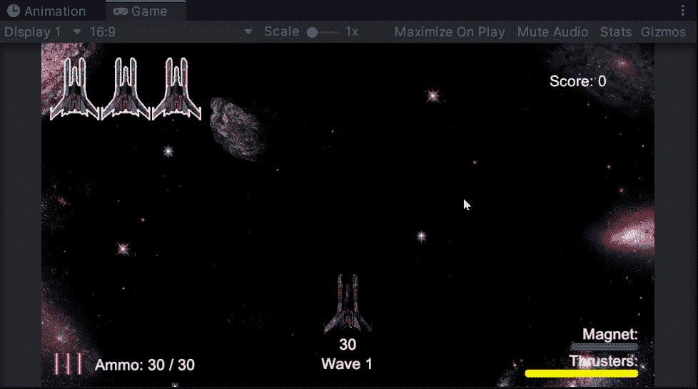

# 太空射击挑战:敌人躲避射击

> 原文：<https://levelup.gitconnected.com/space-shooter-challenge-enemy-avoid-shot-70d83e0c77d9>

今天的挑战是创造一个新的敌人类型，可以避免玩家的投射物。

在寻找其他敌人的时候，我发现了一个我想用来替换原来敌人的。相反，我决定将这个模型作为一个额外的敌人类型，但是有三个不同的迭代在他们如何旅行方面的相似设计。直下、斜左和斜右。

为了让我的代码易于阅读，我想将这两种敌人类型配对在一起，这意味着对我之前创建的高级敌人的 ID 进行一点重新洗牌。

上图显示了 **IDBehaviors Switch 语句的一个片段，**在案例 3、4 和 5 中照看这个新的**闪避敌人。**他们都运行 **FireLaserCoroutine，**不同的是他们的**旋转。****产卵管理器**照看他们的**产卵位置，**跟随原敌人**的变化。**

另外，我创建了一个**协程**用于检测激光。在这里，我想运行一个 **while 循环**来利用 **RayCast** 搜索其他**碰撞器。**我需要添加一个偏移量，这样它就不会简单地检测自己，我还选择了 **CircleCast** 这样我就可以让检测覆盖物体的宽度。否则，只有当**激光器的**恰好位于**敌方目标的正中间时，它们才会被探测到。**

接下来我检查了**碰撞器的标签，在调用**闪避方法之前是**。**我使用了一个**布尔值**，这样这个**方法**就只会被调用一次。

然后我决定，我想让**敌人**能够再次**躲闪**而不是仅仅一次。所以我把整个事情放在另一个 **while 循环**中，这个循环本质上是在**敌人**活跃的时候运行的。

在**减淡方法**中，我想选择一个随机的方向去**桶滚。为了做到这一点，我在**混合器**中旋转了**敌人**，并将一堆**精灵**渲染成**滚动动画。****

根据选择的方向，我可以调用一个 **BarrelRoll 协程，**传入适当的方向值。

这个**滚转协同程序**本质上是**导弹防御程序**被重新设计用于两种**敌人类型。**我需要选择**方向来移动 int** ，并将**向量 3 变量**设置为适当的方向，同时还要设置一个**动画触发器。**

然后，我可以获得当前动画**、**的**长度**，并在此发生时运行一个 **while 循环**。在这个**循环中，**我用了**变换。平移，**将**敌人**向与**动画一致的方向移动，**产生看起来像桶滚的效果。

