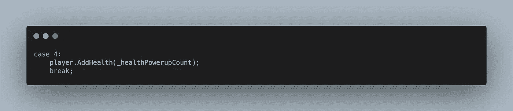
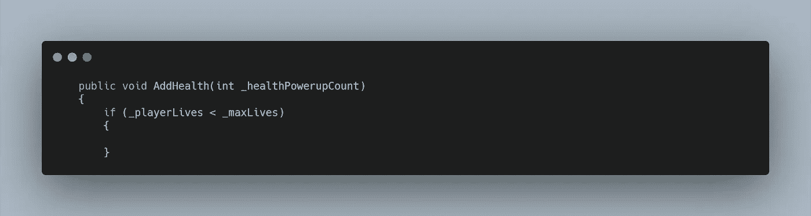
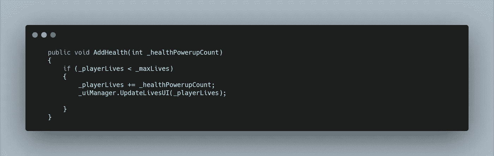
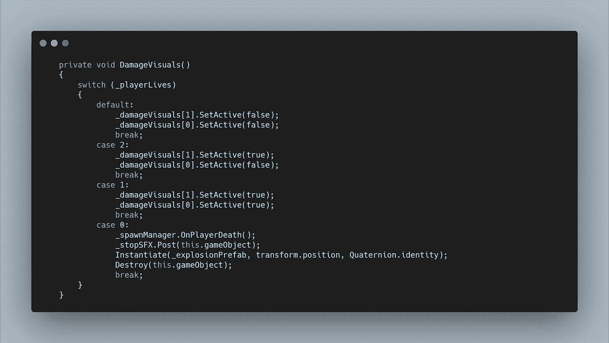

# 太空射击挑战:健康收藏

> 原文：<https://levelup.gitconnected.com/space-shooter-challenge-health-collectable-2ab669156f5e>

让我们给使用者一个重生的机会。

就像弹药加电一样，我必须在 Gimp 中创建一个新的。我可以使用我为弹药补充创建的模板，简单地重新着色和修改文本。

再次，将新的**精灵**拖到**场景中，**然后复制启动所需的组件。健康启动可以具有下一个 ID 4。

动画它，并使它成为一个预置。然后将其添加到 **SpawnManager 加电数组**。

为了功能性，我再次在**加电脚本**中创建了一个 **int 变量**，以允许我们为每次加电分配不同的健康级别。然后在 switch 语句中添加了一个新的 case。

为了完成这项工作，我需要在我的**播放器脚本**上创建一个**公共 AddHealth 方法**，并要求传递一个 **int 值**。

在这个方法中，我只想在**玩家**的生命值低于最大值的情况下增加生命值。为了在未来增加最大寿命，我创建了一个 **int 变量**来存储这个值。然后在我的方法中，我可以在添加生命值之前，检查生命值是否小于生命值的最大值。

在 **if 语句中，**我想添加生命，然后更新 **UIManager。**

视觉伤害效果也需要更新。为了整理一下，我把**伤害视觉效果**的**切换声明**移到了它自己的**方法中。**现在当生命被添加时，我可以调用这个**方法**，但是当生命在**方法中被扣除时，我也需要调用它。**

我还需要进一步充实 switch 语句，以说明随着生命的增长，是否应该关闭视觉效果。

