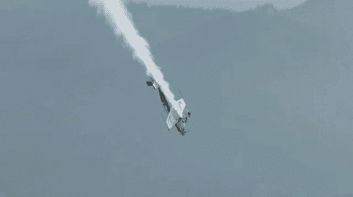
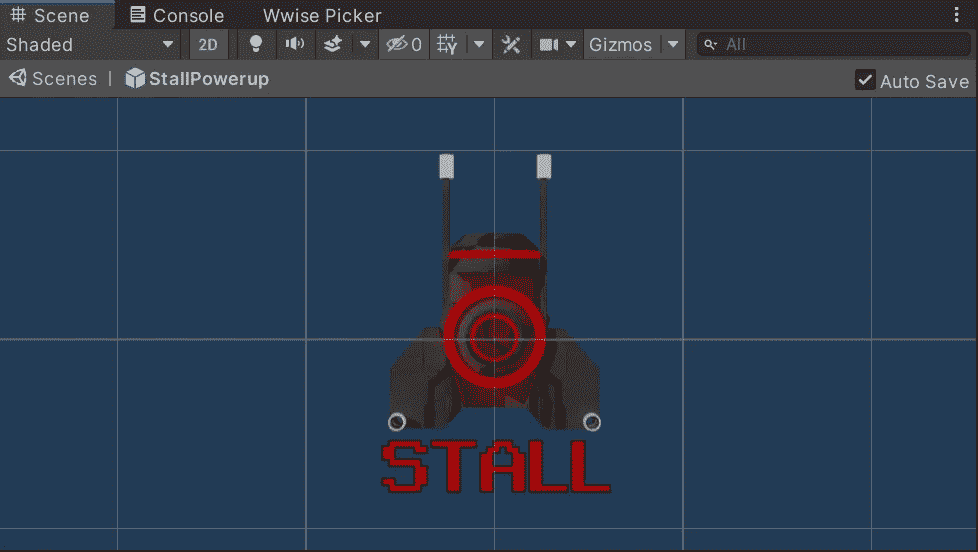
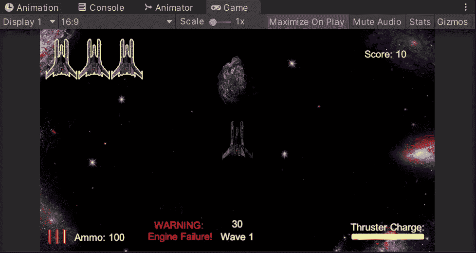
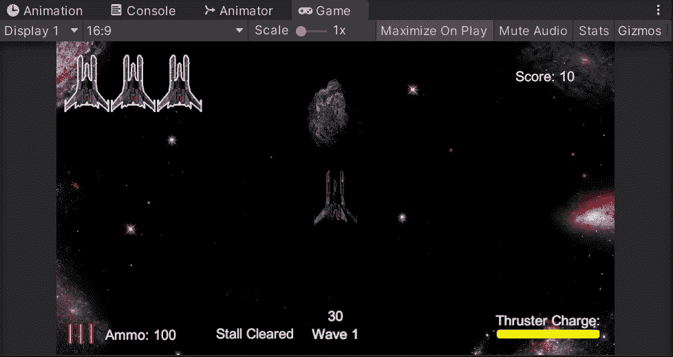
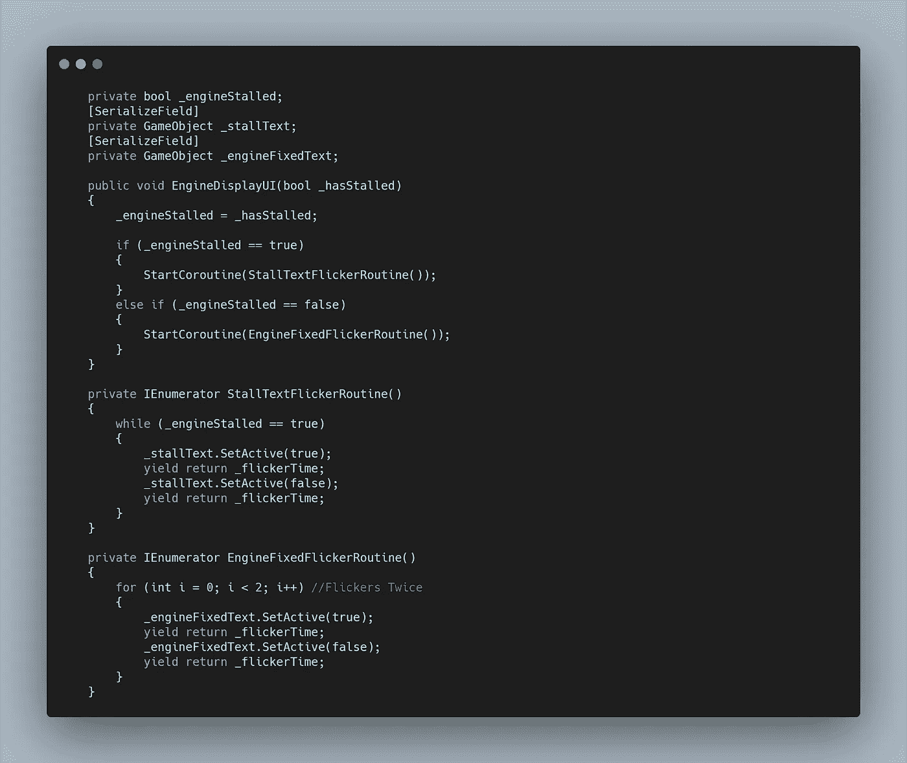
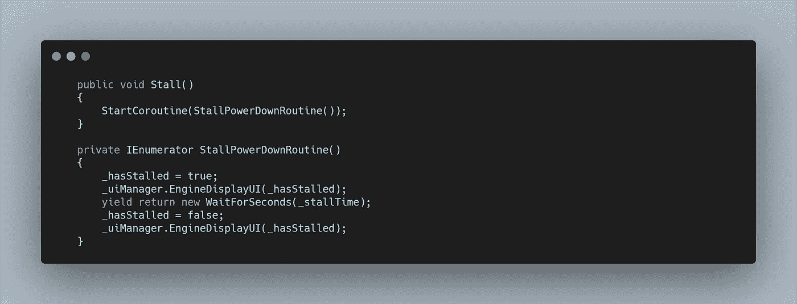

# 太空射击挑战:负面能量

> 原文：<https://levelup.gitconnected.com/space-shooter-challenge-negative-powerup-89bb7c04b4b1>

我的下一个挑战是创造一个对玩家有负面影响的能量。对我来说，最合适的是在设定的时间内启动引擎，在你无法躲避敌人时制造紧张感。

首先，我使用可靠的 GIMP 模板创建了一个新的动画精灵。我选择了暗红色，因为它看起来和生命值相近，很容易在战斗中被弄错。

接下来，我创建了两个简单的文本 UI 游戏对象,以给出正在发生的事情的视觉指示。

类似于错误消息的红色闪烁文本

一旦玩家可以再次移动，快速闪烁

然后，我需要在我的 **UIManager 脚本中编写一些功能。**首先我创建了一个 **bool** ，我将从**播放器脚本**中设置它，并创建了**变量**来控制我的两个文本对象。

我创建了一个**公共方法**，它需要从**播放器传递一个**布尔值**。**然后将**本地布尔**设置为该值。基于该结果，两个**闪烁协程**中的一个将启动。这些与我之前创建的 **UI 闪烁协程**非常相似，除了**引擎固定例程**使用了 **for 循环**而不是 **while 循环**，因为我只是想让这段文本闪烁两次。

然后我需要在我的**加电脚本的 Switch 语句**中添加一个新的 case，它调用了**播放器脚本中的**公共方法**。**这个方法将启动一个**协程**，该协程设置一个 **bool** ，我通过一个 **if 语句将我的**移动方法**装入其中。**然后我会调用之前在 **UI 管理器脚本**中创建的**方法**，然后等待 5 秒钟，恢复更改。

