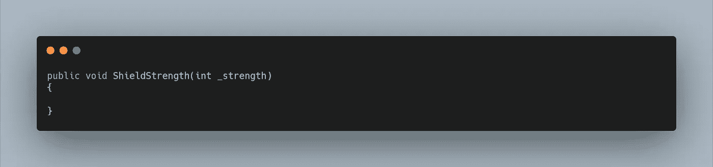
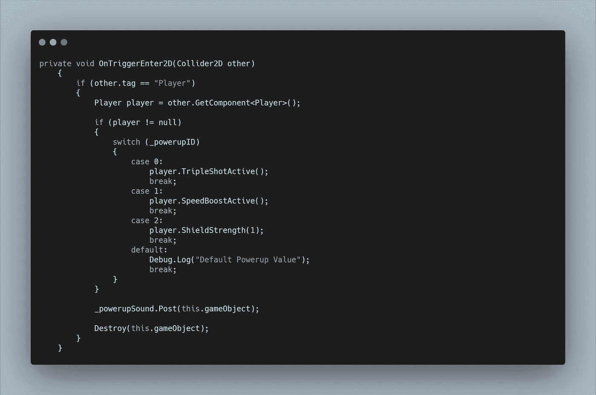
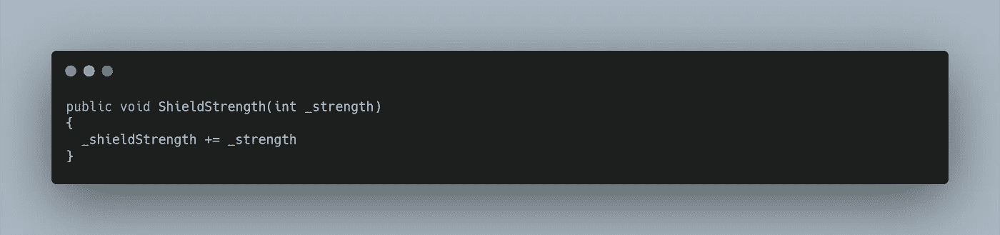
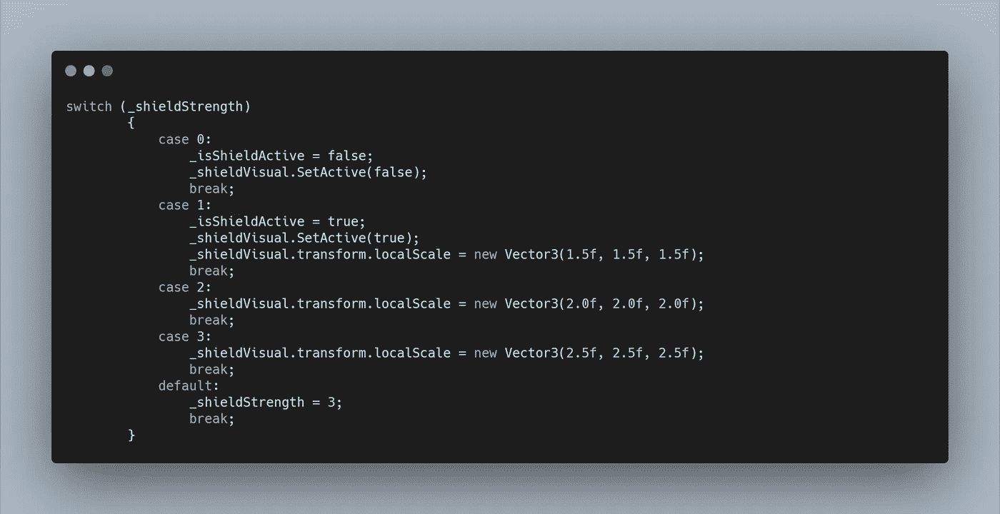
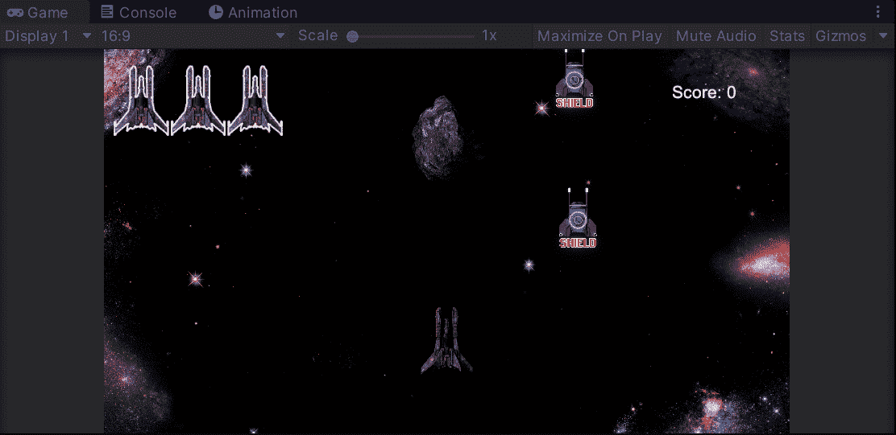

# 太空射手挑战:盾牌力量

> 原文：<https://levelup.gitconnected.com/space-shooter-challenge-shield-strength-ac8c368379cf>

我的太空射击游戏中要实现的下一个功能是收集多个**护盾能量**，允许最大强度或命中数为 3。

首先，我将我的 **ShieldPowerup 方法**重新标记为 **ShieldStrength** ，并为调用添加了一个要求，以包含一个名为 **_strength 的 **int 值**。**

然后在我的**加电脚本**中，在收集带盾 ID 的加电时，我简单的给我的**播放器加了一个值 1。ShieldStrength** 召唤，每次增加一级力量。

为了使用这个 **_strength 变量**，我还需要创建一个名为 **_shieldStrength 的 **private int** 。每当这个方法被调用时，总强度加 1，如果我们调用这个方法七次，我们的护盾强度就是 7。**

为了给 **_shieldStrength 值**适当的函数，我使用了下面的 **switch 语句。**

在我们的 **TakeDamage 方法**中使用了 **_isShieldActive bool** 来检查我们是否需要移除一个生命，所以我们首先需要适当地设置它。接下来，我们还需要启用和禁用我们的**盾视觉。为了给用户增加一种可视化不同强度的方式，我简单地改变了盾牌视觉的**比例**随着**盾牌强度**的增长而增长。最后，我的**默认情况**阻止 **_shieldStrength** 高于值 3。**

为了在**玩家**被击中时降低我们**盾**的**强度，在 **TakeDamage 方法**中，当我们检查**if _ isShieldActive = = true**时，可以在**返回**之前调用**盾强度方法**，并通过 **-1、**的值来降低强度。**

我又一次忍不住添加了音频。除了调整和重新设计**通电拾音之外，**我还想让音频在防护罩激活时循环播放。我又一次摆弄了一些环境来创建一些不同的循环，我可以在 **Wwise 的**随机容器**中玩。**但我也觉得需要有护盾启动的迹象。一旦我得到了我想要的声音，我就创建了一个**序列容器**，它将在过渡到**循环随机容器之前播放**盾牌启动声音**。**

像推进器一样，我需要一个**启动**和**停止**事件。在我的 **ShieldStrength 方法**中，我使用了一个 **if 语句**来检查强度是否大于或等于 1，因为屏蔽是活动的。如果是，将发布**开始事件**。

随着屏蔽强度的增加，这再次导致了多重声音的分层。我可以在**开关语句**的每个**情况**中调用**停止事件**，但为了方便起见，我简单地在**护盾强度方法**开始时调用它，所以每次调整强度等级时，循环都会减弱，要么停止，要么进入新的**开始事件**。我很喜欢每次强度增加时**护盾启动声音**播放的想法，因为它给出了护盾再次充电的想法。