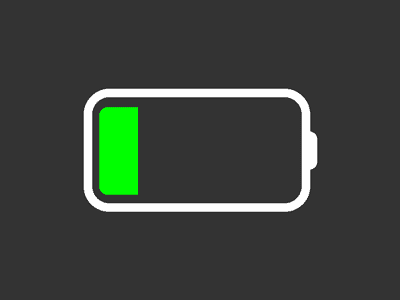
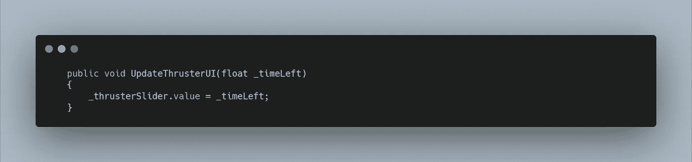
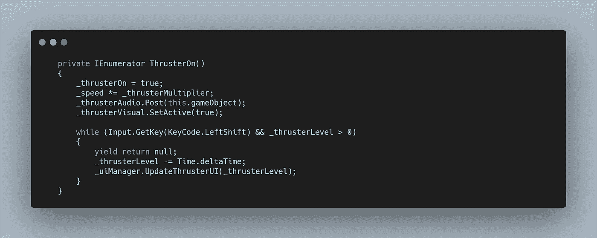
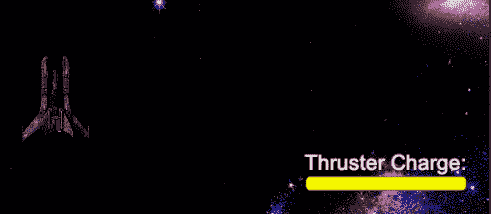
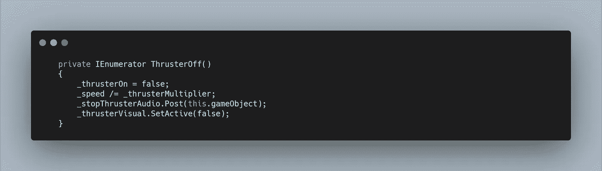
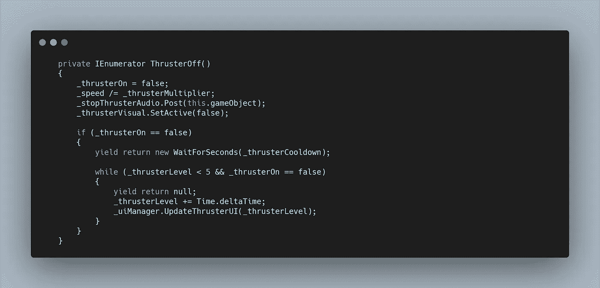
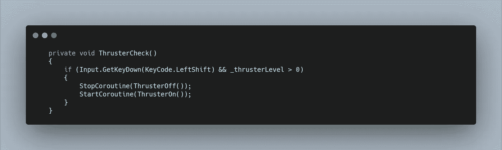

# 太空射击挑战:推进器界面和冷却

> 原文：<https://levelup.gitconnected.com/space-shooter-challenge-thruster-ui-and-cooldown-5a544e118e99>

以前，我创造了一个推进器，可以在按住 shift 键时提高玩家的速度。目前，这可以无限期地持有，我想创建一个系统，用户必须考虑什么时候节约使用它。

为此，我将创建一个 **UI 滑块**来可视化**推进器水平的值。**然后在代码中，我需要创建一个方法来消耗这个值，但也是一个基于计时器的充值功能。

首先，我创建了一个 **UI 滑块**并删除了**句柄对象**，因为我不想让它被用户控制。我在上面添加了一些文字，并将背景**设置为红色，填充**为黄色。****

为了更新 **UI，**我需要将**滑块**添加到我的 **UIManager 中。**然后我可以创建一个**公共方法**，它基于剩余时间内传入的一个**浮点变量**来设置值。

在我的**玩家脚本**中，我需要一些新的变量。我创建了一个**私有浮动**来存储**推进器水平，**一个**序列化** **私有浮动**来存储和调整**冷却时间，**和一个**私有浮动**来检查**推进器**在我将要创建的循环中是开还是关。

我现在需要将我原来的**画眉程序**和**画眉程序方法**转换成**协程。**我一开始只是让**推进器水平**开始下降。我的**推力器检查方法**现在检查**左移位**是否被按下，**和**是否**推力器水平**高于 0，如果是，则**协同程序启动。**

**画眉协程**包含了之前的速度、视觉和音频功能，但也将新的**布尔**设置为**真。然后我跳转到一个循环中。**我不希望其他所有东西都持续更新，因此只需要初始按下**左移位键**来启动**协程。**创建一个 **while 循环**允许我现在检查**左移键**是否被按住，以及**推进器水平**是否高于 0，因为这将是**循环的两个退出功能。**

在循环中，我可以使用 **yield return null** ,这样我们就可以没有任何形式的延迟地循环。然后我将**推进器水平**降低**时间δ时间，**并同时更新 **UI。**

现在按住 shift 键，**推进器 UI 滑块减小，**我们的**推进器水平**达到 0。但是速度、视觉和音频继续。从 **while 循环中出来后**就是可以调用**推力器协程**的地方。

这个**协程**保存所有先前的**推力函数**，但也将**布尔函数**设置为假。

在这个**协程**中，我想在将 **Time.deltaTime** 添加到我的**推进器等级之前等待一段时间。**如果 bool 上的**推进器设置为**假，我只希望这个运行。**否则，如果**推进器**在开和关之间交替，我们最终会多次要求给**推进器充电。**因此我需要一个 **if 语句**，然后在最终创建一个 **while 循环之前，我可以等待我之前设置的**冷却变量**。****

在这个**循环中，**我希望它只在**推进器水平**低于 5 时运行，这样我们就不会以超过 5 秒的使用结束。它也应该只在**布尔值**为**假时运行。因此，如果**推力协程**再次启动，充电将停止。 **while 循环**的内容是 **ThrusterOn while 循环的逆循环。****

回到最初的 **if 语句**中，我想确认当 shift 键被按下时**推力器协同程序**停止，所以我在启动**推力器协同程序之前调用**停止协同程序**。**

