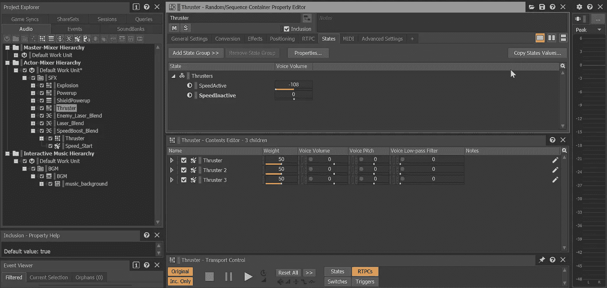

# 太空射击挑战:推进器

> 原文：<https://levelup.gitconnected.com/space-shooter-challenge-thrusters-bcbad4e1e105>

扩展我的太空射击游戏的第一个挑战是为**玩家**添加**推进器**。当按住**换档键**时，这些功能应被启用。

为了形象化这一点，我决定简单地使用我们已经添加到我们的**播放器中的推进器动画。**我可以用 **Shift 键来启动和关闭这个功能，**没有推进器也没什么不合适的，因为我们的敌人也没有。

为了访问推进器，我们可以创建一个**游戏对象变量。**

除此之外，我还增加了一个**乘数值**来增加我们的**速度。为了更好地平衡我的游戏，我把默认的玩家速度从 4 降低到了 4。我的**推进器乘数**是 1.5 倍，而**速度提升**的乘数是 2 倍。**

在我的**更新方法**中，我调用了一个**推力检查方法**来检测**换挡键**是否被按下。最初，我只是简单地使用 **GetKey** 而不是 **GetKeyDown** 来允许**推进器**打开和关闭，但是因为我决定使用乘法器，这个功能增加了我们每一帧的速度。我恢复到 **GetKeyDown** 来调用**推力方法**，并创建了一个相反的**推力方法**，当**换挡键**未按下时调用。

在 **On 和 Off 方法中，**我分别乘以和除以我们的**速度变量**，然后调用一个 **Wwise 事件**来打开和关闭一个**音频循环**。最后，我启用或禁用视觉。

为了创建**音频循环**，我使用了一个**随机容器**，它由三个类似的 **SFX** 组成，我用一个环境循环的不同部分和一个均衡的粉红色噪音音调创建。

快速简单的首次挑战。但现在我面临一个问题，没有任何迹象表明**速度提升动力**我们已经有了。

为了辨别两个乘数，我复制了**推进器视觉**并将颜色设置为黄色，因为它使**精灵**看起来更强大。然后我把它作为一个**游戏对象变量**引用，并在我的**加速方法中启用/禁用它。**

为了推进更强的速度提升的想法，我找到了一个科幻类型的东西通电的样本，并编辑它以适应**推进器声音**，而不是引入更多的文件，我只是重复使用了**推进器随机容器**，并将其放在一个带有我的启动声音的**混合容器**中，以短暂的延迟时间抵消启动。

我现在有一个助推器和一个加速助推器。但是我碰到了最后一个问题。

我最初只是做了一个直接复制的**推进器 Wwise 事件**，这导致了不必要的分层，并且根据开始和停止时间的各种组合，我最终会在我的推进器 boost 上没有音频，直到我按下 shift 键。因此创建了一个新的**速度提升事件**，但是重用了 SFX 并增加了更多。

这修复了大多数问题，但我仍然希望在**速度提升**激活时**推进器提升**短暂关闭。为了解决这个问题，我创建了两个**状态。**

现在在我的**推进器容器上，**转到**状态**选项卡，我可以在**速度提升**处于活动状态时简单地将**音量**拉低，如果我一直按住 shift，当**速度提升**结束时，声音将会恢复。

在我的 **SpeedBoost 播放和停止事件**中，我简单地设置了相应的状态。

