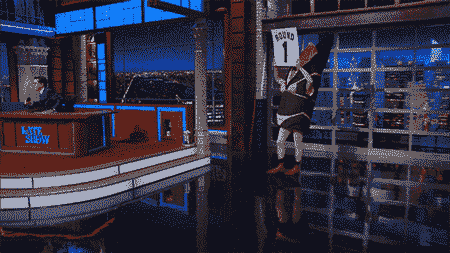
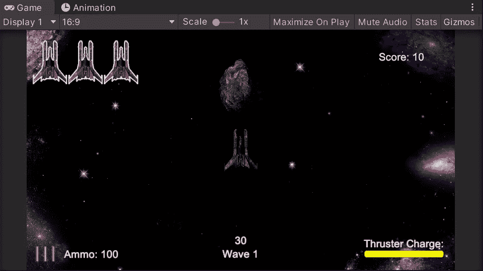
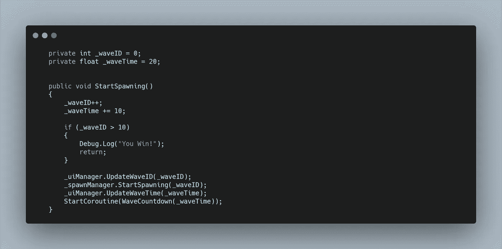
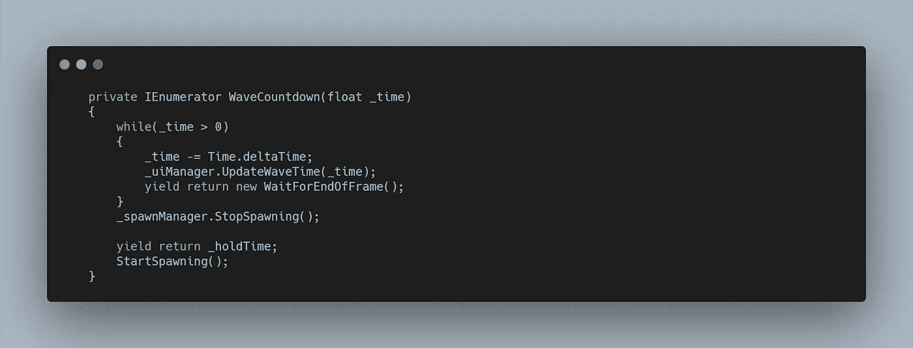
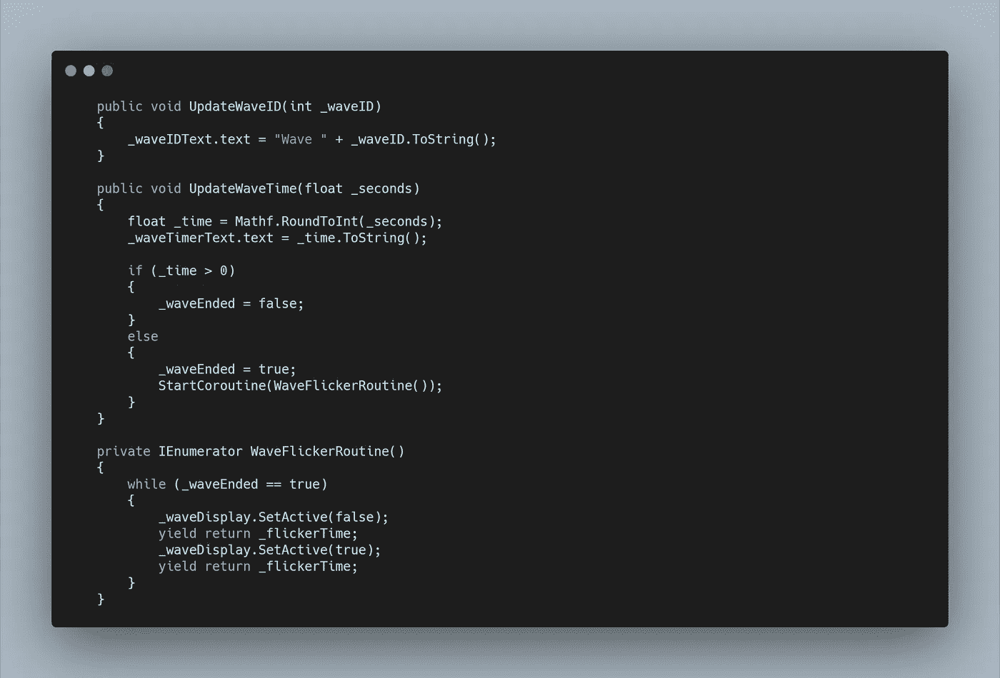
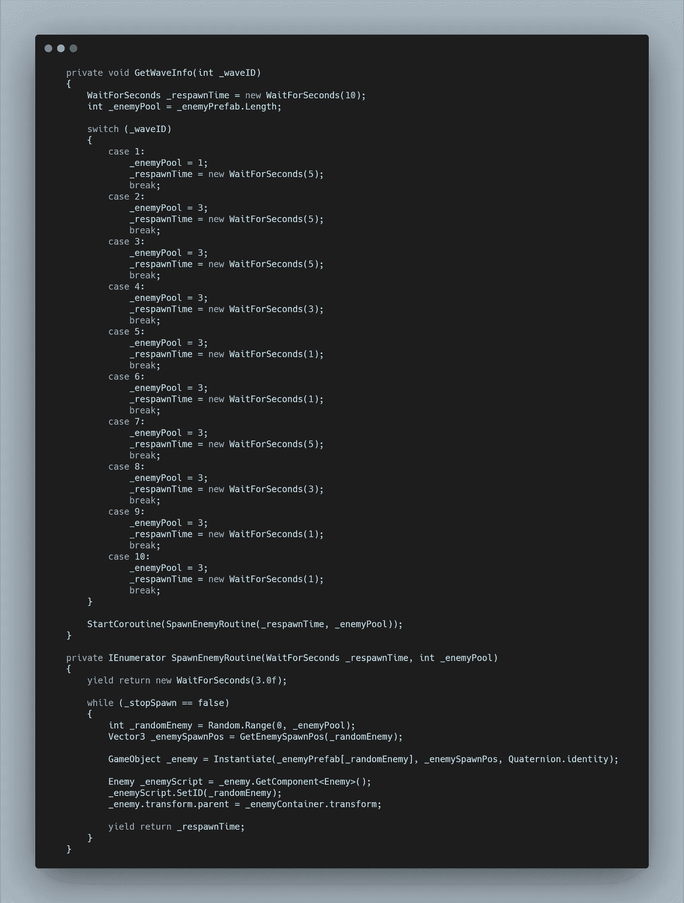
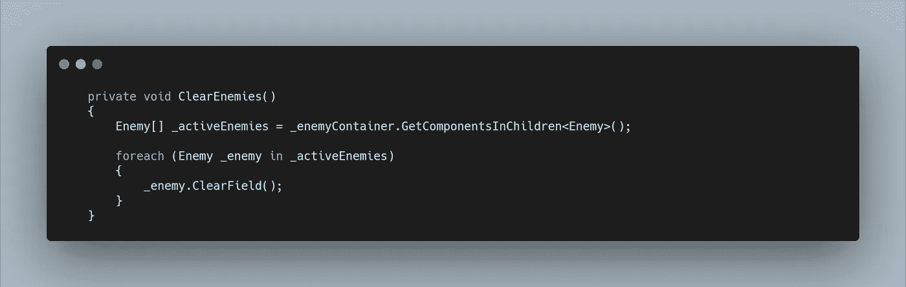
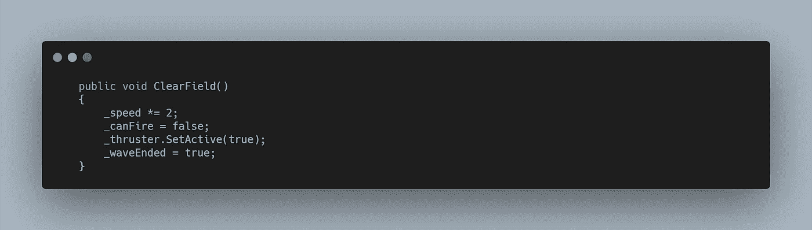
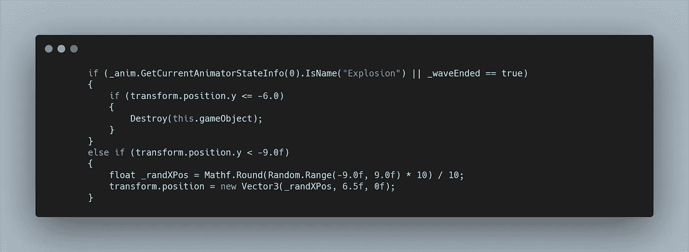
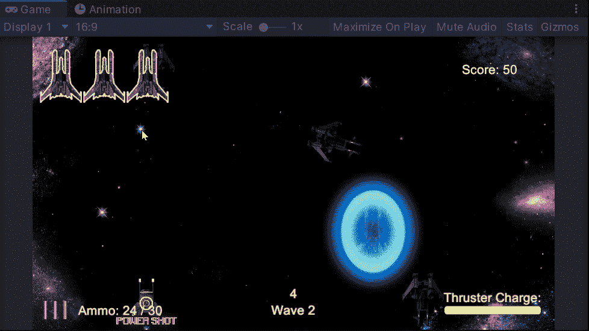

# 太空射击挑战:波浪系统

> 原文：<https://levelup.gitconnected.com/space-shooter-challenge-wave-system-377b65255d10>

下一个挑战是实现一个 wave 系统。虽然这不会像对付更多敌人那样彻底，但我至少可以把这个系统放在适当的位置。

首先，我在**画布内创建了一个**空游戏对象**，**，其中包含了一个 **Wave ID 文本对象、**和一个 **Wave Timer 文本对象。**

处理 **Wave 系统**最有意义的脚本是**游戏管理器。**目前，**小行星**处理对**产卵管理器**的**开始产卵调用**，相反，我将其改为在**游戏管理器**上调用一个**开始产卵公共方法**，然后它可以在告诉**产卵管理器**做它的事情之前处理功能。

我需要一个 **int 变量**来保存 **Wave ID、**和一个 **float 变量**来保存 **Wave time。**我希望第一波有 30 秒长，所以我把时间初始化为 20 秒。

我这样做是因为每次调用**start spaving 方法**时，我都希望 Wave ID 增加 1，Wave Time 增加 10 秒。从 30 秒开始，通过 10 波，每一波都比另一波长，最终会导致一场老板大战！现在，我只需要 debug.log“你赢了！”

从这里，我需要访问 **UI 管理器**并调用**公共方法**来传递 **ID** 和**时间。**除此之外，我还想调用**产卵管理器**来**开始产卵**，并在方法中添加了一个 **int 变量**来传递 **Wave ID。**

最后，我需要一个倒计时的方法…一个**协程！**

**协程**会将 **_waveTime** 的**浮点变量**赋值给 **_time。**然后**当时间大于 0 时，在更新 **UI 管理器**并等待直到当前帧结束之前，时间**将由**增量时间**修改。

一旦 **while 循环**完成，就可以在 **Spawn Manager 上调用**公共方法**，**将 **stop spawn bool** 设置为 **true。**

然后，我创建了一个保持时间 **WaitForSeconds 变量**，以便在再次调用**start spashing**之前等待。

在进入 wave 系统的生成功能之前，我想设置一下 **UI** 。为此，我需要两个**公共方法**，它们将各自的**文本组件**分配给传递的值。

对于时间变量，我首先需要将其四舍五入为一个 int 值**以便于显示。**

当该波结束并且保持时间正在发生时，我希望显示器闪烁，向用户显示他们已经通过了该波，因此我创建了一个类似于我的另一个 **UI 闪烁例程**的**协程**。

现在是产卵功能。在**start spaving 方法**中，我正在从**游戏管理器接收 **Wave ID** 。**所以在调用 **SpawnEnemyRoutine 之前，**我首先想传递一个**方法**，它可以根据 **Wave ID** 为**例程**分配不同的值。

因此，我创建了下面的 **switch 语句，**它现在对每种情况都非常相似，但是当增加额外的敌人时会有更多的变化。现在我只是简单地通过不同的**重生时间**，它对应于**实例化**每个敌人之前的时间量，也是一个 **int 变量**，用于表示 **ID 的**在**敌人预置阵列中可以被随机访问的最大数量。然后我可以调用**启动协同例程**并修改这些变量。**

最后，当每一波结束时，我希望所有的敌人消失，但要以视觉上有意义的方式。因此在**停止产卵方法**和**开启死亡方法**中，我调用了一个新的**方法**叫做**清除敌人。**

在这个方法中，我用**敌人容器中的**子组件**创建了一个**数组**。**然后对于每个敌人，我可以使用 **GetComponent、**访问它的**脚本**，并在各自的脚本中调用一个方法。

在**敌方脚本中，**我的**净空方法**，将**速度变量**乘以 2，将 **canFire bool** 设置为**假，**启用**推进器视觉**，并将一个新的 **bool waveEnded** 设置为**假。**

我创造的这个新球，是用来在敌人走出垂直范围时消灭敌人的，而不是在屏幕顶部重新显示。

