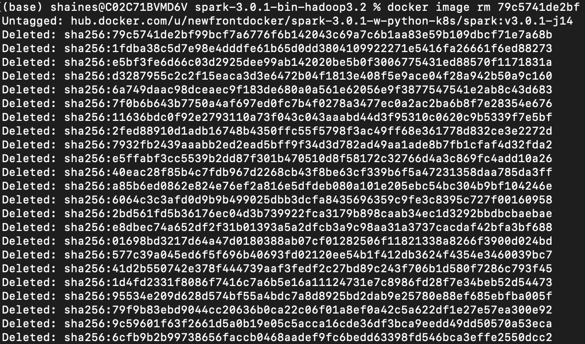

# Kubernetes 上的火花

> 原文：<https://levelup.gitconnected.com/spark-on-kubernetes-3d822969f85b>

## 动手操作介绍:启动和运行。


拉里莎·比尔塔在 [Unsplash](https://unsplash.com/s/photos/orchestra?utm_source=unsplash&utm_medium=referral&utm_content=creditCopyText) 上拍摄的照片

本教程旨在帮助工程师了解如何在 Kubernetes 上使用 *Spark。我希望您能够使用本系列中开发的技能，熟练使用 Kubernetes 调度程序构建和部署 Spark 应用程序。*

鉴于这是本系列的第一篇教程，自然也是最简单的。这里的想法是介绍我们将在整个系列中使用的概念和组件，包括[Kubernetes](https://kubernetes.io/)(K8s)[Docker](https://www.docker.com/)和 [Spark 3.0.1](http://spark.apache.org/) 。

## 先决条件

对 Apache Spark 的基本了解。

[](https://databricks.com/spark/about) [## Apache Spark 什么是 Spark

### Spark 是一个强大的开源统一分析引擎，围绕速度、易用性和流分析而构建…

databricks.com](https://databricks.com/spark/about) 

## 你将学到什么

这第一个教程将涵盖以下内容。

1.  在 Docker 桌面上启动和运行
2.  配置 Docker 环境
3.  使用 Docker 桌面的捆绑 Kubernetes
4.  安装 Kubernetes 仪表板
5.  基本 Kubernetes 命令
6.  局部火花装置
7.  如何构建自定义 Spark Docker 映像
8.  如何将自定义 Spark 图像推送到 DockerHub
9.  在本地 Kubernetes 集群中启动您的第一个 Spark 应用程序
10.  使用 Kubernetes 仪表板查看应用程序的运行情况

接下来的两节旨在涵盖所使用技术的基础知识，如果您赶时间，那么您可以跳到**在 Docker Desktop** 上开始运行，稍后再回来了解 Kubernetes 是什么，以及一点关于 [Spark Kubernetes 操作符](https://github.com/GoogleCloudPlatform/spark-on-k8s-operator/blob/master/docs/user-guide.md)或 Spark 的官方 Kubernetes 调度程序。

# 什么是 Kubernetes？


**图 1–1**:部署、自动扩展和修复由 Kubernetes 编排的容器化应用程序:通过 [Kubernetes](https://kubernetes.io/docs/concepts/overview/what-is-kubernetes/) 从什么是 Kubernetes？

[Kubernetes](https://kubernetes.io/) 简而言之，它是一个开源基础设施管理框架，允许您提供集群计算基础设施的逻辑切片，以便部署、扩展和管理不同规模的容器化应用。

乍一看，这个心理模型的某些部分感觉很熟悉。如果你已经站在 DevOps 一边有一段时间了——就像我一样——你可能已经在精神上看到了许多类似的解决方案。从不起眼的 shell 脚本，到不同的服务引导库，如 [Capistrano](https://capistranorb.com/) (还记得 ruby)、[Chef](https://community.chef.io/)(…更多 Ruby)、 [Ansible](https://www.ansible.com/) (python)，再到内部部署、预云部署和基于云的部署，我们都见过在一个地方运行良好，而在另一个地方却严重失败的情况。

> 还记得上一次您或您认识的人更改了配置，重新启动了流程，却忘记了所做的更改吗？不料在下一次部署中又出现了同样的问题:)

## 自动化

我们正处于计算机化自动化的时代，能够自动化修复过程、触发替换或自主扩大生产机器的车队——所有这些都基于“基础设施即代码”——可能是极其有益的。在本地工作的只是复制确切环境的蓝图，因此您可以在所有环境中依靠持久、可靠的部署—这是它的要点。

**基础设施即代码**支持服务配置、共享机密(位置而非实际机密…因为我们不会将密码登记到 github 中！)，磁盘和 ram 分配被检查到您的 github 中，并与典型的 CI/CD 管道一起释放。这些配置是等幂的，这意味着除非有真正的变化(配置哈希变化)，否则将相同的配置推送到集群两次不会改变集群内运行的服务。乍一看，这似乎微不足道，但 Kubernetes 是建立在多年的谷歌规模的部署和他们的最佳实践捆绑在一起的堆栈。

对于您的容器化应用程序，包括 Spark，所有东西都包装在一个版本化的容器中，该容器必须首先发布到您的容器注册中心或公共注册中心。

Kubernetes 支持多种容器格式，以防止锁定，但大多数人会告诉你他们正在用 Docker 做什么。

查看官方 Kubernetes 文档中的[容器运行时](https://kubernetes.io/docs/concepts/containers/#container-runtime)信息，或者浏览下面链接的书。

## **吊舱**

Pods 包装了您的应用程序配置、机器布局(文件系统路径、安装的操作系统、软件包等)、共享资源(如 CPU(cgroups)、ram 分配、应用程序配置、系统设置，甚至通过卷(python 文件、其他脚本)本地访问的共享文件，以及任何其他基于角色的访问控制。

这个名字来源于一种豆荚，这种豆荚在本质上是一种受保护的资源，就像“鲸鱼豆荚”或“豆荚中的豌豆”。更多详情请参见[什么是 Pod](https://kubernetes.io/docs/concepts/workloads/pods/) 。

在 spark 应用程序的情况下，这个应用程序运行时逻辑是标准的 *spark.conf.** 设置，以及任何共享卷(磁盘)、应用程序依赖项(jars/python/r 等)和运行 Spark 应用程序时想要细粒度访问的任何东西。

## 推荐阅读

我想涵盖基本的行话，但对于 Kubernetes 的完整端到端覆盖，我会推荐事实上标准的书(如下)，或者只是浏览一下[文档](https://kubernetes.io/docs/home/)。

[](https://learning.oreilly.com/library/view/kubernetes-up-and/9781492046523/) [## Kubernetes:启动并运行，第二版

### Kubernetes 从根本上改变了应用程序在云中构建和部署的方式。自 2014 年推出以来…

learning.oreilly.com](https://learning.oreilly.com/library/view/kubernetes-up-and/9781492046523/) 

考虑到这篇文章不是 Kubernetes 的入门，我就不说了，这样我们就可以进入教程的实质了。在下一节中，我们将看看 Kubernetes 上的 Spark，了解它是什么，然后开始设置本地环境并运行我们的第一个部署。

# Kubernetes 上的火花


**图 1–2**:在 Pod 内运行的火花驱动器。图片来自 [Spark 文档](https://spark.apache.org/docs/latest/running-on-kubernetes.html)

## Kubernetes 调度程序

Spark Kubernetes 调度器允许您将 Apache Spark 应用程序部署在一个容器化的包中，以及您的应用程序配置、自定义环境变量、共享机密和通过卷挂载的共享磁盘访问，即所谓的驱动程序 Pod。这可以看作是对 Spark Standalone 上部署的改进，原因如下。

## 从 Spark Standalone 到 Spark Kubernetes

如果你一直在独立模式下使用 Spark，这可能会在整体思维模式方面有所不同，下面是它的分解方式。在 [Spark 独立](http://spark.apache.org/docs/latest/spark-standalone.html)部署模式下，您必须部署一个独立的主服务器(集群协调器)，并且为了实现高可用性(HA ),还必须部署一个备用的主服务器。*这些机器不一定是结实的机器。2 个内核和 4gb ram 以及像样的网络实现了这个目标*。

然而，这确实需要 [Zookeeper](https://zookeeper.apache.org/) 来管理集群状态，例如，什么应用程序正在运行，每个应用程序分配了什么——也就是我的 CPU 和 RAM 去哪里了？—最后，哪些执行器实例在哪里运行。对于许多想要运行 Spark 的团队来说，仅仅是准备好运行第一个 Spark 应用程序的环境，就已经有了大量的 DevOps 开销。

您还必须在第一步部署中配置和设置 Spark Worker 实例，以便有一个集群来提交工作。

## 独立 Spark 版本控制

还有棘手的集群版本锁定。如果您有一个运行 Spark 2.3 的集群，那么您需要将您的应用程序部署和迁移到一个新的 Spark 2.4 及更高版本的集群。当然，在某些情况下，小版本仍然可以正常运行，但是总的来说，迁移应用程序总比期望最好的要好。

## 新心智模式

现在如果我们抽象地思考，Kubernetes 在概念上相当于一个火花簇。虽然这不一定是真的，但请听我说完。Kubernetes 是一个通用基础设施管理框架，可以调度部署、自动扩展应用程序，并通过自我修复来减少常见的基础设施缺陷，如主机停机。有一个丰富的生态系统，使您能够通过 Kubernetes 仪表板轻松监控集群的行为，您实际上是在一个可弹性扩展的高度分布式生态系统中开拓空间，非常类似于传统 Spark 集群中的共享计算资源。当然，也许我正在努力。

## BYO 星团

现在，假设您已经配置了一个 Kubernetes 集群，真正重要的是，我认为最大的增值如下。每个 Spark 应用程序驱动程序本质上都分配了一个 ad-hoc Spark 集群，通过 Executor Pods 分配，基于不可变的 Docker 映像和幂等 Pod 配置。

> 每个 Spark 应用程序驱动程序本质上分配一个 ad-hoc Spark 集群，通过 Executor Pods 分配，基于不可变的 Docker 映像和幂等 Pods 配置

如果你已经习惯了在这些共享的计算资源上运行 Spark 独立和共存的 Spark 应用程序，那么你也知道必须将旧应用程序迁移到新版本的 Spark 以减少多年积累的技术债务的烦恼。

现在这是一个尤里卡！至少对我来说，这是一个瞬间，因为我在 Twilio 的团队已经编写并运行了 60 多个不同版本的 Spark 和 scala 应用程序。

## 后续步骤

好吧。有很多要说的，我甚至没有真正触及表面。让我们继续实际动手做一些事情。在下一部分，我们将安装并运行 [Docker 桌面](https://www.docker.com/products/docker-desktop)。

# **在 Docker 桌面上开始运行**


Docker 桌面。图片通过 [Docker](https://www.docker.com/products/docker-desktop)

重要的事情先来。让我们安装 [Docker 桌面](https://www.docker.com/products/docker-desktop)，这样我们就能在同一个竞技场上公平竞争。

## 安装 Docker 桌面

这一部分相当容易，因为唯一的步骤是为您选择的平台下载安装程序。

1.  安装 [Docker 桌面](https://www.docker.com/products/docker-desktop)。
2.  创建一个 [Docker Hub](https://hub.docker.com/) 账户。(*仅当您想要构建和上传自定义 Spark 图像时。)

我倾向于使用 4 个 CPU 和 10gb RAM。根据您的机器大小，如果您主要在 Docker/K8s 上运行*而不是主要在您的核心系统 OS 上运行*，您可以增加资源。*记得给核心系统留些 RAM*。我倾向于在机器上留下 1 个内核，2gb 内存用于后台操作。


我的笔记本电脑是 6 核 i9，64gb 内存，2TB 固态硬盘——16 英寸 MacBook Pro。这种设置对于演示来说效果很好。

## **启用 Kubernetes**

您的单节点集群只需点击一下鼠标。说真的，这是一个救命稻草，因为它减少了开始使用 K8s 的认知负担。


真的。只需点击启用 Kubernetes，你就可以开始摇滚了

## **验证 Kubernetes 正在运行**

如果一切顺利的话。很可能是这样的。然后，您可以打开您最喜欢的终端程序(terminal、iTerm 等),您应该可以随意使用 K8s 命令行界面。

```
kubectl cluster-info
```


如果一切正常，您应该会看到一个类似的对话框。

## **安装 K8s 仪表板**


Kubernetes 仪表板:让自己管理事情变得容易

最新的安装步骤可以在 [Github](https://github.com/kubernetes/dashboard#install) 上找到。事情比我最初预期的要容易得多，希望事情对你来说也一样容易。下面是您将要安装的组件。可以把这个仪表板看作是您完成常见 K8s 任务的向导和助手。集成的仪表板允许你点击按钮而不是记住命令来做一些普通的事情，比如停止部署，在容器上执行命令等等。

## 应用仪表板

使用命令行工具应用仪表板配置。如果你想下载 [YAML](https://yaml.org/) 看看它到底在做什么，请这样做，而不是盲目地应用这个链接！

```
kubectl apply -f [https://raw.githubusercontent.com/kubernetes/dashboard/v2.0.4/aio/deploy/recommended.yaml](https://raw.githubusercontent.com/kubernetes/dashboard/v2.0.4/aio/deploy/recommended.yaml)
```

那就启动 Kubernetes 代理吧。

这个代理将使您能够使用`localhost:8001`而不是您的集群 DNS，这可以很容易地找到返回到您的集群上运行的任何 UI 的方法。

```
kubectl proxy
```

## 打开仪表板

仪表板:[http://localhost:8001/API/v1/namespaces/kubernetes-dashboard/services/https:kubernetes-dashboard:/proxy/#/log in](http://localhost:8001/api/v1/namespaces/kubernetes-dashboard/services/https:kubernetes-dashboard:/proxy/#/login)

如果你试图加载 Kubernetes 仪表盘，你会被吼成没有令牌。这是由于设计的安全性。你没做错什么。你可能会问自己*“但是等等。我只是点击了一个按钮* ***启用 Kubernetes*** *。我该怎么修？”*既然连东西在哪里配置都不知道。没关系。你并不孤单。


哦，太好了。我们现在要干嘛？通过 K8s 仪表板用户界面的图像

## **访问默认令牌**

当您的 K8s 环境从 Docker Desktop 引导时，会生成默认的系统令牌。您可以使用以下命令获取登录仪表板的令牌。

```
kubectl -n kube-system describe secret default
```

使用上面的命令将产生以下结果。只需复制**令牌**字符串并登录即可。


复制令牌:您将把它粘贴到认证对话框中

现在返回，粘贴令牌，并登录到仪表板。

## **成功**。

现在，您应该已经启动并运行了 Kubernetes 仪表板。花点时间拍拍自己的肩膀。我们正在学习新的东西，这才是真正的意义所在。

# 安装 Spark 3.x

安装 Spark 非常简单。只需转到下面的下载页面，选择预构建(tgz)或勇敢者获得完整的源代码来构建自己。我会等的，你下载所有东西需要几分钟。

[](http://spark.apache.org/downloads.html) [## 下载| Apache Spark

### 注意，Spark 2.x 是用 Scala 2.11 预建的，除了 2.4.2 版本是用 Scala 2.12 预建的。火花 3.0+…

spark.apache.org](http://spark.apache.org/downloads.html) 

希望您现在已经下载了 tarball (tgz)。

## **创建一个安装位置**

请注意。为了这个教程，我下载了`spark-3.0.1-bin-hadoop3.2`。

```
mkdir ~/install && cd ~/install
mv ~/Downloads/spark-3.0.1*3.2.tgz .
```

## **提取 Tarball 并清理**

```
tar -xvzf spark-3.0.1-bin-hadoop3.2.tgz
rm -rf spark-3.0.1-bin-hadoop3.2.tgz
```

## **用 Spark Home 更新你的 BashRC 或 ZshRC】**

你需要有一个简单的地方来引用你已经安装了 Spark。标准就是只用 **SPARK_HOME** 。我用的是 zsh，如果你用的是 bash，那么`vim ~/.bashrc`但是你可以遵循同样的命令。

打开并编辑您的 ZshRC

```
vim ~/.zshrc
```

并添加以下内容

```
export SPARK_HOME=/Users/`whoami`/install/spark-3.0.1-bin-hadoop3.2alias spark-shell=”$SPARK_HOME/bin/spark-shell”
```

现在确保这些设置与当前打开的终端窗口保持一致。你打开的任何新窗口都将继承你的`*rc`。

```
source ~/.zshrc
```

此时，您已经安装好了所有的东西，并做好了准备。

## **我们处于流程的哪个阶段？**

在本教程的这一点上，我们已经完成了大量的下载、安装和配置工作，但是我们还完成了本地环境设置，并为 Spark 应用程序开发做好了准备。

1.  我们已经将 docker 设置配置为 4 核 10gb RAM。
2.  我们已经启用了 Kubernetes，因此我们可以使用简单的单节点集群。
3.  我们已经安装了 Kubernetes 桌面软件包。这将让我们看到我们的应用程序正在运行。
4.  我们已经在本地下载并安装了 Spark

现在我们准备开始在 Kubernetes 上运行 Spark。

# **设置 Spark 在 K8s 上运行**

我们希望能够在我们的 Kubernetes 集群中构建和运行本地 Docker 映像。这对于在 Kubernetes 上运行 Spark 是必不可少的，如果您想为 Spark 创建一个基础映像以便在您的组织中重用，这也是非常有用的。能够重用基本映像并有效地扩展这些基本的共享映像是一项关键的技能——例如 PySpark 和定制的运行时安装。

## 构建基础映像

首先让我们找到官方的 Spark Dockerfile 文件。您应该能够在本地 Spark 安装目录中找到它。

```
ls -l $SPARK_HOME/kubernetes/dockerfiles/spark
```

下面是基本 docker 文件的样子。


火花文件。通过 GitHub 上的[火花](https://github.com/apache/spark/tree/branch-3.0/resource-managers/kubernetes/docker/src/main/dockerfiles/spark)

## **修改**

我想用 Java 14 构建 Spark。Spark 3.x 最终使您能够脱离 Java 8，因此您现在可以利用现代 Java 了。我在 *docker hub* 上看了一下，找到了 [OpenJDK](https://hub.docker.com/_/openjdk) 资源。我最终使用了默认 Dockerfile 文件中的 **14-slim** 与标准的 **8-jre-slim** 。

**注意** : Spark 默认运行为 *spark_uid* =185。如果您正在构建一个图像，您可能想要使用您自己的非特权用户。

## 节食中的容器

OpenJdk 14-slim 是基于 Alpine linux 发行版构建的，这是一个非常小的版本。苗条是因为它在节食。为了减小文件大小，大多数默认的命令行工具和包都被省略了。然而，值得指出的是，在 Docker 和 Kubernetes 的例子中，容器越小，由于带宽开销越小，上线越快。这也意味着缓存中的图像不会使缓存膨胀，或者导致其他图像从缓存中被逐出。

使用这种策略，您还可以创建最小的 Spark 应用程序，只需要提供 Spark 运行时没有提供的 jar。值得花时间检查包装有 Spark 的**罐**。

```
ls -l $SPARK_HOME/jars/
```

并且在你的 maven 或者 sbt 中使用**提供的作用域**。

## **构建和推送自定义 Spark 图像**

如果你想下载我制作的图片，请随意。我把它们上传到码头中心了。


**Spark**:Java 14 slim via[docker hub](https://hub.docker.com/repository/docker/newfrontdocker/spark)


**PySpark** :额外的 Python 依赖于 [DockerHub](https://hub.docker.com/repository/docker/newfrontdocker/spark-py)

否则。让我们来看一下创建火花图像的过程。

## **创建 Docker 图像**

在撰写本文时，我在 Slim Java 14 open-jdk 上构建了 Spark 3.0.1。我也选择支持 Python3。以下命令使用 Spark**docker-image-tool . sh**脚本。如果您想亲自尝试一下，那么只需用您的 dockerhub 用户名替换 **newfrontdocker** 即可。

```
$SPARK_HOME/bin/docker-image-tool.sh -r newfrontdocker -t v3.0.1-j14 -p kubernetes/dockerfiles/spark/bindings/python/Dockerfile -b java_image_tag=14-slim build
```

这将运行一会儿。如果一切正常，您应该看到以下内容。


**命令行**:Java/Scala Spark Docker 成功输出


**命令行**:**py spark 构建成功输出。注意它跳过了 java image 标签——这不是错误！**

**现在，您应该在本地 docker 图像缓存中有两个新图像。您可以使用下面的 docker 命令来检查它们。**

```
docker images 
```

****

**将图像放在本地有助于测试事情是否按照您期望的方式工作。然而，最终的游戏通常是将构建推送到 Docker 存储库中。我们现在就去做。**

## ****将你的 Spark 图片推送到 DockerHub****

**鉴于我们所做的只是构建 spark 和 pyspark 图像，我们仍然需要推进到 DockerHub。**

****提示**:考虑到您的 Kubernetes 集群可以在本地或远程运行，当您准备开始在本地机器之外工作时，推送最终的 Spark 构建是有意义的。**

**如果您想删除您创建的图像，可能您不喜欢潜在的存储库名称。然后，您可以使用下面的命令来做到这一点。**

```
docker image rm {containerId}
```

****

****例如:**删除一张我不喜欢的图片。**

## **推送图像**

**如果您对事情满意，可以随意将构建版本发布到您的容器注册中心。**

**第一步是确保你登录到 docker。这里有两种方法。**

## ****使用 Docker 桌面的凭证****

```
docker login docker.io
```

## ****新鲜登录****

```
docker login [docker.io](http://docker.io) — username newfrontdocker
```

**任何一个都应该以**

```
> Login Succeeded
```

## ****推送构建****

****Spark Python Docker 图片**:**

```
docker push newfrontdocker/spark-py:v3.0.1-j14
```

****火花对接图像**:**

```
docker push newfrontdocker/spark:v3.0.1-j14
```

****

****命令行**:推送到 Docker**

**在教程的这一点上，我们只是在主任务。在下一节中，我们将最终在 Kubernetes 上运行一个 Spark 应用程序。如果你坚持到现在，谢谢。**

# ****Kubernetes 上的火花:Hello World****

**我们现在正准备在 Kubernetes 上运行我们的第一个 Spark 任务。这是一件大事。这就是我们在这里的原因！**

1.  **我们需要找到集群主节点。**

```
kubectl cluster-info
```

****

****记住这个**:现在我们实际上正在使用来自集群信息的值**

**在我们的例子中，我们关心的是 Kubernetes Master，因为我们需要在 Spark 提交中引用它。**

```
*$SPARK_HOME/bin/spark-submit \
  --master k8s://https://kubernetes.docker.internal:6443 \
  --deploy-mode cluster \
  --name spark-pi \
  --class org.apache.spark.examples.SparkPi \
  --conf spark.executor.instances=5 \
  --conf spark.kubernetes.container.image=newfrontdocker/spark:v3.0.1-j14 \
  local:///opt/spark/examples/jars/spark-examples_2.12–3.0.1.jar*
```

> **值得指出的是，`**local:///opt/**`实际上引用了 Docker 容器内部的 JAR 路径。当您想要从您的部署中访问本地配置文件、spark-environment 变量、日志记录概要文件等等时，这是非常有用的。**

****

****Spark 提交输出**:当运行 Spark 应用程序时，您应该会看到类似的内容**

## ****豆荚里的火花****

**如果您在 Spark 应用程序运行时打开 ***Kubernetes 仪表板*** ，您会看到类似的视图。值得注意的是，由于我们在 Spark 提交中配置了`spark.executor.instances=5`,您将看到 5 个 pods 为您的应用程序运行。这相当于在传统的 Spark 独立世界中有 5 个 executor 实例。**

****

****Kubernetes 仪表盘**:Spark Executor 吊舱运行视图**

# **那是一个包裹**

**在第一节教程中，我们确实涉及了很多内容。我真的很享受学习周期的这一部分。当创造性的汁液开始流动，新的想法似乎活跃起来，这是大脑奖励学习过程的一种方式，我希望你能够坚持到这一点。在本教程的过程中，我们相当快地覆盖了很多领域。这是倒带。**

## ****Docker 桌面****

**我们在我们的电脑上安装并运行了 Docker Desktop。到处击掌。这包括在我们的笔记本电脑上配置一些空间，以便为 Docker 环境供电。我用的是旧笔记本电脑上的 4 核 10gb 内存。如果你有更多的内核和更多的内存，Kubernetes 会很乐意从你那里得到更多的并行性，让事情运行得更快。**

## ****本地 Kubernetes****

**我们进一步点击复选框，在本地 Docker 中启用了 Kubernetes(单节点)集群支持。这是我们共同的库伯内特之旅的开始。**

## ****Kubernetes 仪表盘****

**我们获取并应用了运行 Kubernetes 仪表板的配置和信息，这样我们就可以对集群有所了解。这是一个比 Docker 桌面仪表盘上的**运行**绿灯更好的集群视图。**

*   **我们研究了一些“kubectl”命令，以找到我们的令牌并实际登录到仪表板**
*   **我们看到了如何通过使用“kubectl cluster-info”命令获得一些非常重要的集群信息**

## ****安装 Apache Spark****

**我们在本地安装了 Apache Spark，以便访问项目附带的核心 order 文件。这是该过程的一个重要部分，因为当我们创建一个新的 Docker 映像时，我们需要能够在本地发布 Spark 源。**

**如果我们只是想做一些基本的事情，并通过 spark-shell 来了解 spark，那么我们可以开箱即用，只是玩玩 Spark 运行时。`$SPARK_HOME/bin/spark-shell`和`$SPARK_HOME/bin/pyspark`分别给你访问本地外壳的权限。**

## ****构建 Spark Docker 映像****

**我们能够构建一个本地版本的 Spark，将我们自己的 JDK 带到餐桌上——因为运输集装箱时饮食是很好的。这让我们能够**选择**如何在不引入集体厨房水槽的情况下构建这些图像。现在，本地测试、列出本地映像、有选择地删除映像以及最后将映像推送到公共存储库的功能都在您的工具箱中了。**

## ****在 Kubernetes 上本地运行 Spark】****

**我们通过运行一个示例 Spark 应用程序完成了这次旋风式的深入研究。这是作为测试集群的 **HelloWorld** 完成的，现在我们可以使用这里完成的工作，以便继续做更大更好的事情。**

## **后续步骤**

**在我的下一篇教程中，我将向您展示如何使用这两个基础 Spark 映像来简化运行 Spark Scala 应用程序以及需要定制 python 安装的 PySpark 应用程序。我们将更深入地了解 Kubernetes 配置如何工作，以便 ***支持基于服务和角色的访问*** 到在我们的*驱动程序*和*执行程序*容器中运行的流程。**

**感谢您花时间深入了解 Kubernetes 上的 Spark。**

## ****注意事项和绊脚石****

**作为题外话。Kubernetes Docs 上的“熄灭火花”为入门提供了答案。困难的部分实际上是让图像构建并上传到 DockerHub。我很不好意思地说，我敲了两个多小时的键盘，试图理解`-r <repo>`应该只是我的`username`——比如`newfrontdocker`。为我想得太多而感到羞耻。**

**DockerHub 的注册表实际上帮助我调试了这个问题，因为我不能在一个存储库中创建文件夹。啊。查看 Spark Kubernetes 目录中的`docker-image-tool.sh`有助于了解工件是如何合成的。这帮助我明白了我应该创建两个存储库`spark`和`spark-py`。**

## ****链接和感谢****

**在我经历这个过程的时候，网上有大量的资源可以提供帮助。我已经按内容把链接分解了。**

## **码头工人**

**[https://docs.docker.com/docker-hub/](https://docs.docker.com/docker-hub/)**

**[https://hub.docker.com/_/openjdk?tab=tags&page = 1&name = 14-slim](https://hub.docker.com/_/openjdk?tab=tags&page=1&name=14-slim)**

**[https://docs.docker.com/engine/reference/commandline/login/](https://docs.docker.com/engine/reference/commandline/login/)**

**[https://www . docker . com/blog/docker-hub-new-personal-access-tokens/](https://www.docker.com/blog/docker-hub-new-personal-access-tokens/)**

**【https://docs.docker.com/engine/reference/commandline/push/ **

**[https://docs.docker.com/docker-hub/repos/](https://docs.docker.com/docker-hub/repos/)**

**[https://stack overflow . com/questions/54410909/what-the-correct-upload-URL-for-a-docker hub-repo](https://stackoverflow.com/questions/54410909/what-is-the-correct-upload-url-for-a-dockerhub-repo)**

## **K8s 上的火花**

**[https://spark . Apache . org/docs/latest/running-on-kubernetes . html](https://spark.apache.org/docs/latest/running-on-kubernetes.html)**

**[https://spark . Apache . org/docs/latest/running-on-kubernetes . html # pod-template](https://spark.apache.org/docs/latest/running-on-kubernetes.html#pod-template)**

**[https://www . slide share . net/databricks/running-Apache-spark-jobs-using-kubernetes](https://www.slideshare.net/databricks/running-apache-spark-jobs-using-kubernetes)**

**[https://github.com/marcelonyc/igz_sparkk8s](https://github.com/marcelonyc/igz_sparkk8s)**

**[https://collab nix . com/kubernetes-dashboard-on-docker-desktop-for-windows-2-0-0-3-in-2-minutes/](https://collabnix.com/kubernetes-dashboard-on-docker-desktop-for-windows-2-0-0-3-in-2-minutes/)**

**[https://www . oreilly . com/content/how-to-run-a-custom-version-of-spark-on-hosted-kubernetes/](https://www.oreilly.com/content/how-to-run-a-custom-version-of-spark-on-hosted-kubernetes/)**

## ****Docker 桌面替代****

**最后。如果你只是想运行 *Kubernetes* 那么你也可以使用 [*MiniKube*](https://kubernetes.io/docs/setup/learning-environment/minikube/) 。**