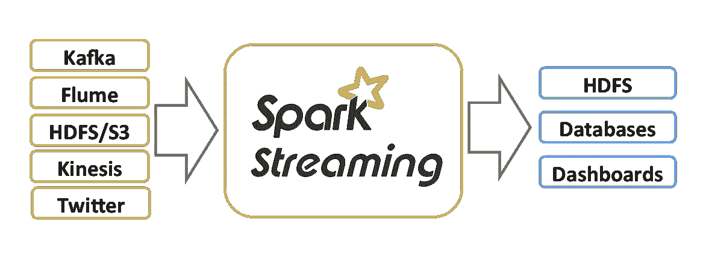
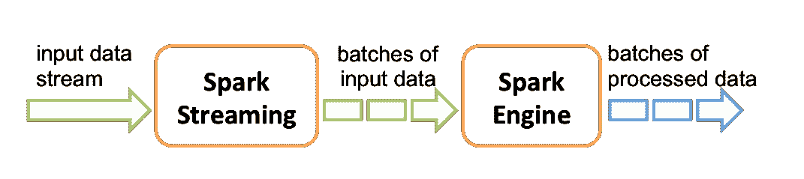
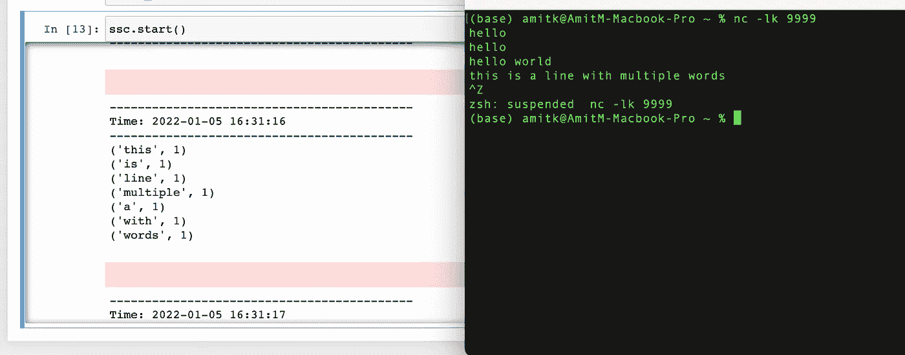

# 使用 Python 的 Spark 流

> 原文：<https://levelup.gitconnected.com/spark-streaming-with-python-f88ff662feb0>

迈克尔·泽兹奇在 [Unsplash](https://unsplash.com?utm_source=medium&utm_medium=referral) 上的照片

## 什么是火花流？

*   Spark Streaming 是核心 Spark api 的扩展，支持实时数据流的可伸缩、高吞吐量、容错流处理
*   数据可以从 Kafka、Flume、Kinesis 或 TCP sockets 等许多来源获取，并可以在用 map、reduce、join and reduce、join and reduce 和 window 等高级函数表示的复杂算法中进行处理。

信用:spark.apache.org

*   在内部，Spark Streaming 接收实时输入数据流，并将数据分成批次，然后由 Spark 引擎进行处理，以批次形式生成最终的结果流。

火花流:信用 spark.apache.org

*   让我们通过一个简单的例子来理解 Spark 流(我们将构建一个非常简单的应用程序，它通过套接字连接连接到一个本地数据流(一个开放的终端)。然后**会计算我们输入的每一行的字数**。)

## 流式传输的步骤如下:

*   创建 SparkContext
*   创建流上下文
*   创建套接字文本流
*   作为“数据流”读入这些行

## **处理数据的步骤**:

*   将输入行分割成单词列表
*   将每个单词映射到一个元组
*   然后按单词(键)分组(归约)元组，并对第二个参数(第一个)求和

注意 : RDD 语法严重依赖 lambda 表达式

*   下面是完整的代码和输出👇🏻

以上示例的输出:

火花流

**注:**我的 Python 版本是3.8.12，Spark 版本是 3.0.1，Java 版本是“1.8.0_25”。由于版本不匹配，您可能会遇到错误。

**感谢您的阅读。感谢您的诚实反馈！**

# 参考:

*   [https://www . udemy . com/course/spark-and-python-for-big-data-with-py spark/](https://www.udemy.com/course/spark-and-python-for-big-data-with-pyspark/)
*   [https://spark . Apache . org/docs/latest/streaming-programming-guide . html](https://spark.apache.org/docs/latest/streaming-programming-guide.html)