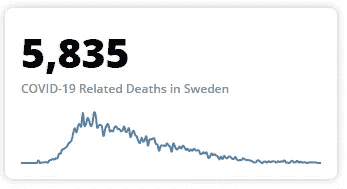

# 带角度和 D3 的迷你图

> 原文：<https://levelup.gitconnected.com/sparklines-with-angular-and-d3-d279dbac0c38>


带图表的平板电脑

所以你想显示迷你图？没有必要使用庞大的库，尤其是那些构建在 D3 之上的库(不要误解我，它们中的许多都很棒)，或者在这里购买一个商业组件。为了让枯燥的数字变得生动，我们可以很容易地做出一个。

为了解决这个问题，我们 ***将*** 使用 [D3.js](https://d3js.org/) ，在维基百科上描述为:

> D3.js(也称为 D3，是数据驱动文档的缩写)是一个 JavaScript 库，用于在 web 浏览器中生成动态、交互式数据可视化。它利用了广泛实现的可缩放矢量图形(SVG)、HTML5 和级联样式表(CSS)标准。

# 先决条件

最近我看到的大多数 Angular 目标教程都喜欢带你安装 Angular 并创建一个全新的项目。我不打算这么做，因为我坚信在你到达这里之前，你应该有框架的基础知识。不过，我会提供一个如何开始使用 Angular 的链接，所以如果你是新手，请浏览教程(英雄之旅),然后回来和我们一起制作迷你图！[角斗士之旅](https://angular.io/tutorial)

您需要安装 D3 库，这可以在提示符下完成:`**npm install d3 --save**`

然后，为了确保我们在实现 D3 时不会发疯，我们需要键入:`**npm install @types/d3 --save-dev**`

好了，我们现在有了库，让我们开始处理数据。在处理 D3 的数据时， [Observable HQ](https://observablehq.com/@d3/gallery) 上的许多示例使用 csv 或 tsv 数据(分别为逗号或制表符分隔的数据)。这些都很好，但是大多数 API 倾向于返回 JSON 数据，所以我们需要在开始创建实际的迷你图之前做一些准备工作。

## tsconfig.json

在我们继续之前，我喜欢在构建 Angular 应用程序时使用路径快捷方式。这样我只需用**~ app/feature/demo/demo . component**就可以访问**src/app/feature/demo/demo . component . ts**。为此，您需要打开根目录中的 **tsconfig.json** 文件，并将以下内容添加到 compilerOptions 部分，我通常将它插入到 moduleResolution 的正下方和 importHelpers 的前面。

```
**"paths": {
      "~app/*": ["src/app/*"],
      "~assets/*": ["src/assets/*"],
      "~environment/*": ["src/environments/*"]
},**
```

## 图表模型

图表模型是我们数据的结构，并防止我们与我们选择的打字稿冲突。让我们用以下内容来创建它:

```
**ng generate class feature/chart/chart**
```

这应该会在**应用程序/功能/图表**目录中创建一个 **chart.ts** 文件。对于这个实现，我们只需要创建一个名为“ChartSeries”的类来保存 x 和 y 轴数据。

**图表系列**

*   **x 轴**—x 轴数据
*   **y 轴数据**

以下是完整的图表文件:

**图表. ts**

```
**export *class* ChartSeries {
    public xAxis: any;
    public yAxis: any;
}**
```

# 图表组件

我们需要一个组件来实际显示迷你图。我们将通过使用:`**ng generate component feature/chart**`生成一个图表组件来实现

创建完成后，我们打开:**app/feature/chart/chart . component . ts**

## 图表.组件. ts

我们将利用相当多的核心角度接口，包括***AfterViewInit***， ***ElementRef*** ， ***HostListener*** ， ***Input*** ，以及 ***ViewChild*** 。我们通过导入来做到这一点。
替换现有的:`**import { Component, OnInit } from '@angular/core';**`

同:`**import { AfterViewInit, Component, ElementRef, HostListener, Input, ViewChild } from '@angular/core';**`

一旦完成，让我们导入 D3 库:`**import * as d3 from 'd3';**`

最后但同样重要的是，我们之前创建的 ChartSeries 类:`**import { ChartSeries } from './chart';**`

好的，这应该能让我们成功！

这里可能会有一个错误，因为我们实现的是 OnInit 而不是 AfterViewInit，所以我们需要做两处调整:

替换包含`**export class ChartComponent implements OnInit {**`的第 10 行或其附近的导出语句

用`**export class ChartComponent implements AfterViewInit {**`

我们还需要用**ngafterviewit()**替换 **ngOnInit()** 方法。在第 14 行或其周围更换`**ngOnInit(): void {}**`

用`**ngAfterViewInit(): void {}**`

为什么这很重要？如果你对[Angular Component life cycle](https://angular.io/guide/lifecycle-hooks)不太熟悉，它本质上是一种在组件生命周期中的特定事件(创建、更新和销毁)将代码“注入”到组件中的方法。来自官方的 Angular 文档:

> 组件实例的生命周期始于 Angular 实例化组件类并呈现组件视图及其子视图。生命周期继续进行更改检测，Angular 检查数据绑定属性何时更改，并根据需要更新视图和组件实例。当 Angular 销毁组件实例并从 DOM 中删除其呈现模板时，生命周期结束。指令也有类似的生命周期，Angular 在执行过程中创建、更新和销毁实例。

因此，在尝试绘制任何东西之前，我们希望等到组件尽可能初始化。这一点尤其重要，因为我们将利用 **ViewChild** 装饰器，根据 Angular 文档，该装饰器设置在调用**ngafterviewit()**之前，但在其他初始化生命周期挂钩之后。

> 视图查询是在调用`ngAfterViewInit`回调之前设置的。

**主持听众** 好吧！现在，我们还想确保当调整窗口大小时，我们的图表也随之调整大小。我们希望捕获任何窗口大小调整事件，以便在其容器内适当地重新绘制图表。最简单的方法是通过 Angular host listener——我们捕获任何' **window:resize** '事件，然后执行我们的 re-draw 方法 **this.resize()** ,我们将在本文中进一步实现该方法。

```
**@HostListener('window:resize', ['$event'])
onResize() {
    this.resize();
}**
```

**Input**
我们还需要来自调用组件的一些信息来初始化图表并适当地调整大小。

```
**@Input() data: ChartSeries[]; // The data to plot on the sparkline
@Input() lineColor: number[] = [70, 130, 180, 1]; // The RGBA value representing the color of the sparkline
@Input() margin: number = 0; // The margin to apply to sizing calculations - default to 0 but will typically be 20-24 pixels.**
```

请记住，如果您不想使用 RGBA 值，您可以简单地将 **lineColor** 变成一个字符串，并使用十六进制代码，如“**# 4682 B4”**，但我喜欢允许自己自由的不透明度(RGBA 数组中的第四个数字，范围在 0-完全透明和 1-不透明之间，如 0.4)

**观子**

继续前进！我们还希望利用 Angular 的 **ViewChild** 来轻松地(并且不生成或不需要特定的元素 id，这在显示多个图表时会非常麻烦)引用容器和图表 DOM 元素。

```
**@ViewChild('chart', {static: false}) chart: ElementRef<SVGElement>;
@ViewChild('container', {static: false}) container: ElementRef<HTMLDivElement>;**
```

**其他变量**
最后，我们需要存储一些在整个组件中使用的全局值，比如高度、宽度和一个全局 svg 组件，以便以后引用。

```
**private height: number;
private svg: any;
private width: number;**
```

## 快速回顾

到目前为止，我们的 **chart.component.ts** 文件看起来应该与此非常相似:

```
**import { AfterViewInit, Component, ElementRef, HostListener, Input, ViewChild } from '@angular/core';
import * as d3 from 'd3';
import { ChartSeries } from './chart';****@Component({
    selector: 'app-chart',
    templateUrl: './chart.component.html',
    styleUrls: ['./chart.component.scss']
})
export class ChartComponent implements AfterViewInit {** **@HostListener('window:resize', ['$event'])
    onResize() {
        this.resize();
    }

    @Input() data: ChartSeries[] = []; // The data to plot on the sparkline
    @Input() lineColor: *number*[] = [70, 130, 180, 1]; // The RGBA value representing the color of the sparkline
    @Input() margin: *number* = 0; // The margin to apply to sizing calculations - default to 0 but will typically be 20-24 pixels.** **@ViewChild('chart', {static: false}) chart: ElementRef<SVGElement>;
    @ViewChild('container', {static: false}) container: ElementRef<HTMLDivElement>;** **private height: *number*;
    private svg: *any*;
    private width: *number*;** **constructor() { }** **ngAfterViewInit(): void {
    }
}**
```

## **调整大小**

我们想要实现的第一个方法是 resize。这将允许我们在触发 resize 事件时修改图表的高度和宽度，并允许我们执行初始大小设置。我们将使用 **ViewChild** 对 **this.container** 和 **this.chart** 的定义，然后访问它们的 **nativeElement** 属性。

> **注意** :
> 如果你不熟悉你在代码示例中看到的反斜杠`**`**`，这不是一个粗心的错误！使用反斜线代替引号`**'**`或双引号`**"**`就是 JavaScript 中的插值或模板文字。MDN Web Docs 将模板文字描述为:**模板文字是用反斜杠(** `**`**` **)分隔的文字，允许被称为*替换*的嵌入表达式。你可以在这里找到更多信息:[https://developer . Mozilla . org/en-US/docs/Web/JavaScript/Reference/Template _ literals](https://developer.mozilla.org/en-US/docs/Web/JavaScript/Reference/Template_literals)**

```
**private resize(): void {
    // We know how big we should be based on our parent element - and its offsetHeight/offsetWidth properties
    this.height = this.container.nativeElement.parentElement.offsetHeight;
    this.width = this.container.nativeElement.parentElement.offsetWidth;** **this.chart.nativeElement.style.height = `${this.height}px`;
    this.chart.nativeElement.style.maxHeight = `${this.height}px`;
    this.chart.nativeElement.style.maxWidth = `${this.width}px`;
    this.chart.nativeElement.style.minHeight = `${this.height}px`;
    this.chart.nativeElement.style.minWidth = `${this.width}px`;
    this.chart.nativeElement.style.width = `${this.width}px`;** **this.container.nativeElement.style.height = `${this.height}px`;
    this.container.nativeElement.style.maxHeight = `${this.height}px`;
    this.container.nativeElement.style.maxWidth = `${this.width}px`;
    this.container.nativeElement.style.minHeight = `${this.height}px`;
    this.container.nativeElement.style.minWidth = `${this.width}px`;
    this.container.nativeElement.style.width = `${this.width}px`;
}**
```

现在我们有了 resize 事件，让我们将它添加到我们的**ngafterview it**方法中，以便在初始化时设置我们的高度和宽度。此外，让我们稍后用一个 **d3.select()** 更容易地引用我们的实际图表。

```
**ngAfterViewInit(): *void* {
    this.resize();
    this.svg = d3.select(this.chart.nativeElement);
}**
```

## 构建迷你图

现在我们开始讨论事情的实质。我们需要生成并绘制迷你图。

**X 和 Y 刻度** 刻度允许 d3 沿轴缩放数据。根据 d3 文件:

> 比例函数是 JavaScript 函数，它:
> 
> -接受一个输入(通常是数字、日期或类别)，然后
> -返回一个值(如坐标、颜色、长度或半径)
> 
> 它们通常用于将数据值转换(或“映射”)为可视变量(如位置、长度和颜色)。

我们将假设我们的 x 轴是时间(水平轴——例如左右), y 轴是数值(垂直轴——例如上下)。我们从 x 轴的零范围(最左边的值)开始，到组件的宽度结束。在 y 轴上，我们从组件的高度范围(最底部的值)开始，以 0 结束。对于这些域，我们使用 **d3.extent()** 来确定 x 轴上 **this.data** 内的最小和最大时间范围—对于 y 轴，我们有一个从零开始并在 **this.data** 的 **yAxis** 中的最大值处结束的域。

```
**const xScale = d3.scaleTime()
    .domain(d3.extent(this.data, (d) => d.xAxis))
    .range([0, this.width]);
const yScale = d3.scaleLinear()
    .domain([0, d3.max(this.data, (d) => d.yAxis)])
    .range([this.height, 0]);**
```

**线
线**是的，这是实际的迷你图。我们简单地创建一个 **d3.line** 并将它的 x 和 y 轴分别设置为 **xScale** 和 **yScale** 方法的返回。我们也用**D3 . line**curve 方法用 **d3.curveCardinal.** 给线条设置一条漂亮的曲线(而不是锯齿状的边缘)

```
**const line: any = d3.line<ChartSeries>()
      .curve(d3.curveCardinal)
      .x((d) => xScale(d.xAxis))
      .y((d) => yScale(d.yAxis));**
```

**绘制它** 现在我们将我们的线写入一个 SVG 路径，以便在画布上绘制迷你图。

```
**this.svg.append('path')
      .datum(this.data)
      .attr('d', line)
      .style('fill', 'none')
      .style('stroke', `rgba(${this.lineColor[0]},${this.lineColor[1]},${this.lineColor[2]},${this.lineColor[3]})`)
      .style('stroke-width', '2')
      .style('width', `${this.width}px`);**
```

**初始化它** 

```
**ngAfterViewInit(): void {
    this.resize();
    this.svg = d3.select(this.chart.nativeElement);
    this.buildSparkline();
}**
```

**总结** 在所有这些有趣的事情之后，我们应该得到一个如下所示的 chart.component.ts 文件:

```
**import { AfterViewInit, Component, ElementRef, HostListener, Input, ViewChild } from '**[**@angular/core**](http://twitter.com/angular/core)**';
import * as d3 from 'd3';
import { ChartSeries } from './chart';**[**@Component**](http://twitter.com/Component)**({
  selector: 'app-chart',
  templateUrl: './chart.component.html',
  styleUrls: ['./chart.component.scss']
})
export class ChartComponent implements AfterViewInit {** **@HostListener('window:resize', ['$event'])
    onResize() {
      this.resize();
    }** **@Input() data: ChartSeries[]; // The data to plot on the sparkline
    @Input() lineColor: number[] = [70, 130, 180, 1]; // The RGBA value representing the color of the sparkline
    @Input() margin: number = 0; // The margin to apply to sizing calculations - default to 0 but will typically be 20-24 pixels.** **@ViewChild('chart', {static: false}) chart: ElementRef<SVGElement>;
    @ViewChild('container', {static: false}) container: ElementRef<HTMLDivElement>;** **private height: number;
    private svg: any;
    private width: number;** **constructor() { }** **ngAfterViewInit(): void {
        this.resize();
        this.svg = d3.select(this.chart.nativeElement);
        this.buildSparkline();
      }** **private buildSparkline(): void {** **const xScale: any = d3.scaleTime()
          .domain(d3.extent(this.data, (d) => d.xAxis))
          .range([0, this.width]);** **const yScale: any = d3.scaleLinear()
          .domain([0, d3.max(this.data, (d) => d.yAxis)])
          .range([this.height, 0]);** **const line: any = d3.line<ChartSeries>()
          .curve(d3.curveCardinal)
          .x((d) => xScale(d.xAxis))
          .y((d) => yScale(d.yAxis));** **this.svg.append('path')
          .datum(this.data)
          .attr('d', line)
          .style('fill', 'none')
          .style('stroke', `rgba(${this.lineColor[0]},${this.lineColor[1]},${this.lineColor[2]},${this.lineColor[3]})`)
          .style('stroke-width', '2')
          .style('width', `${this.width}px`);
    }** **private resize(): void {
        // We know how big we should be based on our parent element - and its offsetHeight/offsetWidth properties
        this.height = this.container.nativeElement.parentElement.offsetHeight;
        this.width = this.container.nativeElement.parentElement.offsetWidth;** **this.chart.nativeElement.style.height = `${this.height}px`;
        this.chart.nativeElement.style.maxHeight = `${this.height}px`;
        this.chart.nativeElement.style.maxWidth = `${this.width}px`;
        this.chart.nativeElement.style.minHeight = `${this.height}px`;
        this.chart.nativeElement.style.minWidth = `${this.width}px`;
        this.chart.nativeElement.style.width = `${this.width}px`;****this.container.nativeElement.style.height = `${this.height}px`;
        this.container.nativeElement.style.maxHeight = `${this.height}px`;
        this.container.nativeElement.style.maxWidth = `${this.width}px`;
        this.container.nativeElement.style.minHeight = `${this.height}px`;
        this.container.nativeElement.style.minWidth = `${this.width}px`;
        this.container.nativeElement.style.width = `${this.width}px`;
    }
}**
```

## chart.component.html

我们的组件很棒，但是我们还没有显示任何东西。让我们在 chart.component.html 用以下内容快速替换 Angular 中的占位符:

```
**<div #container style="height: 100%; width: 100%;">
  <svg #chart height="100%" style="overflow: visible;" width="100%">
  </svg>
</div>**
```

你应该认识上面的**#容器**和**#图表**标识符——这些是我们在**图表.组件. ts** 中用**视图子**引用的

# 演示组件

图表组件现在已经完成，但是我们没有使用它。让我们以使用它为目的创建一个新组件。`**ng generate component feature/demo**`

## data.ts

要加载这个组件，我们需要一些数据。让我们在 **app/feature/demo 目录**中创建一个名为“ **data.ts** ”的文件(手动完成，无需 Angular CLI)。我们将在这里使用静态数据，但它也可以很容易地从外部来源引入。这超出了本文的范围，所以我们现在使用静态数据。在这里，我使用的是来自瑞典的最新(截至撰写本文时)每日新冠肺炎死亡数据。随意使用你选择的任何 x 和 y 轴！

```
import { ChartSeries } from '~app/feature/chart/chart';export const DATA: ChartSeries[] = [{xAxis: new Date('3/01/2020'), yAxis: 0},{xAxis: new Date('3/02/2020'), yAxis: 0},{xAxis: new Date('3/03/2020'), yAxis: 0},{xAxis: new Date('3/04/2020'), yAxis: 0},{xAxis: new Date('3/05/2020'), yAxis: 0},{xAxis: new Date('3/06/2020'), yAxis: 0},{xAxis: new Date('3/07/2020'), yAxis: 0},{xAxis: new Date('3/08/2020'), yAxis: 0},{xAxis: new Date('3/09/2020'), yAxis: 0},{xAxis: new Date('3/10/2020'), yAxis: 0},{xAxis: new Date('3/11/2020'), yAxis: 0},{xAxis: new Date('3/12/2020'), yAxis: 6},{xAxis: new Date('3/13/2020'), yAxis: 0},{xAxis: new Date('3/14/2020'), yAxis: 1},{xAxis: new Date('3/15/2020'), yAxis: 1},{xAxis: new Date('3/16/2020'), yAxis: 2},{xAxis: new Date('3/17/2020'), yAxis: 2},{xAxis: new Date('3/18/2020'), yAxis: 1},{xAxis: new Date('3/19/2020'), yAxis: 6},{xAxis: new Date('3/20/2020'), yAxis: 7},{xAxis: new Date('3/21/2020'), yAxis: 9},{xAxis: new Date('3/22/2020'), yAxis: 8},{xAxis: new Date('3/23/2020'), yAxis: 11},{xAxis: new Date('3/24/2020'), yAxis: 11},{xAxis: new Date('3/25/2020'), yAxis: 21},{xAxis: new Date('3/26/2020'), yAxis: 22},{xAxis: new Date('3/27/2020'), yAxis: 31},{xAxis: new Date('3/28/2020'), yAxis: 32},{xAxis: new Date('3/29/2020'), yAxis: 35},{xAxis: new Date('3/30/2020'), yAxis: 38},{xAxis: new Date('3/31/2020'), yAxis: 45},{xAxis: new Date('4/01/2020'), yAxis: 48},{xAxis: new Date('4/02/2020'), yAxis: 53},{xAxis: new Date('4/03/2020'), yAxis: 70},{xAxis: new Date('4/04/2020'), yAxis: 80},{xAxis: new Date('4/05/2020'), yAxis: 70},{xAxis: new Date('4/06/2020'), yAxis: 85},{xAxis: new Date('4/07/2020'), yAxis: 90},{xAxis: new Date('4/08/2020'), yAxis: 84},{xAxis: new Date('4/09/2020'), yAxis: 115},{xAxis: new Date('4/10/2020'), yAxis: 86},{xAxis: new Date('4/11/2020'), yAxis: 90},{xAxis: new Date('4/12/2020'), yAxis: 103},{xAxis: new Date('4/13/2020'), yAxis: 97},{xAxis: new Date('4/14/2020'), yAxis: 85},{xAxis: new Date('4/15/2020'), yAxis: 91},{xAxis: new Date('4/16/2020'), yAxis: 115},{xAxis: new Date('4/17/2020'), yAxis: 111},{xAxis: new Date('4/18/2020'), yAxis: 82},{xAxis: new Date('4/19/2020'), yAxis: 86},{xAxis: new Date('4/20/2020'), yAxis: 88},{xAxis: new Date('4/21/2020'), yAxis: 84},{xAxis: new Date('4/22/2020'), yAxis: 62},{xAxis: new Date('4/23/2020'), yAxis: 77},{xAxis: new Date('4/24/2020'), yAxis: 86},{xAxis: new Date('4/25/2020'), yAxis: 89},{xAxis: new Date('4/26/2020'), yAxis: 73},{xAxis: new Date('4/27/2020'), yAxis: 75},{xAxis: new Date('4/28/2020'), yAxis: 73},{xAxis: new Date('4/29/2020'), yAxis: 82},{xAxis: new Date('4/30/2020'), yAxis: 84},{xAxis: new Date('5/01/2020'), yAxis: 78},{xAxis: new Date('5/02/2020'), yAxis: 78},{xAxis: new Date('5/03/2020'), yAxis: 73},{xAxis: new Date('5/04/2020'), yAxis: 75},{xAxis: new Date('5/05/2020'), yAxis: 84},{xAxis: new Date('5/06/2020'), yAxis: 72},{xAxis: new Date('5/07/2020'), yAxis: 73},{xAxis: new Date('5/08/2020'), yAxis: 80},{xAxis: new Date('5/09/2020'), yAxis: 60},{xAxis: new Date('5/10/2020'), yAxis: 69},{xAxis: new Date('5/11/2020'), yAxis: 74},{xAxis: new Date('5/12/2020'), yAxis: 64},{xAxis: new Date('5/13/2020'), yAxis: 61},{xAxis: new Date('5/14/2020'), yAxis: 50},{xAxis: new Date('5/15/2020'), yAxis: 46},{xAxis: new Date('5/16/2020'), yAxis: 58},{xAxis: new Date('5/17/2020'), yAxis: 49},{xAxis: new Date('5/18/2020'), yAxis: 53},{xAxis: new Date('5/19/2020'), yAxis: 61},{xAxis: new Date('5/20/2020'), yAxis: 40},{xAxis: new Date('5/21/2020'), yAxis: 54},{xAxis: new Date('5/22/2020'), yAxis: 54},{xAxis: new Date('5/23/2020'), yAxis: 56},{xAxis: new Date('5/24/2020'), yAxis: 56},{xAxis: new Date('5/25/2020'), yAxis: 44},{xAxis: new Date('5/26/2020'), yAxis: 42},{xAxis: new Date('5/27/2020'), yAxis: 28},{xAxis: new Date('5/28/2020'), yAxis: 39},{xAxis: new Date('5/29/2020'), yAxis: 40},{xAxis: new Date('5/30/2020'), yAxis: 40},{xAxis: new Date('5/31/2020'), yAxis: 39},{xAxis: new Date('6/01/2020'), yAxis: 45},{xAxis: new Date('6/02/2020'), yAxis: 40},{xAxis: new Date('6/03/2020'), yAxis: 37},{xAxis: new Date('6/04/2020'), yAxis: 26},{xAxis: new Date('6/05/2020'), yAxis: 45},{xAxis: new Date('6/06/2020'), yAxis: 38},{xAxis: new Date('6/07/2020'), yAxis: 31},{xAxis: new Date('6/08/2020'), yAxis: 33},{xAxis: new Date('6/09/2020'), yAxis: 38},{xAxis: new Date('6/10/2020'), yAxis: 33},{xAxis: new Date('6/11/2020'), yAxis: 40},{xAxis: new Date('6/12/2020'), yAxis: 36},{xAxis: new Date('6/13/2020'), yAxis: 30},{xAxis: new Date('6/14/2020'), yAxis: 33},{xAxis: new Date('6/15/2020'), yAxis: 27},{xAxis: new Date('6/16/2020'), yAxis: 31},{xAxis: new Date('6/17/2020'), yAxis: 28},{xAxis: new Date('6/18/2020'), yAxis: 33},{xAxis: new Date('6/19/2020'), yAxis: 29},{xAxis: new Date('6/20/2020'), yAxis: 29},{xAxis: new Date('6/21/2020'), yAxis: 29},{xAxis: new Date('6/22/2020'), yAxis: 21},{xAxis: new Date('6/23/2020'), yAxis: 21},{xAxis: new Date('6/24/2020'), yAxis: 25},{xAxis: new Date('6/25/2020'), yAxis: 22},{xAxis: new Date('6/26/2020'), yAxis: 24},{xAxis: new Date('6/27/2020'), yAxis: 12},{xAxis: new Date('6/28/2020'), yAxis: 14},{xAxis: new Date('6/29/2020'), yAxis: 22},{xAxis: new Date('6/30/2020'), yAxis: 18},{xAxis: new Date('7/01/2020'), yAxis: 20},{xAxis: new Date('7/02/2020'), yAxis: 17},{xAxis: new Date('7/03/2020'), yAxis: 15},{xAxis: new Date('7/04/2020'), yAxis: 8},{xAxis: new Date('7/05/2020'), yAxis: 15},{xAxis: new Date('7/06/2020'), yAxis: 9},{xAxis: new Date('7/07/2020'), yAxis: 16},{xAxis: new Date('7/08/2020'), yAxis: 12},{xAxis: new Date('7/09/2020'), yAxis: 11},{xAxis: new Date('7/10/2020'), yAxis: 15},{xAxis: new Date('7/11/2020'), yAxis: 14},{xAxis: new Date('7/12/2020'), yAxis: 10},{xAxis: new Date('7/13/2020'), yAxis: 9},{xAxis: new Date('7/14/2020'), yAxis: 14},{xAxis: new Date('7/15/2020'), yAxis: 8},{xAxis: new Date('7/16/2020'), yAxis: 6},{xAxis: new Date('7/17/2020'), yAxis: 7},{xAxis: new Date('7/18/2020'), yAxis: 7},{xAxis: new Date('7/19/2020'), yAxis: 11},{xAxis: new Date('7/20/2020'), yAxis: 8},{xAxis: new Date('7/21/2020'), yAxis: 7},{xAxis: new Date('7/22/2020'), yAxis: 7},{xAxis: new Date('7/23/2020'), yAxis: 6},{xAxis: new Date('7/24/2020'), yAxis: 5},{xAxis: new Date('7/25/2020'), yAxis: 3},{xAxis: new Date('7/26/2020'), yAxis: 1},{xAxis: new Date('7/27/2020'), yAxis: 2},{xAxis: new Date('7/28/2020'), yAxis: 6},{xAxis: new Date('7/29/2020'), yAxis: 5},{xAxis: new Date('7/30/2020'), yAxis: 2},{xAxis: new Date('7/31/2020'), yAxis: 0},{xAxis: new Date('8/01/2020'), yAxis: 3},{xAxis: new Date('8/02/2020'), yAxis: 3},{xAxis: new Date('8/03/2020'), yAxis: 1},{xAxis: new Date('8/04/2020'), yAxis: 4},{xAxis: new Date('8/05/2020'), yAxis: 2},{xAxis: new Date('8/06/2020'), yAxis: 3},{xAxis: new Date('8/07/2020'), yAxis: 4},{xAxis: new Date('8/08/2020'), yAxis: 3},{xAxis: new Date('8/09/2020'), yAxis: 1},{xAxis: new Date('8/10/2020'), yAxis: 4},{xAxis: new Date('8/11/2020'), yAxis: 2},{xAxis: new Date('8/12/2020'), yAxis: 4},{xAxis: new Date('8/13/2020'), yAxis: 3},{xAxis: new Date('8/14/2020'), yAxis: 6},{xAxis: new Date('8/15/2020'), yAxis: 1},{xAxis: new Date('8/16/2020'), yAxis: 1},{xAxis: new Date('8/17/2020'), yAxis: 0},{xAxis: new Date('8/18/2020'), yAxis: 3},{xAxis: new Date('8/19/2020'), yAxis: 5},{xAxis: new Date('8/20/2020'), yAxis: 1},{xAxis: new Date('8/21/2020'), yAxis: 2},{xAxis: new Date('8/22/2020'), yAxis: 5},{xAxis: new Date('8/23/2020'), yAxis: 1},{xAxis: new Date('8/24/2020'), yAxis: 3},{xAxis: new Date('8/25/2020'), yAxis: 1},{xAxis: new Date('8/26/2020'), yAxis: 1},{xAxis: new Date('8/27/2020'), yAxis: 2},{xAxis: new Date('8/28/2020'), yAxis: 0},{xAxis: new Date('8/29/2020'), yAxis: 1},{xAxis: new Date('8/30/2020'), yAxis: 1},{xAxis: new Date('8/31/2020'), yAxis: 2},{xAxis: new Date('9/01/2020'), yAxis: 1},{xAxis: new Date('9/02/2020'), yAxis: 1},{xAxis: new Date('9/03/2020'), yAxis: 1},{xAxis: new Date('9/04/2020'), yAxis: 0},{xAxis: new Date('9/05/2020'), yAxis: 0},{xAxis: new Date('9/06/2020'), yAxis: 0}
];
```

## 演示组件

我们只需要从 **data.ts** 中提取数据，然后让它可以被我们的**demo.component.html**文件访问，该文件实际上调用了我们的图表组件。打开 **demo.component.ts** 并用以下内容替换内容:

```
**import { Component, OnInit } from '@angular/core';
import { ChartSeries } from '~app/feature/chart/chart';
import { DATA } from './data';****@Component({
  selector: 'app-demo',
  templateUrl: './demo.component.html',
  styleUrls: ['./demo.component.scss']
})
export class DemoComponent implements OnInit {** **public data: ChartSeries[] = DATA;** **constructor() { }** **ngOnInit(): void {}****}**
```

## demo.component.html

现在让我们来显示迷你图。我们会把它包起来，让它更显眼。我们将在下一节中设计这些样式。注意我们是如何将 **[data]="data"** 发送到 app-chart 组件的。

```
**<div class="card">
  <div class="card-content">
    <h1>5,835</h1>
    <h4 class="color-grey">COVID-19 Related Deaths in Sweden</h4>
  </div>
  <div class="card-footer">
    <div class="sparkline-wrapper">
      <app-chart [data]="data"></app-chart>
    </div>
  </div>
</div>**
```

# 风格

所有这些工作都很棒，但是除非它们看起来很吸引人，否则我们为什么会在这里？我说的对吗？让我们在 **src** 目录的根目录下打开 **styles.scss** 文件。

> **抬头！**
> 如果您在生成 Angular 项目时没有指定`**--style scss**`，那么您将根据您在那里的选择来查找 **styles.css、styles.less 或 styles.sass** 。如果您根本没有指定`**--style**`，那么您将会寻找 **styles.css**

```
**@import url('https://fonts.googleapis.com/css2?family=Open+Sans:wght@400;600;800&display=swap');****:root {
  font-family: 'Open Sans', sans-serif;
  font-size: 12px;
}****h1, h2, h3, h4, h5, h6 {
  margin: 0px;
  padding: 0px;
}****h1 {
  font-size: 3.4em;
}****h4 {
  font-weight: 600;
}****.card {
  align-content: flex-start;
  align-items: flex-start;
  border-radius: 8px;
  box-shadow: 0 0 8px 0 rgba(40, 40, 40, .3);
  display: flex;
  flex: 1 0 300px;
  flex-flow: row wrap;
  height: auto;
  justify-content: flex-start;
  padding: 16px;
  position: relative;
  width: 300px;
}****.card-content {
  width: 100%;
}****.card-footer {
  margin-top: 16px;
  width: 100%;
}****.color-grey {
  color: rgba(140, 140, 140, 1);
}****.sparkline-wrapper {
  align-self: flex-end;
  display: flex;
  height: 50px;
  min-height: 50px;
  width: 100%;
}**
```

# 应用

最后，我们需要设置更多的项目，如样式和路由(这样我们就可以进入我们的演示组件)。

## app-routing.module.ts

让我们打开位于**app/app-routing . module . ts**的 **app-routing.module.ts** 文件，设置我们的路线并默认为演示组件。路由超出了本文的范围，所以如果您不确定这里发生了什么，我建议您阅读 Angular Router。

```
**import { NgModule } from '@angular/core';
import { Routes, RouterModule } from '@angular/router';****import { DemoComponent } from '~app/feature/demo/demo.component';****const routes: Routes = [
  {
    path: '',
    pathMatch: 'full',
    redirectTo: 'demo',
  },
  {
    component: DemoComponent,
    path: 'demo'
  }
];****@NgModule({
  imports: [RouterModule.forRoot(routes)],
  exports: [RouterModule]
})
export class AppRoutingModule { }**
```

## app.component.html

我们将清除我们的 **app/app.component.html** 文件中的所有无意义内容，并用一个简单的 liner 替换它。不，真的，这就是我们想要的文件。

```
**<router-outlet></router-outlet>**
```

# 成品

如果一切顺利，当你加载你的应用程序时，你会看到一个漂亮的带迷你图的小卡片(通常是[**http://localhost:4200**)。](http://localhost:4200).)



# Git 储存库

你可以在 github 这里访问完整的项目:[https://github.com/johnathanesanders/angular-d3-sparkline](https://github.com/johnathanesanders/angular-d3-sparkline)

**感谢阅读！**

*写字板配图表照片由* [*PhotoMIX 公司*](https://www.pexels.com/@wdnet?utm_content=attributionCopyText&utm_medium=referral&utm_source=pexels) *从* [*Pexels*](https://www.pexels.com/photo/black-samsung-tablet-computer-106344/?utm_content=attributionCopyText&utm_medium=referral&utm_source=pexels)