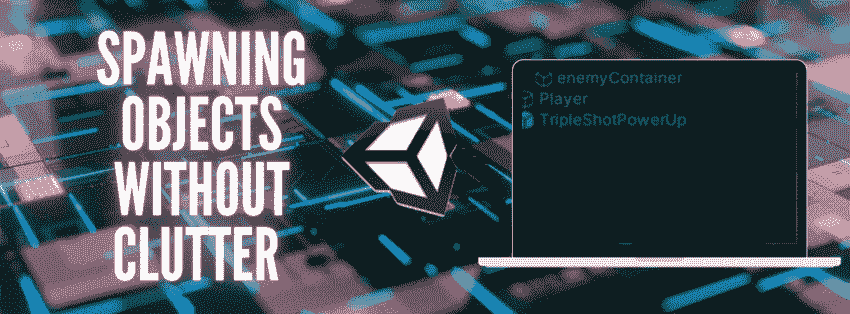
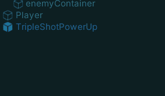

# 在 Unity 中生成没有混乱的对象

> 原文：<https://levelup.gitconnected.com/spawning-objects-without-clutter-in-unity-c23c2aa347ed>

对象的迭代生成可能是核心游戏循环的重要部分。然而，有时这种游戏对象的实例化超过了它们被消除的速度，最终将导致混乱的层次结构。

现在，想象你可以整齐地将实例化的对象存储在一个盒子里，所以…

我没有看到这个

**你会看到这个**

我们将通过**对象** **养育**来看看一种快速简单的方法来实现这一点。

# 什么是对象养育？

Unity 中的对象遵循层次结构。使用这个框架，游戏对象可以成为其他游戏对象的“父母”。当一个游戏对象有一个父对象时，**它所有变换变化都是在** **视角中对那个** **游戏对象**而不是游戏世界进行的。

创建游戏对象的父对象就像将它们拖放到想要的父对象上一样简单。在对象列表中,“子”对象由父对象旁边的小缩进和箭头标记。

然而，因为我们处理的是实例化的对象，所以父类将通过代码来完成。

# 如何为你的游戏对象创建容器

1.  创建一个空的游戏对象，并给它一个合适的名字。这将是我们实例化克隆的容器/父容器。

2.在脚本中创建对该对象的引用。您需要从处理实例化的脚本中访问游戏对象。

3.现在你有了一个对你的游戏对象的引用，你可以通过代码把它添加到你的实例化中。

您的实例化将被存储在一个 GameObject 变量中，这样就可以使用 [transform.parent](https://docs.unity3d.com/ScriptReference/Transform-parent.html) 通过代码来父化克隆容器。

在我的 Space Shooter 游戏的代码示例中，这种逻辑被用来避免产生的电子邮件带来的混乱。

在下一篇文章中，我将讨论我是如何在我的太空射击游戏中从原型变成艺术品的！