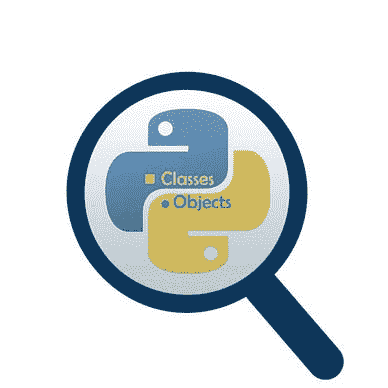

# Python OOP 中的特殊方法总结:Python OOP 完整教程—第 21 部分

> 原文：<https://levelup.gitconnected.com/special-methods-in-python-oop-conclusion-python-oop-complete-course-part-21-23eba4b18d3>

## Python OOP 中可用特殊方法的快速总结。

照片由 [Aaron Burden](https://unsplash.com/@aaronburden) 在 [Unspash](https://unsplash.com/s/photos/summary) 上拍摄

在我们开始之前，让我告诉你:

*   这篇文章是 Python 面向对象编程完整课程的一部分，你可以在这里找到它。

## 介绍

在本文中，将对您在特殊方法(Dunder 方法)一节中学到的内容进行快速概述。

**目录**

1.  [有哪些特殊方法？](#1a7c)
2.  [一些可用的特殊方法](#e380)

## 1.有哪些特殊方法？

它们是不应该由您直接调用的方法，但是调用是基于特定的动作在场景之外发生的。
例如，使用一个带有类对象的操作符。

照片由[托尔加·乌尔坎](https://unsplash.com/@tolga__?utm_source=medium&utm_medium=referral)在 [Unsplash](https://unsplash.com?utm_source=medium&utm_medium=referral) 上拍摄

## 2.一些可用的特殊方法

下面的列表总结了 Python OOP 中可用的特殊方法。

*   [**初始化和构造特殊方法**](https://medium.com/dev-genius/initialization-and-construction-special-methods-python-oop-complete-course-part-13-78b62305101?source=list-fce1159c0748--------13-------7b54126a7f4e---------------------) :当你实例化一个新对象或者从你的类中删除一个对象时，这些方法被调用。比如:`__init__() , __del__()`。
*   [**操作符特殊方法** :](https://medium.com/gitconnected/operators-special-methods-python-oop-complete-course-part-14-b5acd58f1fdf?source=list-fce1159c0748--------14-------7b54126a7f4e---------------------) 当你对你的类的对象使用操作符时，这些方法被调用。
    例如算术运算符(`+`、`—` 、`*`、`/`，或者比较运算符`(>`、`>=` 、`<`、`<=)`)。
*   [**类表示特殊方法** :](https://medium.com/mlearning-ai/class-representation-special-methods-python-oop-complete-course-part-15-2bdfed7f417?source=list-fce1159c0748--------15-------7b54126a7f4e---------------------) 这些方法用于为你的类对象生成一个代表值。该值可以是人类可读的，如`str()`函数的情况，也可以是机器可读的，如`repr()`函数的情况。
*   [**类型转换特殊方法** :](https://medium.com/gitconnected/how-to-make-your-class-objects-convertible-to-other-data-types-python-oop-complete-course-part-e0c71967c9ef?source=list-fce1159c0748--------16-------7b54126a7f4e---------------------) 当你想将一个对象数据类型从一种类型转换成另一种类型时，这些方法被调用。比如:`int()`，`float()`。
*   [**属性特殊方法** :](https://medium.com/gitconnected/what-happens-beyond-the-scene-when-you-get-set-or-delete-an-instance-attribute-d88be5610456?source=list-fce1159c0748--------17-------7b54126a7f4e---------------------) 当你想获取、设置或删除一个对象的属性值时，这些方法被调用。比如:`getattr()`，`setattr(), delattr()`。
*   [**Sequences 特殊方法** :](https://medium.com/dev-genius/how-to-create-a-customized-sequence-class-python-oop-complete-course-part-18-8c47ac58b814?source=list-fce1159c0748--------18-------7b54126a7f4e---------------------) 这些方法让你的 Python 类表现得像内置序列(`dict`、`tuple`、`list`、`str`等)..).比如:`contains()`，`getitem(), setitem()`。
*   [**上下文管理器的特殊方法** :](/how-to-create-a-custom-context-manager-in-python-oop-python-oop-complete-course-part-19-6f6647a97f5c) 这些方法用于在 Python OOP 中定义一个定制的上下文管理器。
*   [**可调用对象** :](/how-to-create-callable-objects-in-python-python-oop-complete-course-part-20-15fe46e3e2c3) 你只需通过覆盖方法`__call__()`就能使对象可调用。

普里西拉·杜·普里兹在 [Unsplash](https://unsplash.com?utm_source=medium&utm_medium=referral) 上的照片

***附言*** :万分感谢您花时间阅读我的故事。在你离开之前，让我快速地提两点:

*   首先，要直接在您的收件箱中获得我的帖子，请在此订阅*，您可以在此关注我**。***
*   ***其次，要想无限制地阅读媒体报道，现在就注册成为媒体会员，每月只需 5 美元。用这个链接 报名[***，可以直接支持我，不需要你额外付费。***](https://medium.com/@samersallam92/membership)***

**

萨梅尔·萨拉姆** 

## **Python 面向对象编程的完整教程**

**[View list](https://medium.com/@samersallam92/list/the-complete-course-in-objectoriented-programming-in-python-7b54126a7f4e?source=post_page-----23eba4b18d3--------------------------------)****24 stories**************

**要回到上一篇文章，您可以使用以下链接:**

**[第 20 部分:如何在 Python 中创建可调用对象](/how-to-create-callable-objects-in-python-python-oop-complete-course-part-20-15fe46e3e2c3)**

**要阅读下一篇文章，您可以使用以下链接:**

**[第 22 部分:Python 概述中的类关系](http://medium.com/gitconnected/classes-relationships-in-python-overview-python-oop-complete-course-part-22-8bbe18aca3c6)**