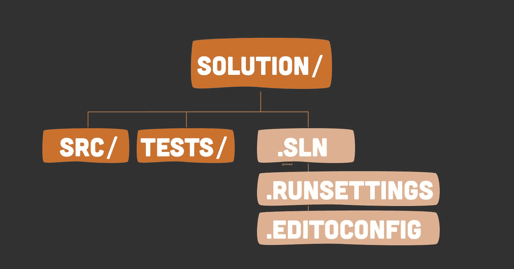
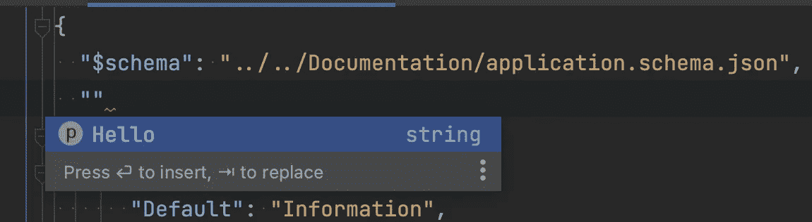

# 中提高协作可伸缩性的特定文件。网络解决方案

> 原文：<https://levelup.gitconnected.com/specific-files-that-increase-collaborative-scalability-in-net-solutions-7890212391ad>

## 实用编程建议

## 每个人都在谈论如何组织文件和文件夹，但文件本身又如何呢？让我们来看看有助于新开发人员入门的文件。



图片由[尼可拉斯·米勒德](https://medium.com/u/7c7a43b3d9de?source=post_page-----7890212391ad--------------------------------)提供

我意识到我们很少谈论有助于增加协作努力的非代码文件。

你是否考虑过高级人员如何通过简单地添加特定的文件来帮助增加新开发人员，尤其是初级人员入职的便利性？

**🔔** [成为中等会员](https://nmillard.medium.com/membership)或者把这样的文章[发到你的邮箱](https://nmillard.medium.com/subscribe)。

# 用 JSON 模式记录应用程序设置。

你有没有克隆过一个应用程序的源代码，然后对自己说“这个应用程序到底需要运行什么？”。

让每个人都容易，并包含一个 JSON 模式，它清楚地定义了每个必需的应用程序设置。像 JetBrains Rider 这样的 ide 甚至有很好的代码补全功能。



过程是这样的:

*   创建一个 JSON 文件，可以随意命名，但是要取一个合理的名字，比如“application.schema.json”。
*   在您的常规`appsettings.json`中，您在指向模式文件的根处包含了一个`$schema`。

从官方 aspnetcore [app 设置 schema 这里](https://json.schemastore.org/appsettings.json)获取灵感。

# readme.md 文件。

这可能是最重要的文件。

很少有开发人员熟悉 readme——或者至少是如何创建它们——这让我很困扰。每当你打开一个 GitHub 存储库或 Azure DevOps repo，你都会看到一个自述文件。

在公司软件开发项目中，您至少应该陈述以下内容:

*   该解决方案是关于什么的、它的特征以及它正在解决的问题。
*   如何设置解决方案在本地运行？这包括定义需要哪些应用程序设置以及如何找到它们。
*   如何执行常见的开发操作，比如创建新的数据库迁移、运行单元测试、收集代码覆盖报告、将测试报告上传到 SonarQube 等。
*   如何管理机密，例如使用. net 用户机密。
*   执行所有动作所需的 CLI 应用程序，如`dotnet-ef-core`、`dotnet-reportgenerator-globaltool`等。

🔔[想要更多这样的文章？在这里签名。](https://nmillard.medium.com/subscribe)

# 包括收集单元测试报告的. runsettings 文件。

你不需要一个. runsettings 文件，但是它会有所帮助，特别是当新开发人员不熟悉如何从单元测试中收集数据的时候。此外，该文件有时会被命名为类似于。coverage”或“CodeCoverage.runsettings”。

你可能不想在这里太疯狂，但是定义*放置**代码覆盖报告是一个好主意。*

```
*// .runsettings in root of solution
<?xml version="1.0" encoding="utf-8"?>
<RunSettings>
    <RunConfiguration>
        <ResultsDirectory>./TestResults</ResultsDirectory>
    </RunConfiguration>

    <DataCollectionRunSettings>
        <DataCollectors>
            <DataCollector friendlyName="XPlat Code Coverage">
                <Configuration>
                    <Format>opencover</Format>
                </Configuration>
            </DataCollector>
        </DataCollectors>
    </DataCollectionRunSettings>
</RunSettings>*
```

*运行`dotnet test --settings .runsettings`获取 runsettings 并将结果发布到。/TestResults "文件夹。这允许您通过运行`dotnet reportgenerator -reporttypes:Html -reports:path_to_testresults/guid/coveragefile -targetDir:Coverage`来创建格式良好的报告。*

*这需要你先安装`dotnet dotnet-reportgenerator-globaltool`。*

*点击阅读更多关于[运行设置的信息。](https://learn.microsoft.com/en-us/visualstudio/test/customizing-code-coverage-analysis?view=vs-2022)*

# *使用. editorconfig 统一样式。*

*时不时地，您会遇到令人讨厌的“我想用我的方式”类型的开发人员，他们很少考虑已建立的代码风格，因为“我更喜欢我的方式”，或者“不是我，是 IDE 的自动重新格式化造成的。”我也曾经是那样的人…*

*没有比在一个`.editorconfig`文件中记录一个明确的、权威的风格指南更好的方法让这样的人闭嘴了。甚至 IDE 也尊重它，并基于它执行自动格式化。你可以从我这里得到灵感[。](https://github.com/NMillard/SimpleWebApps/blob/master/other-projects/OrganizingCode/Enterprise/.editorconfig)*

# *用“忽略”文件忽略无关文件。*

*只有完全的初学者或不考虑他人的人才会丢弃“忽略”文件。所以，我估计这部分只针对那些 3 天以下开发者经验的人。*

*忽略文件，如著名的“gitignore“和”。“dockerignore”是由各自的应用程序找到的特殊文件。您通常希望忽略文件和文件夹，如`obj`、`bin`、`out`和用户设置文件。*

*忽略任何将在构建时自动生成的文件或文件夹，或者可以通过“npm install”等方式轻松创建的文件或文件夹，并且记住忽略任何包含机密的文件。*

# *让我们保持联系！*

*查看 [*YouTube 频道(@ Nicklas Millard)*](https://www.youtube.com/channel/UCaUy83EAkVdXsZjF3xGSvMw)*[*成为中等会员*](https://nmillard.medium.com/membership) *。*把这样的文章[*发到你的邮箱*](https://nmillard.medium.com/subscribe) *！***

**在 LinkedIn 上联系。**

# **好奇者的资源。**

*   **用微软的. runsettings 文件配置单元测试**
*   **[在 GitHub 上报告生成器](https://github.com/danielpalme/ReportGenerator)**
*   **[什么以及如何使用。编辑器配置](https://editorconfig.org/)**

# **分级编码**

**感谢您成为我们社区的一员！在你离开之前:**

*   **👏为故事鼓掌，跟着作者走👉**
*   **📰查看[升级编码出版物](https://levelup.gitconnected.com/?utm_source=pub&utm_medium=post)中的更多内容**
*   **🔔关注我们:[Twitter](https://twitter.com/gitconnected)|[LinkedIn](https://www.linkedin.com/company/gitconnected)|[时事通讯](https://newsletter.levelup.dev)**

**🚀👉 [**将像你这样的开发人员安置在顶级创业公司和科技公司**](https://jobs.levelup.dev/talent/welcome?referral=true)**