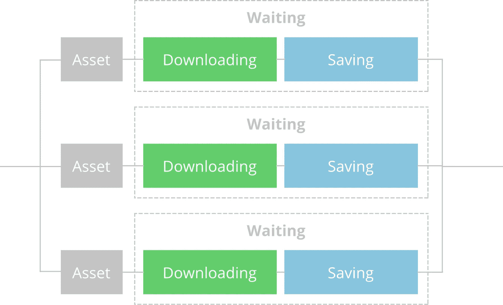

# 利用期货、流和流转换器加速飞镖/颤动

> 原文：<https://levelup.gitconnected.com/speed-up-dart-flutter-with-futures-streams-and-streamtransformers-77ff5a20daa3>


照片由 [Magnet.me](https://unsplash.com/@magnetme?utm_source=medium&utm_medium=referral) 在 [Unsplash](https://unsplash.com?utm_source=medium&utm_medium=referral) 上拍摄

这个世界上没有一个人喜欢等待。等待应用程序准备就绪是一种可怕的用户体验。不幸的是，当内容加载时间太长时，用户会毫不犹豫地留下一星评级。

我一直在做的一个项目需要从服务器上下载许多资源并保存在本地设备上。这意味着许多等待。尤其是对于需要一次下载所有这些资产的新用户。


时势

我们目前的系统运行良好，但我们可以做得更好。我们现在的主要瓶颈是我们最终要等待很长时间。首先，我们等待资产被下载。一旦它被下载，我们等待资产被保存。如果是一个资产，这可能没问题，但是对于许多资产，我们可能最终要等待几分钟。我们真正需要的是一个并行下载资产的系统。



提议的情况

# 期货

如果你使用 Dart/Flutter 有一段时间了，你应该已经熟悉了一个`Future`。对`Future`的一个非常基本的解释是在未来某个时候执行并返回响应的代码。我们不必等待回应，但我们可以在任何我们想要的时间等待回应。

这听起来像是完美的解决方案。我们将创建我们的`Future`来首先下载我们的文件，然后保存文件。对于此示例，我们将使用一个带有 DownloadAsset 对象的延迟未来来模拟此行为:

为了下载，我们将编写以下代码:

运行这段代码将产生以下结果(两次，因为只有一行代码):

```
Downloaded and saved Small Asset
Downloaded and saved Medium Asset
Downloaded and saved Big Asset
```

太好了，看起来有用。小型资产首先完成，中型资产其次，大型资产最后。就像我们在真实场景中预期的那样。这个解决方案只有一个问题:我们无法控制每个期货何时执行。例如，当我们没有互联网连接时，我们不想尝试下载资产。所以这个解决方案对我们的情况并不理想。

但是，我们可以做得更好。

# 流

现金流没有期货普遍，但它们同样有用。对于新接触流的人来说，它是一种处理从输入到输出的数据流的技术。它们与期货相似，都是异步的。这意味着我们不必在他们进行操作时等待他们。不同的是，一般情况下:流多次执行操作；期货执行一次操作。

流的一个优点是，即使有很多操作，我们也可以控制数据流。这对我们的用例非常有用。我们喜欢在没有互联网连接时暂停下载，当我们再次连接时继续下载。我们甚至可以一起停止下载，但我们不需要为我们的项目。还有其他优势，如内存管理，但我们不会深入讨论，因为它与我们的情况无关。

## 流控制器

可以用许多不同的方式创建流。对于我们的用例，我们将使用一个`[StreamController<T>](https://api.dart.dev/stable/2.10.4/dart-async/StreamController-class.html)`。`StreamController<T>`允许我们随时向流中添加新的项目。这样，我们可以将失败的下载添加回流中，以便再次尝试。

下面是对`StreamController<T>`的一个快速概述:

## 流操作

一旦我们创建了我们的`[Stream<T>](https://api.dart.dev/stable/2.10.4/dart-async/Stream-class.html)`，我们就可以操作和处理流经它的数据。

流有许多操作和处理数据的函数，例如:`map()`、`asyncMap()`、`skip()`、`skipWhile()`、`take()`、`takeWhile()`、`expand()`、`asyncExpand()`、`transform()`等等。我们将使用其中的几个，并简单解释一下。

`map()`功能可用于操作数据。输出将始终具有与输入相同的项数，但它们不必是相同的类型。以下是一些例子:

`asyncMap()`与地图功能几乎相同。唯一的区别是它将等待期货完成并返回一个`Stream<T>`而不是一个`Stream<Future<T>>`。

使用`skipWhile()`功能，我们可以对想要查看的数据进行限制，并减少数据流量。

## 流订阅

`StreamSubscription<T>`可以通过在任何流上调用`listen()`来创建。通常，一个流只能有一个订阅。但是有一个例外，那就是广播流。只有广播流可以有多个订阅。

在`listen`函数中，我们可以在流的末尾处理某些事件。在我们的流中，只有下载失败的资产会通过。我们希望将这些资产重新添加到流中，以尝试再次下载，如下所示:

现在假设我们的网络连接在下载过程中中断了。首先会发生的是我们的下载会开始失败。这不是问题，因为我们会把它们加回去。但是，在我们再次连接之前，继续尝试下载是没有用的。所以我们可以简单地暂停我们的流:

我们的流也可以停止流动，通过取消它。请记住，广播流在停止流动之前需要被所有订阅取消。

最后，我们还可以使用下面的代码行等待流完成:

同样，请记住，一旦完成向 StreamController 添加项目，就应该关闭它。如果你不关闭它，这个流将永远不会结束。

## 把所有东西放在一起

我们的代码变得有点复杂，但是如果你遵循了这一过程中的每一步，你应该能够理解一切。

运行此代码将导致以下结果:

```
Downloaded and saved Big Asset
Downloaded and saved Small Asset
Downloaded and saved Medium Asset
```

所以这显示了使用流的一个明显的缺点。流中的所有数据将被逐一处理。因此，我们再次等待我们更大的资产完成，然后再下载下一个。似乎我们又回到了起点。然而，我们已经为完美的解决方案奠定了基础。

因为，我们可以做得更好。

# 无序异步流/并行流

如果我告诉你我们可以同时拥有现金流和期货的好处。不幸的是，这不是 dart 的固有特性。我们需要用`[StreamTransformer<S,T>](https://api.dart.dev/stable/2.10.4/dart-async/StreamTransformer-class.html)`自己实现这个功能。

`StreamTransformer<S,T>`允许我们根据需要获取尽可能多的数据，并按照我们喜欢的方式进行转换。这意味着我们可以接收一个期货流，并以任意顺序返回结果。这正是我们所需要的。

## 步骤 1:绑定流

对于我们自己，`StreamTranformer<S,T>`我们将需要创建一个新的类来覆盖`BaseStreamTransformer<S,T>`。基类需要实现 bind 函数。bind 函数接收旧的输入流并返回新的输出流。

当一个流被绑定到我们的转换器时，需要做一些事情。我们需要为我们的旧流创建订阅，我们需要确保处理`cancel()`、`pause()`和`resume()`流控制，我们需要让我们的转换器知道我们的输入流何时不再有数据，我们还需要我们自己的内部`_streamController.`有了所有这些，我们的流转换器设置将如下所示:

`_onCancel()`函数从旧流中取消我们的订阅，并像这样设置我们的`_finalizing`标志:

## 步骤 2:创建我们的构造函数

我们希望我们的转换器调用一个函数，以便在数据进入时执行一个新的异步任务。如果能有一个允许我们决定同时运行多少个期货的功能，那就太好了。因此，本质上，我们希望我们的变压器被称为这样:

为了实现这一点，我们将把一个函数作为一个参数和一个可选参数，称为 parallel。该函数可以返回一个`Future`或者只是值。Dart 有一个`FutureOr<T>`类型支持这两种情况。我们还需要初始化我们的`_finalizing`、`_futureCount`和`_streamController`字段。考虑到这一点，我们的构造函数如下所示:

## 步骤 3:处理传入数据

我们的监听器回调`_onData`将处理我们所有的输入数据。我们将调用我们的`_asyncCB()`函数。如果函数立即返回值，我们将把它添加到`_streamController`。当`_asyncCB()`返回一个 future 时，我们将增加我们的`_futureCount`并提供一个对所述 future 的回调。我们将在下一步中详细讨论这个回调。

一旦`_futureCount`达到平行期货的最大数量，我们需要暂停我们的流入。为了暂停输入流，我们将首先创建一个[完成符](https://api.dart.dev/stable/2.10.4/dart-async/Completer-class.html)。完成者允许我们创造未来，并在以后完成它们。然后，我们将`_resumeCallback`设置为完成者`complete()`函数，并使用完成者的未来从我们的订阅中调用`pause()`函数。

## 步骤 4:处理未来完成

当一个未来完成时，我们想做一些事情。首先，我们希望减少我们的`_futureCount`并将值添加到`_streamController`。当我们的`_futureCount`低于最大值时，如果我们的流暂停了，我们也想再次恢复它。最后，一旦最后的未来完成，我们想要关闭流。

## 我们的最终解决方案

现在我们已经创建了 StreamTransformer 类，我们只需更改下面的代码行

到…里面

我们所有的代码都可以在[这个 GitHub gist](https://gist.github.com/mmdk95/725a13db8f93934984e8b0e47caa6243) 中找到。运行该代码将导致以下结果:

```
Downloaded and saved Small Asset
Downloaded and saved Medium Asset
Downloaded and saved Big Asset
```

太好了！它以我们希望的方式工作。就像期货一样，小资产先完成，中等资产其次，大资产最后。然而，现在我们有了更多的控制权，可以随时暂停我们的操作。

希望这个挑战让你更加熟悉 [Dart:async 库](https://api.dart.dev/stable/2.10.4/dart-async/dart-async-library.html)。具体来说:未来，流，流变压器，和完成者。这里演示的技术可以应用于许多不同的情况，应该有助于加快您的 dart 代码。

编码快乐！