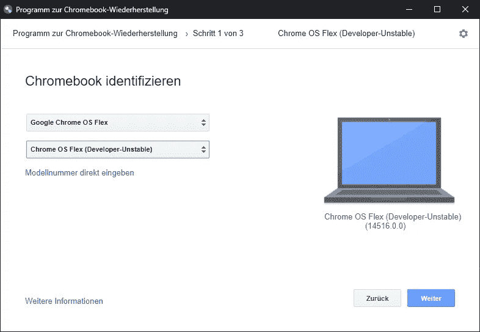
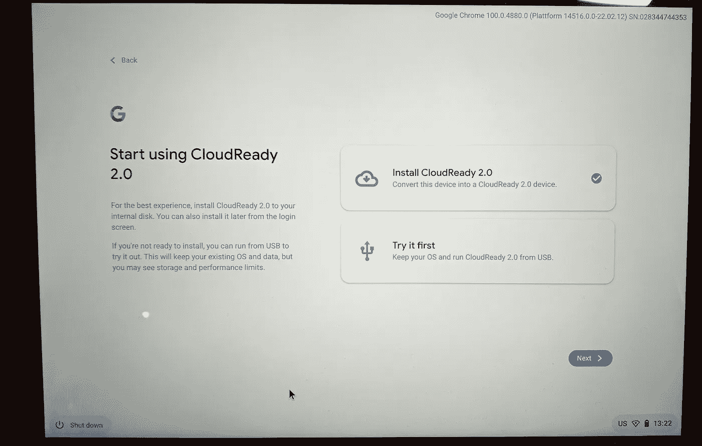
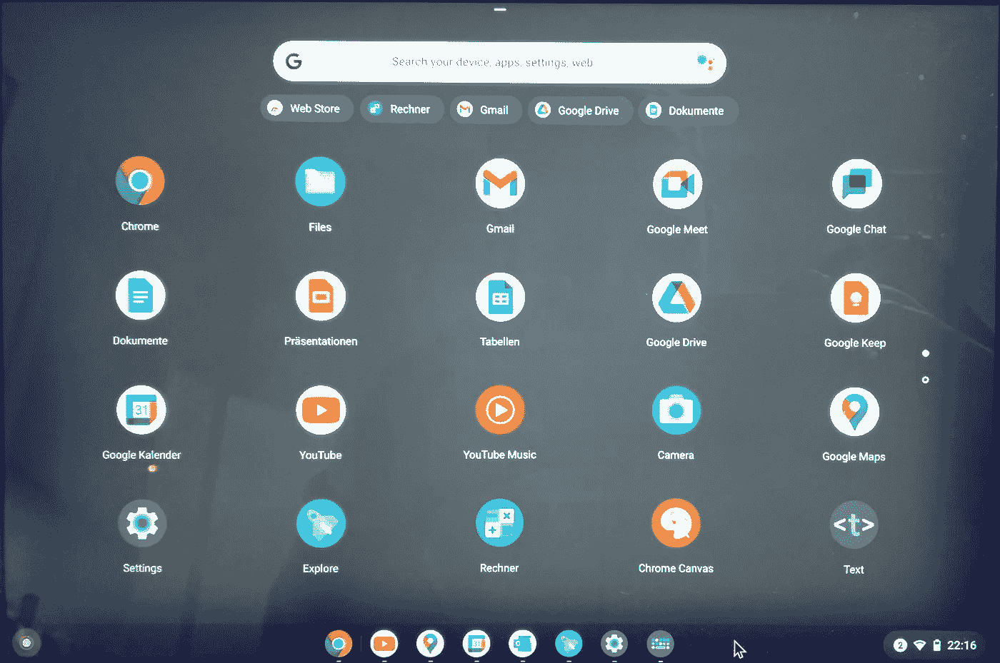
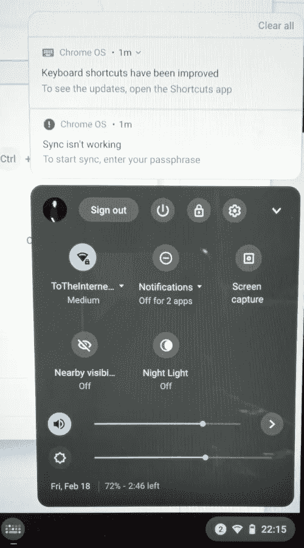

# 如何用新的谷歌 ChromeOS Flex 加速旧笔记本

> 原文：<https://levelup.gitconnected.com/speed-up-old-notebooks-with-google-chromeos-flex-3db16509b013>

## 让旧设备再次发挥作用！

## 我将向你展示如何在旧的 Windows 笔记本上安装谷歌 ChromeOS Flex，解释其优点和缺点，并为你提供日常使用技巧。

劳拉·乔伊特在 [Unsplash](https://unsplash.com?utm_source=medium&utm_medium=referral) 上拍摄的照片

如果你家里有一台旧的 Windows 笔记本电脑，它已经过时而且速度很慢，你可以用谷歌 ChromeOS Flex 赋予它第二次生命。这是一个类似于谷歌 ChromeOS 的免费操作系统，比当前版本的微软 Windows 需要更少的资源。你的设备可能会再次变得快速和有用。您可以在不对当前系统进行任何更改的情况下测试它，并自己做出决定。

❗ ChromeOS Flex 目前只是一个**开发者预览版**，没有稳定版本。它可能会比最终版本**不稳定**或**慢**，功能可能会被更改、添加或删除。**不要用在重要设备上**！

## 与 ChromeOS 的区别

ChromeOS Flex 和 ChromeOS 之间所有差异的完整列表可以在[这里](https://support.google.com/chromeosflex/answer/11542901)找到。对于私人用户来说，最重要的细节是:

❌没有 Google Play 商店，没有 Android 应用程序支持
❌制造商提供的固件更新，没有谷歌
❌有限公司支持的[设备列表](https://support.google.com/chromeosflex/answer/11513094)
❌并非所有设备功能都可用(端口、驱动器、蓝牙、生物识别等)。)

## 我能用它吗？

嗯，看情况。如果你想将你的设备主要用于网上冲浪、社交网络和视频，它将完美地工作。如果你依赖于 Chrome 网络商店或浏览器中没有的应用程序，那么 ChromeOS Flex 可能还不是正确的选择。
遗憾的是，目前无法安装或下载安卓应用。也许这将在未来的版本中改变。

## 创建安装程序

要创建安装程序，你需要遵循[官方指南](https://support.google.com/chromeosflex/answer/11552529?hl=en&ref_topic=11551271)。我在这里给你一个快速的总结:

1.  安装一个[谷歌 Chrome 扩展](https://chrome.google.com/webstore/detail/chromebook-recovery-utili/pocpnlppkickgojjlmhdmidojbmbodfm/related)来创建安装程序(你需要 [Chrome 浏览器](https://www.google.com/chrome/)
2.  插入至少有 8GB 存储空间的 USB 设备
3.  启动扩展并按照说明进行操作
4.  在步骤 1 中，选择谷歌 Chrome OS Flex 作为制造商，Chrome OS Flex(不稳定的开发者)作为产品(见下图)。

在安装过程中选择制造商和产品

5.在步骤 2 中，选择您的 USB 设备。

6.等待安装完成。

该设备现已准备就绪，可用于在支持的设备上安装或试用 ChromeOS Flex。

## 在目标设备上安装

您的设备必须配置为从 USB 设备启动。这通常在 BIOS 或 UEFI 中完成，或者通过按设备上的按钮组合来完成。将 USB 设备插入您的笔记本电脑并启动。安装过程应该在几秒钟内开始。按照向导设置操作系统。如果您将设备与您的 Google 帐户连接，将会安装您现有的应用程序(如果可用)并同步您的数据。
用户可以选择不安装 ChromeOS Flex 进行试用。因此，如果您不确定，您可以在不改变当前设备的情况下进行检查。

无需完全安装即可试用 ChromeOS Flex

## 怎么样？

我有一台旧的 Surface Pro 3 设备，我正在其上使用 ChromeOS Flex。启动时间更快了，我有了更多可用的存储空间，一切都感觉更快了。这是一种非常令人耳目一新的感觉，如果你有支持的设备，我只能建议你自己尝试一下。👍

该操作系统预装了许多谷歌应用程序。有些看起来像是集成良好的真实应用程序(YouTube、地图、邮件)，有些只是在浏览器中打开一个网页(Docs)。👍

ChromeOS Flex 的应用抽屉

对我来说不好的是，我不是谷歌 Chrome 的用户，所以我的书签和其他东西在这款设备上无法使用。你越是谷歌人，你的设备就越能为你做好准备。遗憾的是，你无法安装替代浏览器，你只能使用谷歌 Chrome 及其网络商店。👍/👎

一个很好的特性是支持[渐进式网络应用](https://docs.microsoft.com/en-us/microsoft-edge/progressive-web-apps-chromium/) ( **PWA** )。一些网站会提供这种 PWA 的安装，例如 outlook.com。它将出现在你的应用抽屉中，隐藏典型的浏览器元素，看起来更自然。有些甚至有离线存储功能，所以你不需要一直在线才能使用它们。👍

要提的一个小问题是，**蓝牙**在我的设备上无法工作。有一个选项，但我不能激活它，因为按钮被禁用。因此，目前没有蓝牙键盘或耳机可用。我希望在未来的版本中会有所改变。指纹识别器可能也是如此，所以也要做好准备。👎

ChromeOS Flex 中的快速设置菜单

## 结论

嗯，我喜欢。它很快，看起来很好，并且允许我使用我需要的任何东西。我使用这款设备的主要情况是在 YouTube、网飞和 Twitch 上观看视频，以及在社交媒体页面上浏览网页。这在浏览器中运行良好，你不一定需要 Play Store 中的应用程序。我对目前的开发进度很满意，但当他们最终加入谷歌 Play 商店(并修复蓝牙)时，它可能会成为目前运行 Windows 的中低价平板电脑/笔记本电脑的替代品。

如果你喜欢这篇文章，我会很高兴得到掌声👏(你知道可以拍几次吗？😎)另外，如果你还没有跟上我，我也很感激。

🌲 [linktr.ee](https://linktr.ee/xeladu) |☕ [咖啡](https://www.buymeacoffee.com/xeladu)🎁[捐赠](https://www.paypal.com/donate/?hosted_button_id=JPWK39GGPAAFQ) |💻GitHub |🔔[订阅](https://xeladu.medium.com/subscribe)

顺便说一句:如果你还没有 Medium 会员，我推荐你使用[│我的推荐链接◀](https://medium.com/@xeladu/membership) ，因为它会让你访问 Medium 上的所有内容，并以一小部分费用支持我，而不会为你带来任何额外费用。谢谢大家！✨

## 相关故事

这里有一些相关的文章，你可能会感兴趣。

 [## 使用 winget 在 Windows 上管理应用程序

### 如何用 Windows 包管理器(winget)安装应用程序，如何保持应用程序更新，以及如何使用…

xeladu.medium.com](https://xeladu.medium.com/app-management-with-winget-on-windows-e668086a03f7)  [## 作为软件开发人员，我在最初几年学到了一些重要的东西

### 以下是我作为软件开发人员最初几年学到的一些东西。这是关于文档，写作…

xeladu.medium.com](https://xeladu.medium.com/some-important-things-i-learnt-in-my-first-years-as-a-software-developer-638918f60b2c)  [## 中 SpecFlow 和行为驱动开发的高级技巧。网

### 我们将查看场景上下文、安装和拆卸、ide 中的导航，以及在步骤中使用参数…

levelup.gitconnected.com](/advanced-tips-for-specflow-and-behavior-driven-development-in-net-3dcf93dc2655)