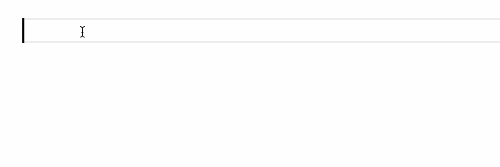
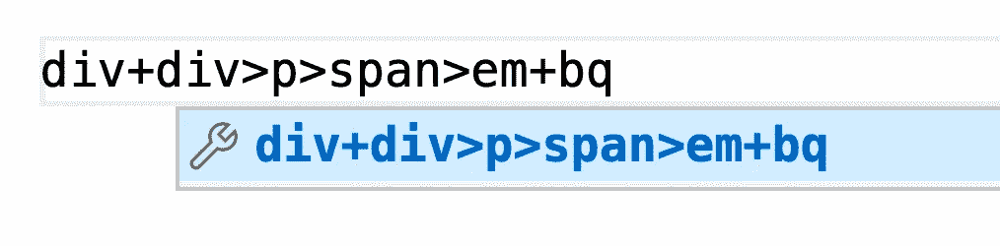

# 使用 VSCode 中的 Emmet 加快编码速度

> 原文：<https://levelup.gitconnected.com/speed-up-your-coding-with-emmet-in-vscode-433162d95880>

## 用 20 张 gif 解释。


如果您要在编辑器中键入以下代码，您需要键入多长时间？

```
<!DOCTYPE html>
<html lang="en">
<head>
    <meta charset="UTF-8">
    <meta name="viewport" content="width=device-width, initial-scale=1.0">
    <title>Document</title>
</head>
<body>
    <div class="container">
        Lorem ipsum, dolor sit amet consectetur adipisicing elit. Harum mollitia illo deserunt possimus dicta, quod aliquam, fugiat eligendi debitis sed magni, perferendis recusandae tenetur officia ipsa ipsam tempore fugit error!
    </div>
    <ul>
        <li>list 1</li>
        <li>list 2</li>
        <li>list 3</li>
        <li>list 4</li>
        <li>list 5</li>
        <li>list 6</li>
        <li>list 7</li>
        <li>list 8</li>
    </ul>
</body>
</html>
```

如果用传统的逐行输入的方法，即使有编辑器的智能补全，还是会很慢。

如果我们使用 Emmet，我们可以很快完成打字:


如上面的 GIF 所示，Emmet 是一个编辑器插件，为智能代码完成提供语法规则。它允许我们快速编写 HTML 和 CSS 代码。

我们知道 HTML 有很多刻板的、重复的字符，Emmet 的存在就是为了帮助我们去掉那些多余的代码。

# 装置

目前，VSCode、WebStorm 等流行的代码编辑器已经预装了 Emmet 插件。不需要下载 Emmet 插件，可以直接使用。

下面的 gif 都是在 VSCode 中记录的，但是规则是通用的，你可以在其他编辑器中使用类似的技巧。

# 生成 HTML 模板

我们知道每个 HTML5 文件都应该有一个固定的框架，大概是这样的:

```
<!DOCTYPE html>
<html lang="en">
<head>
  <meta charset="UTF-8">
  <meta name="viewport" content="width=device-width, initial-scale=1.0">
  <title>Document</title>
</head>
<body>

</body>
</html>
```

使用 Emmet 后，不需要手动输入这些字符，只需要在一个 HTML 文件中输入一个`!`，VSCode 会提醒你是否使用 Emmet 规则进行自动补全。

规则:


GIF:


# 键入标签

在 HTML 中，标签看起来像这样:

```
<div></div><span></span>
```

在这类标签中，除了`div`、`span`是核心内容，其他符号(如`<`、`>`)都是刻板印象的补充人物。

有了 Emmet，我们不需要键入这些多余的字符:


此外，您可以使用缩写来表示较长的标签，如 header 或 blockquote:


```
hdr ==> header
bq  ==> blockquote
```

# 键入带有类的标记

我们知道 HTML 标签通常有 CSS 样式。使用 Emmet 时，我们只需要在标签名后面加上类名就可以自动添加了:

规则:

```
div.container  ==> <div class="container"></div>span.red  ==> <span class="red"></span>div.row.blue ==> <div class="row blue"></div>
```

GIF:


# 键入 ID 为的标记

规则:

```
div#id1 ==> <div id="id1"></div>span#bytefish.blue ==> <span id="bytefish" class="blue"></span>
```

GIF:


# 键入带有内容的标签

如果我们想给标签添加一些内容，我们可以使用`{}`语法。

规则:


GIF:



# 键入多个标签

Emmet 支持附加操作。如果使用`+`，可以同时输入多个标签。

规则:


GIF:


# 类型嵌套标签

在 CSS 中，子组合符的符号是`>`，你也可以在 Emmet 中使用这个符号来输入嵌套标签。

规则:

`nav>ul>li` = >

```
<nav>
  <ul>
    <li></li>
  </ul>
</nav>
```

GIF:


在输入嵌套标签时，我们也可以和类、内容一起输入。

规则:


结果:


GIF:


# 爬上

假设我们想用 Emmet 一次性输入这样的文字，那么应该怎么做呢？

```
<div></div>
<div>
  <p><span><em></em></span></p>
  <blockquote></blockquote>
</div>
```

以上文字最大的痛点是 p 标签既有子标签又有并列标签。仅使用我们之前提到的`>`和`+`无法一次输入所有文本。

**错误方式:**



上面写的问题是，当我们输入`+bq`时，它实际上创建了一个与`em`同级的标签。如果我们想在与`span`相同的层次上创建一个标签，我们可以使用`^`符号。这个符号是为了让标签爬上一个更高的层次。

规则:


结果:


GIF:


如果我们希望`blockquote`和`p`平行，那么我们只需要使用`^`两次，这意味着要爬上标签两级。

规则:


GIF:


# 增加

很多标签需要多次重复，比如`li`。为了方便批量输入这些标签，Emmet 允许我们使用乘法。

规则:


`*`表示乘法，`*3`表示前一个标签出现了三次。

结果:


GIF:


GIF2:


# 编号为美元

在使用乘法批量生成标签时，我们可能需要使用数字。例如:

```
<ul>
  <li>item 1</li>
  <li>item 2</li>
  <li>item 3</li>
  <li>item 4</li>
  <li>item 5</li>
  <li>item 6</li>
</ul>
```

那么我们怎么输入上面的呢？

Emmet 中提供了一个特殊符号:$。这个符号代表一个特殊的变量，它的缺省初始值是 1，并且在每次出现后自动递增。

规则:


结果:


GIF:


GIF2:


## 数字

如果要用三位数，只需要用$符号三次。

规则:


结果:


GIF:


## 基础资料

如果想把`$`的初始值设置成别的，可以用`@`符号。

规则:


结果:


GIF:


# 洛雷姆

当我们编码时，我们经常需要填写一些无意义的字符串来测试我们的 HTML 页面的显示效果。以前用键盘随机输入字符吗？

Emmet 为我们提供了一个特殊的命令，可以快速生成一堆无意义的字符串。

规则:


结果:


GIF:


GIF2:


这是 Emmet 的基本用法，希望对你有帮助。如果你认为这些 gif 对你有帮助，请告诉我，我会继续创作同类型的文章。

最后:现在你能快速输入本文开头的 HTML 文本吗？