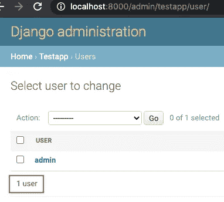
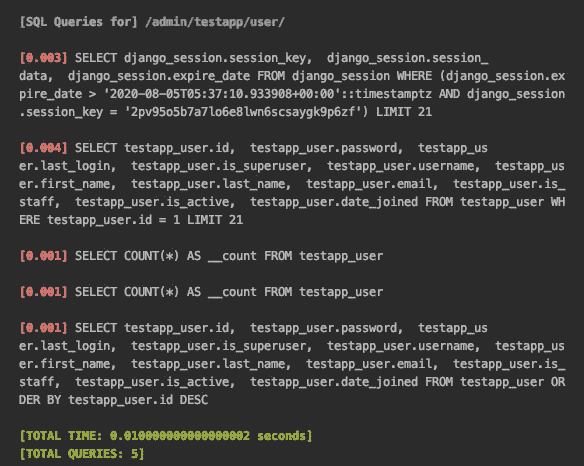
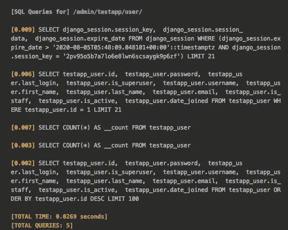
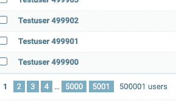
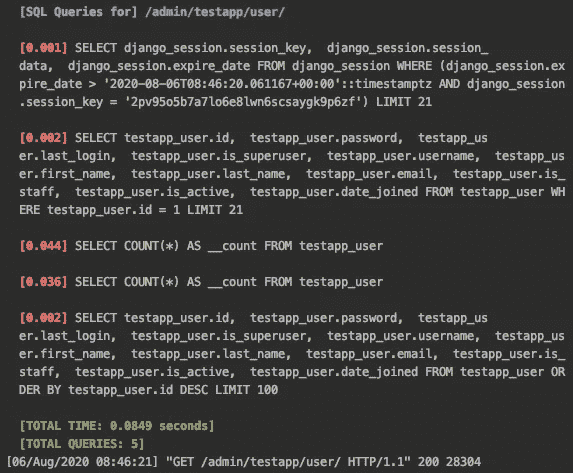
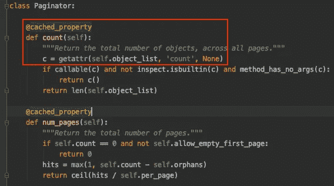
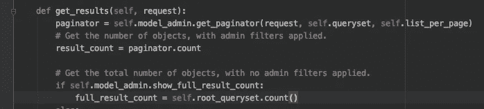
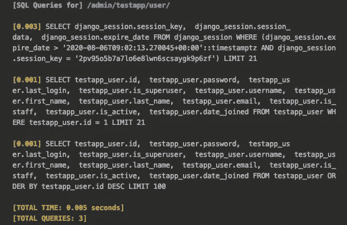

# 使用 NoCountPaginator 加速 Django 管理——优化 Django:第 2 部分

> 原文：<https://levelup.gitconnected.com/speed-up-your-django-admin-by-removing-sql-counts-optimizing-django-part-2-f5e09da667c>


Django 管理门户在某些地方可能又笨又慢，但是在这篇短文中，我将试着帮助您以较小的代价使它更有效。

## 那么，它有什么问题呢？

好吧，Django admin 是一个很好的工具，只需很少的额外开发工作就可以得到一个可靠的 Django 后台用户界面。为 Django 模型添加一个管理界面实际上只需要几行代码，对于试图平衡使特性工作与使非技术人员(比如他们的客户)可以访问特性的开发人员来说，这是一个很大的帮助。

然而，让 Django admin 易于访问需要付出一些代价，其中之一就是速度。拿页面计数器来说。



数据库中的 1 个用户(红框)

只有一个用户时，SQL 查询如下所示:



实际上，很好。

请注意请求中的选择计数值。对于 1 个用户来说，这不成问题。事实上，即使是 10k 用户也没问题:



然而，对 50 万用户进行同样的尝试会导致 SQL 时间开始增加。



我想与更多的用户进行演示，但我不想为了截图而破坏我的本地数据库

任何与 Django 进行小规模以外的交易的人可能都熟悉这个问题，尤其是在通过模型进行交易时。例如，社交媒体后端可能使用直通表来记录订阅或评论(大公司倾向于使用 Redis 或其他一些缓存实现来更快地提供这些服务，但对于更永久的记录，像 Postgresql 这样的数据库是黄金标准)。你可以想象这些表爆炸的速度有多快，会让它们的管理员无法使用。

你也可以选择不使用 admin，但这将是一种浪费。因此，让我们看看是否可以通过删除计数查询来修复它。

## 那么是什么导致了计数查询呢？

一句话:SQL count 查询用于提供您在 admin 中看到的对象计数。是的，就是页面选择 UI 元素旁边的那个数字。Django ModelAdmin 使用一个 Paginator 类来管理页面选择 UI 和对象计数，并至少调用一次 SQL:



我们的罪犯在这里。

最重要的是，当管理员收集信息来呈现屏幕时，它会执行另一个 queryset 计数。



请注意 self.root_queryset.count()。

我认为可以肯定地说，当你加载你的管理时，如果你有这么多的条目，你可能会使用某种过滤器或搜索栏来找到你想要的条目。您可能并不关心这个表中到底有多少条目，也不打算使用 page tab 来处理前几页之外的内容。

**幸运的是，有一种简单的方法可以摆脱 SQL 查询，节省宝贵的查询时间。**

# 你只需要更新两个地方。

就像这样简单:

```
from django.core.paginator import Paginator
class NoCountPaginator(Paginator):
    @property
    def count(self):
        return 999999999 # Some arbitrarily large number,
                         # so we can still get our page tab.
```

像这样设置您的管理员:

```
from django.contrib import admin
from . import modelsclass UserAdmin(admin.ModelAdmin):
    model = models.User
    paginator = NoCountPaginator
    show_full_result_count = Falseadmin.site.register(models.User, UserAdmin)
```

现在有 50 万用户，相同的页面负载如下所示:



这还差不多！

# 结论

Django 管理员因效率低下而受到指责，原因有几个。然而，Django Admin 作为一个开箱即用的解决方案很好地服务于它的目的，并且可以被扩展来关闭你不需要的东西。在本指南中，我们演示了如何阻止 Django admin 调用 SQL count 查询，代价是呈现正确的对象计数。

当然，您可以做更多的事情来改进 Django 管理。在本系列的下一篇指南中，我将向您展示一个场景，其中 Django admin 变得非常慢，甚至在对象数低于 500k 的情况下，以及您如何处理它。