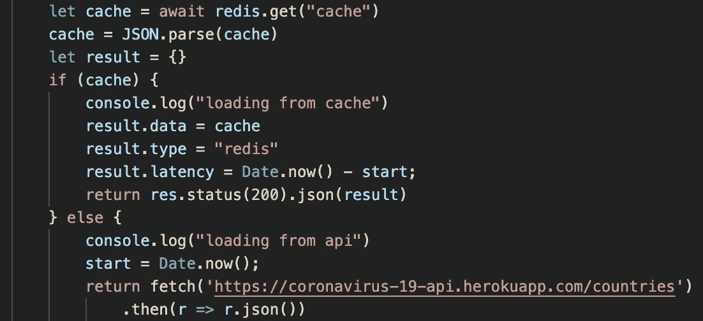

# 使用 Redis 加速 Next.js 应用程序

> 原文：<https://levelup.gitconnected.com/speed-up-your-next-js-application-with-redis-2907b86a4610>



Next.js 是一个非常成功的 web 框架，它将服务器端呈现和静态站点生成结合在一起。感谢 CDN 缓存，SSG 加速了你的网站，同时 SSR 帮助你搜索引擎优化和动态数据。

服务器端渲染是一个很棒的特性，可以帮助你编写全栈应用。但是如果你不小心，你的 Next.js 网站的性能很容易受到影响。在这篇博文中，我将解释如何利用 Redis 来加速 Next.js API 调用。在此之前，我将简要地提到一个更简单的方法来提高您的性能。

# 在 API 调用中使用 SWR

SWR 是一个非常智能的数据读取库。它使用由 [HTTP RFC 5861](https://datatracker.ietf.org/doc/html/rfc5861) 描述的 HTTP 缓存失效策略(stale-while-revidate)。当您使用 SWR 调用 API 时，它会立即返回缓存的数据，但会异步获取当前数据并更新您的 UI。您还可以根据对陈旧性的容忍度来设置 refreshInterval。

```
{ data: user } = useSWR(‘/api/user’, { refreshInterval: 2000 })
```

在上面的代码中，用户 API 将每 2 秒刷新一次。

# Redis 缓存

SWR 非常简单有效。但是有些情况下，您需要服务器端缓存:

*   客户端缓存提高了客户端的性能。但是如果客户端的数量很大，您可能会经历服务器端资源的高负载，这最终也会影响客户端的性能。
*   如果您正在使用一个带有配额的外部 API，那么您将希望在服务器端控制 API 的使用。否则，太多的客户端会很快消耗 API。
*   如果您使用动态输入在服务器端计算、获取或处理资源，客户端缓存将不会非常有用。

# 示例项目:Covid 跟踪器

在这个项目中，我们将使用[贾维尔·阿比莱斯的 Covid API](https://github.com/javieraviles/covidAPI) ，找出案例数量最多的前 10 个国家。查看[网站](https://next-caching-with-redis.vercel.app/)和[源代码](https://github.com/upstash/examples/tree/master/next-caching-with-redis)。

我们将使用[upshosh Redis](https://upstash.com)——这是一个无服务器 Redis 服务——来缓存来自 Covid API 的响应，因此:

*   反应会快很多。如果您查看[网站](https://next-caching-with-redis.vercel.app/)，您会发现调用 Covid API 需要数百毫秒，而从 Redis 获取数据需要 1-2 毫秒。
*   我们不会用太多的请求淹没 Covid API。

# API 代码

代码首先检查我们是否在 Redis 中缓存了 API 结果。如果没有，我们将从 Covid API 获取所有国家的列表，并按照当天的案例数对它们进行排序，并将前 10 个案例保存到 Redis。在保存到 Redis 时，我们设置了“EX”60 参数，这意味着 Redis 将在 60 秒内清除条目。

# UI 代码

UI 是一个简单的 React 代码。我们使用 SWR 从 API 获取数据。

# 外部链接

[https://docs.upstash.com/](https://docs.upstash.com/)

[](https://swr.vercel.app/docs/with-nextjs) [## SWR: React 钩子获取数据

### 如果你的页面包含频繁更新的数据，并且你不需要预先渲染数据，SWR 是一个完美的选择

应用程序](https://swr.vercel.app/docs/with-nextjs) [](https://brianlovin.com/writing/caching-api-routes-with-next-js) [## 现在用 Next.js +缓存 API 路由

### 我一直在使用 Next.js 的 API 路由特性来实现一个瘦包装器…

brianlovin.com](https://brianlovin.com/writing/caching-api-routes-with-next-js) 

【https://coronavirus-19-api.herokuapp.com/countries 号

[](https://github.com/javieraviles/covidAPI) [## javieraviles/covidAPI

### 获取 https://coronavirus-19-api.herokuapp.com/all 新冠肺炎实时信息的 API>获取全球信息…

github.com](https://github.com/javieraviles/covidAPI)