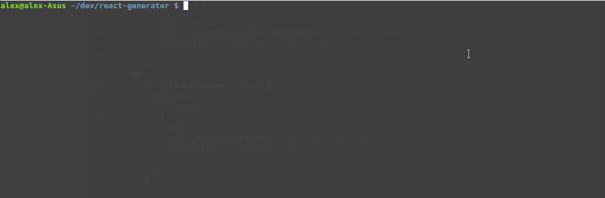

# 使用代码生成器加快 React 开发人员的工作流程

> 原文：<https://levelup.gitconnected.com/speed-up-your-react-developer-workflow-with-code-generators-f8181eced241>


作为 React 开发人员，我们经常需要设置新的组件，将它们与现有的基础设施连接起来，或者搭建应用程序。这需要大量重复的手动工作，尽管不经常发生，但可能会非常乏味，坦率地说，非常无聊。好消息是它可以很容易地用代码生成器自动化。这些生成器也可以与其他开发人员共享，增加团队内部的代码一致性。

在这篇文章中，我们将使用 [plop](https://github.com/amwmedia/plop) 包来设置生成器，这些生成器将从头开始创建 React 组件文件夹，或者向已经存在的文件夹添加一个新组件。最终代码可在 [Github](https://github.com/Clarity-89/react-generator/tree/react-generator) 上获得。

假设你已经有了一个 React app 设置(我个人更喜欢 [create-react-app](https://github.com/facebook/create-react-app) 来加速这个过程)，我们就从安装扑通开始。

```
npm i -D plop
```

`-D`这里是`--save-dev`的快捷方式。同时，让我们将`generate`脚本添加到我们的 package.json 中

如果全局安装 plop(带— `g`前缀)，可以用`plop`命令代替`./node_modules/.bin/plop`。

基础结构是用 create-react-app 制作的应用程序的典型结构。此外，每个组件都有一个包含组件文件和`index.js`的文件夹，所有组件都从这里导出。

```
mysite/
    src/
        components/
            Component1/
                Component1.js
                index.js
        App.js
        App.css
        index.js
        index.css
```

现在我们将在`src`目录下创建`scripts`文件夹，在其中我们将添加`generator`文件夹。在生成器内部，让我们添加`index.js`，在这里我们设置生成器本身，命名为“组件”。

我们仍然需要添加生成器的配置，这是我们设置的主要部分。为此，让我们创建`config.js`并开始充实它。

如果我们查看扑通[文档](https://github.com/amwmedia/plop#setgenerator)，发电机配置对象有 3 个属性:

*   `description` -该生成器功能的简短描述
*   `prompt` -收集用户意见的问题
*   `action` -根据输入执行的动作

让我们从添加描述开始。

嗯，那很简单。现在让我们来定义提示，它基本上是从用户那里获得输入的方法。

`prompts`数组中每个对象的主要属性是`type`、`name`和`message`。如果提示的类型是`list`，我们需要为它提供一个选择列表。Plop 使用 [inquirer.js](https://github.com/SBoudrias/Inquirer.js#examples) 进行提示，因此如果您想更深入地了解可用的提示类型，请查看它们的存储库。

提示的工作方式是在收集了用户的输入后，作为提示方法的参数的一个属性。例如，在上面的第一个提示中，我们提供了一组选项供选择。用户选择一个选项后，它的`value`将在数据对象的`action`属性上可用，因为我们将提示的`name`指定为`action`。然后在下一个提示对象中，我们可以在`when`方法中访问这个值:`when: answer => answer.action === "add"`。`when`属性主要检查当前提示是否应该显示给用户。所以在这种情况下，如果用户选择了`add`动作，下一个提示将要求指定一个应该添加组件的目录。

您会注意到这里使用了`listComponents`实用函数来获取`components`目录中的组件名数组。

此外，我们使用`validate`来确保用户确实指定了组件的名称。在最后一个提示中，我们要求选择要创建的组件的类型，默认提供 functional component 选项，因为它可能是最常用的。

现在是发电机最有趣的部分——它的动作。动作可以是要执行的命令列表，也可以是返回该列表的函数。在这个例子中，我们将使用函数形式，因为我们需要做相当多的检查和条件返回。

但是在此之前，让我们在文件的顶部添加一个常量，`componentsPath`，这将省去我们在多个地方更新路径字符串的麻烦，以防我们决定将配置移动到其他地方。

`actions`方法以一个数据对象作为参数，该数据对象包含提示收集的所有数据。该方法需要返回操作对象的数组。最重要的属性是:

*   `type` -该动作将执行何种操作。这里我们有一些动作，将创建一个名为`add,`的新文件，或者通过`append`修改现有文件。
*   `path` -创建或修改组件的位置。
*   `templateFile` -一个用于创建或修改文件的车把路径模板。或者，可以使用一个`template`属性，这对于需要放在单独文件中的短把手模板来说很方便。

首先，我们用默认操作填充数组，这将在从下拉列表中选择的目录中创建一个新的组件，或者如果是一个新的组件文件夹，则在具有该名称的文件夹中创建一个新的组件。接下来有两个路径——当创建新的组件文件夹时，我们向文件夹添加一个`index.js`文件；如果它是一个新的组件文件，我们将用新的导出修改`index.js`。扑通有几个方便的内置文本转换器，我们在这里使用，即`properCase`，这将改变文本到这一点。我们也可以使用 handlebars 语法来定义文件的路径。这些字符串可以访问来自 prompt 的数据，例如通过执行`{{properCase name}}`我们可以访问用户在 prompt 中输入的组件名称。结合这一点与 ES6 字符串插值提供了一个强大的方式来配置我们的路径。

现在让我们看看用来生成和修改文件的模板。

我们使用格式`filename.js.hbs`来显示目标的文件类型。模板非常简单，它们基本上是缺少组件名称的各个文件的存根。值得注意的是，模板中还提供了 plop 的 helper 方法，这对于定制输出非常方便。

现在让我们试着运行我们的发电机，以验证它是否真的工作。



厉害！生成新组件现在只需一个命令。这是一个非常简单的例子，但是它很好地展示了代码生成器的强大功能。它可以很容易地扩展，对于有很多样板文件的组件来说甚至更有用。例如，如果每个组件都有一些翻译设置或大量导入列表。

对这篇文章有任何问题/评论或其他类型的反馈吗？请在评论中或在 [Twitter](https://mobile.twitter.com/Clarity_89) 上告诉我。

*原载于*[*https://claritydev.net*](https://claritydev.net/blog/speed-up-your-react-developer-workflow-with-code-g/)*。*