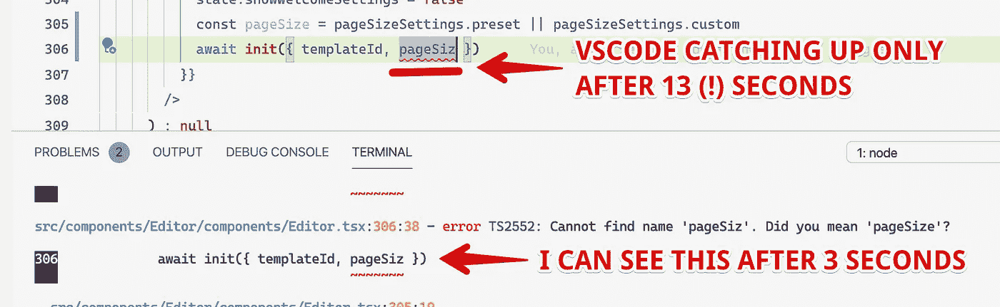

# 在 1 分钟内加速 VSCode 中的 TypeScript🚀

> 原文：<https://levelup.gitconnected.com/speed-up-your-typescript-vscode-workflow-in-1-minute-2e3c505e008b>

**分享一个简单的提示**，在过去的 3 年里**为我节省了很多时间**(尤其是大型的！).

我希望在我刚刚开始使用 TypeScript 的时候早点知道…

# 🤔问题是

我们都知道 **TypeScript 在 VS 代码**中会变得很慢。尤其是一些类型定义复杂的代码库(想想 UI 组件框架中的多态`as`道具！).

当你键入新代码或修复错误时，你有没有发现自己在**等待编译器赶上**你？

这很快就会令人沮丧，**减慢你的反馈循环**(快速反馈循环有助于保持你的快乐和动力！).

# 让打字稿工作得更快

这里有一个窍门: **在终端标签中以观察模式运行一个单独的 TypeScript 进程。
在你写代码的时候保持它的运行——与 VSCode 相比，它会更快地响应变化和突出错误。**



以我的经验来看，这种差异可能是惊人的(见截图)。这似乎取决于它所使用的项目和 npm 库，但是总体模式在我工作过的不同项目和 ts 版本中是相当一致的。

**下面是如何为您的 TypeScript 项目逐步设置它:**

1.  将这两个 NPM 脚本添加到您的 package.json 中:

```
"scripts": {
  ...
  "typecheck": "tsc",
  "typecheck:watch": "tsc -w"
  ...
}
```

2.现在在终端选项卡中运行`npm run typecheck:watch`(我喜欢在 VSCode 的终端面板中这样做)。

这将在监视模式下启动一个单独的 TypeScript 进程。

开始需要一些时间，但是随着代码的改变，逐步地重新编译代码会快得多。

3.如果只需要检查一次，使用`npm run typechek`。它会比手表模式运行得更快。

我发现它很方便，比如在部署之前确保构建成功。

# 🙌就是这样！

我希望这个技巧能帮助你成为一个更高效、更快乐的开发人员(它确实帮助了我)。

请分享您自己的经历——它是否帮助您加快了工作流程？