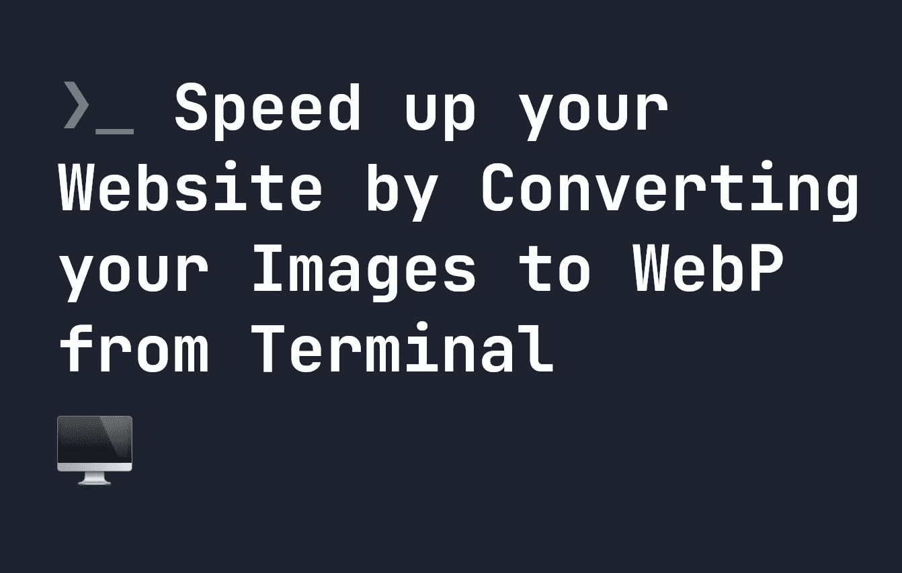
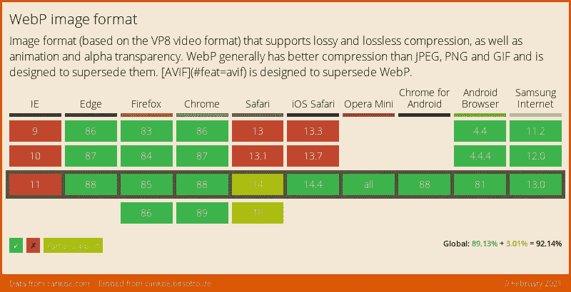

# 使用终端将您的图像转换为 WebP，加速您的网站

> 原文：<https://levelup.gitconnected.com/speed-up-your-website-by-converting-your-images-to-webp-from-terminal-3bbeb118dd1>



`.webp`格式是一种被广泛支持的压缩图像格式，在网络上越来越普遍。将您的图像存储为`.webp`可以减小您的网页大小，同时仍然保持您需要的图像质量。图像大小的节省可能非常显著，这意味着您的页面将加载得更快。

如果你想把一张图片转换成`.webp`，你可以在很多应用程序中完成，比如 Photoshop——但是更快的方法是直接在终端上完成。让我们看看它是如何工作的。

# 支持。webp 文件

`.webp`广泛支持除 Internet Explorer 之外的所有浏览器。你可以在下面看到完整的支持:



# 安装 WebP 和 cwebp

要开始将文件转换为`.webp`，我们需要做的第一件事是安装一个名为`cwebp`的工具，它是 Google 提供的`webp`包的一部分。如果你已经安装了**自制软件**，这很容易，可以从终端安装，如下所示:

```
brew install webp
```

如果你没有，你可以通过 Google 找到更多关于[安装这个包的说明。安装后，我们可以从终端运行命令`cwebp`来获得以下输出:](https://developers.google.com/speed/webp/download)

```
~ % cwebp
Usage:
    cwebp [options] -q quality input.png -o output.webp
```

所以现在，如果我们想将一个`.png`文件更改为`.webp`，质量为 60，我们可以运行以下命令:

```
cwebp -q 60 image.png -o image.webp
```

这将把`image.png`转换成质量为 60%的文件`image.webp`。改变这个质量值将会改变输出的大小——质量越低，文件越小——但是平衡它，使图像看起来还可以也很重要。**原始图像仍然会被保留，所以我们会有两个版本的文件。**

由于一些老的浏览器如 Internet Explorer 不支持`.webp`，拥有两个版本实际上是有用的。在 HTML 中，我们可以使用我们的`.webp`文件，通过使用`<picture>`标签回退到原始的`.png`文件:

```
<picture>
    <source srcset="image.webp" type="image/webp">
    
</picture>
```

这意味着对于使用更现代浏览器的用户来说，他们将获得更快加载时间的额外好处——而那些使用旧浏览器的用户仍然可以看到图像，如果他们的浏览器不支持`.webp`。

# 将您的所有图像转换为。webp

`.webp`是如此之快，有必要将你所有的图片制作成`.webp`的副本，这样你就可以随时使用它们。因为`cwebp`也保留原始文件，所以没有丢失图像原始副本的风险。由于大多数服务器都有大量的图像，这可能非常耗时。

幸运的是，我们可以使用`cwebp`通过一个`for`循环将所有的`.png`、`.jpg`和`.jpeg`文件转换成`.webp`。下面的代码将找到运行它的目录中的所有图像，并为每个图像创建`.webp`版本。因为它递归地工作，它将转换你的服务器上找到的任何图像。这意味着有时运行它会很耗时，这取决于你有多少图像。[你可以在这里了解更多关于 find 命令的信息](https://fjolt.com/article/linux-find-command)。

```
echo 'Converting all .png, .jpg, and .jpeg files to .webp...'
for f in $(find . -name '*.png' -or -name '*.jpg' -or -name '*.jpeg'); do 
    if [ ! -f "${f%.*}.webp" ]; then
        cwebp -q 60 $f -o ${f%.*}.webp
    fi
done
```