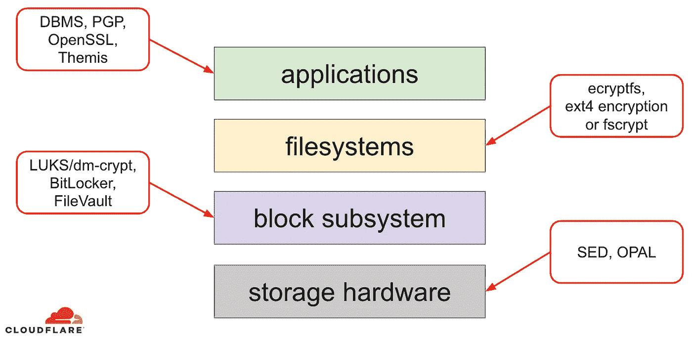
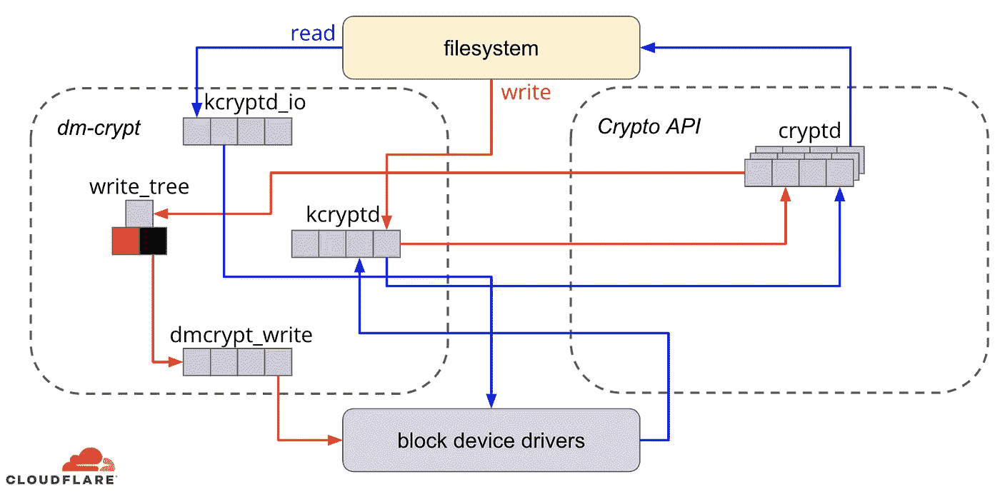
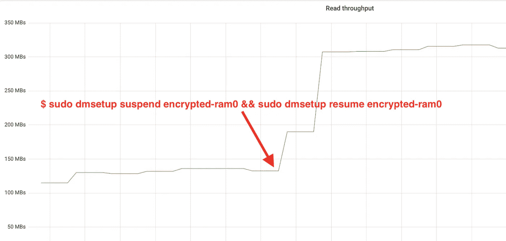
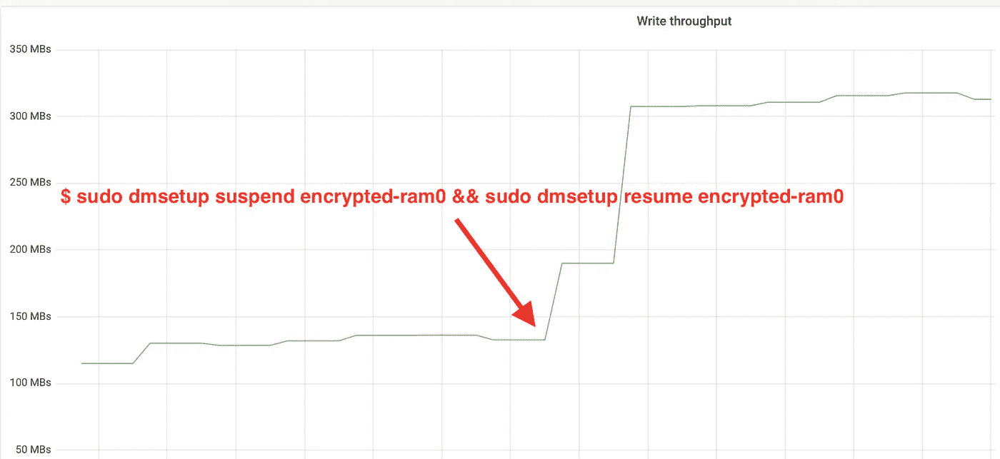
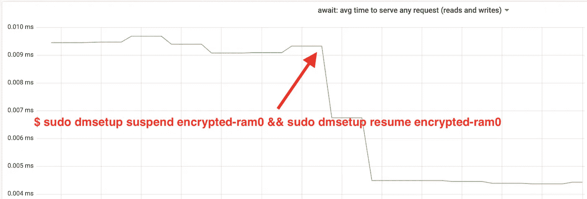
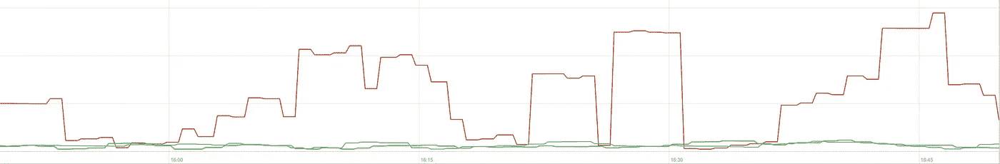

# 加速 Linux 磁盘加密

> 原文：<https://levelup.gitconnected.com/speeding-up-linux-disk-encryption-5c56491201b2>

*原载于 2020 年 3 月 25 日 https://blog.cloudflare.com*[](https://blog.cloudflare.com/speeding-up-linux-disk-encryption/)**。**

*静态数据加密是任何现代互联网公司的必备工具。然而，许多公司不加密他们的磁盘，因为他们担心加密开销会导致潜在的性能损失。*

*加密静态数据对于 Cloudflare 至关重要，因为 cloud flare 在全球有[200 多个数据中心](https://www.cloudflare.com/network/)。在本帖中，我们将调查 Linux 上磁盘加密的性能，并解释我们如何为我们自己和我们的客户使它至少快两倍！*

## *加密静态数据*

*说到加密静态数据，有几种方法可以在现代操作系统(OS)上实施。可用的技术与典型的操作系统存储堆栈紧密结合。存储堆栈和加密解决方案的简化版本可以在下图中找到:*

**

*栈顶是应用程序，它在文件(或流)中读写数据。OS 内核中的文件系统跟踪底层块设备的哪些块属于哪些文件，并将这些文件读取和写入转换成块读取和写入，然而底层存储设备的硬件细节从文件系统中抽象出来。最后，数据块子系统实际上使用适当的设备驱动程序将数据块读写传递给底层硬件。*

*存储堆栈的概念实际上类似于[众所周知的网络 OSI 模型](https://www.cloudflare.com/learning/ddos/glossary/open-systems-interconnection-model-osi/)，其中每一层都有一个更高层次的信息视图，较低层的实施细节从较高层中抽象出来。而且，类似于 OSI 模型，人们可以在不同的层应用加密(想想 [TLS](https://www.cloudflare.com/learning/ssl/transport-layer-security-tls/) vs [IPsec](https://en.wikipedia.org/wiki/IPsec) 或[VPN](https://www.cloudflare.com/learning/access-management/what-is-a-vpn/))。*

*对于静态数据，我们可以在数据块层(硬件或软件)或文件级(直接在应用程序或文件系统中)应用加密。*

## *块与文件加密*

*一般来说，我们应用加密的级别越高，我们拥有的灵活性就越大。有了应用程序级加密，应用程序维护人员可以将他们喜欢的任何加密代码应用于他们需要的任何特定数据。这种方法的缺点是他们实际上必须自己实现它，并且加密通常对开发人员来说不是很友好:人们必须知道特定加密算法的详细情况，正确地生成密钥、随机数、iv 等。此外，应用级加密没有利用操作系统级缓存，尤其是 [Linux 页面缓存](https://en.wikipedia.org/wiki/Page_cache):每次应用需要使用数据时，它必须再次解密数据，浪费 CPU 周期，或者实现自己的解密“缓存”,这给代码带来了更多的复杂性。*

*文件系统级加密使数据加密对应用程序透明，因为文件系统本身会在将数据传递给数据块子系统之前对数据进行加密，因此无论应用程序是否支持加密，文件都会被加密。此外，可以将文件系统配置为只加密特定的目录，或者为不同的文件使用不同的密钥。然而，这种灵活性是以更复杂的配置为代价的。文件系统加密也被认为不如块设备加密安全，因为只有文件的内容被加密。文件也有相关的元数据，如文件大小、文件数量、目录树布局等。这对于潜在的对手仍然是可见的。*

*数据块层的加密(通常称为[磁盘加密](https://en.wikipedia.org/wiki/Disk_encryption)或全磁盘加密)也使数据加密对应用程序甚至整个文件系统透明。与文件系统级加密不同，它加密磁盘上的所有数据，包括文件元数据甚至可用空间。但是它的灵活性较差——一个人只能用一个密钥加密整个磁盘，因此没有针对每个目录、每个文件或每个用户的配置。从加密的角度来看，并不是所有的加密算法都可以使用，因为数据块层不再具有数据的高级概览，因此它需要独立处理每个数据块。大多数[通用算法需要某种块链接](https://en.wikipedia.org/wiki/Block_cipher_mode_of_operation#Common_modes)来保证安全，所以不适用于磁盘加密。相反，[专门为这一特定用例开发了特殊模式](https://en.wikipedia.org/wiki/Disk_encryption_theory#Block_cipher-based_modes)。*

*那么选择哪一层呢？一如既往，视情况而定…由于灵活性，应用程序和文件系统级加密通常是客户端系统的首选。例如，多用户桌面上的每个用户可能希望用他们自己的密钥加密他们的主目录，而不加密某些共享目录。相反，在由 SaaS/PaaS/IaaS 公司(包括 Cloudflare)管理的服务器系统上，首选是配置简单性和安全性—通过启用全磁盘加密，来自任何应用程序的任何数据都会自动加密，没有例外或覆盖。我们认为，所有数据都需要得到保护，而不需要将其分类到“重要”或“不重要”的存储桶中，因此不需要上层提供的选择性灵活性。*

## *硬件与软件磁盘加密*

*在块层加密数据时，如果硬件[支持](https://en.wikipedia.org/wiki/Hardware-based_full_disk_encryption)，可以直接在存储硬件中加密。这样做通常会提供更好的读/写性能，并消耗更少的主机资源。然而，由于大多数硬件固件都是专有的，因此它没有受到安全社区的关注和审查。在过去，这导致了硬盘加密的一些实现中的[缺陷](https://www.us-cert.gov/ncas/current-activity/2018/11/06/Self-Encrypting-Solid-State-Drive-Vulnerabilities)，这使得整个安全模型变得无用。例如，微软[从那时起开始偏爱基于软件的磁盘加密](https://support.microsoft.com/en-us/help/4516071/windows-10-update-kb4516071)。*

*我们不想让我们的数据和客户的数据面临使用潜在不安全解决方案的风险，我们[坚信开源](https://blog.cloudflare.com/helping-to-build-cloudflare-part-4/)。这就是为什么我们只依赖 Linux 内核中的软件磁盘加密，它是开放的，并且已经过世界各地许多安全专家的审核。*

## *Linux 磁盘加密性能*

*我们的目标不仅是为我们的客户节省带宽成本，而且尽可能快地向互联网用户提供内容。*

*有一次，我们注意到我们的磁盘没有我们希望的那么快。一些分析和快速 A/B 测试指向了 Linux 磁盘加密。因为不加密数据(即使它应该是一个公共的互联网缓存)不是一个可持续的选择，我们决定进一步研究 Linux 磁盘加密性能。*

## *设备映射和 dm-crypt*

*Linux 通过一个 [dm-crypt 模块](https://en.wikipedia.org/wiki/Dm-crypt)实现透明磁盘加密，而`dm-crypt`本身是[设备映射器](https://en.wikipedia.org/wiki/Device_mapper)内核框架的一部分。简而言之，当 IO 请求在文件系统和底层块设备之间传输时，设备映射器允许预处理/后处理 IO 请求。*

*`dm-crypt`特别是在将“写”IO 请求进一步发送到实际的块设备之前对其进行加密，在将“读”IO 请求发送到文件系统驱动程序之前对其进行解密。简单易行！或者是？*

## *基准设置*

*根据记录，本文中的数字是通过在停产的闲置 [Cloudflare G9 服务器](https://blog.cloudflare.com/a-tour-inside-cloudflares-g9-servers/)上运行指定命令获得的。但是，该设置应该可以在任何现代 x86 笔记本电脑上轻松重现。*

*通常，由于存储硬件本身引入的噪声，围绕存储堆栈的任何基准测试都很困难。不是所有的磁盘都是一样的，所以在这篇文章中，我们将使用最快的磁盘，也就是没有磁盘。*

*相反，Linux 有一个选项可以直接在 RAM 中模拟一个磁盘。由于 RAM 比任何持久存储快得多，它应该不会给我们的结果带来什么偏差。*

*以下命令创建 4GB 内存磁盘:*

```
*$ sudo modprobe brd rd_nr=1 rd_size=4194304
$ ls /dev/ram0*
```

*现在我们可以在它的基础上建立一个`dm-crypt`实例，从而为磁盘启用加密。首先，我们需要生成磁盘加密密钥，“格式化”磁盘并指定一个密码来解锁新生成的密钥。*

```
*$ fallocate -l 2M crypthdr.img
$ sudo cryptsetup luksFormat /dev/ram0 --header crypthdr.img

WARNING!
========
This will overwrite data on crypthdr.img irrevocably.

Are you sure? (Type uppercase yes): YES
Enter passphrase:
Verify passphrase:*
```

*熟悉`LUKS/dm-crypt`的人可能已经注意到我们在这里使用了一个 [LUKS 分离式头球](http://man7.org/linux/man-pages/man8/cryptsetup.8.html)。通常，LUKS 将密码加密的磁盘加密密钥与数据存储在同一个磁盘上，但是由于我们想要比较加密和未加密设备之间的读/写性能，我们可能会在稍后的基准测试中意外覆盖加密的密钥。出于本文的目的，将加密密钥保存在单独的文件中可以避免这个问题。*

*现在，我们实际上可以“解锁”加密设备以进行测试:*

```
*$ sudo cryptsetup open --header crypthdr.img /dev/ram0 encrypted-ram0
Enter passphrase for /dev/ram0:
$ ls /dev/mapper/encrypted-ram0
/dev/mapper/encrypted-ram0*
```

*此时，我们现在可以比较加密和未加密 ramdisk 的性能:如果我们向`/dev/ram0`读取/写入数据，它将存储在[明文](https://en.wikipedia.org/wiki/Plaintext)中。同样，如果我们向`/dev/mapper/encrypted-ram0`读/写数据，它会在途中被`dm-crypt`解密/加密，并存储在[密文](https://en.wikipedia.org/wiki/Ciphertext)中。*

*值得注意的是，我们没有在数据块设备上创建任何文件系统，以避免因文件系统开销而导致结果偏差。*

## *测量吞吐量*

*说到存储测试/基准测试[灵活的 I/O 测试器](https://fio.readthedocs.io/en/latest/fio_doc.html)是常用的解决方案。让我们在未加密的 ramdisk 上用 4K 块大小模拟简单的顺序读/写负载:*

```
*$ sudo fio --filename=/dev/ram0 --readwrite=readwrite --bs=4k --direct=1 --loops=1000000 --name=plain
plain: (g=0): rw=rw, bs=4K-4K/4K-4K/4K-4K, ioengine=psync, iodepth=1
fio-2.16
Starting 1 process
...
Run status group 0 (all jobs):
   READ: io=21013MB, aggrb=1126.5MB/s, minb=1126.5MB/s, maxb=1126.5MB/s, mint=18655msec, maxt=18655msec
  WRITE: io=21023MB, aggrb=1126.1MB/s, minb=1126.1MB/s, maxb=1126.1MB/s, mint=18655msec, maxt=18655msec

Disk stats (read/write):
  ram0: ios=0/0, merge=0/0, ticks=0/0, in_queue=0, util=0.00%*
```

*上面的命令会运行很长时间，所以我们过一会儿就停止它。正如我们从统计数据中看到的，我们能够在大约`1126 MB/s`的时候以大致相同的吞吐量进行读写。让我们用加密的 ramdisk 重复测试:*

```
*$ sudo fio --filename=/dev/mapper/encrypted-ram0 --readwrite=readwrite --bs=4k --direct=1 --loops=1000000 --name=crypt
crypt: (g=0): rw=rw, bs=4K-4K/4K-4K/4K-4K, ioengine=psync, iodepth=1
fio-2.16
Starting 1 process
...
Run status group 0 (all jobs):
   READ: io=1693.7MB, aggrb=150874KB/s, minb=150874KB/s, maxb=150874KB/s, mint=11491msec, maxt=11491msec
  WRITE: io=1696.4MB, aggrb=151170KB/s, minb=151170KB/s, maxb=151170KB/s, mint=11491msec, maxt=11491msec*
```

*哇，那是一滴！我们现在只得到`~147 MB/s`，慢了 7 倍多！这是在一台完全闲置的机器上！*

## *也许，加密就是慢*

*我们首先考虑的是确保我们使用最快的密码。`cryptsetup`允许我们对系统上所有可用的加密实施进行基准测试，以选择最佳实施:*

```
*$ sudo cryptsetup benchmark
# Tests are approximate using memory only (no storage IO).
PBKDF2-sha1      1340890 iterations per second for 256-bit key
PBKDF2-sha256    1539759 iterations per second for 256-bit key
PBKDF2-sha512    1205259 iterations per second for 256-bit key
PBKDF2-ripemd160  967321 iterations per second for 256-bit key
PBKDF2-whirlpool  720175 iterations per second for 256-bit key
#  Algorithm | Key |  Encryption |  Decryption
     aes-cbc   128b   969.7 MiB/s  3110.0 MiB/s
 serpent-cbc   128b           N/A           N/A
 twofish-cbc   128b           N/A           N/A
     aes-cbc   256b   756.1 MiB/s  2474.7 MiB/s
 serpent-cbc   256b           N/A           N/A
 twofish-cbc   256b           N/A           N/A
     aes-xts   256b  1823.1 MiB/s  1900.3 MiB/s
 serpent-xts   256b           N/A           N/A
 twofish-xts   256b           N/A           N/A
     aes-xts   512b  1724.4 MiB/s  1765.8 MiB/s
 serpent-xts   512b           N/A           N/A
 twofish-xts   512b           N/A           N/A*
```

*看来`aes-xts`用 256 位数据加密密钥是这里最快的。但是我们实际上是用哪一个来加密 ramdisk 呢？*

```
*$ sudo dmsetup table /dev/mapper/encrypted-ram0
0 8388608 crypt aes-xts-plain64 0000000000000000000000000000000000000000000000000000000000000000 0 1:0 0*
```

*我们使用带有 256 位数据加密密钥的`aes-xts`(计算所有被`dmsetup`工具方便地屏蔽的零——如果你想看到实际的字节，在上面的命令中添加`--showkeys`选项)。然而，这些数字并没有加起来:`cryptsetup benchmark`告诉我们不要依赖上面的结果，因为“仅使用内存(没有存储 IO)的测试是近似的”，但这正是我们如何使用 ramdisk 设置我们的实验。在某种程度上更糟糕的情况下(假设我们读取所有数据，然后在没有并行性的情况下顺序加密/解密)，进行[粗略计算](https://en.wikipedia.org/wiki/Back-of-the-envelope_calculation)时，我们应该避开`(1126 * 1823) / (1126 + 1823) =~696 MB/s`，这仍然与实际的`147 * 2 = 294 MB/s`(读写总数)相差甚远。*

## *DM-加密性能标志*

*在阅读 [cryptsetup 手册页](http://man7.org/linux/man-pages/man8/cryptsetup.8.html)时，我们注意到它有两个前缀为`--perf-`的选项，这可能与性能调优有关。第一个是`--perf-same_cpu_crypt`，描述相当隐晦:*

```
*Perform encryption using the same cpu that IO was submitted on.  The default is to use an unbound workqueue so that encryption work is automatically balanced between available CPUs.  This option is only relevant for open action.*
```

*所以我们启用了这个选项*

```
*$ sudo cryptsetup close encrypted-ram0
$ sudo cryptsetup open --header crypthdr.img --perf-same_cpu_crypt /dev/ram0 encrypted-ram0*
```

*注:根据[最新手册页](http://man7.org/linux/man-pages/man8/cryptsetup.8.html)，还有一个`cryptsetup refresh`命令，可用于启用这些选项，而不必“关闭”和“重新打开”加密设备。然而我们的`cryptsetup`还不支持它。*

*验证选项是否已真正启用:*

```
*$ sudo dmsetup table encrypted-ram0
0 8388608 crypt aes-xts-plain64 0000000000000000000000000000000000000000000000000000000000000000 0 1:0 0 1 same_cpu_crypt*
```

*是的，我们现在可以在输出中看到`same_cpu_crypt`，这正是我们想要的。让我们重新运行基准测试:*

```
*$ sudo fio --filename=/dev/mapper/encrypted-ram0 --readwrite=readwrite --bs=4k --direct=1 --loops=1000000 --name=crypt
crypt: (g=0): rw=rw, bs=4K-4K/4K-4K/4K-4K, ioengine=psync, iodepth=1
fio-2.16
Starting 1 process
...
Run status group 0 (all jobs):
   READ: io=1596.6MB, aggrb=139811KB/s, minb=139811KB/s, maxb=139811KB/s, mint=11693msec, maxt=11693msec
  WRITE: io=1600.9MB, aggrb=140192KB/s, minb=140192KB/s, maxb=140192KB/s, mint=11693msec, maxt=11693msec*
```

*嗯，现在是`~136 MB/s`比以前稍微差一点，所以不行。第二个选项`--perf-submit_from_crypt_cpus`怎么样:*

```
*Disable offloading writes to a separate thread after encryption.  There are some situations where offloading write bios from the encryption threads to a single thread degrades performance significantly.  The default is to offload write bios to the same thread.  This option is only relevant for open action.*
```

*也许，我们正处于这里的“某种情况”,所以让我们试一试:*

```
*$ sudo cryptsetup close encrypted-ram0
$ sudo cryptsetup open --header crypthdr.img --perf-submit_from_crypt_cpus /dev/ram0 encrypted-ram0
Enter passphrase for /dev/ram0:
$ sudo dmsetup table encrypted-ram0
0 8388608 crypt aes-xts-plain64 0000000000000000000000000000000000000000000000000000000000000000 0 1:0 0 1 submit_from_crypt_cpus*
```

*现在是基准测试:*

```
*$ sudo fio --filename=/dev/mapper/encrypted-ram0 --readwrite=readwrite --bs=4k --direct=1 --loops=1000000 --name=crypt
crypt: (g=0): rw=rw, bs=4K-4K/4K-4K/4K-4K, ioengine=psync, iodepth=1
fio-2.16
Starting 1 process
...
Run status group 0 (all jobs):
   READ: io=2066.6MB, aggrb=169835KB/s, minb=169835KB/s, maxb=169835KB/s, mint=12457msec, maxt=12457msec
  WRITE: io=2067.7MB, aggrb=169965KB/s, minb=169965KB/s, maxb=169965KB/s, mint=12457msec, maxt=12457msec*
```

*`~166 MB/s`，好一点了，但还是不好...*

## *询问社区*

*绝望的我们决定从互联网上寻求支持，[将我们的发现发布到了](https://www.spinics.net/lists/dm-crypt/msg07516.html) `[dm-crypt](https://www.spinics.net/lists/dm-crypt/msg07516.html)` [邮件列表](https://www.spinics.net/lists/dm-crypt/msg07516.html)，但是我们得到的回应并不令人鼓舞:*

> *如果这些数字让你感到不安，那么这是因为你缺乏理解。您可能没有意识到加密是一项繁重的操作…*

*我们决定通过在谷歌搜索中键入“加密昂贵吗”来对此主题进行科学研究，其中一个顶级结果(实际上包含有意义的测量)是… [我们自己关于加密成本](https://blog.cloudflare.com/how-expensive-is-crypto-anyway/)的帖子，但在 [TLS](https://www.cloudflare.com/learning/ssl/transport-layer-security-tls/) 的上下文中！这本身就是一个引人入胜的阅读，但要点是:现代硬件上的现代加密即使在 Cloudflare 规模上也非常便宜(每秒处理数百万个加密的 HTTP 请求)。事实上，它非常便宜，以至于 Cloudflare 是第一个为每个人提供免费 SSL/TLS 的提供商。*

## *深入研究源代码*

*当试图使用上面描述的自定义`dm-crypt`选项时，我们很好奇为什么它们会首先存在，以及“卸载”是什么意思。最初我们期望`dm-crypt`是一个简单的“代理”,它只是在数据流经堆栈时对数据进行加密/解密。原来`dm-crypt`不仅仅是加密内存缓冲区，下面给出了一个(简化的)IO 遍历路径图:*

**

*当文件系统发出一个写请求时，`dm-crypt`并不立即处理它——而是把它放到一个名为“kcryptd”的[工作队列](https://www.kernel.org/doc/html/v4.19/core-api/workqueue.html) [中。简而言之，内核工作队列只是安排一些工作(在本例中是加密)在以后更方便的时候执行。当“时机”到来时，`dm-crypt`](https://github.com/torvalds/linux/blob/0d81a3f29c0afb18ba2b1275dcccf21e0dd4da38/drivers/md/dm-crypt.c#L3124) [向](https://github.com/torvalds/linux/blob/0d81a3f29c0afb18ba2b1275dcccf21e0dd4da38/drivers/md/dm-crypt.c#L1940) [Linux Crypto API](https://www.kernel.org/doc/html/v4.19/crypto/index.html) 发送请求进行实际加密。然而，现代 Linux Crypto API [也是异步的](https://www.kernel.org/doc/html/v4.19/crypto/api-skcipher.html#symmetric-key-cipher-api)，所以根据您的系统将使用的特定实现，很可能不会立即处理它，而是再次排队等待“以后的时间”。当 Linux Crypto API 最终[进行加密](https://github.com/torvalds/linux/blob/0d81a3f29c0afb18ba2b1275dcccf21e0dd4da38/drivers/md/dm-crypt.c#L1980)时，`dm-crypt`可能会尝试[通过将每个请求](https://github.com/torvalds/linux/blob/0d81a3f29c0afb18ba2b1275dcccf21e0dd4da38/drivers/md/dm-crypt.c#L1909-L1910)放入[红黑树](https://en.wikipedia.org/wiki/Red%E2%80%93black_tree)来对未决的写请求进行排序。然后一个[单独的内核线程](https://github.com/torvalds/linux/blob/0d81a3f29c0afb18ba2b1275dcccf21e0dd4da38/drivers/md/dm-crypt.c#L1819)再次在“一段时间后”实际上获取树中的所有 IO 请求，并且[将它们发送到堆栈](https://github.com/torvalds/linux/blob/0d81a3f29c0afb18ba2b1275dcccf21e0dd4da38/drivers/md/dm-crypt.c#L1864)。*

*现在对于读取请求:这一次我们需要首先从硬件获取加密的数据，但是`dm-crypt`并不只是向驱动程序请求数据，而是将请求排队到另一个名为“kcryptd _ io”的[工作队列](https://www.kernel.org/doc/html/v4.19/core-api/workqueue.html) [中。在稍后的某个时刻，当我们实际拥有加密的数据时，我们](https://github.com/torvalds/linux/blob/0d81a3f29c0afb18ba2b1275dcccf21e0dd4da38/drivers/md/dm-crypt.c#L3122)[使用现在熟悉的“kcryptd”工作队列来调度它进行解密](https://github.com/torvalds/linux/blob/0d81a3f29c0afb18ba2b1275dcccf21e0dd4da38/drivers/md/dm-crypt.c#L1742)。“kcryptd”[将请求](https://github.com/torvalds/linux/blob/0d81a3f29c0afb18ba2b1275dcccf21e0dd4da38/drivers/md/dm-crypt.c#L1970)发送到 Linux Crypto API，它也可以异步解密数据。*

*公平地说，请求并不总是遍历所有这些队列，但这里重要的一点是，写请求在`dm-crypt`中最多可以排队 4 次，读请求最多可以排队 3 次。此时，我们想知道所有这些额外的排队是否会导致任何性能问题。例如，Google 有一个关于排队和尾部延迟之间关系的[不错的演示。本演示的一个关键要点是:](https://www.usenix.org/conference/srecon19asia/presentation/plenz)*

> *大量的尾部延迟是由排队效应引起的*

*那么，为什么会有这些队列，我们能消除它们吗？*

## *Git 考古学*

*没有人会为了好玩而编写更复杂的代码，尤其是对于操作系统内核。所以所有这些队列放在那里肯定是有原因的。幸运的是，Linux 内核源代码是由 [git](https://en.wikipedia.org/wiki/Git) 管理的，所以我们可以试着追溯变化和围绕它们的决策。*

*“kcryptd”工作队列从可用历史开始就在源[中，并带有以下注释:](https://github.com/torvalds/linux/blob/1da177e4c3f41524e886b7f1b8a0c1fc7321cac2/drivers/md/dm-crypt.c)*

> *之所以需要，是因为在中断上下文中进行解密是非常不明智的，所以从读取请求返回的 bios 会在这里排队。*

*所以它只用于读取，但即使如此，如果 Linux Crypto API 无论如何都可能使用专用的线程/队列进行加密，我们为什么还要关心它是否是中断上下文呢？好吧，回到 2005 年，Crypto API [不是异步的](https://github.com/torvalds/linux/blob/1da177e4c3f41524e886b7f1b8a0c1fc7321cac2/Documentation/crypto/api-intro.txt)，所以这很有意义。*

*2006 年`dm-crypt` [开始使用](https://github.com/torvalds/linux/commit/23541d2d288cdb54f417ba1001dacc7f3ea10a97)的“kcryptd”工作队列，不仅用于加密，还用于提交 IO 请求:*

> *此修补程序旨在帮助 dm-crypt 遵守以下修补程序在-mm 中施加的新约束:MD-DM-reduce-stack-usage-with-stacked-block-devices . patch*

*这里的目标似乎不是增加更多的并发性，而是减少内核堆栈的使用，这也是有意义的，因为内核在所有代码中都有一个公共的堆栈，所以这是一个非常有限的资源。然而，值得注意的是， [Linux 内核堆栈已经在 2014 年针对 x86 平台进行了扩展](https://github.com/torvalds/linux/commit/6538b8ea886e472f4431db8ca1d60478f838d14b)，因此这可能不再是一个问题。*

*“kcryptd_io”工作队列的第一个版本是在 2007 年添加的[，目的是避免:](https://github.com/torvalds/linux/commit/cabf08e4d3d1181d7c408edae97fb4d1c31518af)*

> *等待内存分配的许多请求导致的饥饿…*

*请求处理在单个工作队列上遇到瓶颈，因此解决方案是添加另一个工作队列。有道理。*

*我们肯定不是第一个因为大量排队而经历性能下降的人:2011 年引入了一个变化，即[有条件地恢复一些读取请求的排队](https://github.com/torvalds/linux/commit/20c82538e4f5ede51bc2b4795bc6e5cae772796d):*

> *如果有足够的内存，代码可以直接提交 bio，而不是在单独的线程中排队该操作。*

*不幸的是，那时的 Linux 内核提交消息不像现在这样详细，所以没有可用的性能数据。*

*在 2015 年 [dm-crypt 开始在单独的“dmcrypt_write”线程中对写操作](https://github.com/torvalds/linux/commit/dc2676210c425ee8e5cb1bec5bc84d004ddf4179)进行排序，然后将它们发送到堆栈中:*

> *在多处理器计算机上，加密请求的完成顺序与提交顺序不同。因此，写请求将以不同的顺序提交，这可能会导致严重的性能下降。*

*这确实有意义，因为顺序磁盘访问曾经比随机磁盘访问快得多，而`dm-crypt`正在打破这种模式。但这主要适用于 2015 年仍占主导地位的[旋转圆盘](https://en.wikipedia.org/wiki/Hard_disk_drive)。它可能没有现代的快速固态硬盘[(包括 NVME 固态硬盘)](https://en.wikipedia.org/wiki/Solid-state_drive)重要。*

*提交消息的另一部分值得一提:*

> *…特别是它使像 CFQ 这样的 IO 调度程序能够更有效地排序…*

*它提到了 [CFQ IO 调度器](https://www.kernel.org/doc/Documentation/block/cfq-iosched.txt)的性能优势，但 Linux 调度器从那时起已经有所改进，到 2018 年 [CFQ 调度器已经从内核中移除](https://github.com/torvalds/linux/commit/f382fb0bcef4c37dc049e9f6963e3baf204d815c)。*

*同一个补丁集[用红黑树](https://github.com/torvalds/linux/commit/b3c5fd3052492f1b8d060799d4f18be5a5438)替换排序列表:*

> *理论上，排序应该由底层磁盘调度程序来执行，然而，实际上磁盘调度程序只接受和排序有限数量的请求。为了允许对所有请求进行排序，dm-crypt 需要实现自己的排序。*
> 
> *与基于 rbtree 的排序相关联的开销被认为是可以忽略的，因此它没有被有条件地使用。*

*所有这些都有道理，但如果有一些支持数据就更好了。*

*有趣的是，在同一个补丁集中，我们看到[引入了我们熟悉的“submit _ from _ crypt _ cpus”选项](https://github.com/torvalds/linux/commit/0f5d8e6ee758f7023e4353cca75d785b2d4f6abe):*

> *在某些情况下，将写 bios 从加密线程卸载到单个线程会显著降低性能*

*总的来说，我们可以看到每一个变化都是合理的和必要的，但是从那以后事情发生了变化:*

*   *硬件变得更快更智能*
*   *重新审视了 Linux 资源分配*
*   *耦合的 Linux 子系统被重新构建*

*上面的许多设计选择可能不适用于现代 Linux。*

## *“大扫除”*

*基于上面的研究，我们决定尝试移除所有额外的排队和异步行为，并将`dm-crypt`恢复到其最初的目的:简单地在 IO 请求通过时对其进行加密/解密。但是为了稳定性和进一步的基准测试，我们最终没有删除实际的代码，而是添加了另一个`dm-crypt`选项，如果启用的话，它会绕过所有的队列/线程。该标志允许我们在满负荷运行时在当前行为和新行为之间切换，因此如果我们看到任何副作用，我们可以很容易地恢复我们的更改。生成的补丁可以在 [Cloudflare GitHub Linux 存储库](https://github.com/cloudflare/linux/blob/master/patches/0023-Add-DM_CRYPT_FORCE_INLINE-flag-to-dm-crypt-target.patch)上找到。*

## *同步 Linux 加密 API*

*从上图中我们可以看出，并不是所有的排队都在`dm-crypt`中实现。现代 Linux Crypto API 也可能是异步的，为了这个实验，我们也想消除队列。“可能”是什么意思呢？操作系统可能包含同一算法的不同实现(例如，x86 平台上的[硬件加速 AES-NI](https://en.wikipedia.org/wiki/AES_instruction_set)和通用 C 代码 AES 实现)。默认情况下，系统根据[配置的算法优先级](https://www.kernel.org/doc/html/v4.19/crypto/architecture.html#crypto-api-cipher-references-and-priority)选择“最佳”算法。`dm-crypt`允许覆盖这种行为，并且[使用`capi:`前缀请求特定的密码实现](https://gitlab.com/cryptsetup/cryptsetup/-/wikis/DMCrypt#mapping-table-for-crypt-target)。但是，有一个问题。让我们实际检查可用的 AES-XTS(这是我们的磁盘加密密码，还记得吗？)在我们系统上的实现:*

```
*$ grep -A 11 'xts(aes)' /proc/crypto
name         : xts(aes)
driver       : xts(ecb(aes-generic))
module       : kernel
priority     : 100
refcnt       : 7
selftest     : passed
internal     : no
type         : skcipher
async        : no
blocksize    : 16
min keysize  : 32
max keysize  : 64
--
name         : __xts(aes)
driver       : cryptd(__xts-aes-aesni)
module       : cryptd
priority     : 451
refcnt       : 1
selftest     : passed
internal     : yes
type         : skcipher
async        : yes
blocksize    : 16
min keysize  : 32
max keysize  : 64
--
name         : xts(aes)
driver       : xts-aes-aesni
module       : aesni_intel
priority     : 401
refcnt       : 1
selftest     : passed
internal     : no
type         : skcipher
async        : yes
blocksize    : 16
min keysize  : 32
max keysize  : 64
--
name         : __xts(aes)
driver       : __xts-aes-aesni
module       : aesni_intel
priority     : 401
refcnt       : 7
selftest     : passed
internal     : yes
type         : skcipher
async        : no
blocksize    : 16
min keysize  : 32
max keysize  : 64*
```

*我们想从上面的列表中显式地选择一个同步密码，以避免线程中的排队效应，但是只支持两个密码`xts(ecb(aes-generic))`(通用 C 实现)和`__xts-aes-aesni`(x86 硬件加速实现)。我们肯定想要后者，因为它更快(我们的目标是这里的性能)，但它被可疑地标记为内部(见`internal: yes`)。如果我们[检查源代码](https://github.com/torvalds/linux/blob/fb33c6510d5595144d585aa194d377cf74d31911/include/linux/crypto.h#L91):*

> *将一个密码标记为只能由另一个密码使用的服务实现，而不能由内核加密 API 的普通用户使用*

*因此，这个密码只能由 Crypto API 中的其他包装器代码使用，而不能在它之外使用。在实践中，这意味着当请求一个特定的密码实现时，Crypto API 的调用者需要显式地指定这个标志，但是`dm-crypt`没有这样做，因为根据设计，它不是 Linux Crypto API 的一部分，而是一个“外部”用户。我们已经修补了`dm-crypt`模块，所以我们也可以只添加相关的标志。但是 [AES-NI](https://en.wikipedia.org/wiki/AES_instruction_set) 还有一个特别的问题: [x86 FPU](https://en.wikipedia.org/wiki/X87) 。你说“浮点”？为什么我们需要浮点数学来做对称加密，而对称加密应该只涉及位移和异或运算？我们不需要数学，但 AES-NI 指令使用一些 CPU 寄存器，这些寄存器专用于 FPU。不幸的是，由于性能原因，Linux 内核[并不总是在中断上下文](https://github.com/torvalds/linux/blob/fb33c6510d5595144d585aa194d377cf74d31911/arch/x86/kernel/fpu/core.c#L77)中保留这些寄存器(保存/恢复 FPU 是昂贵的)。但是`dm-crypt`可能在中断上下文中执行代码，所以我们冒着破坏一些其他进程数据的风险，并且我们回到原始代码中的“在中断上下文中进行解密是非常不明智的”语句。*

*我们解决上述问题的方案是创建另一个有点“智能”的加密 API 模块。该模块是同步的，不包含自己的加密，只是加密请求的“路由器”:*

*   *如果我们可以在当前执行上下文中使用 FPU(以及 AES-NI ),我们只需将加密请求转发给更快的“内部”`__xts-aes-aesni`实现(我们可以在这里使用它，因为现在我们是 Crypto API 的一部分)*
*   *否则，我们只是将加密请求转发给更慢的、通用的基于 C 的`xts(ecb(aes-generic))`实现*

## *使用全部*

*让我们一起来看一下使用它的过程。第一步是[获取补丁](https://github.com/cloudflare/linux/blob/master/patches/)并重新编译内核(或者只是编译`dm-crypt`和我们的`xtsproxy`模块)。*

*接下来，让我们在一个单独的终端中重新启动我们的 IO 工作负载，这样我们可以确保我们可以在运行时根据负载重新配置内核:*

```
*$ sudo fio --filename=/dev/mapper/encrypted-ram0 --readwrite=readwrite --bs=4k --direct=1 --loops=1000000 --name=crypt
crypt: (g=0): rw=rw, bs=4K-4K/4K-4K/4K-4K, ioengine=psync, iodepth=1
fio-2.16
Starting 1 process
...*
```

*在主终端中，确保我们的新加密 API 模块已加载并可用:*

```
*$ sudo modprobe xtsproxy
$ grep -A 11 'xtsproxy' /proc/crypto
driver       : xts-aes-xtsproxy
module       : xtsproxy
priority     : 0
refcnt       : 0
selftest     : passed
internal     : no
type         : skcipher
async        : no
blocksize    : 16
min keysize  : 32
max keysize  : 64
ivsize       : 16
chunksize    : 16*
```

*重新配置加密的磁盘，以使用我们新加载的模块，并启用我们打了补丁的`dm-crypt`标志(我们必须使用低级的`dmsetup`工具，因为`cryptsetup`显然不知道我们的修改):*

```
*$ sudo dmsetup table encrypted-ram0 --showkeys | sed 's/aes-xts-plain64/capi:xts-aes-xtsproxy-plain64/' | sed 's/$/ 1 force_inline/' | sudo dmsetup reload encrypted-ram0*
```

*我们刚刚“加载”了新配置，但为了使其生效，我们需要暂停/恢复加密设备:*

```
*$ sudo dmsetup suspend encrypted-ram0 && sudo dmsetup resume encrypted-ram0*
```

*现在观察结果。我们可以回到运行`fio`作业的另一个终端，查看输出，但是为了让事情更好，这里有一个在 [Grafana](https://grafana.com/) 中观察到的读/写吞吐量的快照:*

****

*哇，我们的吞吐量增加了一倍多！有了`~640 MB/s`的总吞吐量，我们现在离上面预期的`~696 MB/s`更近了。IO 延迟呢？(来自 [iostat 报告工具](http://man7.org/linux/man-pages/man1/iostat.1.html)的`await`统计数据):*

**

*延迟也减少了一半！*

## *到生产*

*到目前为止，我们一直在使用合成设置，缺少完整生产堆栈的某些部分，如文件系统、实际硬件以及最重要的生产工作负载。为了确保我们没有对想象中的事情进行优化，下面是这些变化给我们堆栈的缓存部分带来的生产影响的快照:*

**

*此图显示了我们的一台服务器中[缓存命中的最坏情况响应时间(第 99 个百分点)的三种比较。绿线来自具有未加密磁盘的服务器，我们将使用它作为基线。红线来自使用默认 Linux 磁盘加密实现的加密磁盘的服务器，蓝线来自使用加密磁盘并启用了我们的优化的服务器。正如我们所看到的，在最坏的情况下，默认的 Linux 磁盘加密实现对我们的缓存延迟有很大的影响，而打补丁的实现与完全不使用加密没有什么区别。换句话说，改进的加密实现对我们的缓存响应速度没有任何影响，所以我们基本上是免费的！这是一个胜利！](https://blog.cloudflare.com/how-we-scaled-nginx-and-saved-the-world-54-years-every-day/)*

## *我们才刚刚开始*

*这篇文章展示了架构审查是如何让系统性能翻倍的。此外，我们[再次确认现代加密技术并不昂贵](https://blog.cloudflare.com/how-expensive-is-crypto-anyway/)，而且通常没有借口不保护您的数据。*

*我们将把这项工作提交到主内核源代码树中，但很可能不是当前的形式。尽管结果看起来令人鼓舞，但我们必须记住，Linux 是一个高度可移植的操作系统:它运行在强大的服务器以及资源受限的小型物联网设备上，也运行在[许多其他 CPU 架构](https://blog.cloudflare.com/arm-takes-wing/)上。当前版本的补丁只是针对特定架构上的特定工作负载优化了磁盘加密，但 Linux 需要一个在任何地方都能流畅运行的解决方案。*

*也就是说，如果你认为你的情况是相似的，并且你想利用现在的性能改进，你可以[获取补丁](https://github.com/cloudflare/linux/blob/master/patches/)并且希望提供反馈。运行时标志使得动态切换功能变得容易，并且可以执行简单的 A/B 测试来查看它是否有益于任何特定的情况或设置。这些补丁已经在我们的[超过 200 个数据中心](https://www.cloudflare.com/network/)的广泛网络上运行了五代硬件，因此可以合理地认为是稳定的。让所有人享受 Cloudflare 的性能和安全性！*

**

## *更新(2020 年 10 月 11 日)*

*这个博客的主要补丁(以稍微更新的形式)已经被[合并](https://git.kernel.org/pub/scm/linux/kernel/git/torvalds/linux.git/commit/drivers/md/dm-crypt.c?id=39d42fa96ba1b7d2544db3f8ed5da8fb0d5cb877)到主线 Linux 内核中，并且从 5.9 版本开始可用。主要的区别是主线版本公开了两个标志，而不是一个，这提供了绕过 dm-crypt 工作队列进行独立读写的能力。详情见[官方 dm-crypt 文档](https://www.kernel.org/doc/html/latest/admin-guide/device-mapper/dm-crypt.html)。*