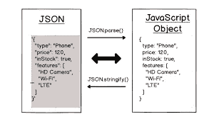

# 快速技巧:如何在 JavaScript 中遍历 JSON 响应

> 原文：<https://levelup.gitconnected.com/speedy-tip-how-to-loop-through-a-json-response-in-javascript-1963c9b728>

当从远处的工作人员那里获得信息时，工作人员的反应通常会出现在 JSON design 中。在这篇快速技巧文章中，我将展示如何利用 JavaScript 来解析工作人员的反应，以获得您需要的信息。



这个过程通常由两个步骤组成:将数据解码为原生结构(比如数组或对象)，然后使用 JavaScript 的一个内置方法遍历该数据结构。在本文中，我将使用大量可运行的示例来涵盖这两个步骤。

# JSON 是什么？

在我们研究如何处理 JSON 之前，让我们花一点时间来理解它是什么(以及它不是什么)。


JSON 代表“JavaScript 对象符号”。它是一种独立于语言、基于文本的格式，通常用于在 web 应用程序中传输数据。JSON 的灵感来自 JavaScript 对象文字符号，但两者之间存在差异。例如，在 JSON 中，键必须用双引号括起来，而在 object literals 中却不是这样。

## 在 JSON 中有两种存储数据的方式:

名称/值对的集合(也称为 JSON 对象)
值的有序列表(也称为 JSON 数组)
当从 web 服务器接收数据时，数据总是一个字符串，这意味着您的工作是将其转换成您可以使用的数据结构。

如果你想了解更多关于 JSON 的工作原理，请访问 JSON 网站。

## 从远程 API 获取 JSON

在下面的例子中，我们将使用奇妙的 icanhazdadjoke API。正如您在它的文档中所看到的，发出一个 GET 请求，其中 Accept 头设置为 application/JSON，将会看到 API 返回一个 JSON 有效负载。

让我们从一个简单的例子开始:

```
const xhr = new XMLHttpRequest();
xhr.onreadystatechange = () => {
  if (xhr.readyState === XMLHttpRequest.DONE) {
    console.log(typeof xhr.responseText);
    console.log(xhr.responseText);
  }
};
xhr.open('GET', 'https://icanhazdadjoke.com/', true);
xhr.setRequestHeader('Accept', 'application/json');
xhr.send(null);
```

`// string
// {"id":"daaUfibh","joke":"Why was the big cat disqualified from the race? Because it was a cheetah.","status":200}`

正如我们所看到的，服务器返回给我们一个字符串。我们需要将它解析成一个 JavaScript 对象，然后才能遍历它的属性。我们可以用 JSON.parse()做到这一点:

```
if (xhr.readyState === XMLHttpRequest.DONE) {
  const res = JSON.parse(xhr.responseText);
  console.log(res);
};// Object { id: "fiyPR7wPZDd", joke: "When does a joke become a dad joke? When it becomes apparent.", status: 200 }
```

一旦我们有了作为 JavaScript 对象的响应，就有很多方法可以用来遍历它。

使用一个 [for…in 循环](https://dev.to/fariharajput/speedy-tip-how-to-loop-through-a-json-response-in-javascript-6a1)
一个 for…in 循环遍历一个对象的所有可枚举属性:

```
const res = JSON.parse(xhr.responseText);for (const key in res){
  if(obj.hasOwnProperty(key)){
    console.log(`${key} : ${res[key]}`)
  }
}// id : H6Elb2LBdxc
// joke : What's blue and not very heavy?  Light blue.
// status : 200
```

请注意 for…of 循环将遍历整个原型链，所以这里我们使用 hasOwnProperty 来确保该属性属于我们的 res 对象。

使用 Object.entries、Object.values 或 Object.entries
上述方法的另一种方法是使用 Object.keys()、Object.values()或 Object.entries()之一。这些将返回一个数组，然后我们可以迭代。

让我们看看如何使用 Object.entries。这将返回我们传递给它的对象的键/值对的数组:

```
const res = JSON.parse(xhr.responseText);Object.entries(res).forEach((entry) => {
  const [key, value] = entry;
  console.log(`${key}: ${value}`);
});// id: SvzIBAQS0Dd 
// joke: What did the pirate say on his 80th birthday? Aye Matey!
// status: 200
```

注意 const [key，value]= entry；该语法是 ES2015 语言中引入的数组析构的一个示例。

这要简洁得多，避免了前面提到的原型问题，并且是我首选的遍历 JSON 响应的方法。

使用 Fetch API
虽然上面使用 XMLHttpRequest 对象的方法工作得很好，但它会很快变得难以处理。我们可以做得更好。