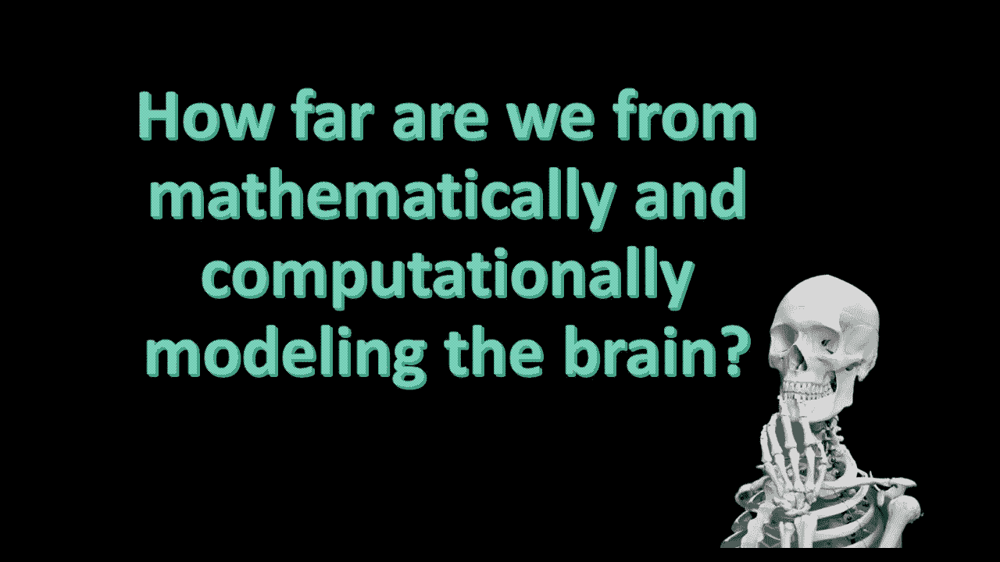
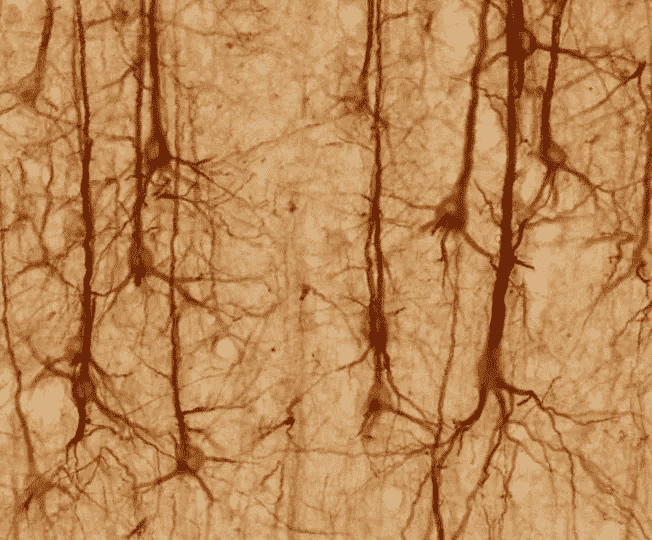
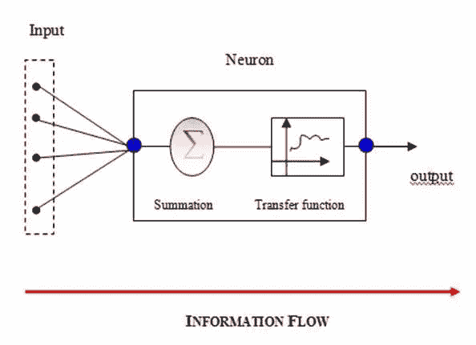
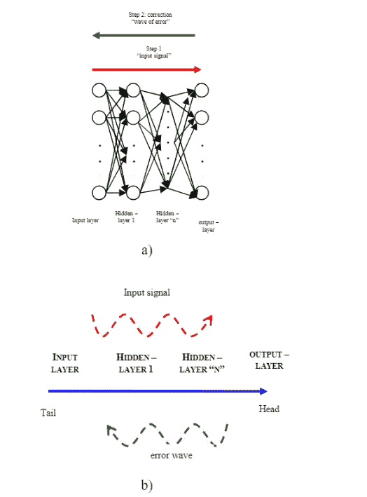
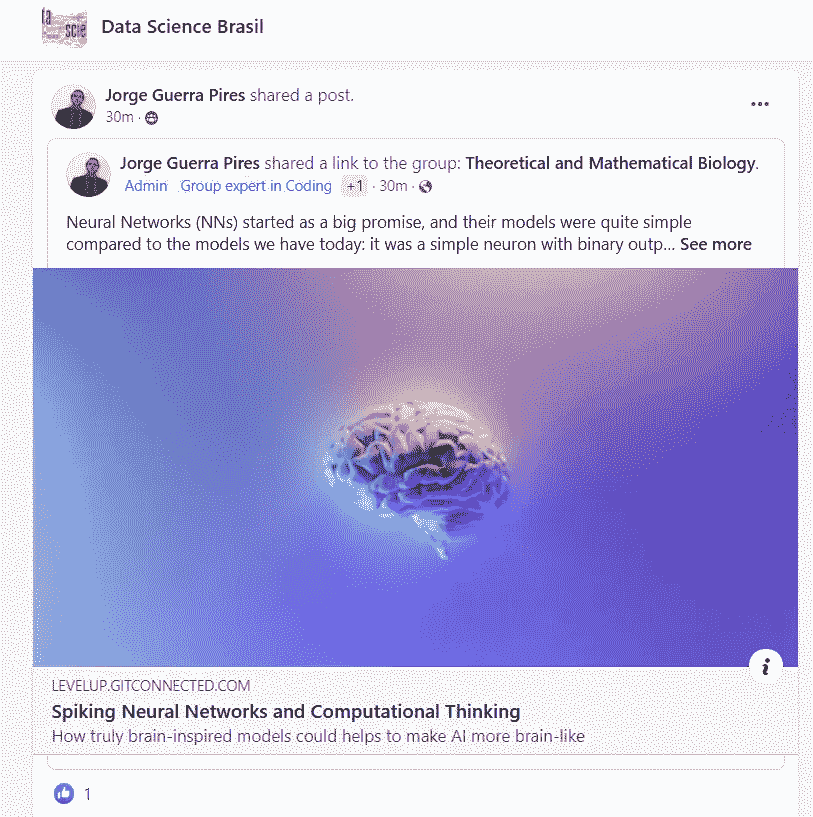
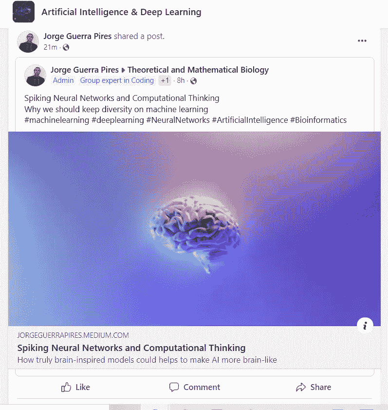

# 脉冲神经网络与计算思维

> 原文：<https://levelup.gitconnected.com/spiking-neural-networks-and-computational-thinking-8e9d03a7481c>

米拉德·法库里安在 [Unsplash](https://unsplash.com?utm_source=medium&utm_medium=referral) 上拍摄的照片

从我们记事起，人类就对大脑着迷。最初，就像在科学的主要领域一样，人类的大脑只是基于推测；甚至应用了一些理论，但结果都不好。20 世纪对几个科学领域来说相当重要(例如，最后，随着爱因斯坦关于布朗运动的论文，原子被证明是真实的和可测量的)；这意味着神经科学的进步。他们最终证明了神经元的存在。与原子、电子等等的故事非常相似，大脑现在是一组离散的细胞和元素，称为[神经元](https://en.wikipedia.org/wiki/Neuron)。

神经网络染色后的样子。想想一个隐形人，随便拿点颜料颜料扔 hm！😂😁😎这是动画片里的经典！

# 神经网络和被称为深度学习的后起之秀

*经许可转载*:皮雷，豪尔赫·格拉。我从 Medium 中选择的关于计算机编程的分析:Angular、JavaScript、机器学习、TensorFlow.js 等等！第一卷。(我在媒介上的写作)(第 74 页)。ediao do Kindle。

神经网络(NNs)一开始是一个很大的承诺，与我们今天的模型相比，它们的模型非常简单:它是一个简单的神经元，具有基于阈值的二进制输出；一方面，我们让神经科学的一些人在模型上看到对他们的生物现象的可能解释(即，计算机模拟)；另一方面，应用数学和计算机科学家正在寻找新的开箱即用的解决方案(例如，异或问题)。

照片由[马修·施瓦茨](https://unsplash.com/@cadop?utm_source=medium&utm_medium=referral)在 [Unsplash](https://unsplash.com?utm_source=medium&utm_medium=referral) 上拍摄

> 一方面，我们让神经科学的一些人在模型上看到对他们的生物现象的可能解释(即，计算机模拟)；另一方面，应用数学和计算机科学家正在寻找新的开箱即用的解决方案(例如，异或问题)。

一个通用神经模型。经 [Pires (2012)](https://www.researchgate.net/publication/281836484_On_the_Applicability_of_Computational_Intelligence_in_Transcription_Network_Modelling/figures) 许可复制。

据说，一位数学家证明了模型的局限性。然而，真正限制 NNs 应用的是我们无法分层训练神经元的事实，直到[反向传播算法](https://en.wikipedia.org/wiki/Backpropagation)，将 NNs 带到了聚光灯下；数据分割问题需要非常复杂的边界定义[34]。然而，另一个问题出现了:我们仍然不能训练几个隐藏层，更不用说当提供新的训练部分时，神经网络会忘记已经获得的知识:想象一下，每当你在大学学习一个新的学科时，你会完全忘记以前的学科，你永远不会完成大学！使用深度学习中使用的算法解决了训练几个层的问题，并且忘记先前训练的网络的问题也通过诸如迁移学习的技术来解决，最初的提议是自适应共振理论(ART)。

反向传播和误差波。经[许可复制 Pires (2012)](https://www.researchgate.net/publication/281836484_On_the_Applicability_of_Computational_Intelligence_in_Transcription_Network_Modelling/figures) 。

解释简单层神经网络和复杂层神经网络的区别。

# 结束语

照片由 [serjan midili](https://unsplash.com/es/@s_midili?utm_source=medium&utm_medium=referral) 在 [Unsplash](https://unsplash.com?utm_source=medium&utm_medium=referral) 拍摄

我不会剧透，但我们确实对我们即将出版的书进行了一些丰富的讨论。你可以和卡萨伯夫教授一起参加我们的现场直播！

> 我捍卫人工神经网络模型的多样性，即使深度学习做得很好。

 [## LinkedIn 上的 Jorge Guerra Pires:尖峰神经网络和计算思维

### 我捍卫人工神经网络模型的多样性，尽管深度学习做得很好…

www.linkedin.com](https://www.linkedin.com/posts/jorgeguerrapires_spiking-neural-networks-and-computational-activity-6935629174497787906-bKU5?utm_source=linkedin_share&utm_medium=member_desktop_web)  [## LinkedIn 上的 Jorge Guerra Pires:尖峰神经网络和计算思维

### 神经网络(NNs)开始是一个很大的承诺，与我们现有的模型相比，它们的模型非常简单…

www.linkedin.com](https://www.linkedin.com/posts/jorgeguerrapires_spiking-neural-networks-and-computational-activity-6931551291219267584-behC?utm_source=linkedin_share&utm_medium=member_desktop_web)  [## LinkedIn 上的理论和数学生物学:脉冲神经网络和计算…

### 脉冲神经网络和计算思维为什么我们应该保持机器学习的多样性#机器学习…

www.linkedin.com](https://www.linkedin.com/posts/theoretical-and-mathematical-biology_spiking-neural-networks-and-computational-activity-6931234910544216064-4kQ-?utm_source=linkedin_share&utm_medium=member_desktop_web) 

# 阅读建议

 [## 从简单的角度来看，这是一个抽象的概念

### 描述神经系统，但具体形式，神经系统的人工神经系统

www.academia.edu](https://www.academia.edu/18365339/Redes_Neurais_em_termos_simples_como_aprendemos_pensamos_e_modelamos) 

**论计算智能在转录网络建模中的适用性**

[https://www . research gate . net/publication/281836484 _ On _ availability _ of _ computing _ Intelligence _ in _ sport _ Network _ modeling](https://www.researchgate.net/publication/281836484_On_the_Applicability_of_Computational_Intelligence_in_Transcription_Network_Modelling)

*尖峰神经网络* (SNNs)出来的时候[1]，我想:这就是“事情”；2013 年，尼古拉·卡萨博夫(Nikola Kasabov)教授为我开设了第一门正式课程。深度学习在 2012 年开始增长，在 2018 年之前，在一个事件和我的博士后上从未听到过，当它变得对我来说很明显，深度学习接管了舞台，从尖峰神经网络再也没有听到过。*为什么？*他们没有死，因为卡萨博夫教授在 2019 年发布了一本新书。*计算思维，*亚马逊推出新书

在我的第一个博士后期间，我对环境如何变得对深度学习有害印象深刻。我担心的是，即使事情进展顺利，深度学习做得很好，特别是在“谷歌大脑”决定进入游戏之后，我们仍然必须保持多样性，我会说。

[1]尖峰神经元模型:单个神经元，群体，可塑性。这本书是我读的第一本书，但我受到了尼古拉·k·卡萨伯夫的影响，因为他在巴西做了一系列特别的讲座。他现在也有一本书:[时空、尖峰神经网络和大脑启发的人工智能](https://e2.udemymail.com/ls/click?upn=ZF3sOyS2SxEPIoSZT6Aoc2Ciser1e8lA9qDQ158NDkktMORH5Bqm8AgvCGWrtL0b525KUzKlR7HBUb-2BgG9lfm4su-2BIuEoG3GuZb0Vi50dBrbAQ0IgsW25g4yOPMlfGyuhMToQG73yc7HCUlJ5xpcPH0hzY3h9EerjNRawJ6Y8ca-2FaZJEMgtGfCC8tvF9NvsrrqO0PDK65DS0vXmrQr-2B5igBuRBboBcC1DhLbaOooumlXUctRuuDmipJ-2B7U1c7eOMfRThDnNKyUnx6SAoN0XK5Q6GHJJ8SGkvTzy4O02-2BXJ48JQwgpupH8Feb0xOWfrJPMBqH_YFGmhoEOW8-2FYdMy-2BQD-2BKBCWOgPlQjTekFf69-2F-2Fe6C6SkMY41kXi-2BMzaMjcf7J97LDVTs-2BP1cjKS8AnY62M2AuxRwn08h4g6gK57vYdo87rnW-2FG2SyDWUZ3eQJHRsiPCxrTrxrXgCQ7juuoYOFEiVeEdgvSGng6mZ2SjLXB3IaT8m0jPEP6NH-2F-2FdrReXXJvkF65rv2aXew33GKSLbcDfTOI9lP1Fq7T9-2FcKkLE5tJY921oz6QUpZEZRVLQcnL7juHizzm-2F-2FgYAh8RRfvjApV6SzEq42eSjCx4WnmeSEytSibQZJr-2BjHTfakTyFJjgFfsvrMIaRTLEi1dpb3GkOjOxS7MVAla-2BZEjosQ3LMmDxkvDHktUFX4zHnrK-2FM-2Bl0aG7LrvDRmxvWQf8Ux-2BbUnMFFoHsF9BbPu2bRDFWQSQ7RP-2BvEgwn9dLLy60MfQKi1LV-2ByzAwPPXGxPlmvW2oKRkjagg-3D-3D)