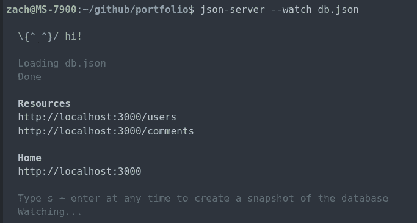
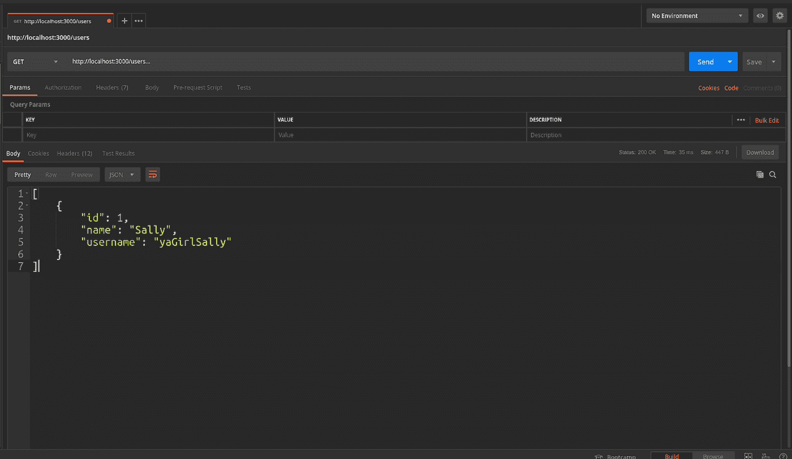
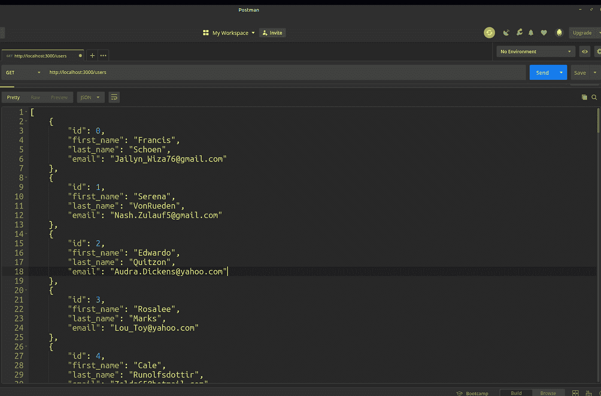
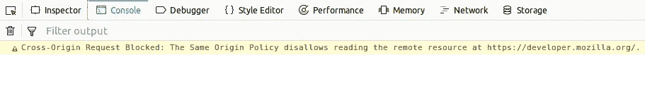

# 用 json-server 在 30 秒或更短的时间内构建一个 RESTful API

> 原文：<https://levelup.gitconnected.com/spin-up-a-restful-api-in-30-seconds-or-less-with-json-server-31bcf95ee32d>

## `json-server`简介

## 介绍

通常，当开发前端项目时，您需要从 REST API 中检索数据，并在前端提供数据，开始时，创建一个完整的 API 似乎有点多。要么您不知道如何创建这个 API，要么您的环境要求您首先构建前端。如果这听起来像你的情况，输入`[json-server](https://www.npmjs.com/package/json-server)`。

## json-server 是什么？

`json-server`是一个包，允许前端开发人员快速启动 REST API，而无需手动设置路由和模式。它只是工作。

## 如何集成 json-server？

像往常一样，我们需要将包添加到我们的项目中。您可以使用以下命令来完成此操作:

`yarn add json-server --dev`

**旁注**:官方文档要求全球安装`json-server`。我个人不喜欢全局安装软件包，除非绝对必要，因为有时不同的项目可能使用不同版本的软件包，全局安装很难跟踪软件包版本，特别是在与其他开发人员合作时。我没有注意到这个包的本地安装有任何负面影响。如果您想进行全局安装，可以使用以下命令:

`yarn global add json-server`

现在我们已经安装了`json-server`,我们必须告诉它我们想要使用什么数据。我们通过创建一个包含一些数据的 json 文件来做到这一点。为了简单起见，我将把我的文件命名为`db.json`，但是你可以随意命名你的文件。`db.json`的内部将被格式化成这样:

```
{
  "users": [{ "id": 1, "name": "Sally", "username": "yaGirlSally"}],
  "comments": [{ "id": 1, "body": "Heyo", "postId": 1 }]
}
```

在这个文件中，`users`和`comments`是路径名，花括号中的内容是这些路径的内容。现在我们已经有了数据，我们可以通过运行以下命令来启动我们的服务器(确保您在运行以下命令时位于`db.json`的相同目录中):

`json-server --watch db.json`

假设一切正常，您应该在控制台窗口中看到类似这样的内容(如果 json 文件不正常，`json-server`会提醒您):



如果我们在 http://[localhost:3000/users](http://localhost:3000/users)和[http://localhost:3000/comments](http://localhost:3000/comments)上发出 get 请求，我们应该会看到我们的数据:



不错！`json-server`还监视我们所做的文件更改，这意味着在编辑器中对 db.json 所做的任何更改都会自动触发服务器重新加载。这些现成的路由都支持 GET、HEAD、PUT、PATCH、POST、DELETE 和 OPTIONS 请求。一些重要的警告是:

*   POST、PUT 或 PATCH 请求应该在请求体中包含一个`Content-Type: application/json`头。否则，它将导致 200 OK，但不会对数据进行任何更改。
*   Id 值是不可变的。PUT 或 PATCH 请求正文中的任何 id 值都将被忽略。只有在 POST 请求中设置的值才会被考虑，但前提是该值尚未被另一个对象占用。

## 为服务器生成更多数据

以上步骤将让你开始运行，但`json-server`可以做得更多。`json-server`的一个很好的特性是能够用脚本随机生成数据。我们可以随机生成 10 个用户:

```
//simpleUserGen.jsmodule.exports = () => {
  const data = { users: [] };
  // Create 10 users
  for (let i = 0; i < 10; i++) {
    data.users.push({ id: i, name: `user${i}` });
  }
  return data;
};
```

编写完脚本后，我们可以使用以下命令运行它:

`json-server simpleUserGen.js`

这很好，但是在数据深度和唯一性方面有点乏味。在一个叫做 [faker](https://www.npmjs.com/package/faker) 的软件包的帮助下，我们可以做得更好。要安装 run:

`yarn add faker --dev`

安装后，我们可以创建一个文件，并在里面编写一个基本脚本，如下所示:

```
// userGen.js
const faker = require('faker');const genUsers = () => {
  const users = [];
  for (let i = 0; i < 10; i++) {
    const id = i;
    const firstName = faker.name.firstName();
    const lastName = faker.name.lastName();
    const email = faker.internet.email();
    users.push({
      id,
      first_name: firstName,
      last_name: lastName,
      email,
    });
  }
  return { users };
};
module.exports = genUsers;
```

这个脚本使用 [Faker.js](https://www.npmjs.com/package/faker) 方法生成 10 个随机用户。如果您想要更多的数据字段，Faker.js 支持许多方法，如地址、日期和电话号码。

然后我们运行:

`json-server userGen.js`

我们看到了所有的新数据:



这样做的唯一缺点是，如果没有一些中间件，我们无法将这些数据保存到文件中，这在这个 [Github 发布线程](https://github.com/typicode/json-server/issues/952)中被引用。保存这些数据的一个简单方法是在运行`json-server`时在控制台中键入 s + < Enter 键>来保存我们数据的快照，然后在使用新保存的 db 文件时重启`json-server`。

## 替代港口

另一个巧妙的特性是我们可以在其他端口上用`--port`标志启动`json-server`:

```
json-server --watch db.json --port 3003
```

## CORS 问题

有时当使用`json-server`或任何远程资源时，你的浏览器会发出这样的 CORS 警告:



为了解决这个问题，我们可以告诉`json-server`我们希望禁用 CORS 的这个标志:

`json-server --no-cors db.json`

**旁注**:不要禁用任何将向公众发布的 [CORS](https://developer.mozilla.org/en-US/docs/Web/HTTP/CORS) 。`json-server`不用于生产，在实施适当的解决方案之前，它只是一个占位符。

## 定义配置文件

此时你的选项标志列表可能会变得很长，幸运的是`json-server`允许我们在文件中定义选项来使用。你需要做的就是创建一个文件并定义我们的规则。类似这样的工作非常完美:

```
{
 “port”: 3000,
 “no-cors”: true
}
```

然后告诉`json-server`我们想要使用哪个配置文件:

`json-server -c settings.json db.json`

## 结论

`json-server`是一个很棒的包，可以作为 RESTful API 服务器的快速修复。它可以用我没有提到的更多配置选项来设置，但是可以在它写得很好的[文档](https://github.com/typicode/json-server)中读到。

如果您有任何问题、建议或其他任何事情，请随时发表评论！