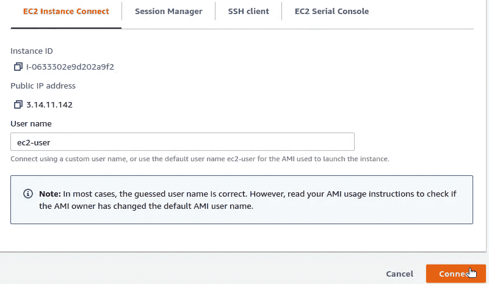

# 使用 EC2 在 AWS 上的容器中启动 Node.js 服务器

> 原文：<https://levelup.gitconnected.com/spinning-up-a-node-js-server-in-a-container-on-aws-with-ec2-2cf7f41f4aec>


[转换器](https://unsplash.com/@convertkit?utm_source=unsplash&utm_medium=referral&utm_content=creditCopyText)在[去飞溅](https://unsplash.com/?utm_source=unsplash&utm_medium=referral&utm_content=creditCopyText)上拍照

## 给未来自己的笔记

## 我需要这样做，我做了笔记。随便抄。

对于工作中的一个项目，我需要在 Docker 容器中运行 Node.js Express 服务器，然后将该容器部署到 AWS 上的 EC2 实例。我一路上做着笔记，因为我确信有一天我还需要做类似的事情。然后，我想——既然我做了笔记——我不妨分享一下我的笔记。

您可以根据自己的需要概括我的用例。它不一定是 Node.js 服务器。它可以是您需要部署到 AWS EC2 的任何 Docker 容器映像，只要您知道您需要向外界公开容器上的哪个(哪些)端口。

你准备好开始了吗？开始了。

# 1.建立 Docker 形象

对于本文，我们将通过部署一个具有单个端点的基本 Node.js Express 服务器来保持简单。我初始化了 Node.js 项目，添加了`express`，然后写了下面的`index.js`文件:

```
const PORT = 8080;
const express = require('express');
const app = express();app.get('/', async (req, res, next) => {
  res.send('Hello world.');
});app.listen(PORT, () => {
  console.log(`Server is listening on port ${PORT}`);
});
```

注意，我的例子中的服务器正在监听端口`8080`。这是我的项目文件夹的样子:

```
$ tree -L 1
.
├── index.js
├── node_modules
├── package.json
└── yarn.lock1 directory, 3 files
```

为了将这个项目作为 Docker 容器进行部署，我们编写了一个`Dockerfile`，将其放在项目根文件夹中。

```
FROM node:14-alpineWORKDIR /usr/src/appCOPY package*.json /usr/src/app
RUN npm installCOPY . .EXPOSE 8080CMD ["node", "index.js"]
```

我的项目运行在节点`v14.16.0`上。你可以运行`node --version`确定你的版本，然后找到对应的[节点高山基图](https://hub.docker.com/_/node)。写好你的`Dockerfile`，建立图像。

```
$ docker build --file ./Dockerfile --tag my-node-server .
...
Successfully built a6df3f2bda72
Successfully tagged my-node-server:latest$ docker images
REPOSITORY        TAG         IMAGE ID       CREATED         SIZE
my-node-server    latest      a6df3f2bda72   2 minutes ago   123MB
```

您可以在本地机器上测试您的容器:

```
$ docker run -d -p 3000:8080 my-node-server:latest
c992be3580b1c27c81f6e2af54f9f49bf82f977df36d82c7af02c30e4c3b321d$ curl localhost:3000
Hello world.$ docker stop c992be3580
```

注意，我用`-p 3000:8080`运行了我的容器，这将我的容器(我的 Node.js 服务器正在监听的容器)上的端口`8080`暴露给我的本地机器上的端口`3000`。这允许我们向`localhost:3000`发送请求，并从我们的服务器获得响应。稍后，当我们在 AWS EC2 中运行时，我们将把容器上的端口`8080`公开给 EC2 实例上的端口`80`。

# 2.准备您的 AWS ECR 存储库

我们的 EC2 机器在运行之前需要获取我们的容器映像。为此，我们需要[将我们的容器映像推送到 AWS ECR](https://docs.aws.amazon.com/AmazonECR/latest/userguide/docker-push-ecr-image.html) 。但是在我们这样做之前，我们需要准备我们的存储库并设置访问。确保您已经安装了 [AWS CLI](https://aws.amazon.com/cli/) 。

# 创建 ECR 存储库

首先，在 AWS ECR 中，创建一个新的存储库。对于我们的 AWS 地区，我们将使用`us-east-2`(俄亥俄州)。


我们创建一个名为`my-node-server`的**私有**存储库，保留所有剩余的默认设置。


很快，我们将需要使用`docker login`来访问我们的存储库并推送我们的容器映像。要登录，我们需要一个注册中心的认证令牌。确保您已经[创建了一个具有编程访问权限的 IAM 用户](https://docs.aws.amazon.com/IAM/latest/UserGuide/id_users_create.html#id_users_create_console)，并且您已经运行了`aws configure`来使用该 IAM 用户的凭证。

# 创建 IAM 策略以允许`ecr:GetAuthorizationToken`

您的 IAM 用户需要获得`ecr:GetAuthorizationToken`的许可。在“AWS IAM 策略”页面上，使用以下 JSON 创建新策略:

```
{
    "Version": "2012-10-17",
    "Statement": [
        {
            "Sid": "VisualEditor0",
            "Effect": "Allow",
            "Action": "ecr:GetAuthorizationToken",
            "Resource": "*"
        }
    ]
}
```

为新策略提供一个名称(例如:`ecr-get-authorization-token`)。将策略附加到您的 IAM 用户。

# 创建 IAM 策略以允许上传到您的 ECR 存储库

您的 IAM 用户还需要将容器图像上传到您的 ECR 存储库的权限。使用下面的 JSON 创建另一个 IAM 策略，确保将`Resource`设置为您的存储库的 ARN。

```
{
    "Version": "2012-10-17",
    "Statement": [
        {
            "Sid": "VisualEditor0",
            "Effect": "Allow",
            "Action": [
                "ecr:BatchCheckLayerAvailability",
                "ecr:BatchGetImage",
                "ecr:CompleteLayerUpload",
                "ecr:DescribeImages",
                "ecr:DescribeRepositories",
                "ecr:GetDownloadUrlForLayer",
                "ecr:GetRepositoryPolicy",
                "ecr:InitiateLayerUpload",
                "ecr:ListImages",
                "ecr:PutImage",
                "ecr:UploadLayerPart"
            ],
            "Resource": "arn:aws:ecr:us-east-2:1539********:repository/my-node-server"
        }
    ]
}
```

为您的新策略提供一个名称(例如:`ecr-upload-to-my-node-server-repo`)，并将该策略附加到您的 IAM 用户。

# 3.将容器图像推送到 AWS ECR

现在，我们准备将我们的容器映像提升到 AWS ECR。

# 标记您的本地容器图像

我们创建的容器图像被标记为`my-node-server:latest`。我们需要用我们的 ECR 注册中心、存储库和(可选的)图像标记名来标记该图像。为此，您将需要上面创建的 ECR 存储库的 URI。

```
$ docker tag my-node-server:latest \
  1539********.dkr.ecr.us-east-2.amazonaws.com/my-node-server:latest$ docker images
REPOSITORY                                                   TAG     IMAGE ID    
1539********.dkr.ecr.us-east-2.amazonaws.com/my-node-server  latest  a6df3f2bda72
my-node-server                                               latest  a6df3f2bda72
```

当然，你的库 URI 会有你的 AWS 账户 ID 和区域。

# 登录到您的容器注册表

当您的 IAM 用户被授权给`ecr:GetAuthorizationToken`时，您可以获得令牌并通过`docker login`命令使用它。确保您获取授权令牌的区域与您尝试登录的区域相同。

```
$ aws ecr get-login-password --region us-east-2 | docker login \
  --username AWS \
  --password-stdin 1539********.dkr.ecr.us-east-2.amazonaws.com...
Login Succeeded
```

# 将您的集装箱推到 AWS ECR

现在我们已经登录了，我们可以将我们的容器推送到我们的注册表中。

```
$ docker push 1539********.dkr.ecr.us-east-2.amazonaws.com/my-node-server:latest
The push refers to repository [1539********.dkr.ecr.us-east-2.amazonaws.com/my-node-server]
7ac6ec3e6477: Pushed 
f56ccac17bd2: Pushed 
91b00ce18dd1: Pushed 
58b7b5e46ecb: Pushed
0f9a2482a558: Pushed
8a5d6c9c178c: Pushed 
124a9240d0af: Pushed 
e2eb06d8af82: Pushed 
latest: digest: sha256:9aa81957bd5a74b3fc9ab5da82c7894014f6823a2b1e61cd837362107dc062e5 size: 1993
```

我们的 Node.js 服务器的容器映像现在位于 AWS ECR！

困难的部分已经完成了。现在，我们可以加速我们的 EC2 实例。

# 4.启动 EC2 实例

转到 EC2 主页，确保您使用的是与前面步骤相同的地区(`us-east-2`)。点击“启动实例”

我们将推出一个“符合免费层条件”的 Amazon Linux 2 AMI 实例。选择 64 位(x86)版本，然后单击“选择”


为了在这次学习体验中停留在免费层，我们将选择`t2.micro`实例类型。然后，我们将跳到“配置安全组”页面。


对于 EC2 实例的安全组，我们将创建一个新的安全组，并提供名称和描述。我们的 EC2 将需要允许 SSH (TCP 在端口`22`)和 HTTP 访问(TCP 在端口`80`)。AWS 可能会警告您，您可能希望将流量限制在 IP 地址的白名单中。对于生产级部署，您可能需要考虑采取比我们在这里所做的演示更安全的措施。


点击“查看并启动”，然后点击“启动”

您将看到一个对话框，用于为对 EC2 实例的 SSH 访问创建新的密钥对。选择“创建新的密钥对”，选择“RSA”作为密钥对类型，然后给密钥对命名。然后，点击“下载密钥对”


将下载的私钥文件存储在安全的地方。然后，单击“启动实例”

您的 EC2 实例可能需要几分钟才能启动。

# 5.连接到 EC2 来安装和运行 Docker

一旦我们的 EC2 实例运行，我们将设置它来运行我们的 Docker 容器。

# 连接到您的 EC2 实例

在 EC2 instances 页面上，选择您刚刚启动的实例，然后点击“Connect”这里有使用您刚刚下载的私有密钥的 SSH 客户端的说明。您还可以在 AWS 控制台中使用 EC2 实例连接选项。点击“连接”



这将在您的浏览器中打开一个新的选项卡，您将拥有一个浏览器内终端，可以通过命令行访问您的 EC2 实例。


# 安装并启动 Docker

在 EC2 终端中，运行以下命令将 Docker 安装到您实例中:

```
[ec2-user@ip-172-31-38-144 ~]$ sudo yum update -y
...
No packages marked for update

[ec2-user@ip-172-31-38-144 ~]$ sudo amazon-linux-extras install docker
...
Installed size: 285 M
Is this ok [y/d/N]: y
...[ec2-user@ip-172-31-38-144 ~]$ sudo service docker start

[ec2-user@ip-172-31-38-144 ~]$ sudo chmod 666 /var/run/docker.sock
```

# 运行`aws configure`设置 IAM 用户凭证

在 EC2 命令行中，您将需要运行`aws configure`，使用与您在本地机器上相同的 IAM 用户凭证，以便您可以运行类似的 AWS CLI 命令。

```
[ec2-user@ip-172-31-38-144 ~]$ aws configure
AWS Access Key ID [None]: AKIA****************
AWS Secret Access Key [None]: z8e*********************************
Default region name [None]: us-east-2
Default output format [None]: json
```

# 登录到您的容器注册表

就像我们将我们的映像从本地机器推送到 ECR 时所做的那样，我们需要登录到我们的注册中心(从我们的 EC2 中)，以便我们可以提取我们的映像。

```
[ec2-user@ip-172-31-38-144 ~]$ $ aws ecr get-login-password --region us-east-2 | docker login \
  --username AWS \
  --password-stdin 1539********.dkr.ecr.us-east-2.amazonaws.com...
Login Succeeded
```

# 下拉容器图像

现在我们已经登录，我们拉下我们的容器图像。

```
[ec2-user@ip-172-31-38-144 ~]$ docker pull 1539********.dkr.ecr.us-east-2.amazonaws.com/my-node-server:latest
latest: Pulling from my-node-server
a0d0a0d46f8b: Pull complete 
4684278ccdc1: Pull complete 
cb39e3b315fc: Pull complete 
90bb485869f4: Pull complete 
32c992dbb44a: Pull complete 
4d7fffd328bd: Pull complete 
562d102dfc97: Pull complete 
d7de8aedebed: Pull complete 
Digest: sha256:9aa81957bd5a74b3fc9ab5da82c7894014f6823a2b1e61cd837362107dc062e5
Status: Downloaded newer image for 1539********.dkr.ecr.us-east-2.amazonaws.com/my-node-server:latest
1539********.dkr.ecr.us-east-2.amazonaws.com/my-node-server:latest
```

# 运行 Docker

有了我们的容器映像，我们可以用 Docker 运行它。记住，我们希望将容器上的端口`8080`公开给 EC2 实例上的端口`80`(这个端口对 HTTP 访问开放)。

```
[ec2-user@ip-172-31-38-144 ~]$ docker run -t -i -d \
-p 80:8080 1539********.dkr.ecr.us-east-2.amazonaws.com/my-node-server 8cb7c337b9d5f39ea18a60a69f5e1d2d968f586b06f599abfada34f3fff420c1
```

# 6.使用 HTTP 请求进行测试

我们已经设置并连接了所有的部分。最后，我们可以测试对服务器的访问。注意，我们只设置了 EC2 实例和网络来响应 HTTP(不是 HTTPS)请求。**我们将在以后的文章中介绍 HTTPS 和自定义域的附加配置。**

为了测试我们的设置，我们只需要向 EC2 实例的公共 IPv4 地址(或者公共 IPv4 DNS 地址，这是一个别名)发出 curl 请求。

```
$ curl http://3.14.11.142
Hello world.$ curl http://ec2-3-14-11-142.us-east-2.compute.amazonaws.com
Hello world.
```

注意，我们没有在请求中指定端口，这意味着我们对 HTTP 请求使用默认端口(`80`)。当我们用 docker run 启动容器时，我们将 EC2 实例上的端口`80`与容器上的开放端口`8080`相关联。我们还设置了安全组来允许来自端口`80`的流量。

# 结论

在 AWS EC2 中启动一个基本服务器并作为一个容器运行可能感觉很复杂。诚然，这需要很多步骤，但它们都很简单。您自己的用例可能有所不同(服务器实现、容器需求、要公开的端口)，但是过程仍然会非常相似。在我们的[后续文章](/adding-a-custom-domain-and-ssl-to-aws-ec2-a2eca296facd)中，我们将通过设置一个自定义域并通过 SSL/HTTPS 访问我们的服务器来更进一步。