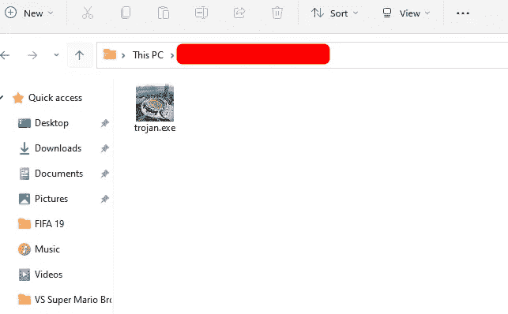
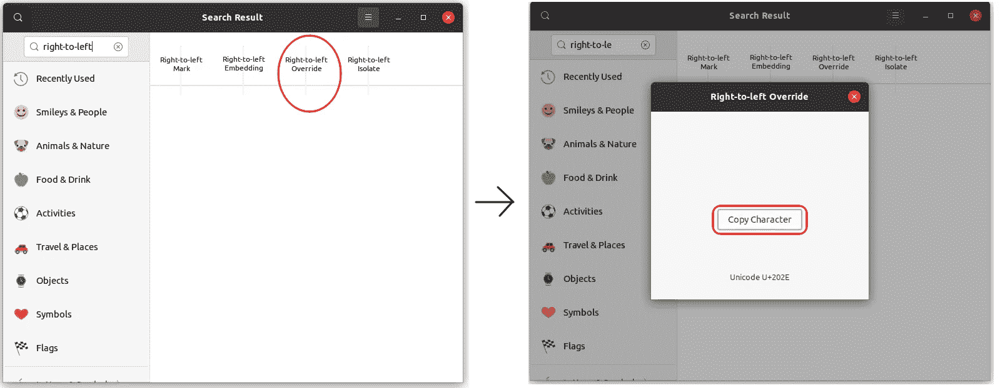
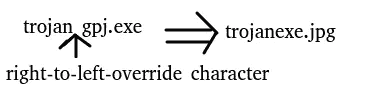
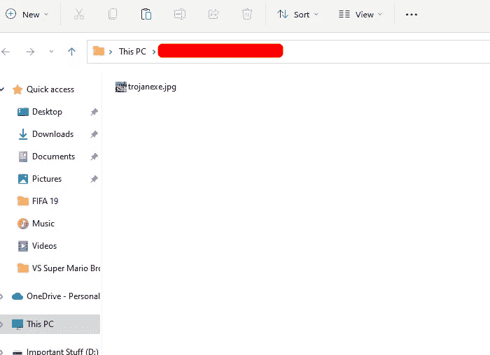
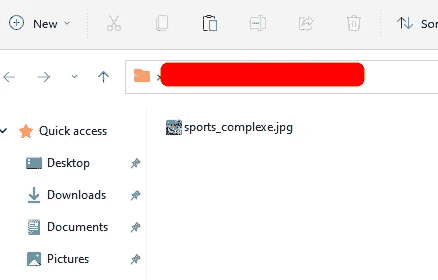

# 欺骗文件扩展名—道德黑客

> 原文：<https://levelup.gitconnected.com/spoofing-file-extensions-ethical-hacking-bd128189738b>

创建特洛伊木马时，文件扩展名欺骗是一个方便的技巧。在这篇博客中，我将恶搞一下**。exe'** 扩展为**'。jpg'** 扩展名。但是这个方法可以扩展到欺骗任何扩展类型。

我有一个名为`trojan.exe`的文件，在这篇博客的结尾，我将把它的名字改为`sports_complexe.jpg`。

我会用一个`right-to-left-override`人物来恶搞扩展`.exe`，换成`.jpg`。让我告诉你怎么做。

当前文件名-->`trojan.exe`

期望的扩展名-> `.jpg`

**为了从扩展名中删除** `**.exe**` **，我将使用一个** `**right-to-left-override**` **字符使文件名在** `**right-to-left-override**` **放置后从右向左读取。**

从右到左的`.jpg`应该是`gpj.`

要获得从右到左覆盖字符，在 Ubuntu 中打开`characters`应用程序，搜索从右到左覆盖字符。您可以按照下图所示的步骤进行操作。

将`trojan.exe`重命名为`trojangpj.exe`。在特洛伊木马后的第 7 个位置粘贴从右到左覆盖字符。在`right-to-left-override`字符之后的所有字符将被翻转，即**从右向左**阅读。

文件名现在看起来像`trojanexe.jpg`

为了使可执行文件看起来更真实，由于文件中包含的图像图标是一个体育场馆，我将把名称中的`trojan`替换为`sports_compl`，这样文件名就变成了`sports_complexe.jpg`

**还有 tada！，**文件扩展名欺骗成功。一些最新的浏览器在下载前取消了从右到左的覆盖。所以压缩文件并发送过来是个好主意。

> 这里邀请您探索我们的博客平台**。一个让您了解软件开发和技术领域最新发展的一站式平台。我们在 [**的极客头脑**](https://www.thegeekyminds.com/) 旨在写一些你实际上可以用来提高工作效率和充实你的职业生活的内容。**
> 
> **邀请您在[**https://thegeekyminds.com**](https://thegeekyminds.com/)通过我们的平台。并订阅我们的时事通讯，以便在我们每次发布新帖子时收到电子邮件。我们承诺不会向您的收件箱发送垃圾邮件。点击下面的按钮订阅我们的时事通讯**

****