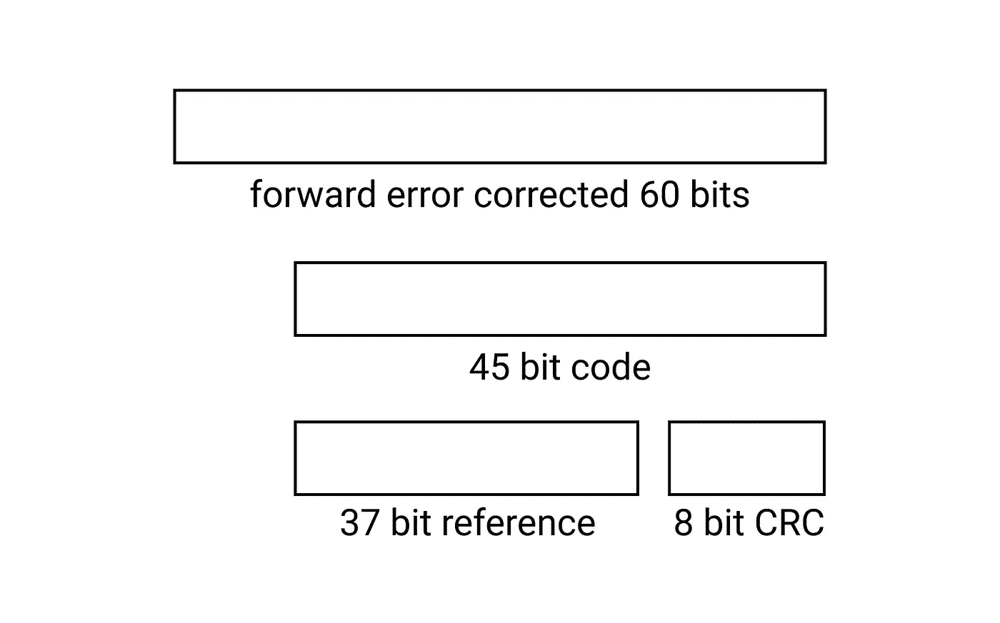

# Spotify 代码及其工作原理

> 原文：<https://levelup.gitconnected.com/spotify-codes-and-how-they-work-664f4e4b8489>

Spotify 为每首歌曲、专辑、艺术家和播放列表创建唯一的条形码和专辑封面图像。用户可以使用这些可扫描的代码来快速分享或访问 Spotify 中的内容。但我更感兴趣的是这些代码是如何工作的，Spotify 会不会用光其媒体内容的“唯一”代码？


通往地狱之路的 Spotify 代码

典型的 Spotify 代码包含 23 个小节，每个代码都以 Spotify 徽标开始。根据 Spotify Codes 网站的说法，Spotify 代码需要在前面有 Spotify 标志，这样扫描仪才能读取它们。这意味着 Spotify 标志有助于识别图像中具有机器可读代码的区域。

代码还定义了开始和结束标记，以定义代码的开始和结束。扫描方法识别该起点和终点、它们之间的轴以及指示最大偏移的参考标记。对于可能的长度值，偏移量除以步长，在本例中为 7。代码中的每个条的长度是从轴点到条的光学标记的末端测量的，四舍五入到最接近的步长。因此，该算法可以将该条的长度转换成相应的*格雷码。*

## 格雷码

[格雷码](https://www.tutorialspoint.com/what-is-gray-code)是二进制数字系统的排序，使得两个连续值仅相差一位。


八种可能长度的格雷码编码

但是为什么使用格雷码而不是二进制编码呢？在读取机器可读代码时，可能会出现错误。该代码可以测量距离 3 和 4 之间的光条。只有一位是不确定的；编码位可以是 010 或 110(格雷码代表 3 和 4)。如果我们使用二进制编码，所有三位都是不确定的(可能的位是 011 或 100)。*因此，每个测量的距离生成 3 个比特，其中一个比特可能具有小于 100%的确定性。*

让我们来看看“通往地狱的高速公路”Spotify 代码，并将条形转换为格雷码，好吗？


首先，我们需要对我们的图像进行一些图像增强，以使结果更适合于进一步的分析。我们将使用 [Skimage](https://scikit-image.org/) 加载图像，将其转换为灰度，然后转换为二进制。

接下来，我们需要检测图像中的条形。首先，我们需要标记图像，然后使用 [regionprops](https://scikit-image.org/docs/dev/api/skimage.measure.html#skimage.measure.regionprops) 测量标记图像区域的属性。维度的每个元素都是一个元组，表示(最小行，最小列，最大行，最大列)。

我们需要最大高度作为参考来计算所有条的步长。

[标签](https://scikit-image.org/docs/dev/api/skimage.measure.html#skimage.measure.label)返回 dtype int 的 ndarray。我们需要保留标签的顺序。因此，我们需要按 min_col 对维度进行排序。

光学棒的步长可以在 0 和 7 之间变化；因此，可能有八个可能的值。正如我之前提到的，第一个和最后一个小节作为开始和结束标记，而中间的小节是其他小节的参考。

该顺序为我们提供了图像中每个条形的步长。

```
[0, 5, 3, 2, 4, 6, 3, 3, 4, 2, 1, 7, 5, 4, 3, 6, 4, 7, 7, 6, 4, 2, 0]
```

让我们想象一下。


这是我实现这一点的代码。

根据 [Spotify 的专利](https://data.epo.org/publication-server/pdf-document/EP18199246NWA1.pdf?PN=EP3444755%20EP%203444755&iDocId=5852402&iepatch=.pdf) *，除了起止标记的固定长度和参考标记，每段距离编码 3 位*。所以总共有 60 位。

```
110010011110101010010110011001110110010101110100100101110011
```

比特被打乱以分散错误。在码字中，丢失的比特不是连续的，而是不连续的。当丢失了整个条/距离时，这提高了前向纠错的机会。

## 解码

然后发送新的有序比特进行解码。该专利表明，他们可能使用卷积码进行前向纠错(FEC)和维特比解码器，该解码器对前向纠错码进行最大似然解码，提取纠错后的 45 位(37 位用于媒体参考，8 位用于校验和)。

我们不会深入研究解码的算法。



校验和得到验证，37 位参考被发送到服务器。

创建媒体引用时，可能已经在服务器上分配了一个随机数，并存储在链接媒体 URI 的表中。例如，歌曲或播放列表。然后，服务器将相应的媒体返回给扫描图像的设备。

生成媒体引用、将其转换为 Spotify 代码、然后读取这些代码以提取媒体引用的整个过程相当复杂。不过，我喜欢让代码看起来像声波的想法。

## Spotify 会用完这些独特的代码吗？

答案是否定的。如果你看看 Spotify 的媒体 URI，它遵循以下格式。

```
spotify:<type of media>:<media reference>
spotify:track:3Dv1eDb0MEgF93GpLXlucZ
```

媒体引用是由字母和数字 a-z、A-Z 以及 0–9(26+26+10 = 62)组成的 22 个字符

可能的组合总数是 62 = 2.7078036478026614e+39(很多)。可以说，Spotify 不会很快用完它。

## 谷歌的现货代码

Google pay 有一个对每个用户都是独一无二的现货代码。Spot Code 是一种谷歌品牌的视觉代码，其工作原理类似于 QR 码，但它是 Google Pay India 独有的。你可以分享和扫描一个点代码来找到一个对等点或一个点。


这些代码比标准的二维码或条形码领先一步。它展示了图像处理带来的创造力的范围。Spotify 的专利有足够的洞察力来理解这一切背后的基本处理过程，尽管我在谷歌的 spot 代码中找不到同样的东西。

这篇文章花了很长时间来写，主要是因为我没有图像处理的经验，但是 [Skimage](https://scikit-image.org/docs/stable/) 有足够的演示和教程来开始。如果你有任何问题或反馈，请在评论中告诉我。如果你觉得它有帮助，请与他人分享！

*查看这篇由* [*彼得·布恩*](https://boonepeter.github.io/posts/2020-11-10-spotify-codes/) *撰写的文章，获得关于 Spotify 代码工作的更多见解。*