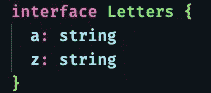
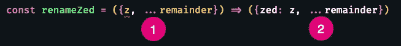
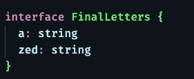
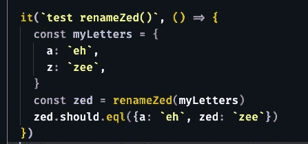
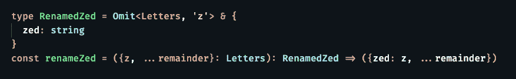

# 在 TypeScript 中扩展、保留和重命名属性

> 原文：<https://levelup.gitconnected.com/spreading-resting-and-renaming-properties-in-typescript-68fb35ffb1f>

## [JavaScript 和类型脚本提示](https://gentille.us/typescript-tips-b74925485b78?sk=4c9067cf57be6406abc26e44cb7fb872)

当您需要一个与现有对象关系密切的新对象，但一个或多个属性名必须更改时。

我是在休息还是散开？

我第一次看到这个技巧是在 Joel Thoms 的这篇出色的文章中。那篇文章收集了一些技巧。我只想专注于这一技术，并提供一个更有力的解释。

# **现实世界的需求**

虽然我的示例代码非常精简，但这种技术确实源于现实世界的需要。我们编写了一个 API 调用来返回我们想要从一些现有对象中构造的单个对象。我们遇到的问题是，其中一个对象的一个顽固的属性需要被重命名。

对于此讨论，假设我们有一个符合以下接口的对象:

对象的接口

我们需要一个名为`zed` 的属性，而不是名为`z`的属性，我们可以使用这个简单的粗箭头函数来实现:

两个看起来一样的不同运算符

这一行代码包含了许多术语，所以让我们从头到尾看一遍。我们正在定义一个名为`renameZed`的函数，它只接受一个对象参数。参数使用“去结构化”将该参数分成两部分。第一个非结构化项目是从对象剥离属性`z`。第二个非结构化项使用“rest”操作符①将剩余的属性放入一个名为 remainder 的对象中。*我总是发现“rest”这个名字在这里令人困惑，因为它与首字母缩写 rest 和动词“REST”同音异义。我使用了变量名称 remainder 来更清楚地说明“rest”的意思是“其余的东西”。*

在粗箭头之后，我们需要一组括号，因为我们没有使用“return”关键字和括号。我们用一对大括号开始返回对象，并将第一个属性指定为`zed.`，原始对象的`z`属性值被赋给`zed`。接下来，使用“spread”运算符②从原始对象添加回所有剩余的属性。我们得到了我们想要的符合这个接口的对象:

所需最终对象的接口

这段代码的测试可能如下所示:

重命名()函数的单元测试

现在唯一缺少的是类型。虽然我可以像上面显示的那样创建接口`FinalLetters`，但是这个例子比一个典型的对象要简单得多，即使在创建类型的时候，我也希望尽可能的简洁。

为我们的最终对象创建一个名为 RenamedZed 的类型

这里我创建了类型`RenamedZed`，并指定它拥有除了`z`属性之外的`Letters`接口的所有属性。类型脚本实用程序 `[Omit](https://www.typescriptlang.org/docs/handbook/utility-types.html#omittype-keys)`完成了这项工作。然后我用`use &`将`Letters’`属性的子集与我的新`zed`属性组合起来，形成一个[交集类型](https://www.typescriptlang.org/docs/handbook/unions-and-intersections.html#intersection-types)。*如果你对为什么这是交集类型而不是并集类型感到困惑，* [*这篇文章*](https://medium.com/@Methrat0n/union-types-and-intersection-types-50c41c9b61d6) *可能会有所帮助。我的建议是多关注一下`&`操作符将两组属性组合在一起的事实，稍后再考虑集合论语义。*

如果你发现你不仅需要重命名属性，还需要删除一个或多个属性，t [他的故事现在有了第二章。](https://tod-gentille.medium.com/eliding-properties-in-typescript-b170cd83ee09)

*本文显示的代码是 GitHub* *中可用的* [*。*](https://github.com/Rolias/blog-posts/blob/b779109c183cb4dc7fcdf86d2bdc8434808c9174/src/spread-rename/spread-rename.test.ts#L1-L23)

还有更多 [JavaScript 和 Typescript 技巧文章](https://gentille.us/typescript-tips-b74925485b78?sk=4c9067cf57be6406abc26e44cb7fb872)。

平静地编码。