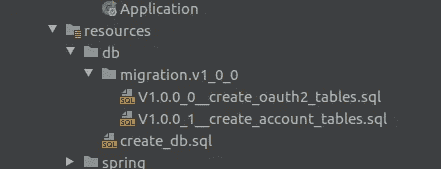
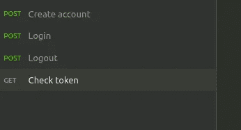

# Spring Boot 2 + OAuth2 集成，适用于独立或微服务

> 原文：<https://levelup.gitconnected.com/spring-boot-2-oauth2-integration-for-standalone-or-micro-services-use-31f56b907cb7>


照片由来自 Pexels 的 ahmad syahrir 拍摄

## 在这篇文章中，我将尝试展示 Spring Boot 2 和 OAuth2 的简洁集成。

在这个简单而全面的示例/教程中，我将尝试提供伟大的 Spring Boot 2 与 OAuth2 规范的清晰集成。幸运的是，Spring 为我们做了艰苦的工作，并慷慨地提供了所有的强制库。唯一困难的部分，是把所有的东西放在一起，让它们绝对和谐地工作。这篇文章的目的是创建一个服务，它可以在独立模式下使用，也可以在微服务架构中与其他服务协作使用。这个例子的源代码，可以在 github 上找到。在这篇文章的末尾找到链接。

我的意图是保持整个实现尽可能的干净，这样每个开发人员都可以根据他们的需要定制它。简单地说，这是一个完全可用的示例，几乎可以在您的基础设施中使用。我假设您已经了解 OAuth2 规范的主要组件和术语，因为它们将在整个示例中使用。想要快速或完全恢复精神，请访问此[链接](https://tools.ietf.org/html/rfc6749)。

为了完成本教程，我们将使用一些在软件开发方面广泛使用的工具。找到下面的完整列表。Spring Boot 和 *OAuth2* 虽然不包括在内。

*   专家
*   一种数据库系统
*   冬眠
*   春天安全
*   春季数据
*   候鸟迁徙所经的路径

所以，让我们开始吧！

# 配置

现在让我们继续，收集所有合适的库。每个部分都给出了关键部分的简要说明，但是您可以在网上搜索进一步的说明。

## POM 配置

首先，我们需要适当地配置我们的 POM，并包括所有的依赖项，如下所示。

```
 <dependencies>
        <dependency>
            <groupId>org.springframework.boot</groupId>
            <artifactId>spring-boot-starter-web</artifactId>
        </dependency>
        <dependency>
            <groupId>org.springframework.cloud</groupId>
            <artifactId>spring-cloud-starter-oauth2</artifactId>
        </dependency>
        <dependency>
            <groupId>org.springframework.boot</groupId>
            <artifactId>spring-boot-starter-jdbc</artifactId>
        </dependency>
        <dependency>
            <groupId>org.springframework.boot</groupId>
            <artifactId>spring-boot-starter-data-jpa</artifactId>
        </dependency>in your projects or in y

        <dependency>
            <groupId>org.postgresql</groupId>
            <artifactId>postgresql</artifactId>
        </dependency>
        <dependency>
            <groupId>org.apache.commons</groupId>
            <artifactId>commons-dbcp2</artifactId>
        </dependency>
        <dependency>
            <groupId>org.apache.commons</groupId>
            <artifactId>commons-pool2</artifactId>
        </dependency>
        <dependency>
            <groupId>org.flywaydb</groupId>
            <artifactId>flyway-core</artifactId>
        </dependency>

        <dependency>
            <groupId>org.modelmapper</groupId>
            <artifactId>modelmapper</artifactId>
            <version>2.3.5</version>
        </dependency>
    </dependencies>
```

如上所示，我们将需要几个 Spring Boot 和云依赖项。除此之外，我们还包含了依赖关系，使我们能够与`PostgreSQL`数据库进行交互。

## 弹簧配置

首先，我们需要告诉 Spring 扫描所有基于注释的类的包，以便它们可以被注入。默认情况下，Spring Boot 将扫描所有软件包从根开始，所以，这是一个很好的方法，如果我们想减少扫描的范围。除此之外，我们还设置了存储库对象的路径。在接下来的章节中会有更多关于`repository`类的内容。

```
<context:component-scan base-package="com.petroskovatsis.examples.springboot2andoauth2"/><jpa:repositories base-package="com.petroskovatsis.examples.springboot2andoauth2.repository"/>
```

接下来，我们需要配置数据源，并将其适当地分配给 Hibernate 实体管理器。注意我们是如何在`packagesToScan`属性中设置要被`Hibernate`扫描的域对象的路径的。

```
<bean id="dataSource" class="org.apache.commons.dbcp2.BasicDataSource" destroy-method="close"
      p:driverClassName="${settings.jdbc.driverClassName}"
      p:url="${settings.jdbc.url}"
      p:username="${settings.jdbc.username}"
      p:password="${settings.jdbc.password}"
      p:initialSize="${settings.jdbc.initial_size}"
      p:maxTotal="${settings.jdbc.max_total}"
      p:maxIdle="${settings.jdbc.max_idle}"
      p:minIdle="${settings.jdbc.min_idle}"
      p:testOnBorrow="true"
      p:validationQuery="select 1"/>

<bean id="entityManagerFactory" class="org.springframework.orm.jpa.LocalContainerEntityManagerFactoryBean">
    <property name="dataSource" ref="dataSource"/>
    <property name="packagesToScan">
        <list>
            <value>com.petroskovatsis.examples.springboot2andoauth2.domain</value>
        </list>
    </property>
    <property name="jpaVendorAdapter">
        <bean class="org.springframework.orm.jpa.vendor.HibernateJpaVendorAdapter" />
    </property>
    <property name="jpaProperties">
        <props>
            <prop key="hibernate.dialect">${settings.hibernate.dialect}</prop>
            <prop key="hibernate.show_sql">${settings.hibernate.show_sql}</prop>
            <prop key="hibernate.format_sql">${settings.hibernate.format_sql}</prop>
        </props>
    </property>
</bean>
```

所有的`settings.*`值都存在于`resources`文件夹下的`application.properties`文件中。这是默认的文件夹路径，Spring Boot 使用它来读取和加载任何启动和初始信息。

## 安全配置

最后，我们完成了令人兴奋的安全部分的配置阶段。

请记住，这是一个`all-in-one`实现。这意味着，我们的服务将充当`authentication`和`authorization`服务器以及`resource`服务器。另一种可能更好的设计是，我们可以将这个服务单独作为授权和认证服务器，并将所有的帐户操作转移到另一个服务中。为了简单起见，我们将它们组合在一起，以展示一个端到端的示例。

第一步。介绍一下`WebSecurityConfig`类。我们相应地注释这个类，并扩展 Spring 配置类，如下所示。这里重要的是，我们利用了一些在春天已经到位的好东西，比如`AuthenticationManager`。

```
@EnableWebSecurity
public class WebSecurityConfig extends WebSecurityConfigurerAdapter {
    @Bean
    @Override
    public AuthenticationManager authenticationManagerBean() throws Exception {
        return super.authenticationManagerBean();
    }
```

第二步。介绍一下`AuthorizationServerConfig`类。我们使用`@EnableAuthorizationServer`注释来表示这是一个授权服务器，让 Spring 发挥它的魔力。

```
@Configuration
@EnableAuthorizationServer
public class AuthorizationServerConfig extends AuthorizationServerConfigurerAdapter {
...
```

这里重要的是，我们需要适当地添加可用的客户端。请注意，设置了一组非常简单的范围，只是为了帮助我们完成这个示例。

```
@Override
public void configure(ClientDetailsServiceConfigurer clients) throws Exception {
    clients.inMemory()
            .withClient(stargateClientId)
            .authorizedGrantTypes("password", "refresh_token")
            .scopes("Create", "Read", "Update", "Delete", "Auth:Logout")
            .accessTokenValiditySeconds(36000)
            .refreshTokenValiditySeconds(86400);
}
```

第三步。介绍一下`ResourceServerConfig`。这里也一样，我们需要通过添加`@EnableResourceServer`注释告诉 Spring 这也是一个资源服务器。

```
@Configuration
@EnableResourceServer
@EnableGlobalMethodSecurity(prePostEnabled = true)
public class ResourceServerConfig extends ResourceServerConfigurerAdapter {
```

另一个关键部分是配置端点的安全性和权限。我们将需要允许`/oauth/token`和`/account`以便我们能够登录并创建一个帐户。所有其他请求都应该受到保护，除非您提供正确的令牌。

```
@Override
public void configure(HttpSecurity http) throws Exception {
    http.authorizeRequests()
            .antMatchers(HttpMethod.*POST*, "/oauth/token", "/account").permitAll()
            .anyRequest().authenticated();
}
```

# 履行

现在，让我们继续进行实现部分。这里不需要批判性的和广泛的业务逻辑。在大多数情况下，认证过程应该简单明了。这就是我们在这里试图实现的目标。关于授权过程，我们不需要担心，因为 Spring 为我们完成了所有困难的部分。你还记得我们在配置部分使用的`@EnableAuthorizationServer`吗？:)

## 域对象

我们将只需要一个简单的`Account`实体，使我们能够登录并获得有效的访问令牌。这是一个非常非常简单的实现，只需要一个用户名和一个密码。根据您的需求相应地扩展它！

```
@Entity
@Table(name = "ACCOUNT")
public class Account {

    @Id
    @GeneratedValue(strategy = GenerationType.*IDENTITY*)
    @Column(name = "account_id")
    private Long id;

    @Column(name = "username")
    private String username;

    @Column(name = "password")
    private String password;

    @ElementCollection(targetClass = Role.class, fetch = FetchType.*LAZY*)
    @CollectionTable(name = "ACCOUNT_ROLE", joinColumns = {@JoinColumn(name = "account_id")})
    @Enumerated(EnumType.*STRING*)
    @Column(name = "account_role")
    private Set<Role> roles;
```

## 存储库类

对于 repository 类，我们添加了适当的`@Repository`注释并扩展了包含在 Spring Data JPA 库中的`JpaRepository`类。这个类的扩展，附带了准备好使用的方法，并成功地与数据库交互。

```
@Repository
public interface AccountRepository extends JpaRepository<Account, Long> {

    Optional<Account> findByUsername(String username);
}
```

## 控制器类

为了公开我们的端点，应该放置适当的控制器类。下面是处理账户创建请求的`AccountController`的简要概述。

```
@RestController
@RequestMapping("/account")
public class AccountControllerImpl implements AccountController {

    @Override
    @RequestMapping(method = RequestMethod.*POST*, consumes = MediaType.*APPLICATION_JSON_VALUE*, produces = MediaType.*APPLICATION_JSON_VALUE*)
    public ResponseEntity<AccountDto> handleCreateRequest(@RequestBody AccountCreateRequest request) {
        AccountDto response = accountService.createAccount(request);
        return new ResponseEntity(response, HttpStatus.*CREATED*);
    }
}
```

## 飞行路线脚本

最后但同样重要的是，我们需要在默认文件夹中包含`Flyway`脚本。简言之，Flyway 所做的就是按顺序运行所有这些数据库脚本，并应用这些更改。每个脚本中都添加了一个版本和一个简单的描述。因此，随着项目的成熟，可能会添加新的脚本来扩展功能。如需进一步研究和阅读，请访问此[链接](https://flywaydb.org)。



创建数据库表的 Flyway 脚本

关于实现，差不多就是这些了。在源代码中，可以在 github 上找到，存在所有上述的类和成功运行服务的必需组件。

# 运行并测试服务

是的，我们坚持到了最后！现在是运行和测试服务的时候了。

## 运行数据库

您将需要一个启动并运行的数据库。对于这个例子，我们使用了一个 PostrgeSQL 实例。点击此处查看更多[信息](https://www.postgresql.org)。如果您熟悉`Docker`，那么您可以获取并运行适当的映像，而无需本地安装。

在示例中，我们使用默认的用户名和密码来连接数据库，因此如果您打算使用不同的用户名和密码，您也应该相应地更新`application.properties`文件。

## 构建并运行服务

因为我们使用 maven 来打包和构建整个应用程序，所以一行简单的代码就足够了。

```
mvn clean install
```

目标文件夹将被创建，jar 将位于其中。我们现在所要做的就是从如下所示的命令行或者从我们最喜欢的 ide 中运行应用程序。

```
java -jar target/spring-boot-2-and-oauth2-1.0.0.jar
```

瞧！

您的服务应该已经启动并运行，可以通过端口 8080 访问。

## 失眠测试

现在，让我们检查端点。在`utils`文件夹里有一个失眠 json 文件。失眠是一个休息客户端，可以从[这里](https://insomnia.rest/)下载。现在，您可以导入 json 文件，得到如下内容:



测试失眠的终点

继续测试所有这些端点！

我希望这对您的项目和您对这些组件如何协同工作的总体理解有一点帮助。欢迎随时联系我进行任何技术交流！

哦，你可以从 [github](https://github.com/pkovatsis/spring-boot-2-and-oauth2) 克隆这个项目。

干杯！