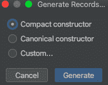

# Spring Boot 和爪哇 16 项记录

> 原文：<https://levelup.gitconnected.com/spring-boot-and-java-16-records-3b3356345ac8>

## 在本文中，我们将讨论 Java 16 的最新特性——记录。然后，我们将应用这些知识，并将其与 Spring Boot 应用程序结合使用。


简·kopřiva 在 [Unsplash](https://unsplash.com?utm_source=medium&utm_medium=referral) 上的照片

## 介绍

2021 年 3 月 16 日 Java 16 was。在这个新版本中，添加了大量令人兴奋的新功能。查看[发布说明](https://jdk.java.net/16/release-notes)以了解更多关于这些变化的细节。这篇文章的焦点是 Java 记录，它是由 [JEP 395](https://openjdk.java.net/jeps/395) 提供的。记录首次在 JDK 14 中引入，作为由 JEP 359 提出的预览功能，在 JDK 15 中，它们在 JEP 384 中保持预览。然而，随着 JDK 16，记录不再是预览。

根据 Java 冠军 Mala Gupta 的 Twitter 投票，我选择记录是因为它们绝对是 Java 16 中最受欢迎的新增特性。

关于最受欢迎的 Java 16 特性的 Twitter 投票

我也进行了一次类似的调查，但是它主要针对 Java 8 以后的特性。这个结果并不出人意料，因为 Java 8 仍然被广泛使用。然而，非常不幸的是，大量的新特性和改进被添加到了新的 Java 版本中。但是就特性而言，从开发者的角度来看，Java 8 绝对是游戏规则的改变者。

关于 Java 8 以后最受欢迎的特性的 Twitter 投票

想了解更多 Java 和技术相关的东西，请关注我的推特

所以我们来讨论一下 Java 记录有什么大惊小怪的。

# 什么是记录？

根据 JEP 395:

> *记录是 Java 语言中一种新的类。它们充当不可变数据的透明载体，比普通类更简单。记录可以被认为是名义上的元组。*

《JEP》的另一段引文清楚地解释了开发人员在编写典型的数据载体类时的沮丧。

> 正确地编写这样一个数据载体类需要大量低价值、重复、易错的代码:构造函数、访问器、equals、hashCode、toString 等等。例如，一个携带 x 和 y 坐标的类不可避免地会这样结束:

我们开发人员最常使用的另一个选项是将样板文件的处理留给 IDE。例如，使用 Intellij，您可以生成构造函数、getters、setters、equals、hashCode 和 toString 等。，只需按 Command + N 快捷键。但是样板代码仍然存在。


用 IntelliJ 自动生成代码

对于 Java 16 记录，它只是一行代码。很酷，不是吗？

`record Point(int x, int y) { }`

这里，记录类声明由名称、可选的类型参数、头部和主体组成。

# 揭秘记录

Java record 类的内部可以使用 IntelliJ IDE 附带的反编译器来检查，也可以使用`javap`命令行实用程序。为了理解内部机制，我们创建了下面的记录类。

```
public record State(String name, String capital) {}
```

下面是反编译的 Java 记录类。我已经使用了`javap`命令行工具来检查类文件内部。

```
$ javap State.class
```

以下是输出。

```
Compiled from "State.java"
public final class com.example.indianstates.State extends java.lang.Record {
  public com.example.indianstates.State(java.lang.String, java.lang.String);
  public final java.lang.String toString();
  public final int hashCode();
  public final boolean equals(java.lang.Object);
  public java.lang.String name();
  public java.lang.String capital();
}
```

您可以从上面的输出中得出以下结论。

1.  状态记录类是对`java.lang.Record`抽象类的扩展。
2.  State record 类被声明为 final，不能使用 extends 关键字进一步扩展。
3.  hashCode()、equals()、toString()和一个规范的构造函数是为我们隐式生成的。
4.  没有 setters 或 getters，只有 accessors。
5.  在类声明中没有 setters 和 final，表明您不能更改状态，因此记录是不可变的。

您还可以通过编写测试来进一步验证这些观点。

与普通类相比，记录类的声明有一些限制。查看 [JEP 395](https://openjdk.java.net/jeps/395) 这样的限制。

# 龙目岛和记录，朋友还是敌人？。

您可能已经在使用 [Lombok](https://projectlombok.org/) 注释，比如@ [Value](https://projectlombok.org/features/Value) ，这是最接近 Java 记录的注释。然后你可以摆脱一个依赖和那些注释的圣诞树。我可能把事情过于简化了，在某些情况下用 Lombok 代替可能是有意义的。但是您可能会将 Lombok 用于其他功能，而不仅仅是它提供的一个注释。相信我，虽然 Java 记录是 Java 爱好者欢迎的特性，但它不会取代 Lombok，至少现在不会。你不相信我？看看 Brain Goetz 在 StackOverflow 上的这个[回答](https://stackoverflow.com/a/61325018/1472027)。

并且要小心你添加到项目中的依赖项，因为作为依赖项一部分的问题也会成为你的问题。

# Spring Boot 和爪哇记录

从版本 2.5.0-M1 开始，Spring Boot 为 Java 16 提供了初步的[支持](https://github.com/spring-projects/spring-boot/wiki/Spring-Boot-2.5.0-M1-Release-Notes#java-16-support)。我有一个工作的 Spring Boot 应用程序，我将用它来演示 Java 记录。源代码可在[这里](https://github.com/yrashish/indian-states/tree/develop)获得。这是一个简单的 Spring Boot 应用程序，当通过/states 或/state 访问时。name=statename REST endpoint 显示所有或特定的印度各州及其首府。该应用程序使用内存中的 H2 数据库，该数据库在应用程序的开头插入行。

和往常一样，您可以使用 [start.spring.io](http://start.spring.io) 为您的 Spring Boot 应用程序生成存根，并且如前所述，确保您选择了 2.5.x 里程碑版本。

下面是 REST 控制器类的样子。

我们可以关注 getAllStates()方法，它返回状态记录类对象的列表。我们已经看到了国家记录类。这一点没有改变。

```
public record State(String name, String capital) {}
```

下面是由`StateService`类实现的`StateRepository`接口。

`StateService`是使用`Controller`类的构造函数自动连接的。它有一个名为 findAll()的方法，该方法使用 Spring JdbcTemplate 进行查询，并从内存中的 H2 数据库返回一个`State`记录类列表。如您所见，我们已经使用了`RowMapper`函数接口，JdbcTemplate 使用它来逐行映射 ResultSet 的行，并且它返回当前行的 row 对象。我们还使用了`new`关键字来初始化记录类，这意味着我们可以像普通的 Java 类一样初始化记录类。我还使用了 Java 15 [文本块](https://openjdk.java.net/jeps/378)特性，这有助于提高 SQL 查询 JSON 字符串值的可读性。

然而，当我开始在这个应用程序中使用记录时，出现了一些问题。之前我使用了`BeanPropertyRowMapper,`，当我禁用 Lombok 并使用 Records 代替`State`类时，导致了下面的异常。

```
2021-03-19 02:01:55.434 ERROR 66059 --- [nio-8080-exec-1] o.a.c.c.C.[.[.[/].[dispatcherServlet] : Servlet.service() for servlet [dispatcherServlet] in context with path [] threw exception [Request processing failed; nested exception is org.springframework.beans.BeanInstantiationException: Failed to instantiate [com.example.indianstates.State]: No default constructor found; nested exception is java.lang.NoSuchMethodException: com.example.indianstates.State.<init>()] with root cause
```

从异常和`BeanPropertyRowMapper` [文档](https://docs.spring.io/spring-framework/docs/current/javadoc-api/org/springframework/jdbc/core/BeanPropertyRowMapper.html)中，很明显我们必须在`State` records 类中声明一个默认或无参数构造函数，这导致了一些关于 Java 中 records 类的有趣发现。为了解决这个错误，我天真地给`State`记录类添加了一个无参数构造函数。

```
public record State(String name, String capital) { 
public State() {} 
}
```

但是，这导致了以下编译错误。

> *非规范记录构造函数必须委托给另一个构造函数*

为了解决这个编译问题，我添加了下面的构造函数，但这会使响应的值。

```
public record State(String name, String capital) {
    public State() {
        this(null,null);
    }
}
```

然后，我借助 IntelliJ 特性为这个记录类生成构造函数。它为我提供了以下选择。



通用记录构造函数

我尝试了这些选项，但得到了相同的结果。我已经知道这些选项不起作用，但我试了试我的运气，这让我想知道如何使用记录与`BeanPropertyRowMapper.`我现在没有答案，但我会进一步挖掘。如果你看到任何问题的代码或有更好的答案，然后让我知道。

更新:-我把这些例外张贴到 Spring Boot·吉特聊天，得到了这个答案。

> *BeanPropertyRowMapper 不能与记录一起使用，因为它包括用其无参数构造函数创建一个 Java Bean 实例，然后调用其 setters 来填充该 Bean。但是记录没有无参数构造函数，并且是不可变的，因此没有设置器。所以，要么使用传统的 Java Bean，要么使用记录，但不要使用 BeanPropertyRowMapper。*

很公平。所以很明显`BeanPropertyRowMapper`不能和记录一起使用。现在已经结束了。快乐编码。

## 结论

在本文中，您已经了解到记录是不可变的数据载体类，它减少了我们习惯编写的大量样板代码。然后我们查看了 Record 类的内部，发现 hashCode()、equals()、toString()和构造函数是由编译器隐式生成的。然后我们了解到，你不应该真的用 Lombok 这样的外部库来比较或替换记录，因为两者是针对不同事物的不同工具。

在上一节中，我们发现记录适用于从数据库(或一些外部服务)获取数据的情况，例如 Spring Boot 应用程序。我们在使用`BeanPropertyRowMapper,`时也发现了一些问题，并得出结论，我们不能将它与记录一起使用。

## 请支持我

如果你喜欢你刚刚读到的，那么你可以点击下图中的链接给我买杯咖啡:

[](https://www.buymeacoffee.com/meashish)