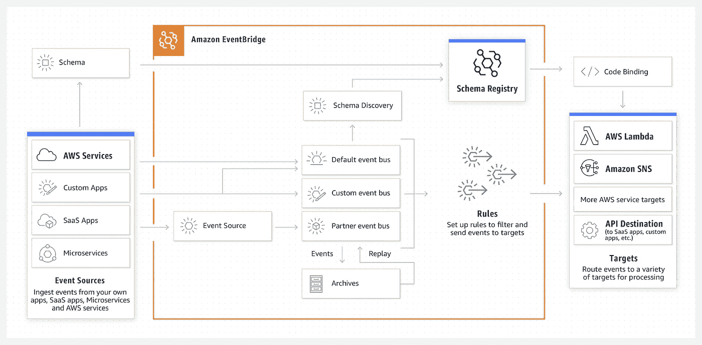
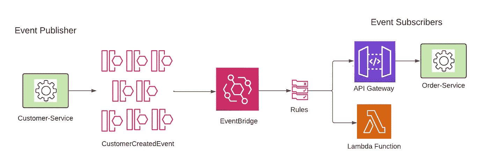
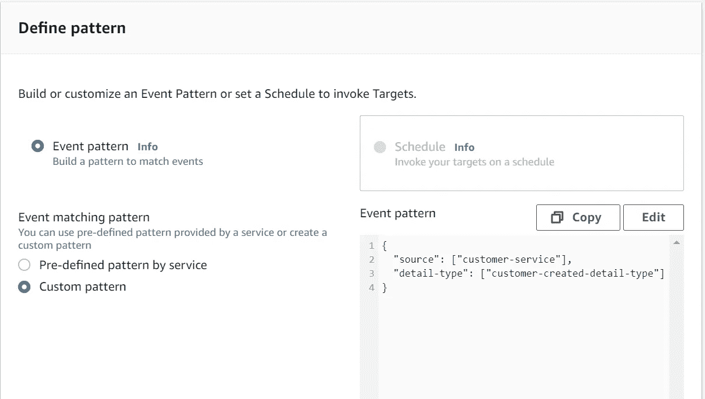
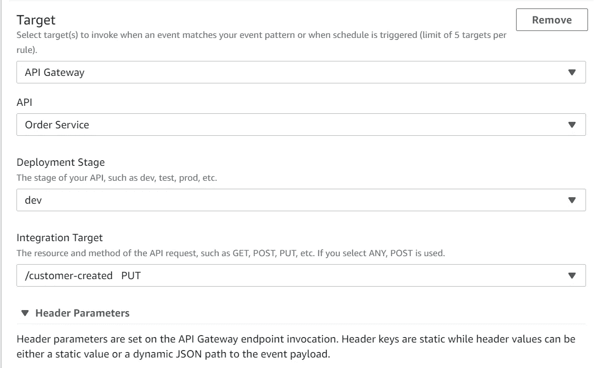
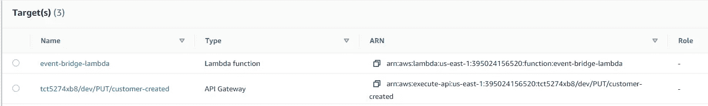

# 使用 AWS EventBridge 的 Spring Boot 事件驱动编程

> 原文：<https://levelup.gitconnected.com/spring-boot-event-driven-programming-with-aws-eventbridge-aa0d8d65f8a8>

图片由 [12019](https://pixabay.com/users/12019-12019/) 来自 [Pixabay](https://pixabay.com/photos/brooklyn-bridge-river-illuminated-1791001/)

AWS EventBridge 是一种无服务器事件总线，使用从您的应用程序、集成的软件即服务(SaaS)应用程序和 AWS 服务生成的事件，可以更轻松地构建大规模事件驱动的应用程序。EventBridge 使用预定义的事件模式，并允许您设置路由规则来确定将数据发送到何处，以构建应用程序架构，该架构通过完全分离的事件发布者和使用者对数据源做出实时反应。

图片来源:[https://aws.amazon.com/eventbridge/](https://aws.amazon.com/eventbridge/)

EventBridge 的一些主要优势包括:

*   处理 AWS 事件、授权 SaaS 合作伙伴事件或自定义事件
*   跨帐户或跨应用程序集成
*   邮件过滤
*   消息转换
*   内置分布式可用性和容错
*   事件存档和重放
*   大量的目标 AWS 服务(尽管您仍然可以通过 API 网关路由或 Lambda 函数调用向外部服务发送事件)
*   用于检查事件结构的模式注册表
*   基于模式定义自动生成代码的代码绑定，加速开发！
*   具有内置的 IAM 支持，可以跨客户工作。轻松实现帐户对帐户的事件共享。

在本文中，我们将探讨在两个 Spring Boot 微服务之间使用 AWS EventBridge 进行发布/订阅所需的步骤。

# 高层架构

作者图表

事件发布者是 Customer-Service，它将 CustomerCreatedEvent 发布到 EventBridge。我们在订户端定义了两个目标，一个 API 网关指向使用 CustomerCreatedEvent 的 Order-Service，另一个目标是一个 Lambda 函数，用于打印事件的详细信息，这仅仅是为了演示我们可以在订户端定义多个目标。

# 步骤 1:发布者端的实现

首先，在 pom 中添加以下依赖项:

在发布者端，我们需要实现下面的代码片段来调用 AmazonEventBridgeClient 将事件放到 EventBridge 的事件总线上。

**提供 AWS 凭证**

默认情况下，AWS SDK 将尝试从以下位置查找 AWS 凭据:

1.  Java 系统属性:`aws.accessKeyId`和`aws.secretAccessKey`。
2.  环境变量:`AWS_ACCESS_KEY_ID`和`AWS_SECRET_ACCESS_KEY`。
3.  默认的凭证配置文件:`~/.aws/credentials`。
4.  Amazon ECS 容器凭证，如果设置了环境变量`AWS_CONTAINER_CREDENTIALS_RELATIVE_URI`，则从 Amazon ECS 加载。
5.  实例配置文件凭证，在 Amazon EC2 实例上使用，通过 Amazon EC2 元数据服务交付。

出于简化演示的目的，让我们通过`application.yml,` 指定凭证，这也是自动识别的:

# 步骤 2:在订户端实现

2020 年 7 月，AWS 宣布在 Amazon EventBridge 中支持 Amazon API Gateway 作为事件目标。这个特性为 web 应用程序和服务提供了新的集成场景。在本例中，我们将通过 API Gateway 公开我们的订户端点，而 API Gateway 又由 EventBridge 作为事件目标触发。

为了使订阅者应用程序能够监听事件总线，我们首先在 pom 中添加以下依赖项，就像我们对发布者应用程序所做的那样:

然后，我们创建一个事件类，根据 EventBridge AWS 事件模式定义属性(我希望这个类属于`aws-java-sdk-eventbridge`依赖项，但是没有)。这个事件类充当订户端点的输入，它的`detail` 属性保存从事件总线传递过来的实际事件的有效负载。

有了事件类，我们现在可以在客户端的`SubscriberController`中实现我们的逻辑，公开端点`consumeCustomerCreatedEvent`:

# 第三步。目标的 API 网关配置

现在让我们通过 API Gateway 公开我们的订阅者应用程序。一旦在 AWS 中部署了订阅者应用程序，比如 EC2，定义其部署阶段，通过 API 网关公开其端点。

# 步骤 4: EventBridge 配置

现在让我们把这些点串起来。

*   **创建自定义事件总线**

访问 AWS 服务下的“Event bridge”→单击左侧导航菜单“Event bus”→单击“Create event bus”按钮创建事件总线，在本例中为“test-event-bus”。**确保该事件总线名称必须与步骤 1 中发布者应用程序上定义的名称相匹配。**

*   **创建自定义规则**

访问 AWS 服务下的“event bridge”→单击左侧导航菜单“Rules”→在下拉菜单中选择自定义事件总线，然后单击“Create rule”按钮创建新规则。

在“定义模式”部分，需要确保为发布者应用程序定义一个自定义模式，以便正确过滤要消费的事件。**注意“source”和“detail-type”需要与步骤 1 中发布者代码中定义的内容完全匹配，否则，事件将不会被传递到目标。**事件模式部分也是定义事件过滤规则的地方，比如说，如果我们只想处理姓“Smith”的事件，我们可以将`"detail":["lastName": "Smith"`添加到事件模式中。

在“选择目标”下，确保为指向我们的订户应用程序的 API 网关添加一个目标，指定其部署阶段、集成目标，请参见下面的示例:

**每条规则限制 5 个目标。**附加目标如 Lambda 函数可以添加到此规则中。这个例子定义了两个目标，一个 API Gateway，另一个 Lambda 只是打印事件细节，两个目标都按预期工作。

这两个使用 EventBridge 的微服务的源代码可以在我的 GitHub 资源库下找到:[https://github.com/wenqiglantz/spring-boot-aws-eventbridge](https://github.com/wenqiglantz/spring-boot-aws-eventbridge)。

编码快乐！手工制作快乐！

**参考文献:**

[https://aws.amazon.com/eventbridge/](https://aws.amazon.com/eventbridge/)

[事件驱动架构(Amazon.com)](https://aws.amazon.com/event-driven-architecture/)

[为无服务器选择合适的事件路由服务:EventBridge、SNS 或 SQS-lumi go](https://lumigo.io/blog/choosing-the-right-event-routing-on-aws-eventbridge-sns-or-sqs/)

[https://micro naut-projects . github . io/micro naut-AWS/latest/guide/](https://micronaut-projects.github.io/micronaut-aws/latest/guide/)

[https://docs . AWS . Amazon . com/event bridge/latest/user guide/e b-API-gateway-target . html](https://docs.aws.amazon.com/eventbridge/latest/userguide/eb-api-gateway-target.html)

[AWS EventBridge Java 示例 EventBridge Java 演示应用程序| EventBridge Lambda Java 演示— YouTube](https://www.youtube.com/watch?v=TEuuPFxyTKg)