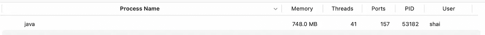

# Vlad Mihalcea 的 Spring Boot 表演工作坊

> 原文：<https://levelup.gitconnected.com/spring-boot-performance-workshop-with-vlad-mihalcea-e886bbb4e4ad>

几周前，我们和 Vlad Mihalcea 一起举办了一个研讨会，大家可以在下面看到。这很有趣，我希望很快再次这样做！

在本次研讨会中，我们重点讨论了 Spring Boot 性能，但最重要的是 Hibernate 性能，这是生产环境中的一个常见问题。这尤其难以跟踪，因为在本地调试时，与数据相关的问题通常难以察觉。当我们有大规模的“真实世界”数据时，它们会突然膨胀并成为主要问题。

在这篇文章的开始，我将概述演讲中的许多亮点，最后回答一些我们错过的问题。我们计划做这个演讲的第二部分，因为有太多的事情我们从来没有谈到过！

# show-sql 的问题是

简短的介绍之后，我们直接进入了问题。开发人员在配置文件中启用`spring.jpa.show-sql`设置是很常见的。通过将此项设置为 true，我们将看到 Hibernate 执行的所有 SQL 语句都打印在控制台上。这对于调试性能问题非常有帮助，因为我们可以确切地看到数据库中发生了什么。

但是它不记录 SQL 查询。它打印在控制台上！

# 我们为什么要使用记录器？

这引发了观众的疑问:为什么我们使用记录器而不使用`System.out`有关系？

聊天中的常见回答包括:

*   `System.out`速度慢–它有性能开销。但是伐木业也是如此
*   `System.out`阻塞——大多数日志实现都是如此，但是你可以使用异步日志记录器
*   无持久性—您可以将流程的输出重定向到文件

原因是记录器提供的细粒度控制和元数据。记录器让我们根据日志级别、包等过滤日志。

他们让我们使用像 MDC 这样的工具将元数据附加到请求上，这绝对令人惊奇。您还可以通过管道将日志传送到多个目的地，以 JSON 等可接收的格式输出它们，这样当您查看来自所有服务器的所有日志时，它们可以包含适当的元数据(例如在 Elastic 上)。

# Show-sql 只是系统输出

它不包括上下文。有可能它不会进入你的弹性输出，即使它进入了。你将没有上下文。无法判断查询是因为请求 X 还是 y 而被触发的。

这里的另一个问题是 SQL 中的问号。可以使用的环境非常有限。我们希望看到变量值，而不是问题。

# 使用 Lightrun 添加日志

Lightrun 允许您在不更改源代码的情况下向生产应用程序添加新日志。我们只需打开 Hibernate 文件“Loader.java”并向`executeQueryStatement`添加一个新日志。

我们可以在提示我们的对话框中填写日志语句。注意，我们可以使用花括号来编写 Java 表达式，例如变量名、方法调用等。

这些表达式在沙箱中执行，**保证**它们不会影响应用程序的状态。沙盒**保证**只读状态！

单击“确定”后，我们可以看到日志出现在 IDE 中。请注意，代码没有发生变化，但是这将如同您在该行中编写了一个 logger 语句一样。因此日志将与其他日志集成在一起。

请注意，我们打印了语句和参数，因此日志输出将包含我们需要的所有内容。你可能会担心这对 CPU 的负担太重，你是对的。Lightrun 会检测 CPU 的过度使用，并暂时暂停昂贵的操作，以控制执行时间。这可以防止您意外执行过于昂贵的操作。

您可以看到日志被打印出来，完整的内容放在最上面，但是为了防止 CPU 开销而被挂起。这意味着在调查性能问题时，您不会遇到性能问题…

您仍然可以看到查询，以及发送到数据库服务器的值。

# 原木管道

[Lightrun 的](https://lightrun.com/)日志功能的最大好处之一是它能够与代码中编写的其他日志语句集成。当您查看日志文件时，Lightrun 添加的语句将与用代码编写的日志语句“按顺序”出现。

就好像你写了语句，重新编译，上传了新版本。但这并不是你在所有情况下都想要的。

如果有很多人在处理源代码，并且您想要调查一个问题，那么日志记录可能是一个问题。您可能不想让您的“调试打印”污染主日志文件。这就是我们使用日志管道的情况。

日志管道让我们决定日志的去向。我们可以选择通过管道将日志发送到插件，在这种情况下，日志不会与其他应用程序日志一起出现。这样，开发人员可以跟踪问题，而不会污染日志的神圣性。

# Spring Boot 连接收购

理想情况下，我们应该在最后一刻建立关系数据库连接。您应该尽快释放它以增加数据库吞吐量。在 JDBC，默认情况下，事务是自动提交的，这与 Spring Boot 的 JPA 事务不兼容。

不幸的是，我们正处于一个先有鸡还是先有蛋的问题。Spring Boot 需要禁用自动提交。为此，它需要一个数据库连接。因此，它需要连接到数据库，以便关闭这个本来应该关闭的标志。

这可能会严重影响性能和吞吐量，因为一些请求可能会在等待来自池的数据库连接时被阻塞。

如果打印出这个日志，我们的自动提交配置就有问题。一旦我们知道剩下的就很容易了。我们需要添加这两个字段来禁用自动提交，并告诉 Hibernate 我们禁用了它。一旦这些都设置好了，性能应该会提高。

# 查询计划缓存

将 JPQL 编译成本地 SQL 代码需要时间。Hibernate 缓存结果以节省 CPU 时间。

在这种情况下，缓存未命中会对性能产生巨大影响，如下图所示:

这会严重影响查询执行时间和整个服务的响应时间。

Hibernate 有一个统计类来收集所有这些信息。我们可以用它来检测有问题的区域，在这种情况下，向类中添加一个快照。

# 快照

快照(也称为不间断断点或捕获)是一个不停止程序执行的断点。它包括堆栈跟踪、每个堆栈帧中的变量值等。然后，它在一个与 IDE 断点 UI 非常相似的 UI 中向我们展示这些细节。

我们可以通过单击堆栈帧来遍历源代码，并查看变量值。我们可以添加观察条目，最重要的是:我们可以创建条件快照(这也适用于日志和指标)。

条件快照允许我们仅在满足特定条件时触发快照。一个常见的问题是当系统中的一个 bug 只被一个特定的用户遇到时。我们可以使用条件快照来获取特定用户的堆栈信息。

# 渴望获取

当我们查看 SQL 查询的日志时，我们经常可以看到数据库获取的数据比我们最初要求的要多得多。这是因为 JPA 关系的默认设置是 EAGER。这是规范本身的问题。我们可以通过显式地将获取类型定义为 LAZY 来实现显著的性能提升。

我们可以通过在`DefaultLoadEventListener`的`loadFromDatasource()`方法中放置一个快照来检测这些问题。

在这种情况下，我们使用带有条件的条件快照:`event.isAssociationFetch()`。

因此，只有当我们有一个急切的关联时，快照才会被触发，这通常是一个 bug。这意味着我们忘记了在注释中包含惰性参数。

如您所见，这是由一个完整的堆栈跟踪和关于具有这种关系的实体的信息触发的。

您也可以使用这种方法来检测不正确的延迟获取。多次延迟获取可能比一次紧急获取更糟糕，因此我们需要保持警惕。

# 在视图反模式中打开会话

从表面上看，我们似乎没有做错什么。我们只是从数据库中获取数据，并将其返回给客户端。但是，当 post 控制器返回时，事务上下文完成了，因此，我们要再次从数据库中获取数据。我们需要做额外的查询，因为数据可能是陈旧的。隔离级别可能会被破坏，除了性能之外，还会出现许多错误。

这造成了不必要查询的 N+1 问题！

我们可以通过在`onInitializeCollection`调用上放置一个快照并查看打开的会话来检测这个问题:

现在我们看到问题正在发生，我们可以通过定义`spring.jpa.open-in-view=false`来解决问题

它会阻止你使用这种方法。

# 问与答(Question and Answer)

作为会议的一部分，有许多精彩的问题。以下是答案。

**你能描述一下 Lightrun 吗？**

Lightrun 是一个开发者观察平台。因此，它可以让您安全地调试产品，同时严格控制 CPU 的使用。它包括以下部分:

*   客户端— IDE 插件/命令行
*   管理服务器
*   代理—在您的服务器上运行以启用功能

我在这里写了关于它的深度[。](https://talktotheduck.dev/remote-debugging-and-developer-observability)

Lightrun 可以离线工作吗？

因为您正在调试产品，所以我们假设您的服务器没有离线。

但是，Lightrun 可以在内部部署，这样就不需要开放的互联网环境。

**想知道这个样品的情况，它可供我们参考吗？**

代码都是[这里](https://github.com/vladmihalcea/spring-petclinic)。

**由于检测/操作是通过服务器进行的，假设我自己没有托管检测服务器，那么正在传输的数据是什么类型和数量？数据是否以任何方式受到保护或加密？**

使用代理在您的服务器上进行检测。

Lightrun 服务器无法访问您的源代码或字节码！

源代码或字节码在任何阶段都不会出现在网络上，Lightrun 也不会接触到它们。

所有的传输都是安全和加密的。证书被固定以避免中间人攻击。Lightrun 架构接受了多轮深度安全审查，正在多家财富 500 强企业中运行。

最后，Lightrun 中的所有操作都记录在管理员日志中，这意味着您可以跟踪执行的每个操作，并拥有完整的事后跟踪。

你可以在这里阅读更多关于 Lightrun security 的信息。

**如前所述，这些日志会在 1 小时内过期。是否可以保存这些日志并重复使用，而不是每次都手动创建日志条目？**

Lightrun 操作默认在 1 小时后过期，以消除任何潜在的无意开销。您可以将这个数字设置得更高，这对难以重现的错误很有用。

请注意，当操作过期时，您只需单击它并重新创建它。它将在 IDE 中以红色显示，并且仍然可以用作参考。

**IntelliJ IDEA 是添加断点/日志的唯一方法吗？或者说用 Lightrun 调试在生产中是怎么做的？**

您可以使用 IntelliJ(还有 PyCharm 和 WebStorm)以及 VSCode、VSCode.dev 和命令行。

这些通过 Lightrun 服务器连接到生产环境。目标是让您感觉好像在提取生产数据的同时调试本地应用程序。没有隐含的风险。

**对于一对多、多对多或多对一的关系，是否应该总是配置急切加载？我总是为上述关系配置延迟加载。可以吗？**

是的。如果您看到您一直在获取另一个实体，那么这种情况下的急切加载是有意义的。在大多数情况下，将渴望作为缺省值没有什么意义。

**我们需要用 javaagent 重启应用程序吗？**

代理会一直在后台运行。它很安全，不使用时没有开销。

**如果我们使用其他测量工具，比如 AppDynamics 或 dynatrace ……这是否也适用？**

这因工具而异。除了 Lightrun 之外，大多数 APM 都工作得很好，因为它们与 JVM 的不同功能挂钩。

**这适用于 GraalVM 吗？**

因为 GraalVM 不支持 javaagent 参数，所以现在不支持。我们正在寻找替代方法，但希望 GraalVM 团队会有一些解决方案。

**可以免费使用吗？**

是啊！

看看[lightrun.com/free](https://lightrun.com/free)

**它会影响应用性能吗？**

是的，但是它是最小的。不使用动作时低于 0.5%，使用多个动作时低于 8%。请注意，您可以调整代理配置中的开销数量。

**对 Scala 和 Kotlin 有效吗？**

是的。

**没有 IDE 如何在生产中使用？**

IDE 甚至可以用于生产，因为您不直接连接到生产服务器，也不能访问它们。IDE 仅连接到 Lightrun 管理服务器。这使您的生产服务器保持隔离。

话虽如此，您仍然可以使用命令行界面来获得这里讨论的所有特性以及更多特性。

除了注射伐木工，我们还能做什么？

快照使您可以获得完整的堆栈跟踪，包括堆栈和对象实例状态中所有变量的值。您还可以将自定义观察器表达式作为快照的一部分。

度量允许您添加计数器(我们到达该行的次数)、tictocs(执行该块需要多长时间)、方法持续时间(类似于 tictocs，但适用于整个方法)和自定义度量。

您还可以向其中的每一个添加条件，以缩小数据的范围。

**我们如何对豆子隐藏敏感属性？说用户的信用卡号？**

Lightrun 支持 PII 缩减，允许您定义一个在进入日志之前将被删除的掩码(例如，信用卡)。这让您可以阻止无意中注入日志。

它还支持阻止列表，允许您阻止文件/类/组的操作。这意味着开发人员不能在那里放置日志或快照。

**我们如何用它来进行性能测试呢？**

我在这里做了这个[的教程。](https://twitter.com/debugagent/status/1531653268639825923?s=20&t=_2mpt-LGGCr5WYvDc7POUw)

**当需要在 prem 上预留工作空间时，您如何提供服务器，作为 jar 或 docker…？**

这是我们的团队帮助您设置的。

**如果我们运行 Lightrun 代理，会消耗更多内存吗？**

这是最低限度。在没有代理的情况下，在我的 Mac 上运行 petclinic 演示程序会在系统监视器中产生以下结果:

有了代理，我们就有了这个:

在这些尺度上，17mb 的差异实际上在误差范围内。不清楚代理有多少开销，如果有的话。

# 最后

这太有趣了，我们迫不及待地想再玩一次。请关注 [Vlad](https://twitter.com/vlad_mihalcea) 、 [Tom](https://twitter.com/tomGranot/) 和[我自己](https://twitter.com/debugagent)了解所有这些的更新。

除了缓慢的查询和 spring 数据的细微差别之外，还有太多的东西我们没有时间去讨论。我们向 Grafana 展示了一个非常酷的管道指标演示，我们希望下次向您展示。