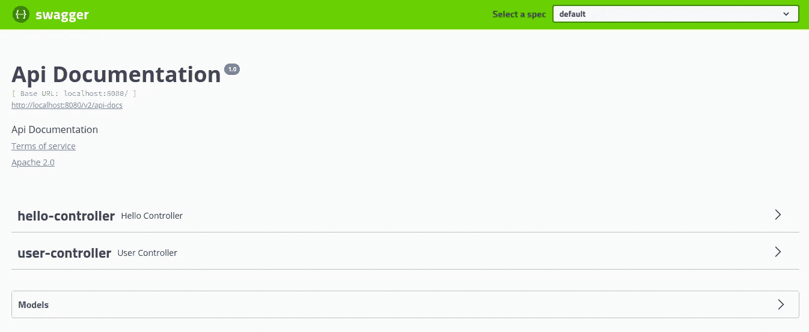

# 带有 Swagger 的 Spring Boot REST API 文档

> 原文：<https://levelup.gitconnected.com/spring-boot-rest-api-documentation-with-swagger-cab4d865a15d>

## 解释 Swagger 以及如何使用 Swagger 为使用 SpringBoot 构建的 REST API 创建文档。

[http://localhost:8080/Swagger-UI . html #/](https://medium.com/javarevisited/10-advanced-spring-boot-courses-for-experienced-java-developers-5e57606816bd#/)获得 Swagger UI。

在这里，您可以展开这些控制器，并查看它拥有的所有端点。此外，您可以使用“*尝试一下*”对这些端点进行 API 调用，并查看响应。

您可以使用之前用于生成文档的相同 docket 向文档添加一些应用程序元数据。您可以使用 apiInfo()方法来做到这一点。

现在您可以看到您传递的元数据。

您可以使用 Swagger 注释向 API 添加更多细节。有许多注释可以用来使文档更具描述性。可以参考[https://springfox.github.io/springfox/docs/current/](https://springfox.github.io/springfox/docs/current/)。

因此，希望您已经了解了 Swagger 的基本概念，以及如何使用 Swagger 为您的 [SpringBoot](https://medium.com/hackernoon/top-5-spring-boot-and-spring-cloud-books-for-java-developers-75df155dcedc) 应用程序创建文档。感谢您的阅读！

# 分级编码

感谢您成为我们社区的一员！ [**订阅我们的 YouTube 频道**](https://www.youtube.com/channel/UC3v9kBR_ab4UHXXdknz8Fbg?sub_confirmation=1) 或者加入 [**Skilled.dev 编码面试课程**](https://skilled.dev/) 。

 [## 编写面试问题

### 掌握编码面试的过程

技术开发](https://skilled.dev)