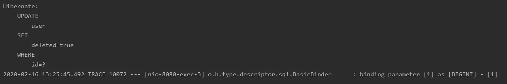
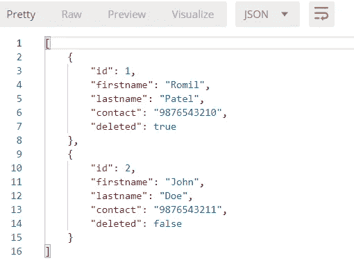
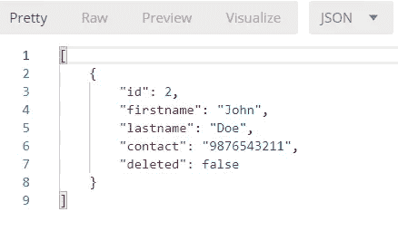
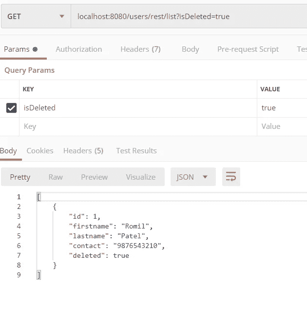
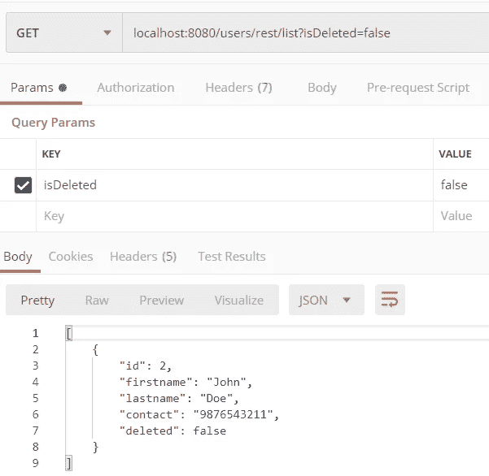

# Spring Boot:Hibernate 的软删除功能

> 原文：<https://levelup.gitconnected.com/spring-boot-soft-delete-functionality-with-hibernate-f5ee8c24c99f>


在[之前的](https://medium.com/@patelromil/spring-boot-annotations-b358628918ac)文章中，我们已经讨论了 *Web 和原型注释*，并且看到了带有代码的例子。在本文中，我将使用注释演示基本的软删除功能。

为了实现软删除功能，我们将使用 ***@SQLDelete、@Where、@Filter 和@FilterDef。*** 为了生成公共的 getter-setter，我们将如下使用 ***@Data*** 。

## @数据

所有字段上的`@ToString`、`@EqualsAndHashCode`、`@Getter`、所有非最终字段上的`@Setter`、`@RequiredArgsConstructor`的快捷方式。

要使用它，你必须在 *pom.xml* 或 *build.gradle* 中添加以下依赖项，并为你的 [IntelliJ IDEA](https://stackoverflow.com/q/41161076/10961238) 、 [Eclipse](https://stackoverflow.com/a/46520849/10961238) 添加 Lombok 插件。

```
***//For Maven Project***
<dependency>
   <groupId>org.projectlombok</groupId>
   <artifactId>lombok</artifactId>
   <scope>provided</scope>
</dependency>***//For Gradle Project***
dependencies {
	compileOnly 'org.projectlombok:lombok:1.18.12'
	annotationProcessor 'org.projectlombok:lombok:1.18.12'

	testCompileOnly 'org.projectlombok:lombok:1.18.12'
	testAnnotationProcessor 'org.projectlombok:lombok:1.18.12'
}
```

让我们首先为用户实体创建一个用于保存、列出和删除的 API，并将探索 ***、@SQLDelete、@Where、@Filter 和@FilterDef***

```
@Entity
@Data
@Table(name = "user")
public class **User** { @Id
    @GeneratedValue
    private Long id;
    private String firstname;
    private String lastname;
    private String contact;
    private Boolean deleted;
}**//APIs**
@PostMapping(value = "/save")
public @ResponseBody User **save**(@RequestBody User user) {
    user = userService.save(user);
    return user;
}@DeleteMapping("/delete/{id}")
public void **delete**(@PathVariable Long id) {
    userService.delete(id);
}@GetMapping(value = "/list")
public ResponseEntity<List<User>> **findAll**() {
    List<User> users = userService.findAll();
    return new ResponseEntity<>(users, HttpStatus.*OK*);
}
```

## @SQLDelete

该注释支持 3 参数 *sql，可调用和检查。*

*   ***sql:*** 过程名或 SQL UPDATE/DELETE 语句。
*   ***可调用:*** 是可调用的语句(又名`CallableStatement`
*   ***检查:*** 对于持久性操作，将使用什么风格的确定结果(成功/失败)。

```
**ResultCheckStyle.NONE** Do not perform checking. Default Paramter**ResultCheckStyle.COUNT**
Perform row-count checking. Row counts are the int values returned by both PreparedStatement.executeUpdate() and Statement.executeBatch(). These values are checked against some expected count.**ResultCheckStyle.PARAM**
Essentially the same as COUNT except that the row count actually comes from an output parameter registered as part of a CallableStatement. This style explicitly prohibits statement batching from being usedimplmen
```

因为我们希望实现软删除，所以我们将把 deleted 标志值更新为 true，并且记录将被保存在数据库中。为了实现这一点，我们必须在*用户实体类*中添加这条语句

```
@Entity
@Data
@Table(name = "user")
**@SQLDelete(sql = "UPDATE user SET deleted=true WHERE id=?")**
public class User {
   ...
}
```

当我们在“ */delete/{id}”上发出删除请求时，* delete 语句将被 *@SQLDelete 中定义的 SQL 查询覆盖。为了验证，*我们可以添加日志属性来使用 *application.properties* 或 *application.yml.* 文件*。*

```
#Logging properties
logging.level.org.hibernate.SQL=DEBUG
logging.level.org.hibernate.type.descriptor.sql.BasicBinder=TRACE
```



由@SQLDelete 生成的 Update 语句

现在，当我们请求“/list”API 获取用户时，它返回所有用户(已删除+未删除)。为了根据删除的标志过滤用户，我们可以使用 [JPA 的查询关键字](https://docs.spring.io/spring-data/jpa/docs/current/reference/html/#repository-query-keywords)。想象一下，一个有很多方法的项目，你需要实现软删除，你必须用 JPA 关键字修改所有的方法，这可能导致容易出错。我们有 ***@Where*** *来解救我们修改所有的方法，节省时间* ***。*** 将此注释添加到用户实体，如下所示。

```
@Entity
@Data
@Table(name = "user")
@SQLDelete(sql = "UPDATE user SET deleted=true WHERE id=?")
**@Where(clause = "deleted = false")**
public class User {
   ...
}
```

*   不带**@ Where(clause = " deleted = false ")**



来自“列表”API 的响应，**所有记录都存在。**

*   用**@ Where(clause = " deleted = false ")**



来自"/list" API 的响应，**只有未删除的用户存在。**

*注意:*您无法检索已被删除的用户的记录，因为@Where 会删除带有已删除标志的用户记录。**如果我们需要显示软删除和未删除用户的记录，我们可以使用@Filter** ，如下例所示。

在用户实体类中添加下面的语句并删除@Where，因为保留这两个注释会使彼此的功能发生冲突。

```
@Entity
@Data
@Table(name = "user")
@SQLDelete(sql = "UPDATE user SET deleted=true WHERE id=?")
**@FilterDef(
        name = "deletedUserFilter",
        parameters = @ParamDef(name = "isDeleted", type = "boolean")
)
@Filter(
        name = "deletedUserFilter",
        condition = "deleted = :isDeleted"
)**
public class **User** {
   ... 
}
```

## **@FilterDef**

该注释定义了将由*@过滤器使用的基本要求。*

*   ***名称*** :将在*@过滤器和会话*中使用的过滤器名称
*   ***参数*** :使用 **@ParamDef** 注释定义参数，参数*名称和类型*

## **@滤镜**

这使用了使用*名称*参数在 *@FilterDef* 中定义的过滤器定义。我们可以使用*条件*参数定义我们需要的条件。

让我们快速修改一下 *findAll()* 方法。我们将添加名为*的参数 isDeleted* 来获取基于它的用户记录。要启用过滤器，我们可以添加*session . enable filter(" filterName ")*，并可以动态设置参数值。

```
@GetMapping(value = "/list")
public ResponseEntity<List<User>> findAll(
**@RequestParam(value = "isDeleted", required = false, defaultValue = "false") boolean isDeleted**) {
    List<User> users = userService.**findAllFilter(isDeleted)**;
    return new ResponseEntity<>(users, HttpStatus.*OK*);
}**public List<User> findAllFilter(boolean isDeleted) {
    Session session = entityManager.unwrap(Session.class);
    Filter filter = session.enableFilter("deletedUserFilter");
    filter.setParameter("isDeleted", isDeleted);
    List<User> users = userRepository.findAll();
    session.disableFilter("deletedUserFilter");
    return users;
}**
```

*   获取参数 **isDeleted=true** 软删除用户的记录



localhost:8080/users/rest/list？isDeleted=true

*   用参数 **isDeleted=false** 获取未删除用户的记录



localhost:8080/users/rest/list？isDeleted=false

从[这里](https://github.com/romilptl/spring-boot-annotations)获取源代码。