# Spring 云网关—请求/响应的加密/解密

> 原文：<https://levelup.gitconnected.com/spring-cloud-gateway-encryption-decryption-of-request-response-4e76f5b15718>

本文提供了一个使用 Spring Cloud Gateway 来解密来自客户端的请求、将解密的内容发送到目标服务、接收响应并在将响应发送到客户端之前对其进行加密的工作示例。

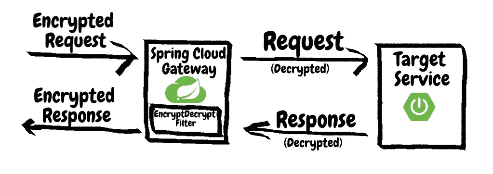

要获得本文中提到的代码，请访问知识库@[https://github.com/sumantrana/SpringGatewayCustomFilter.git](https://github.com/sumantrana/SpringGatewayCustomFilter.git)

# 介绍

使用网关的优势之一是它可以用于处理影响通过它的多条路由的常见功能，例如认证、度量、加密/解密。

我们可以在网关处将这些常见的问题整合在一起，而不是分散在多个微服务中。这提供了以下一组优势:

*   减少开发/更改它们所需的工作量(根据需要)。由于代码位于中心位置，因此只需在一个地方进行更改，测试和部署所需的时间会更少。
*   代码更清晰，更容易理解(原因同上)
*   关注点分离。开发微服务的团队不需要知道传入请求如何被认证、加密等细节。他们只能专注于业务逻辑。

在本文中，我们将深入研究加密/解密方面。有几种方法可以实现这一功能:

*   创建一个外部服务，并将加密和解密的责任委托给该服务。对于每个传入的请求和每个传出的响应，从网关调用该服务。
*   在网关中创建一个自定义过滤器，它将拦截每个请求，解密它，并相应地拦截每个响应，并在发送之前加密它。

以下部分详细解释了后一种方法。

# 加密解密助手

该类充当助手类，并提供静态方法来加密和解密传入的字符串数据。这只是一个示例助手，用来说明功能，可以根据组织的需要用复杂的机制来替换。其思想是将加密/解密问题与过滤器分开，以便在需要时可以更改。也可以将其配置为 bean。

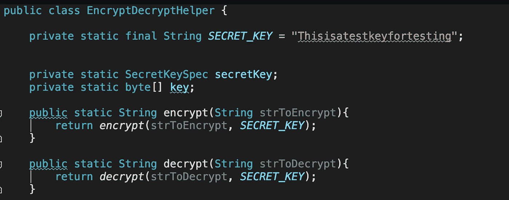

完整代码请参考 github 资源库。

# 加密解密过滤器

要在 Spring Cloud Gateway 中创建网关过滤器，我们可以实现`AbstractGatewayFilterFactory`或者扩展现有的`GatewayFilter`的功能。这里我们将通过实现`AbstractGatewayFilterFactory.`来实现一个新的过滤器

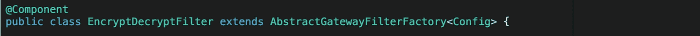

Config 类提供了一种向自定义过滤器传递所需参数的机制。在我们的例子中，它是一个空类，但是它可以用于定制过滤器的某些方面，比如用于加密/解密的 helper 类。

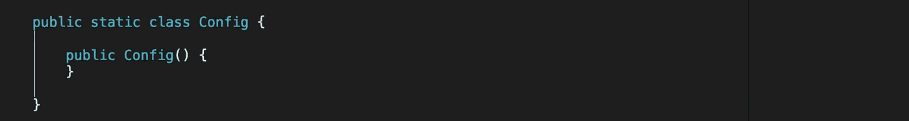

我们的网关过滤器的构造器接受两个参数——一组`MessageBodyDecoder`和一组`MessageBodyEncoder`。这些解码器和编码器在解析传入请求或创建传出响应时使用。

## 注入编码器和解码器

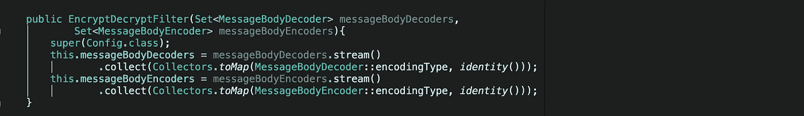

> 默认情况下，Spring Boot 提供了一个 Gzip 消息体编码器和解码器。这个 Gzip 编码器解码器被注入到过滤器中，并且将在发送请求的客户端发送以下报头`Accept-Encoding: gzip, deflate`时使用。该报头表示客户端期望响应是压缩格式的，并且过滤器需要接受它。
> 
> 下面是一个示例输出，显示了客户端在请求中发送`Accept-Encoding`报头:

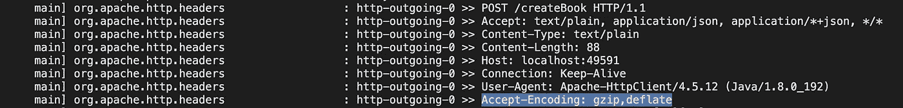

> 对客户端的相应响应显示了服务器如何响应:

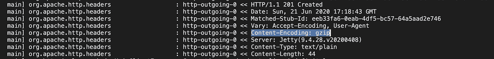

## 订购过滤器

对过滤器进行排序起着重要的作用，尤其是当我们希望我们的过滤器同时应用于传入请求和传出响应时。为了将过滤器应用于响应，我们希望它应用于网关顺序为`-1`的`NettyRewriteResponseFilter`之后。这意味着我们可以选择任何小于`-1`的数字，我们的滤波器将能够成功地修改响应。

如果我们忽略了排序，gateway 将为我们的过滤器分配一个默认的顺序`0`，它将不能按要求运行。

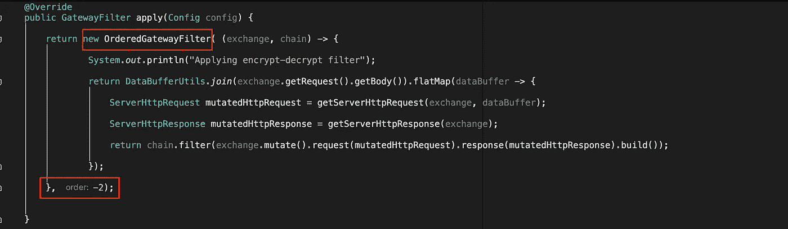

> 理想情况下，应该使用更大的负数，因为它可以确保在 EncryptDecrypt 过滤器之前有足够的空间来应用任何过滤器。

## 解密请求

为了解密传入的请求，我们需要首先从传入的`Flux<DataBuffer>`中提取请求体。

首先从输入缓冲区创建一个缓存流量

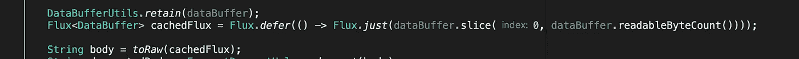

然后用它来解析请求体

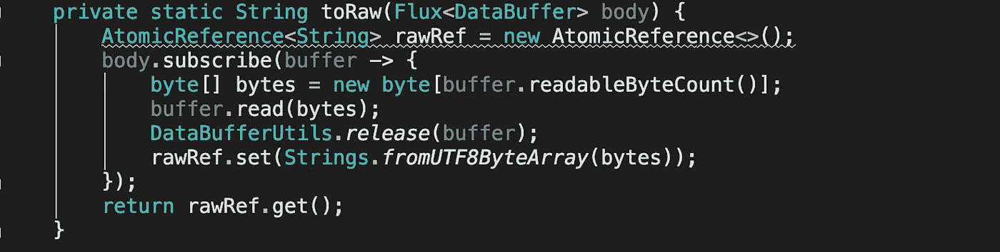

一旦提取了主体，我们就可以使用我们的`EncryptDecryptHelper`解密主体，并创建一个`ServerHttpRequestDecorator`对象，从修改后的主体创建一个新的请求。

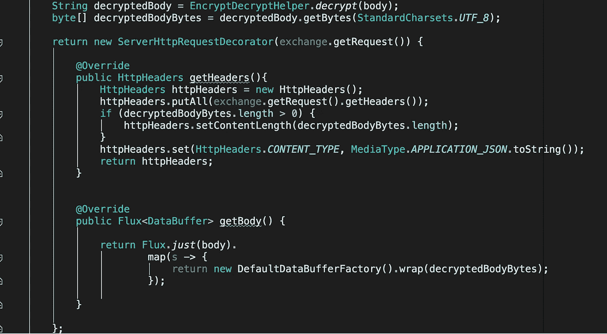

> 这里需要记住的重要一点是，请求的`Content-Length`需要更新，因为解密会改变请求体。如果类型发生变化，也可能需要更新`Content-Type`报头，例如在本例中，由于传入的加密请求主体是`plain text`，因此`text/plain`内容类型被更改为`application/json`，但是当我们解密它时，它会更改为`json.`

然后，这个装饰器可以用来更新交换，并通过链传递，以便应用进一步的过滤器:

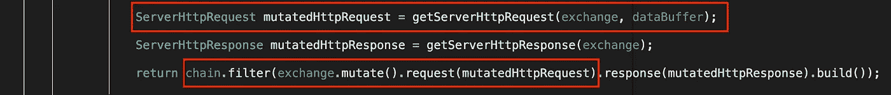

## 加密响应

加密响应的代码灵感来自 Spring 提供的`ModifyResponseGatewayFilter`。与请求类似，我们需要首先提取响应，以便能够对其进行加密。

第一步是创建一个`ServerHttpResponseDecorator`对象并覆盖`writeWith`方法。

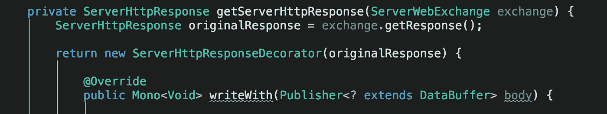

创建一个包含正文和标题的`ClientResponse`对象:

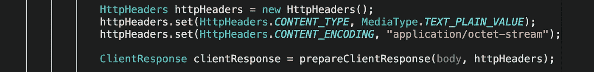

然后提取主体并用`EncryptDecryptHelper`类加密。

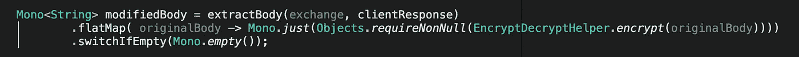

提取正文方法考虑了创建过滤器时注入的消息正文解码器。如果找到任何解码器，它使用它们来解码主体缓冲区。

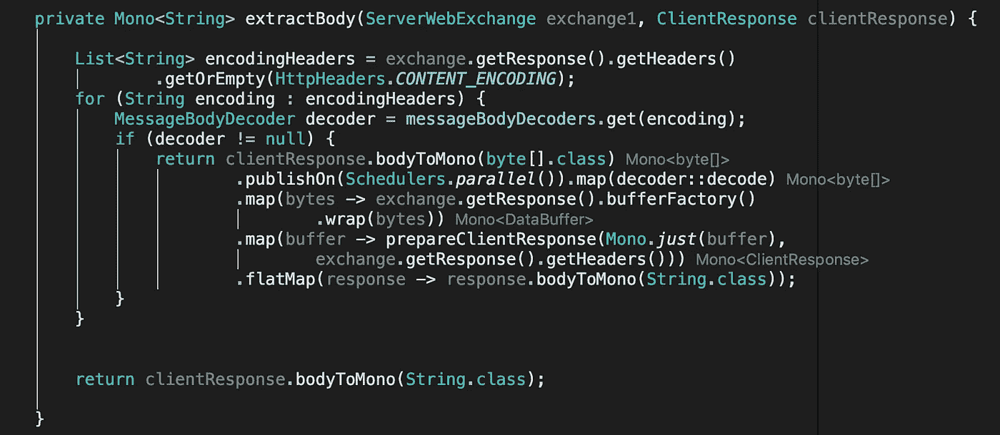

一旦主体可用，就使用一个`BodyInserter`类的对象来创建更新的响应

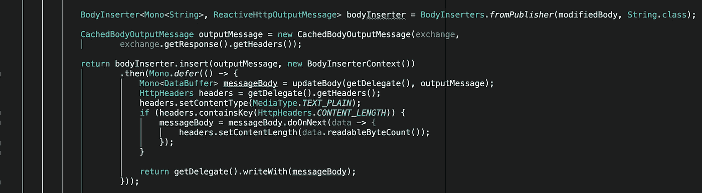

> 同样，对于请求，响应`Content-Length`和`Content-Type`可能会改变。这是根据需求更新这些头的正确位置。对于这篇文章，客户端期望一个文本输出，所以`Content-Type`被重置为`text/plain`。

`updateBody`方法还考虑了消息体编码器，并使用它们对输出响应进行适当的编码。

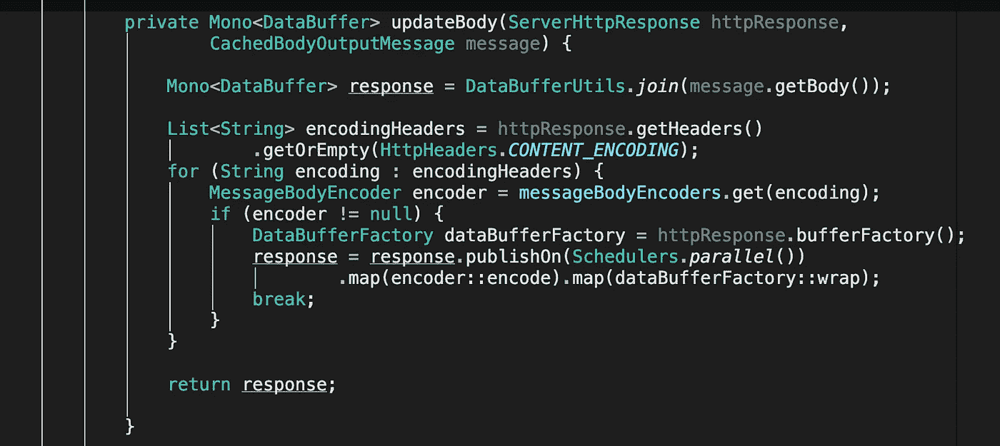

然后，创建的`ServerHttpResponseDecorator`用于更新交换，并通过链进行进一步过滤:

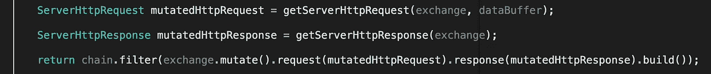

这就完成了过滤器，因为请求和响应都发生了变异。

# 配置

自定义过滤器需要使用 application.properties(或 application.yml)进行配置。下面的代码片段显示了所需的配置

```
spring:
  cloud:
    gateway:
      routes:
        - id: book_encrypt_decrypt_route
          uri: http://localhost:8080/
          predicates:
            - Path=/createBook
          filters:
            - EncryptDecryptFilter
            - RewritePath=/createBook, /api/book
```

上面的配置创建了到托管目标服务的目标 uri `[http://localhost:8080](http://localhost:8080)`的新路由`book_encrypt_decrypt_route`。

这个请求会被`EncryptDecryptFilter`拦截。它的身体将被提取和解密。然后，这个请求将被移交给`RewritePath`过滤器，过滤器将 uri 从`/createBook`更改为`/api/book`并转发请求。

当目标服务响应时，响应将再次被`EncryptDecryptFilter`拦截。然后，在将最终响应发送给客户端之前，将对响应正文进行加密。

# 测试

可以通过使用`wiremock`或等效的库模拟 REST 端点来测试过滤器，以启动模拟端点。

下面的代码片段显示了一个工作测试用例:

```
@ExtendWith({SpringExtension.class})
@SpringBootTest( webEnvironment = SpringBootTest.WebEnvironment.*RANDOM_PORT*)
@TestInstance(TestInstance.Lifecycle.*PER_CLASS*)
public class GatewayEncryptDecryptTests {

   @Autowired
   private TestRestTemplate testRestTemplate;

   @LocalServerPort
   private int port;

   private WireMockServer wireMockServer;

   @BeforeAll
   public void init(){
      wireMockServer = new WireMockServer(*options*().port(8080));
      wireMockServer.start();

   }

   @AfterAll
   public void destroy(){
      wireMockServer.stop();
   }

   @Test
   public void encryptDecryptFilter_decryptsDefaultBook_and_EncryptsDefaultResponse(){

      *//language=JSON* String data = "{**\n**"
            + "  **\"**title**\"**: **\"**TestTitle1**\"**,**\n**"
            + "  **\"**author**\"**: **\"**TestAuthor1**\"\n**"
            + "}";

      MultiValueMap<String, String> headers = new LinkedMultiValueMap<>();
      headers.add(HttpHeaders.*CONTENT_TYPE*, MediaType.*TEXT_PLAIN_VALUE*);

      wireMockServer.stubFor( *post*("/api/book").withRequestBody(*equalToJson*(data))
            .willReturn( *status*(201).withBody("Created")));

      String gatewayUrl = "http://localhost:" + port + "/createBook";

      String encryptedRequest = EncryptDecryptHelper.*encrypt*(data);
      String expectedDecryptedResponse = "Created";

      ResponseEntity<String> outputEntity = testRestTemplate.exchange(gatewayUrl, HttpMethod.*POST*,new HttpEntity<String>(encryptedRequest, headers),String.class);

      *assertThat*( outputEntity.getStatusCode() ).isEqualTo( HttpStatus.*CREATED* );
      *assertThat*( EncryptDecryptHelper.*decrypt*( outputEntity.getBody() ) ).isEqualTo(expectedDecryptedResponse);

   }

}
```

根据测试代码，网络模拟的目标服务期望在主体中有一个 json，并在响应中返回一个文本，但是我们使用加密的 json 而不是真实的 JSON 调用网关 URL，网关过滤器在将它发送到目标之前对其进行解密。

> 要获得本文中提到的代码，请访问知识库@[https://github.com/sumantrana/SpringGatewayCustomFilter.git](https://github.com/sumantrana/SpringGatewayCustomFilter.git)