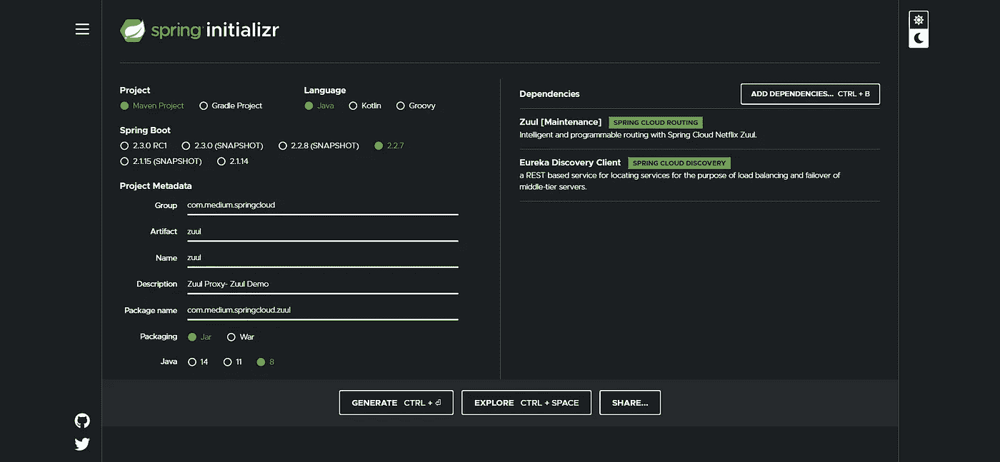

# Spring Cloud: Zuul API 网关

> 原文：<https://levelup.gitconnected.com/spring-cloud-zuul-api-gateway-dffa5933d570>


# 为什么要使用 API 网关

微服务架构的本质是将整体分解成细粒度的服务。这些“微”服务中的每一个都可以独立部署和扩展。虽然这种模式有许多优点，但它也带来了许多挑战。这些挑战中最重要的一个是复杂性的增加，这反过来又导致了可维护性的缺乏。

设想一个场景，您必须为一个复杂的 CRM(客户关系管理)应用程序实现一个 UI。为了填充这个 UI 的不同部分并执行不同的用户操作，您可能需要调用几十个微服务。此外，UI 必须知道所有这些微服务的网络位置(主机和端口)。此外，如果微服务的网络位置发生变化(这在云中经常发生)，UI 也必须更新。显而易见，这是一个非常糟糕的设计。


此外，一个典型的 web 应用应该支持监控、认证、安全、CORS 等。如果 UI 直接调用微服务，那么前面提到的横切关注点应该在每个微服务中单独实现。CORS 策略或身份验证机制的简单更改会强制所有微服务进行更改，这不仅效率低下，而且容易出错。

为了有一个更强大的方法，我们必须为微服务的所有传入流量实施单点入口或网关。UI 将始终向网关发送请求，然后网关将请求转发给相关的微服务。本质上，gateway 充当 UI 和微服务之间的中间件。下图说明了这个概念。


这种方法的两个主要优点如下。

*   UI 不需要知道单个微服务的网络位置。相反，UI 只需要知道网关的网络位置。网关会将传入的请求路由到相关的后端服务。
*   认证、安全、监控、CORS 等交叉问题将由网关处理。每当需要对这些方面进行更改时，可以在一个地方(网关)进行更改，以影响所有微服务。

# Zuul 概念概述

Zuul 是网飞开发的 API 网关或边缘服务器。它能够执行以下任务。

*   身份验证和安全性—确定每个资源的身份验证要求，并拒绝不满足这些要求的请求。
*   洞察和监控——在边缘跟踪有意义的数据和统计数据，以便为我们提供准确的生产视图。
*   动态路由—根据需要将请求动态路由到不同的后端集群。
*   压力测试—逐渐增加集群的流量，以评估性能。
*   减载—为每种类型的请求分配容量，并丢弃超出限制的请求。
*   静态响应处理—直接在边缘构建一些响应，而不是将它们转发到内部集群。

## 过滤

过滤器是一种扩展 Zuul 默认功能和添加自定义特性的方式。在请求路由过程中，根据过滤器执行的阶段，可以将过滤器分为四种类型。

*   `pre` —过滤器在请求被路由之前运行。
*   `route` —过滤器可以处理请求的实际路由。
*   `post` —过滤器在请求被路由后运行。
*   `error` —如果在处理请求的过程中出现错误，则运行过滤器。

## 与 Eureka 的集成

在现实世界的微服务生态系统中，Zuul 与 Eureka 等服务发现工具携手合作。Zuul 一般不会维护后端微服务的硬编码网络位置(主机名和端口号)。相反，它与服务注册表进行交互，并动态获取目标网络位置。下图展示了这一工作流程。


# 用 Spring Cloud 实现 Zuul 网关

如上所述，Zuul 最初是由网飞开发的。然而，Spring 已经开发了一个围绕网飞·祖尔的包装器，所以它可以很容易地集成到基于 Spring 的应用程序中。这个包装器是 Spring Cloud 框架的一部分。在下面的例子中，我们将使用 Spring Cloud 版本的 Zuul。

## 项目概述

在这个例子中，我们将构建三个工件来演示 Zuul 的请求路由过程。你可以在 [GitHub](https://github.com/sarindufit/spring-cloud-zuul) 中找到这个例子的完整源代码。

*   课程微服务
*   Zuul API 网关
*   尤里卡服务注册中心


## 构建课程微服务

该课程是一个简单的微服务，用 Spring Boot 编写，公开一个端点来检索课程列表。此外，课程微服务将被配置为发现客户端，以便可以通过 Eureka 发现其网络位置。

**通过 spring Initializr** 生成项目

您可以使用 [Spring Initializr](https://start.spring.io/) 来生成初始的项目结构。


**Maven 配置(pom.xml)**

**添加模型类(Course.java)**

**添加休息控制器(CourseController.java)**

特别说明:

*   如您所见，已经公开了一个端点(/courses)来检索课程列表。

**添加主类(CourseApplication.java)**

特别说明:

*   @EnableEurekaClient 批注已用于使此服务成为 Eureka 客户端。

**配置应用程序属性(application.properties)**

## 实现 Eureka 服务器

下一步，我们必须实现一个 Eureka 服务器。如果您不熟悉服务发现和 Eureka 的概念，您可以阅读[这篇文章](https://medium.com/swlh/spring-cloud-service-discovery-with-eureka-16f32068e5c7)以获得基本的理解。

**通过 spring Initializr 生成项目**

您可以使用 [Spring Initializr](https://start.spring.io/) 来生成初始项目结构。


**Maven 配置(pom.xml)**

**添加主类(EurekaApplication.java)**

特别说明:

*   @EnableEurekaServer 注释神奇地将这个简单的应用程序转换成了 Eureka 服务器。

**配置应用程序属性(application.properties)**

特别说明:

*   默认情况下，Spring Boot 应用程序在端口`8080`上运行。我已经将其覆盖到`8761`，这样 Eureka 服务器就不会与课程微服务端口冲突(课程微服务将在 8080 上运行)。
*   当 Eureka 启动时，它会尝试将自己注册为客户端。为了方便起见，我使用了`eureka.client.register-with-eureka = false`配置来防止 Eureka 服务器在启动时在服务器中注册自己。
*   在真实的场景中，我们可能有多个 Eureka 服务器节点一起充当对等注册中心。当 Eureka 服务器启动时，默认情况下它会搜索其他对等注册中心。为了防止在我们的本地设置中出现这种情况，我使用了`eureka.client.fetch-registry = false`配置。
*   我已经使用了`logging.level.com.netflix.eureka = OFF`和`logging.level.com.netflix.discovery = OFF`属性来关闭详细日志记录。

## 设置 Zuul 代理

最后一步，我们必须实现 Zuul 代理服务器，将请求路由到课程微服务。

**通过 spring Initializr 生成项目**

您可以使用 [Spring Initializr](https://start.spring.io/) 来生成初始项目结构。



**添加主类(ZuulApplication.java)**

特别说明:

*   @EnableZuulProxy 添加了作为代理运行和将请求路由到后端 API 的功能。
*   @EnableEurekaClient 使这个应用程序成为一个 Eureka 客户机，这样它就可以与服务注册中心交互并获得请求路由所需的信息(后端 API 的网络位置)。

**配置应用程序属性(application.properties)**

特别说明:

*   以下属性将使 Zuul 代理在端口号`8762`上运行。

```
server.port = 8762
```

*   Eureka 服务器 URL 应该配置如下。

```
eureka.client.serviceUrl.defaultZone = http://localhost:8761/eureka
```

*   为了检索/获取注册的服务细节， **Zuul 代理**不需要向 Eureka 服务器注册。应该使用以下属性来阻止 Zuul 在 Eureka 服务器上注册。

```
eureka.client.registerWithEureka=false
```

*   尽管 Zuul 不需要在 Eureka 中注册，但它仍然需要获取注册表项来将请求路由到后端 API。以下属性使 Zuul 能够与 Eureka 服务器交互并获取注册表项。

```
eureka.client.fetchRegistry=true
```

*   以下是使 Zuul 能够执行请求路由的两个最重要的属性。

```
zuul.routes.courseservice.path=/course-service/**zuul.routes.courseservice.serviceId=course-service
```

如果一个请求到达`/course-service/*` URL 路径，该请求将被定向到用 service-id `course-service`注册的服务。在重定向时，Zuul 将默认去除 URL 的`/course-service/`部分。例如，如果请求发送到`/course-service/courses` URL，Zuul 会将该请求重定向到 URL 为`/courses`的课程微服务。

## 测试应用程序

为了测试 Zuul 代理，您必须首先启动我们在上面小节中实现的以下服务。

*   课程微服务
*   尤里卡服务器
*   Zuul 代理

随后，可以使用 Postman 等 REST 客户端调用 Zuul 中配置的`/course-service/`端点，检查课程列表是否返回成功。


# 使用过滤器扩展 Zuul 的功能

如前一节所述，过滤器是扩展 Zuul 默认功能和添加自定义特性的一种方式。有四种类型的过滤器，即`pre`、`post`、`route`和`error`。以下是每种过滤器类型的示例实现。

*   预过滤器

*   后置过滤器

*   路由过滤器

*   误差过滤器

过滤器类实现了四种方法:

*   `filterType()`:返回一个代表过滤器类型的`String`，在本例中为`pre`。(对于路由过滤器，应该是`route`。)
*   `filterOrder()`:给出该过滤器相对于其他过滤器的运行顺序。
*   `shouldFilter()`:包含决定何时运行该过滤器的逻辑(该特定过滤器始终运行)。
*   `run()`:包含过滤器的功能。

# 结论

这篇文章旨在向您介绍通过网飞的 Zuul 请求路由。我们使用 Spring Cloud 对 Zuul 的包装，并构建了一个示例应用程序来观察请求路由过程。我希望这篇文章对你有用。

感谢阅读！