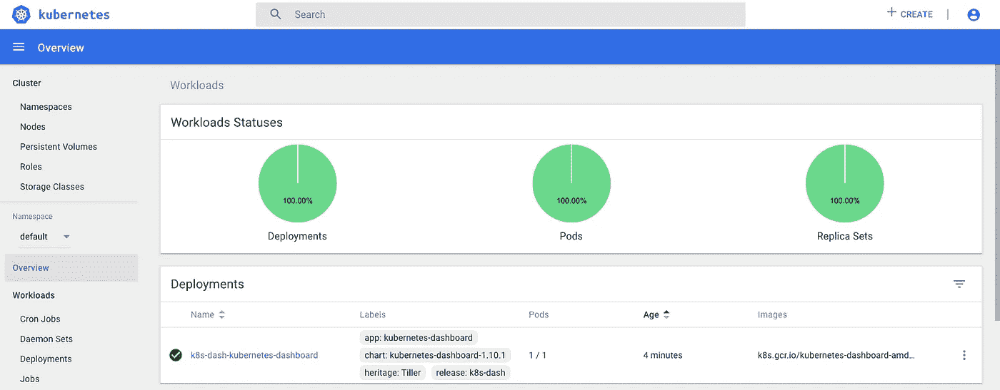

# Kubernetes 上的 Spring 数据休息服务

> 原文：<https://levelup.gitconnected.com/spring-data-rest-service-on-kubernetes-675dcbbdffc6>


部署到 K8s 的简单数据支持的 Hateous REST 服务。

创建代码:

[https://start.spring.io/#!type=maven-project&language = Java&platform version = 2 . 3 . 1 . release&packaging = jar&JVM version = 1.8&groupId = uk . co . actual code&artifactId = data service&name = data service&description = vadal % 20 data % 20 service&package name = uk . co . actual code . vadal . data service&dependencies = lombok，devtools，data-](https://start.spring.io/#!type=maven-project&language=java&platformVersion=2.3.1.RELEASE&packaging=jar&jvmVersion=1.8&groupId=uk.co.actualcode&artifactId=dataservice&name=dataservice&description=vadal%20data%20service&packageName=uk.co.actualcode.vadal.dataservice&dependencies=lombok,devtools,data-rest,h2,data-jpa)

```
@SpringBootApplication
public class VadalDataRestApplication {

    public static void main(String[] args) {
        SpringApplication.run(VadalDataRestApplication.class, args);
    }

    @Autowired
    UserRepo userRepo;

    @Autowired
    RoleRepo roleRepo;

    @PostConstruct
    public void init() {
        Role boss = new Role("boss");
        Role director = new Role("director");
        roleRepo.saveAll(Arrays.asList(boss, director));
        userRepo.saveAll(Arrays.asList(new User("fred", boss), new User("wilma", director)));
    }

}
```

打开 SQL 日志记录。

应用程序. yml

```
server.port: 7777

spring:
  jpa:
    show-sql: true
```

创建映像( [https://buildpacks.io](https://buildpacks.io) ):

这将创建一个云原生构建包。

`mvn spring-boot:build-image`

> *docker 图片*
> 
> vadal-数据-剩余 0 . 0 . 1-快照 363629e2dd33 40 年前 256MB

*注意:如果您有 CI 设置，那么在您推送代码之后，这可以做类似的事情。见我的* [*上一篇博客*](https://medium.com/@lightphos/integrating-kubernetes-with-gitlab-ci-ed3497c41a66) *关于 GitLab 连接 K8s。这里，构建 java 映像只需要上面的 mvn 命令，而不是 docker 文件。*

让我们在 K8s 上运行它(我在本地使用 docker K8s 的桌面，所以这个 K8s 可以看到 docker 图像，对于 minikube，你需要指向它的 VM 的 docker)。

# Docker 桌面上的 K8s 本地(macos)

将 kubectl 指向 docker-for-desktop(而不是 minikube)

> *kubectl 配置使用上下文 docker-for-desktop*
> 
> *kubectl 获取 cs*

```
NAME                 STATUS    MESSAGE              ERROR
controller-manager   Healthy   ok                   
scheduler            Healthy   ok                   
etcd-0               Healthy   {"health": "true"}
```

> *舵初始化(第一次只安装舵杆)*

等待它安装。安装仪表板。

> *helm install—wait—name k8s—dash—set service . type = node port，service . node port = 31111 stable/kubernetes-dashboard*

chrome://flags/# allow-unsecure-localhost

[https://localhost:31111/#！/登录](https://localhost:31111/#!/login)

你需要一个令牌来访问用户界面

> *token=`* `*kubectl -n kube-system describe secret default | grep 'token:' | awk '{print $2}'*` *`*
> 
> `kubectl config set-credentials docker-for-desktop --token="${token}"`

文件将在~/中。kube/config 或 echo $token 并使用它。



# 部署 Spring REST 服务映像

> *kubectl 创建部署 vadal-data-rest-image = vadal-data-rest:0 . 0 . 1-SNAPSHOT*
> 
> *deployment.apps/vadal-data-rest 创造了*

# 暴露内部端口 7777

> *ku bectl expose deployment vadal-data-rest-type node port-port 8888-target-port 7777*
> 
> kubectl get svc vadal-data-rest
> 
> 名称类型 CLUSTER-IP EXTERNAL-IP PORT AGE
> vadal-data-rest NodePort 10 . 108 . 4 . 93<none>8888:31894/TCP 1m

本地主机:31894

```
{
	"_links": {
		"roles": {
			"href": "http://localhost:31894/roles"
		},
		"user": {
			"href": "http://localhost:31894/u"
		},
		"profile": {
			"href": "http://localhost:31894/profile"
		}
	}
}
```

# 使用 Nginx 实现负载平衡

> *舵安装稳定/nginx-入口*
> 
> *kubectl 获取 svc*

```
NAME                                          TYPE           CLUSTER-IP       EXTERNAL-IP   PORT(S)                      AGE
k8s-dash-kubernetes-dashboard                 NodePort       10.109.122.227   <none>        443:31111/TCP                59m
kubernetes                                    ClusterIP      10.96.0.1        <none>        443/TCP                      1d
ponderous-olm-nginx-ingress-controller        LoadBalancer   10.104.194.23    localhost     80:32192/TCP,443:31817/TCP   1m
ponderous-olm-nginx-ingress-default-backend   ClusterIP      10.96.101.109    <none>        80/TCP                       1m
vadal-data-rest                               NodePort       10.108.4.93
```

应用(将此命名为 lb.yml)

```
apiVersion: extensions/v1beta1
kind: Ingress
metadata:
  name: vadal-ingress
spec:
  rules:
  - host: vadal-data.info
    http:
      paths:
      - backend:
          serviceName: vadal-data-rest
          servicePort: 8888
```

> *ingress.extensions/vadal-ingress 创建了*

将 vadal-data.info 添加到/etc/hosts

> *127 . 0 . 0 . 1 vadal-data . info*

浏览至: [http://vadal-data.info](http://vadal-data.info)

应该用 rest 数据细节来响应。

**日志**

K8s Nginx 日志:

```
192.168.65.3 - - [17/Jun/2020:22:09:36 +0000] "GET /favicon.ico HTTP/1.1" 404 146 "http://vadal-data.info/" "Mozilla/5.0 (Macintosh; Intel Mac OS X 10_15_5) AppleWebKit/537.36 (KHTML, like Gecko) Chrome/83.0.4103.98 Safari/537.36" 378 0.013 [default-vadal-data-rest-8888] [] 10.1.0.8:7777 124 0.010 404 7c9566da4f3c0f31e9eacbfd890ac431
1
```

**规模**

缩放到两个

> *kubectl 扩展部署/vadal-data-rest-replicas = 2
> deployment.extensions/vadal-data-rest 扩展*
> 
> *kubectl 获取 po*

```
NAME                                                           READY   STATUS    RESTARTS   AGE
k8s-dash-kubernetes-dashboard-84cb4cc6f-6t8kc                  1/1     Running   0          1h
ponderous-olm-nginx-ingress-controller-6b4d695d86-7gxmq        1/1     Running   0          15m
ponderous-olm-nginx-ingress-default-backend-6fb8ff9645-59mvr   1/1     Running   0          15m
vadal-data-rest-5744484f95-87788                               1/1     Running   0          1m
vadal-data-rest-5744484f95-v9d4h
```

现在那是整洁的。一个新的吊舱。

> *ku bectl logs-f vadal-data-rest-5744484 f95–87788*
> 
> *ku bectl logs-f vadal-data-rest-5744484 f95-v9d4h*

**负载均衡**

反复点击终点:

[http://vadal-data.info](http://vadal-data.info)

日志应该在两者之间循环调度:

`Hibernate: select user0_.id as id1_1_, user0_.name as name2_1_, user0_.role_id as role_id3_1_ from user user0_`

**更新 pod**

> *kubectl 补丁部署 vadal-data-rest-p ' { " spec ":{ " template ":{ " spec ":{ " terminationgraceperiodes ":31 } } } '*

# 结论

kubernetes 中基于 Docker imaged 的部署和扩展使得向上(或向下)扩展变得非常容易，可以在不污染代码的情况下轻松添加任何负载平衡器，并为您提供多种选择。docker 映像可以部署在任何地方(符合 12 个因素)。

K8s 具有内置的服务发现和访问级别。添加任何负载平衡器相当容易，我们通过 helm 添加 Nginx，不需要任何 yml 文件。我们需要的一个 yml 是连接它来平衡服务的负载。

喜欢吗？

度量和监控呢？[下一次](https://medium.com/@lightphos/observability-of-springboot-services-in-k8s-with-prometheus-and-grafana-61c4e7a9d814)我们将添加 prometheus 和 grafana 来监控我们的服务并显示指标。

源代码可以在这里找到

【https://gitlab.com/lightphos/spring/vadal 

*原载于 2020 年 6 月 18 日*[*https://blog . ram JEE . uk*](https://blog.ramjee.uk/spring-data-rest/)*。*