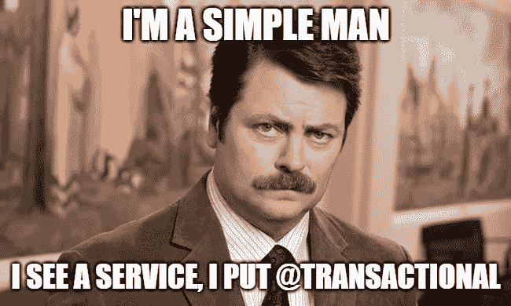
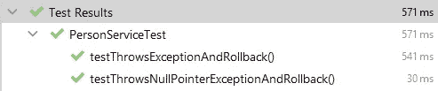
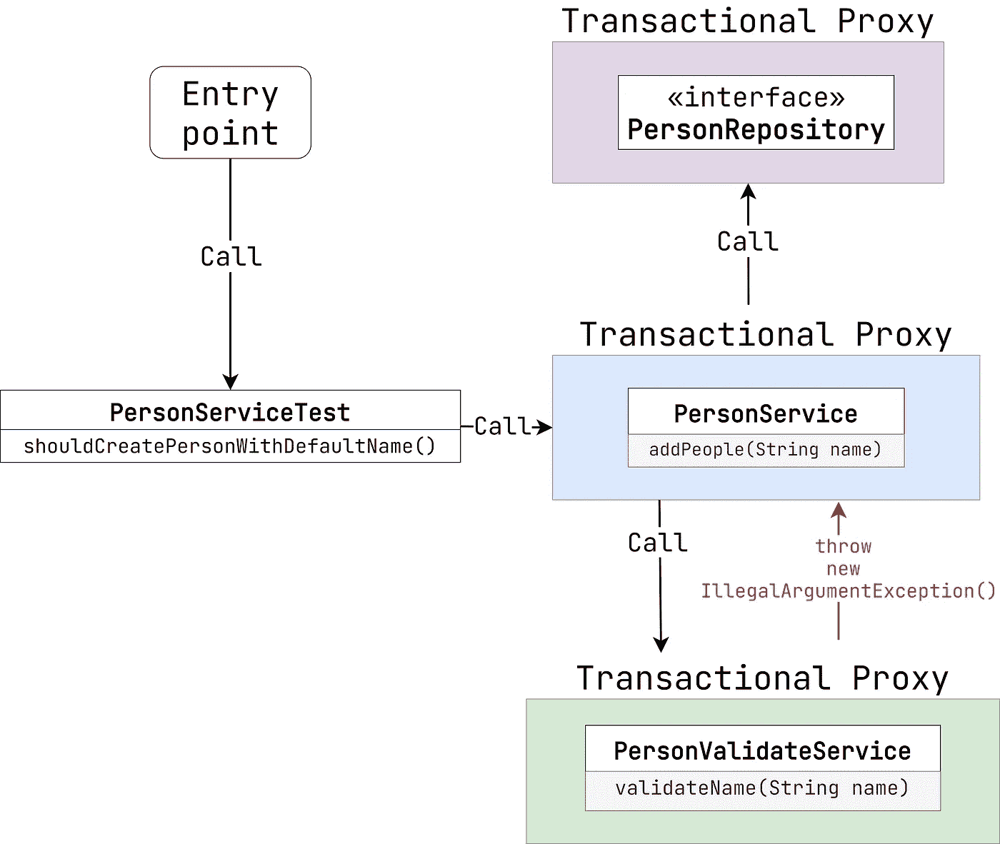

# Spring 数据—交易警告

> 原文：<https://levelup.gitconnected.com/spring-data-transactional-caveats-f6edd41d6785>

Spring 是最流行的 Java 框架。它为 web、安全性、缓存和数据访问提供了许多现成的解决方案。Spring Data 尤其让开发者的生活变得更加轻松。我们不必担心数据库连接和事务管理。框架完成了这项工作。但是它对我们隐藏了一些重要的细节，这可能会导致难以追踪的错误和问题。那么，让我们深入探讨一下`@Transactional`注释。



# 默认回滚行为

假设我们有一个简单的服务方法，在一个事务中创建 3 个用户。如果出错，它抛出`java.util.Exception`。

可能检查到异常的人员服务

这是一个简单的单元测试。

人员服务测试

你认为考试会通过吗？逻辑告诉我们，由于一个异常，Spring 应该回滚事务。所以，`personRepository.count()`应该返回 0，对吗？不完全是。

```
expected: <0> but was: <2>
Expected :0
Actual   :2
```

这需要一些解释。默认情况下，Spring 仅在发生**未检查的**异常时回滚事务。被检查的**和**被视为**可恢复**。在我们的例子中，Spring 执行提交而不是回滚。这就是为什么`personRepository.count()`返回 2。

解决这个问题最简单的方法是用一个未检查的异常替换一个已检查的异常(例如，`NullPointerException`)。或者我们可以使用注释的属性`rollbackFor`。

例如，这两种情况都是完全正确的。

可能存在已检查和未检查例外的人员服务

人员服务测试



试验结果

# 异常抑制时回滚

并非所有的异常都必须传播。有时捕捉它并记录相关信息是可以接受的。

假设我们有另一个**事务性**服务，它检查是否可以用给定的名字创建这个人。如果不是，则抛出`IllegalArgumentException`。

PersonValidateService

让我们给我们的`PersonService`添加验证。

带验证的人员服务

如果验证没有通过，我们将使用默认名称创建一个新人。

好了，现在我们需要测试它。

人员服务测试

但结果却颇为出人意料。

```
Unexpected exception thrown: org.springframework.transaction.UnexpectedRollbackException: Transaction silently rolled back because it has been marked as rollback-only
```

太奇怪了。该异常已被禁止。Spring 为什么回滚交易？首先，我们需要了解`@Transactional`管理方法。

Spring 内部使用了[面向方面的编程模式](https://www.baeldung.com/spring-aop)。跳过复杂的细节，其背后的思想是用执行所需操作(在我们的例子中是事务管理)的代理来包装对象。所以，当我们注入具有任何`@Transactional`方法的服务时，实际上 Spring 放置了代理。

下面是定义的`addPeople`方法的工作流程。



人员服务测试工作流

默认的`@Transactional`传播是`REQUIRED`。这意味着，如果缺少新事务，就会创建新事务。如果已经存在，则支持当前版本。因此，整个请求在单个事务中执行。

无论如何，有一个警告。如果`RuntimeException`抛出*事务代理*，Spring 将当前事务标记为仅回滚。这正是我们的情况。`PersonValidateService.validateName`摔投`IllegalArgumentException`。事务代理跟踪它并设置回滚标志。事务期间的后续执行没有任何影响，因为它们最终应该被回滚。

有什么解决办法？有几个一。例如，我们可以给`PersonValidateService`添加`noRollbackFor`属性。

具有“noRollbackFor”属性的 PersonValidateService

另一种方法是将事务传播改为`REQUIRES_NEW`。在这种情况下，`PersonValidateService.validateName`将在一个单独的事务中执行。因此，父级不会回滚。

具有“传播”属性的 PersonValidateService

# 可能的 Kotlin 问题

Kotlin 与 Java 有许多共同之处。但是异常管理却不是这样。

科特林消除了*已检查*和*未检查*异常的想法。基本上，语言中的任何异常都是*未检查的*，因为我们不需要在方法声明中指定`throws SomeException`。这个决定的利弊应该是另一个故事的主题。但现在我想向大家展示它可能带来的 Spring 数据使用问题。

让我们用 Kotlin 重写文章的第一个例子`java.util.Exception`。

用 Kotlin 写的 PersonService

用 Kotlin 编写的 PersonServiceTest

测试失败，就像在 Java 中一样。

```
expected: <0> but was: <2>
Expected :0
Actual   :2
```

没有惊喜。Spring 在 Java 或 Kotlin 中以同样的方式管理事务。但是在 Java 中，我们不能不小心执行一个抛出`java.util.Exception`的方法。科特林允许了。这可能会带来意想不到的错误，所以，你应该格外注意这种情况。

# 结论

这就是我想告诉你的关于 Spring `@Transactional`注释的全部内容。如果您有任何问题或建议，请在下面留下您的评论。感谢阅读！