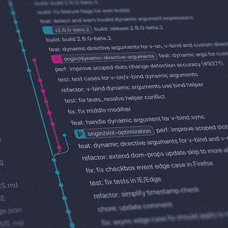

# 每个 Java 开发人员都应该知道的 Spring 依赖注入

> 原文：<https://levelup.gitconnected.com/spring-dependency-injection-every-java-developer-should-know-6bd639d385e3>


由 [Unsplash](https://unsplash.com?utm_source=medium&utm_medium=referral) 上的 [Clément Hélardot](https://unsplash.com/@clemhlrdt?utm_source=medium&utm_medium=referral) 拍摄

# 1.概念

*   依赖注入。
*   **依赖**是指依赖容器创建 Bean 对象。
*   **注入**:容器注入的 Bean 对象的所有属性(设置和组装)

# 2.构造函数注入

# 3.设定方式注射

## 3.1 环境建设

> 复数型

**恒定喷射**

**测试**

## 3.2 不同类型值的注入方法

## 持续注射

```
<bean id="student" class="com.omgzui.pojo.Student">
    <property name="name" value="zui"/>
</bean>
```

## 大豆注射液

> 注意:这里的值是一个参考值，ref

```
<bean id="addr" class="com.omgzui.pojo.Address">
     <property name="address" value="zui"/>
 </bean>

 <bean id="student" class="com.omgzui.pojo.Student">
     <property name="name" value="zui"/>
     <property name="address" ref="addr"/>
 </bean>
```

## 阵列注入

```
<bean id="student" class="com.omgzui.pojo.Student">
     <property name="name" value="zui"/>
     <property name="address" ref="addr"/>
     <property name="books">
         <array>
             <value>Tom1</value>
             <value>Tom2</value>
             <value>Tom3</value>
         </array>
     </property>
 </bean>
```

## 列表注入

```
<property name="num">
     <list>
         <value>1</value>
         <value>2</value>
         <value>3</value>
     </list>
 </property>
```

## Map 注入

```
<property name="card">
     <map>
         <entry key="zip" value="331000"/>
         <entry key="code" value="14"/>
     </map>
 </property>
```

## 设定注入

```
<property name="games">
     <set>
         <value>LOL</value>
         <value>BOB</value>
         <value>COC</value>
     </set>
 </property>
```

## 零注入

```
<property name="wife"><null/></property>
```

## 属性注入

```
<property name="info">
     <props>
         <prop key="number">2022</prop>
         <prop key="name">Tom</prop>
     </props>
 </property>
```

## 3.3 P 命名空间注入

需要将约束文件添加到头文件

```
Import constraint: xmlns:p=”[http://www.springframework.org/schema/p](http://www.springframework.org/schema/p)"
<bean id="user" class="com.omgzui.pojo.User" p:name="bobooy" p:age="18"/>
```

## 3.4 c 命名空间注入

需要将约束文件添加到头文件

```
Import constraint: xmlns:c=”[http://www.springframework.org/schema/c](http://www.springframework.org/schema/c)"<bean id="user" class="com.omgzui.pojo.User" c:name="bobooy" c:age="18"/>
```

**注意:一定要写参数化构造**

**解决方案**:添加参数化的构造函数，这里也可以知道，`c`就是所谓的构造函数注入！

# 4.Beans 的范围

在 Spring 中，那些组成应用程序主体并由 Spring IoC 容器管理的对象被称为 beans。简单地说，bean 是由 IoC 容器初始化、组装和管理的对象。

## 4.1 单例模式(Spring 默认机制)

```
<bean id="user" class="com.omgzui.pojo.User" c:name="Tom" c:age="20" scope="singleton"/>
```

## 4.2 原型模式

```
<bean id="accountService" class="com.omgzui.DefaultAccountService" scope="prototype"/>
```

## 4.3 请求、会话、应用

请求和会话作用域只在基于 web 的应用中使用(不要管你用什么 web 应用框架)，而且只能在基于 web 的`SpringApplicationContext`环境中使用。

# 最后

**感谢阅读**。期待您的关注，阅读更多高质量的文章。


omgzui

## 更好的编程

[View list](https://medium.com/@omgzui/list/better-programing-9b4c9bb174aa?source=post_page-----6bd639d385e3--------------------------------)108 stories

[omgzui](https://medium.com/@omgzui?source=post_page-----6bd639d385e3--------------------------------)

## Java 语言(一种计算机语言，尤用于创建网站)

[View list](https://medium.com/@omgzui/list/java-e7c93884d94b?source=post_page-----6bd639d385e3--------------------------------)55 stories

[omgzui](https://medium.com/@omgzui?source=post_page-----6bd639d385e3--------------------------------)

## 新闻

[View list](https://medium.com/@omgzui/list/news-67ec0a972660?source=post_page-----6bd639d385e3--------------------------------)23 stories